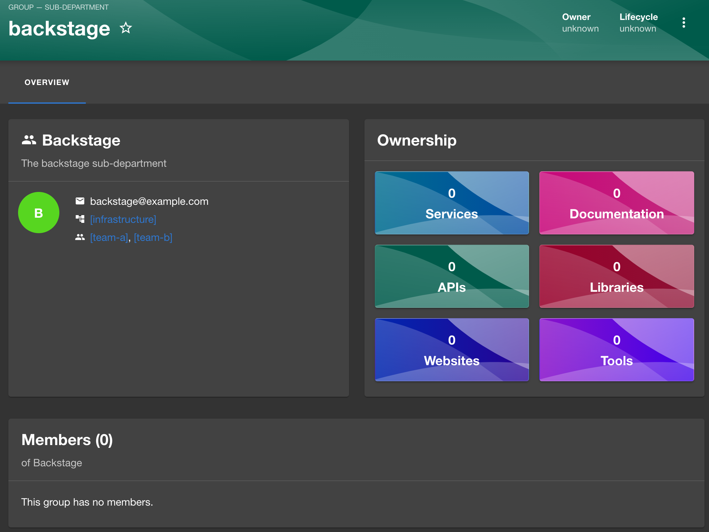

Display the new `profile` fields (`displayName`, `email`, and `picture`) for
groups on the `GroupProfileCard`.

This also resolves some cases where `profile` fields are missing for users or
groups and for example falls back to displaying the entity name. Adds additional test data to the ACME Corp dataset.
