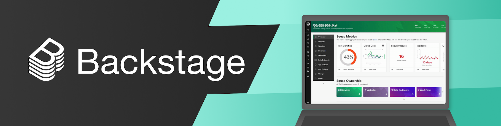
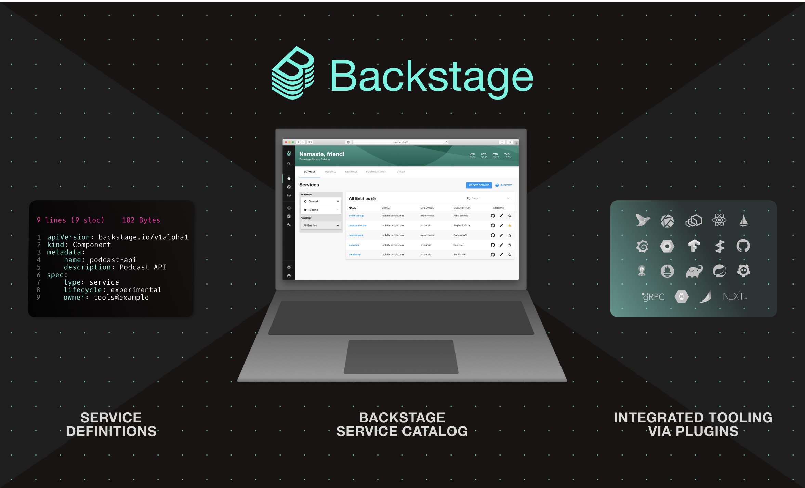

# [Backstage](https://backstage.io)

Englisch \| [Koreanisch](README-ko_kr.md) \| [Chinesisch](README-zh_Hans.md) \| [Französisch](README-fr_FR.md) \| [Spanisch](README-es.md) \| [Deutsch](README-de.md) \| [Japanisch](README-ja.md)

## Was ist Backstage?

[Backstage](https://backstage.io/) ist ein Open-Source-Framework zum Erstellen von Entwicklerportalen. Angetrieben von einem zentralisierten Softwarekatalog, stellt Backstage die Ordnung in Ihren Microservices und Ihrer Infrastruktur wieder her und ermöglicht es Ihren Produktteams, schnell hochwertigen Code zu liefern, ohne die Autonomie zu beeinträchtigen.

Backstage vereint alle Ihre Infrastruktur-Tools, Dienste und Dokumentationen, um eine durchgängig optimierte Entwicklungsumgebung zu schaffen.

Out of the box enthält Backstage:

- [Backstage Software Catalog](https://backstage.io/docs/features/software-catalog/) zur Verwaltung Ihrer gesamten Software wie Microservices, Bibliotheken, Datenpipelines, Websites und ML-Modelle
- [Backstage Software Templates](https://backstage.io/docs/features/software-templates/) zum schnellen Erstellen neuer Projekte und zur Standardisierung Ihrer Tools mit den Best Practices Ihrer Organisation
- [Backstage TechDocs](https://backstage.io/docs/features/techdocs/) zum einfachen Erstellen, Pflegen, Finden und Verwenden technischer Dokumentation nach dem "Docs-like-Code"-Ansatz
- Plus, ein wachsendes Ökosystem von [Open-Source-Plugins](https://github.com/backstage/backstage/tree/master/plugins), die die Anpassbarkeit und Funktionalität von Backstage weiter ausbauen

Backstage wurde von Spotify entwickelt, wird aber jetzt von der [Cloud Native Computing Foundation (CNCF)](https://www.cncf.io) als Projekt auf Inkubationsstufe gehostet. Weitere Informationen finden Sie in der [Ankündigung](https://backstage.io/blog/2022/03/16/backstage-turns-two#out-of-the-sandbox-and-into-incubation).

## Projekt-Roadmap

Informationen zur detaillierten Projekt-Roadmap einschließlich der gelieferten Meilensteine finden Sie unter [der Roadmap](https://backstage.io/docs/overview/roadmap).

## Erste Schritte

Um mit der Nutzung von Backstage zu beginnen, lesen Sie die [Dokumentation zu den ersten Schritten](https://backstage.io/docs/getting-started).

## Dokumentation

Die Dokumentation von Backstage umfasst:

- [Hauptdokumentation](https://backstage.io/docs)
- [Software-Katalog](https://backstage.io/docs/features/software-catalog/)
- [Architektur](https://backstage.io/docs/overview/architecture-overview) ([Entscheidungen](https://backstage.io/docs/architecture-decisions/))
- [Entwerfen für Backstage](https://backstage.io/docs/dls/design)
- [Storybook - UI-Komponenten](https://backstage.io/storybook)

## Community

Um mit unserer Community in Kontakt zu treten, können Sie die folgenden Ressourcen nutzen:

- [Discord-Chatroom](https://discord.gg/backstage-687207715902193673) - Holen Sie sich Unterstützung oder diskutieren Sie das Projekt
- [Zu Backstage beitragen](https://github.com/backstage/backstage/blob/master/CONTRIBUTING.md) - Beginnen Sie hier, wenn Sie beitragen möchten
- [RFCs](https://github.com/backstage/backstage/labels/rfc) - Helfen Sie mit, die technische Ausrichtung zu gestalten
- [FAQ](https://backstage.io/docs/faq) - Häufig gestellte Fragen
- [Verhaltenskodex](CODE_OF_CONDUCT.md) - So machen wir das
- [Anwender](ADOPTERS.md) - Unternehmen, die Backstage bereits verwenden
- [Blog](https://backstage.io/blog/) - Ankündigungen und Updates
- [Newsletter](https://spoti.fi/backstagenewsletter) - Abonnieren Sie unseren E-Mail-Newsletter
- [Backstage Community Sessions](https://github.com/backstage/community) - Nehmen Sie an monatlichen Treffen teil und erkunden Sie die Backstage-Community
- Geben Sie uns einen Stern ⭐️ - Wenn Sie Backstage verwenden oder denken, dass es ein interessantes Projekt ist, würden wir uns über einen Stern freuen ❤️

## Governance

Siehe das [GOVERNANCE.md](https://github.com/backstage/community/blob/main/GOVERNANCE.md) Dokument im [backstage/community](https://github.com/backstage/community) Repository.

## Lizenz

Copyright 2020-2026 © The Backstage Authors. Alle Rechte vorbehalten. Die Linux Foundation hat Marken eingetragen und verwendet Marken. Eine Liste der Marken der Linux Foundation finden Sie auf unserer Seite zur Markennutzung: https://www.linuxfoundation.org/trademark-usage

Lizenziert unter der Apache-Lizenz, Version 2.0: http://www.apache.org/licenses/LICENSE-2.0

## Sicherheit

Bitte melden Sie sensible Sicherheitsprobleme über das [Bug-Bounty-Programm](https://hackerone.com/spotify) von Spotify und nicht über GitHub.

Weitere Einzelheiten finden Sie in unserem vollständigen [Sicherheitsfreigabeprozess](SECURITY.md).
