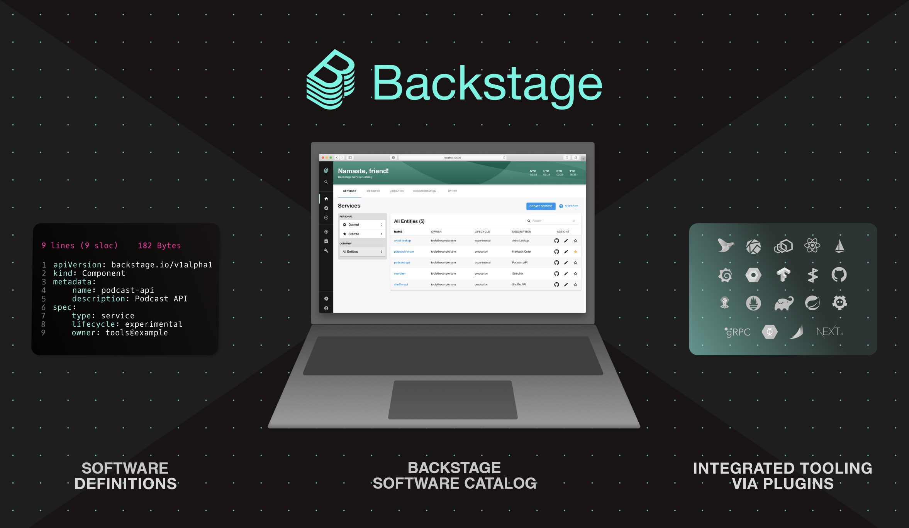

# [Backstage](https://backstage.io)

Français \| [English](README.md) \| [한국어](README-ko_kr.md) \| [中文版](README-zh_Hans.md)

## Qu'est-ce que Backstage?

[Backstage](https://backstage.io/) est un framework open source conçu pour créer des portails à destination des développeurs. Avec l'idée de fournir un catalogue d'applications centralisé, Backstage remet de l'ordre dans vos microservices et votre infrastructure, ce qui permet à vos équipes produit de coder rapidement et de manière efficace sans perdre en autonomie.

Backstage rassemble tous vos outils d'infrastructure, services et documentations pour créer un environnement de développement fluide de bout en bout.

Out-of-the-box, Backstage comprend :

- [Backstage Software Catalog](https://backstage.io/docs/features/software-catalog/) pour gérer tous vos logiciels tels que les microservices, les bibliothèques, les pipelines de données, les sites web et les modèles ML.
- [Backstage Software Templates](https://backstage.io/docs/features/software-templates/) pour créer rapidement de nouveaux projets et uniformiser vos outils selon les meilleures pratiques de votre organisation.
- [Backstage TechDocs](https://backstage.io/docs/features/techdocs/) pour faciliter la création, la maintenance, la recherche et l'utilisation de la documentation technique, en adoptant une approche "docs like code".
- De plus, un écosystème croissant de [plugins open source](https://github.com/backstage/backstage/tree/master/plugins) qui étendent davantage la personnalisation et les fonctionnalités de Backstage.

Backstage a été initialement développé par Spotify, mais il est désormais hébergé par la [Cloud Native Computing Foundation (CNCF)](https://www.cncf.io) en tant que projet en stade d'incubation. Pour en savoir plus, consultez l'[annonce](https://backstage.io/blog/2022/03/16/backstage-turns-two#out-of-the-sandbox-and-into-incubation).

## Roadmap du projet

Pour des informations sur la roadmap détaillée du projet, y compris les jalons atteints, consultez [la Roadmap](https://backstage.io/docs/overview/roadmap).

## Démarrage

Pour commencer à utiliser Backstage, consultez [Getting Started documentation](https://backstage.io/docs/getting-started).

## Documentation

La documentation de Backstage inclus:

- [Main documentation](https://backstage.io/docs)
- [Software Catalog](https://backstage.io/docs/features/software-catalog/)
- [Architecture](https://backstage.io/docs/overview/architecture-overview) ([Decisions](https://backstage.io/docs/architecture-decisions/))
- [Designing for Backstage](https://backstage.io/docs/dls/design)
- [Storybook - UI components](https://backstage.io/storybook)

## Communauté

Si vous voulez contribuer et vous impliquer dans notre communauté, voici les ressources à votre disposition :

- [Discord chatroom](https://discord.gg/backstage-687207715902193673) - Pour obtenir de l'aide ou discuter du projet
- [Contributing to Backstage](https://github.com/backstage/backstage/blob/master/CONTRIBUTING.md) - Rendez-vous ici si vous souhaitez contribuer
- [RFCs](https://github.com/backstage/backstage/labels/rfc) - Contribuez à définir la direction technique
- [FAQ](https://backstage.io/docs/FAQ)
- [Code of Conduct](CODE_OF_CONDUCT.md) - C'est comme ça qu'on fonctionne
- [Adopters](ADOPTERS.md) - Les entreprises utilisant déjà Backstage
- [Blog](https://backstage.io/blog/) - Annonces et mises à jour
- [Newsletter](https://spoti.fi/backstagenewsletter) - Abonnez-vous à notre newsletter par mail
- [Backstage Community Sessions](https://github.com/backstage/community) - Participez aux rencontres mensuelles et découvrez la communauté Backstage
- Donnez-nous une étoile ⭐️ - Si vous utilisez Backstage ou si vous trouvez que c'est un projet intéressant, nous apprécierions beaucoup votre soutien ❤️

## Licence

Copyright 2020-2025 © Les auteurs de Backstage. Tous droits réservés. La Linux Foundation détient des marques déposées et utilise des marques commerciales. Pour une liste des marques de commerce de la Linux Foundation, veuillez consulter notre page d'utilisation des marques: https://www.linuxfoundation.org/trademark-usage

Sous licence Apache, version 2.0: http://www.apache.org/licenses/LICENSE-2.0

## Sécurité

Veuillez signaler les problèmes de sécurité sensibles en utilisant le [programme de bug-bounty](https://hackerone.com/spotify) de Spotify plutôt que GitHub.

Pour plus de détails, consultez notre processus complet de [publication de sécurité](SECURITY.md).
