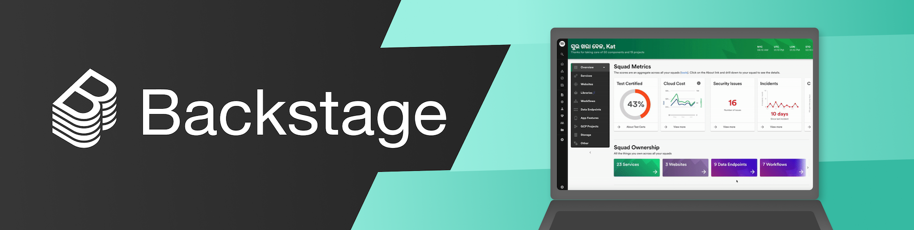

# [Backstage](https://backstage.io)

_During the month of July the majority of the maintainers will be on summer vacation 🏖️ Development will continue as usual, but expect a slower pace for discussions and PR reviews. Why not take this opportunity to [build a plugin](https://backstage.io/docs/plugins/)?_

## What is Backstage?

[Backstage](https://backstage.io/) is an open platform for building developer portals. Powered by a centralized software catalog, Backstage restores order to your microservices and infrastructure and enables your product teams to ship high-quality code quickly — without compromising autonomy.

Backstage unifies all your infrastructure tooling, services, and documentation to create a streamlined development environment from end to end.

Out of the box, Backstage includes:

- [Backstage Software Catalog](https://backstage.io/docs/features/software-catalog/software-catalog-overview) for managing all your software (microservices, libraries, data pipelines, websites, ML models, etc.)
- [Backstage Software Templates](https://backstage.io/docs/features/software-templates/software-templates-index) for quickly spinning up new projects and standardizing your tooling with your organization’s best practices
- [Backstage TechDocs](https://backstage.io/docs/features/techdocs/techdocs-overview) for making it easy to create, maintain, find, and use technical documentation, using a "docs like code" approach
- Plus, a growing ecosystem of [open source plugins](https://github.com/backstage/backstage/tree/master/plugins) that further expand Backstage’s customizability and functionality

Backstage was created by Spotify but is now hosted by the [Cloud Native Computing Foundation (CNCF)](https://www.cncf.io) as a Sandbox level project. Read the announcement [here](https://backstage.io/blog/2020/09/23/backstage-cncf-sandbox).

## Project roadmap

A detailed project roadmap, including already delivered milestones, is available [here](https://backstage.io/docs/overview/roadmap).

## Getting Started

Check out [the documentation](https://backstage.io/docs/getting-started) on how to start using Backstage.

## Documentation

- [Main documentation](https://backstage.io/docs)
- [Software Catalog](https://backstage.io/docs/features/software-catalog/software-catalog-overview)
- [Architecture](https://backstage.io/docs/overview/architecture-overview) ([Decisions](https://backstage.io/docs/architecture-decisions/adrs-overview))
- [Designing for Backstage](https://backstage.io/docs/dls/design)
- [Storybook - UI components](https://backstage.io/storybook)

## Community

- [Discord chatroom](https://discord.gg/MUpMjP2) - Get support or discuss the project
- [Contributing to Backstage](https://github.com/backstage/backstage/blob/master/CONTRIBUTING.md) - Start here if you want to contribute
- [RFCs](https://github.com/backstage/backstage/labels/rfc) - Help shape the technical direction
- [FAQ](https://backstage.io/docs/FAQ) - Frequently Asked Questions
- [Code of Conduct](CODE_OF_CONDUCT.md) - This is how we roll
- [Adopters](ADOPTERS.md) - Companies already using Backstage
- [Blog](https://backstage.io/blog/) - Announcements and updates
- [Newsletter](https://mailchi.mp/spotify/backstage-community) - Subscribe to our email newsletter
- [Backstage Community Sessions](https://github.com/backstage/community) - Join monthly meetup and explore Backstage community
- Give us a star ⭐️ - If you are using Backstage or think it is an interesting project, we would love a star ❤️

## License

Copyright 2020-2021 © The Backstage Authors. All rights reserved. The Linux Foundation has registered trademarks and uses trademarks. For a list of trademarks of The Linux Foundation, please see our Trademark Usage page: https://www.linuxfoundation.org/trademark-usage

Licensed under the Apache License, Version 2.0: http://www.apache.org/licenses/LICENSE-2.0

## Security

Please report sensitive security issues via Spotify's [bug-bounty program](https://hackerone.com/spotify) rather than GitHub.

For further details please see our complete [security release process](SECURITY.md).
