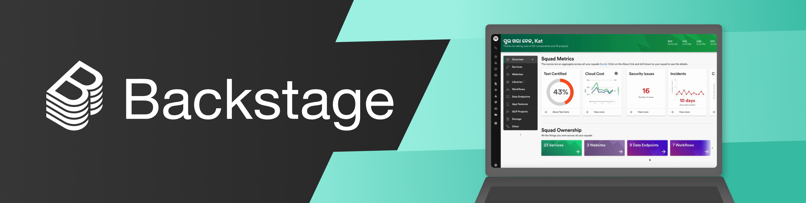

# [Backstage](https://backstage.io)

[](https://opensource.org/licenses/Apache-2.0)

[](https://discord.gg/EBHEGzX)

[](https://github.com/spotify/backstage/releases)

## What is Backstage?

[Backstage](https://backstage.io/) is an open platform for building developer portals. It’s based on the developer portal we’ve been using internally at Spotify for over four years. Backstage can be as simple as a services catalog or as powerful as the UX layer for your entire tech infrastructure.

For more information go to [backstage.io](https://backstage.io) or join our [Discord chatroom](https://discord.gg/EBHEGzX).

### Features

- Create and manage all of your organization’s software and microservices in one place.
- Services catalog keeps track of all software and its ownership.
- Visualizations provide information about your backend services and tooling, and help you monitor them.
- A unified method for managing microservices offers both visibility and control.
- Preset templates allow engineers to quickly create microservices in a standardized way ([coming soon](https://github.com/spotify/backstage/milestone/11)).
- Centralized, full-featured technical documentation with integrated tooling that makes it easy for developers to set up, publish, and maintain alongside their code ([coming soon](https://github.com/spotify/backstage/milestone/15)).

### Benefits

- For _engineering managers_, it allows you to maintain standards and best practices across the organization, and can help you manage your whole tech ecosystem, from migrations to test certification.
- For _end users_ (developers), it makes it fast and simple to build software components in a standardized way, and it provides a central place to manage all projects and documentation.
- For _platform engineers_, it enables extensibility and scalability by letting you easily integrate new tools and services (via plugins), as well as extending the functionality of existing ones.
- For _everyone_, it’s a single, consistent experience that ties all your infrastructure tooling, resources, standards, owners, contributors, and administrators together in one place.

## Backstage Service Catalog (alpha)

The Backstage Service Catalog — actually, a software catalog, since it includes more than just services — is a centralized system that keeps track of ownership and metadata for all the software in your ecosystem (services, websites, libraries, data pipelines, etc). The catalog is built around the concept of [metadata yaml files](https://github.com/spotify/backstage/blob/master/docs/architecture-decisions/adr002-default-catalog-file-format.md#format) stored together with the code, which are then harvested and visualized in Backstage.


We have also found that the service catalog is a great way to organise the infrastructure tools you use to manage the software as well. This is how Backstage creates one developer portal for all your tools. Rather than asking teams to jump between different infrastructure UI’s (and incurring additional cognitive overhead each time they make a context switch), most of these tools can be organised around the entities in the catalog.

## Project roadmap

We created Backstage about 4 years ago. While our internal version of Backstage has had the benefit of time to mature and evolve, the first iteration of our open source version is still nascent. We are envisioning three phases of the project and we have already begun work on various aspects of these phases:

- 🐣 **Phase 1:** Extensible frontend platform (Done ✅) - You will be able to easily create a single consistent UI layer for your internal infrastructure and tools. A set of reusable [UX patterns and components](http://storybook.backstage.io) help ensure a consistent experience between tools.

- 🐢 **Phase 2:** Service Catalog ([alpha released](https://backstage.io/blog/2020/06/22/backstage-service-catalog-alpha)) - With a single catalog, Backstage makes it easy for a team to manage ten services — and makes it possible for your company to manage thousands of them. Developers can get a uniform overview of all their software and related resources, regardless of how and where they are running, as well as an easy way to onboard and manage those resources.

- 🐇 **Phase 3:** Ecosystem (later) - Everyone's infrastructure stack is different. By fostering a vibrant community of contributors we hope to provide an ecosystem of Open Source plugins/integrations that allows you to pick the tools that match your stack.

Check out our [Milestones](https://github.com/spotify/backstage/milestones) and open [RFCs](https://github.com/spotify/backstage/labels/rfc) how they relate to the three Phases outlined above.

Our vision for Backstage is for it to become the trusted standard toolbox (read: UX layer) for the open source infrastructure landscape. Think of it like Kubernetes for developer experience. We realize this is an ambitious goal. We can’t do it alone. If this sounds interesting or you'd like to help us shape our product vision, we'd love to talk. You can email me directly: [alund@spotify.com](mailto:alund@spotify.com).

## Overview

The Backstage platform consists of a number of different components:

- **app** - Main web application that users interact with. It's built up by a number of different _Plugins_. This repo contains an example implementation of an app (located in `packages/app`) and you can easily get started with your own app by [creating one](docs/create-an-app.md).
- [**plugins**](https://github.com/spotify/backstage/tree/master/plugins) - Each plugin is treated as a self-contained web app and can include almost any type of content. Plugins all use a common set of platform API's and reusable UI components. Plugins can fetch data either from the _backend_ or through any RESTful API exposed through the _proxy_.
- [**service catalog**](https://github.com/spotify/backstage/tree/master/packages/backend) - Service that holds the model of your software ecosystem, including organisational information and what team owns what software. The backend also has a Plugin model for extending its graph.
- **proxy** \* - Terminates HTTPS and exposes any RESTful API to Plugins.
- **identity** - A backend service that holds your organisation's metadata.

_\* not yet released_

## Getting started

To run a Backstage app, you will need to have the following installed:

- [git](https://git-scm.com/book/en/v2/Getting-Started-Installing-Git)
- [NodeJS](https://nodejs.org/en/download/) - Active LTS Release, currently v12
- [yarn](https://classic.yarnpkg.com/en/docs/install)

After cloning this repo, open a terminal window and start the example app using the following commands from the project root:

```bash
yarn install # Install dependencies

yarn start # Start dev server, use --check to enable linting and type-checks
```

The final `yarn start` command should open a local instance of Backstage in your browser, otherwise open one of the URLs printed in the terminal.

And that's it! You are good to go 👍

### Next step

Take a look at the [Getting Started](docs/getting-started/README.md) guide to learn more about how to extend the functionality with Plugins.

## Documentation

- [Getting Started](docs/getting-started/README.md)
- [Create a Backstage App](docs/create-an-app.md)
- [Architecture](docs/overview/architecture-terminology.md) ([Decisions](docs/architecture-decisions))
- [API references](docs/reference/README.md)
- [Designing for Backstage](docs/design.md)
- [Storybook - UI components](http://storybook.backstage.io)
- [Contributing to Storybook](docs/getting-started/contributing-to-storybook.md)

## Contributing

We would love your help in building Backstage! See [CONTRIBUTING](CONTRIBUTING.md) for more information.

## Community

- [Discord chatroom](https://discord.gg/MUpMjP2) - Get support or discuss the project
- [Good First Issues](https://github.com/spotify/backstage/contribute) - Start here if you want to contribute
- [RFCs](https://github.com/spotify/backstage/labels/rfc) - Help shape the technical direction
- [FAQ](docs/FAQ.md) - Frequently Asked Questions
- [Code of Conduct](CODE_OF_CONDUCT.md) - This is how we roll
- [Blog](https://backstage.io/blog/) - Announcements and updates
- [Newsletter](https://mailchi.mp/spotify/backstage-community)
- Give us a star ⭐️ - If you are using Backstage or think it is an interesting project, we would love a star ❤️

Or, if you are an open source developer and are interested in joining our team, please reach out to [foss-opportunities@spotify.com ](mailto:foss-opportunities@spotify.com)

## License

Copyright 2020 Spotify AB.

Licensed under the Apache License, Version 2.0: http://www.apache.org/licenses/LICENSE-2.0
