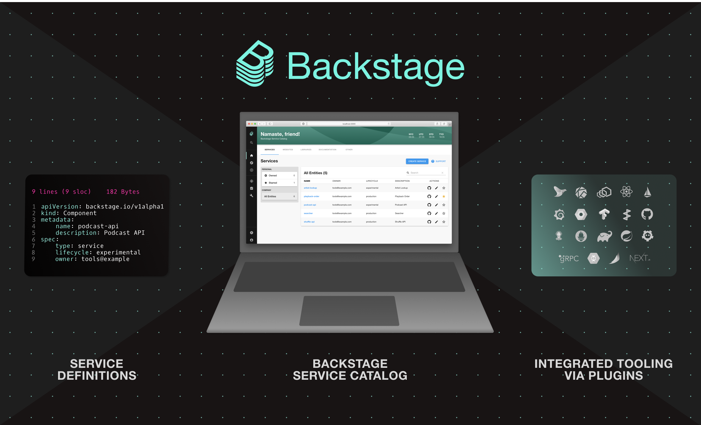

<!-- Shields bar -->

[![Contributors][contributors-shield]][contributors-url]
[![Forks][forks-shield]][forks-url]
[![Stars][stars-shield]][stars-url]
[![Issues][issues-shield]][issues-url]
[![License][license-shield]][license-url]
[![CI][ci-shield]][ci-url]

<!-- Project header -->
<div align="center">
  <a href="https://backstage.io/">
    
  </a>
  <h1>Blitzy Backstage</h1>
  <p>Blitzy's internal developer portal — a customized fork of <a href="https://backstage.io">Backstage</a> providing a unified service catalog, scaffolder, TechDocs, and developer tooling for the Blitzy platform.</p>
  <a href="https://github.com/Blitzy-Sandbox/blitzy-sandbox-backstage"><strong>Explore the docs</strong></a>
  &middot;
  <a href="https://github.com/Blitzy-Sandbox/blitzy-sandbox-backstage/issues/new?labels=bug">Report Bug</a>
  &middot;
  <a href="https://github.com/Blitzy-Sandbox/blitzy-sandbox-backstage/issues/new?labels=enhancement">Request Feature</a>
</div>

<details>
  <summary>Table of Contents</summary>
  <ol>
    <li><a href="#about-the-project">About The Project</a></li>
    <li><a href="#built-with">Built With</a></li>
    <li><a href="#getting-started">Getting Started</a></li>
    <li><a href="#usage">Usage</a></li>
    <li><a href="#structure">Structure</a></li>
    <li><a href="#contributing">Contributing</a></li>
    <li><a href="#license">License</a></li>
    <li><a href="#acknowledgments">Acknowledgments</a></li>
  </ol>
</details>

---

## About The Project

**Blitzy Backstage** is Blitzy's customized fork of the [Backstage](https://backstage.io) open-source developer portal. It serves as the internal developer platform for the Blitzy organization, providing:

- **Software Catalog** — unified registry of all services, APIs, libraries, and infrastructure components, with GitHub and GitHub Org entity providers
- **Scaffolder** — self-service templates for spinning up new projects following Blitzy's standards
- **TechDocs** — documentation-as-code integrated directly with the service catalog
- **Search** — cross-catalog full-text search, with optional Elasticsearch backend
- **Auth** — GitHub OAuth and Guest sign-in; OpenShift provider available
- **Notifications & Signals** — real-time alerts and event-driven messages across the portal
- **PR Review Plugin** — custom Blitzy plugin for surfacing pull request status on the home page

The portal runs on a **TypeScript monorepo** (~970k lines, 10k+ files) using Yarn workspaces. The frontend uses Backstage's new Declarative Integration system; the backend uses the new plugin-as-service DI model.

## Built With

[![TypeScript][typescript-shield]][typescript-url]
[![React][react-shield]][react-url]
[![Node.js][node-shield]][node-url]
[![Tailwind CSS][tailwind-shield]][tailwind-url]
[![Yarn][yarn-shield]][yarn-url]
[![SQLite][sqlite-shield]][sqlite-url]
[![Docker][docker-shield]][docker-url]

## Getting Started

### Prerequisites

- **Node.js** 20 or later
- **Yarn** 4 (`corepack enable && corepack prepare yarn@stable --activate`)
- **Git**
- (Optional) **Docker** for containerized deployments

### Installation

1. Clone the repository:

   ```sh
   git clone git@github.com:Blitzy-Sandbox/blitzy-sandbox-backstage.git
   cd blitzy-sandbox-backstage
   ```

2. Install dependencies:

   ```sh
   yarn install
   ```

3. Configure local overrides:

   ```sh
   cp app-config.yaml app-config.local.yaml
   # Edit app-config.local.yaml — set GITHUB_TOKEN, auth credentials, etc.
   ```

4. Start the development servers (frontend + backend):
   ```sh
   yarn dev
   ```
   The app will be available at `http://localhost:3000` and the backend at `http://localhost:7007`.

### Environment Setup

Key config values (set in `app-config.local.yaml` or as environment variables):

| Variable                    | Purpose                                                         |
| --------------------------- | --------------------------------------------------------------- |
| `GITHUB_TOKEN`              | GitHub PAT for catalog entity ingestion and the GitHub provider |
| `AUTH_GITHUB_CLIENT_ID`     | GitHub OAuth App client ID                                      |
| `AUTH_GITHUB_CLIENT_SECRET` | GitHub OAuth App client secret                                  |
| `BACKEND_SECRET`            | Shared secret for backend service-to-service auth               |

## Usage

### Running in Development

```sh
# Start frontend and backend together
yarn dev

# Backend only
yarn start-backend

# Frontend only
yarn start
```

### Building for Production

```sh
yarn build:backend
yarn build
```

### Running Tests

```sh
# All tests
yarn test:all

# A single package
yarn workspace @backstage/plugin-catalog test
```

### Linting & Type Checks

```sh
yarn lint:all
yarn tsc
```

### Adding a New Plugin

```sh
# Scaffold a new backend plugin
yarn backstage-cli new --select backend-plugin

# Scaffold a new frontend plugin
yarn backstage-cli new --select plugin
```

Register the backend plugin in `packages/backend/src/index.ts` and the frontend plugin in `packages/app/src/App.tsx`.

## Structure

```
blitzy-backstage/
├── packages/
│   ├── app/                    # Frontend app (Declarative Integration system)
│   ├── app-legacy/             # Legacy frontend (being deprecated)
│   ├── backend/                # Backend process entry point
│   ├── backend-plugin-api/     # Backend plugin/service DI framework
│   ├── backend-defaults/       # Default service implementations
│   ├── frontend-plugin-api/    # Frontend extension/blueprint framework
│   ├── catalog-model/          # Entity types, kinds, and validators
│   ├── catalog-client/         # HTTP client for the catalog API
│   ├── config/                 # Config reader
│   ├── cli/                    # Backstage CLI toolchain
│   └── ...                     # ~50 total core packages
├── plugins/
│   ├── auth-backend/           # Authentication backend
│   ├── catalog-backend/        # Software catalog backend
│   ├── scaffolder-backend/     # Template engine backend
│   ├── techdocs-backend/       # TechDocs backend
│   ├── search-backend/         # Search backend
│   ├── notifications-backend/  # Notifications backend
│   └── ...                     # ~100+ feature plugins
├── contrib/
│   └── catalog/                # Experimental catalog providers
├── app-config.yaml             # Base configuration
├── app-config.production.yaml  # Production overrides
└── knexfile.js                 # Database migration config
```

### Key Entry Points

| File                            | Purpose                                                      |
| ------------------------------- | ------------------------------------------------------------ |
| `packages/backend/src/index.ts` | Backend process — registers all plugins via `backend.add()`  |
| `packages/app/src/App.tsx`      | Frontend app root — assembles all features via `createApp()` |
| `app-config.yaml`               | App configuration (URLs, database, auth, integrations)       |

### Architecture Notes

- The backend uses a **DI container** (`ServiceRegistry`) that resolves typed `ServiceRef` → `ServiceFactory` at startup. Plugins declare their service dependencies declaratively.
- The frontend uses **Declarative Integration** — plugins expose typed `Extension` objects (pages, nav items, entity content) assembled by `createApp()`. Routing is automatic.
- **TechDocs search** is intentionally disabled to prevent OOM when indexing repositories that haven't built docs — see the comment in `packages/backend/src/index.ts`.
- **Auth policy** is `dangerouslyDisableDefaultAuthPolicy: true` in development. This is temporary while plugins complete migration to the new auth system.

## Contributing

See [CONTRIBUTING.md](CONTRIBUTING.md) for contribution guidelines, including development environment setup, the changeset process, and pull request requirements.

## License

Copyright 2020-2026 © The Backstage Authors. Distributed under the Apache License 2.0. See [`LICENSE`](LICENSE) for full text.

## Acknowledgments

- [Backstage](https://backstage.io) — the upstream open-source project this fork is based on, maintained by the CNCF community
- [Spotify](https://engineering.atspotify.com/2020/04/how-we-use-backstage-at-spotify/) — original creators of Backstage
- The [CNCF](https://www.cncf.io/projects/backstage/) for hosting Backstage at Incubation level

---

<!-- Reference-style links -->

[contributors-shield]: https://img.shields.io/github/contributors/Blitzy-Sandbox/blitzy-sandbox-backstage.svg?style=flat
[contributors-url]: https://github.com/Blitzy-Sandbox/blitzy-sandbox-backstage/graphs/contributors
[forks-shield]: https://img.shields.io/github/forks/Blitzy-Sandbox/blitzy-sandbox-backstage.svg?style=flat
[forks-url]: https://github.com/Blitzy-Sandbox/blitzy-sandbox-backstage/network/members
[stars-shield]: https://img.shields.io/github/stars/Blitzy-Sandbox/blitzy-sandbox-backstage.svg?style=flat
[stars-url]: https://github.com/Blitzy-Sandbox/blitzy-sandbox-backstage/stargazers
[issues-shield]: https://img.shields.io/github/issues/Blitzy-Sandbox/blitzy-sandbox-backstage.svg?style=flat
[issues-url]: https://github.com/Blitzy-Sandbox/blitzy-sandbox-backstage/issues
[license-shield]: https://img.shields.io/github/license/Blitzy-Sandbox/blitzy-sandbox-backstage.svg?style=flat
[license-url]: https://github.com/Blitzy-Sandbox/blitzy-sandbox-backstage/blob/master/LICENSE
[ci-shield]: https://img.shields.io/github/actions/workflow/status/Blitzy-Sandbox/blitzy-sandbox-backstage/ci.yml?style=flat&label=CI
[ci-url]: https://github.com/Blitzy-Sandbox/blitzy-sandbox-backstage/actions/workflows/ci.yml
[typescript-shield]: https://img.shields.io/badge/TypeScript-3178C6?style=flat&logo=typescript&logoColor=white
[typescript-url]: https://typescriptlang.org
[react-shield]: https://img.shields.io/badge/React-61DAFB?style=flat&logo=react&logoColor=black
[react-url]: https://react.dev
[node-shield]: https://img.shields.io/badge/Node.js-339933?style=flat&logo=node.js&logoColor=white
[node-url]: https://nodejs.org
[tailwind-shield]: https://img.shields.io/badge/Tailwind%20CSS-06B6D4?style=flat&logo=tailwindcss&logoColor=white
[tailwind-url]: https://tailwindcss.com
[yarn-shield]: https://img.shields.io/badge/Yarn-2C8EBB?style=flat&logo=yarn&logoColor=white
[yarn-url]: https://yarnpkg.com
[sqlite-shield]: https://img.shields.io/badge/SQLite-003B57?style=flat&logo=sqlite&logoColor=white
[sqlite-url]: https://sqlite.org
[docker-shield]: https://img.shields.io/badge/Docker-2496ED?style=flat&logo=docker&logoColor=white
[docker-url]: https://docker.com
