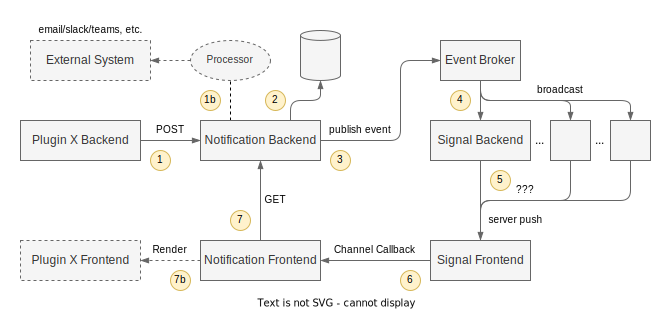

# BEP: Backstage Notifications System

[**Discussion Issue**](https://github.com/backstage/backstage/issues/22213)

- [Summary](#summary)
- [Motivation](#motivation)
  - [Goals](#goals)
  - [Non-Goals](#non-goals)
- [Proposal](#proposal)
- [Design Details](#design-details)
- [Release Plan](#release-plan)
- [Dependencies](#dependencies)
- [Alternatives](#alternatives)

## Summary

The Backstage Notifications System provides a way for Backstage plugins to send notifications to users. The notifications are displayed in the Backstage frontend UI, but future extensions can allow them to be sent via external channels such as email. The system includes a push mechanism to make sure that users receive notifications immediately, as well as persistence of notification history and read status.

## Motivation

Support for notifications is an old and common features request. See [#639](https://github.com/backstage/backstage/issues/639) and [#10652](https://github.com/backstage/backstage/issues/10652). There are also initiatives to implement notifications in [#20312](https://github.com/backstage/backstage/issues/20312) as well as the underlying infrastructure pieces, for example [#17997](https://github.com/backstage/backstage/issues/17997).

This proposal assumes that further motivation for a notifications system as a whole is not needed. The focus is instead on the specific goals of an initial notifications system, and generally aiming to address the need to coordinate this work.

### Goals

We aim to build a system that would provide support for the following type of notifications, as listed in [#10652](https://github.com/backstage/backstage/issues/10652):

- System-wide announcements or alerts
- Notifications for component owners (e.g. build failure, successful deployment, new vulnerabilities)
- Notifications for individuals (e.g. updates you have subscribed to, new required training courses)
- Notifications pertaining to a particular entity in the catalog (a given notification might apply to an entity and the owning team)

Initially we only target a single way to send notifications: via a REST API call to the notifications backend, which in turn also provides an accompanying [backend service](https://backstage.io/docs/backend-system/architecture/services).

The notifications system will need to support scaled deployments, where multiple backend instances may be deployed.

In the future we aim to provide an extensible system that can be customized to send notifications to users via other channels. Notifications can be captured and processed in-band in order to trigger custom behavior such as sending an email. The goal is for this to be possible to build, but not necessarily part of the initial implementation.

### Non-Goals

The following features are out of scope for this BEP:

- Building out specific support for channels such as email, Slack, and other external channels.
- Providing a fallback mechanisms when a notification cannot be delivered to a user. For example, if a user has not logged in for a long time, we will not attempt to send an email instead.

## Proposal

The notifications system is implemented through two net-new components, the `notifications` plugin, and the `signal` plugin.

The `notifications` plugin in its simplest form provides the following:

- A backend API for sending, reading, and interacting with notifications.
- Persistent storage of notification state.
- A frontend UI for viewing notifications.

The `signal` plugin provides the following:

- A backend API for pushing lightweight signals to online users.
- A connection between the frontend and backend that can be used to push messages to the client.
- A frontend API that lets plugins to subscribe to specific signals.

### Signals Plugin

In the backend the signal plugin implements a general purpose message bus for sending signals from backend plugins to connected users. It relies on the `EventBroker` from the [events plugin](https://github.com/backstage/backstage/blob/master/plugins/events-backend/README.md) for the actual message passing in the backend. In order to support scaled deployments, each signal backend instance has a separate subscription to the event broker so that each instance receives all events. It is then up to each backend instance to filter out events that are not relevant to it. For this reason, signals should be kept lightweight and not contain unnecessary data.

In the frontend the signal plugin has a persistent connection to the signal backend. This is initially implemented as a WebSocket connection, but could in the future also receive fallback mechanisms such as Server Sent Events or long polling. It is important that this connection is authenticated as we will be routing signals to specific users. The exact implementation of the authentication is not part of this proposal, but it should use whatever the outcome of the discussion in issue [#19581](https://github.com/backstage/backstage/issues/19581) is.

In order to route signals from the sender to the intended recipient the signal plugin uses the concept of signaling channels. They are just like the topics on the message bus, but we use separate terminology in order to avoid confusion. They also sit one layer beneath the even topic in the protocol stack, where the signal channel is communicated as part of the event payload. In the frontend, the signal plugin exposes an API to subscribe to a signal channel. Each time the user receives a signal on the specified channel, a listener is called with the signal payload.

Upon creating a new notification, a signal will be emitted by the `notification-backend`.

The channel for notifications will be named `notifications` and the message will contain necessary information about the notification for rendering as well as action telling to refresh the notifications using the REST API.

The notification payload must be in the signal to be able to show notification in the UI immediately after receiving the signal.

If the notification status is updated, the signal service shall emit a signal without the notification payload and only with the action.

### Notifications Plugin

The role of the notifications plugin is to manage the lifecycle of notifications. The backend plugin provides an API for other backends to send notifications, as well as an accompanying [backend service](https://backstage.io/docs/backend-system/architecture/services). It also provides a separate API for the frontend plugin to read notifications for an individual user and manage the read status of notifications.

The notification backend stores notification using the [database service](https://backstage.io/docs/backend-system/core-services/index#database). In particular it needs to store the following information for each notification:

- ID
- Read date
- Done date
- Saved status
- Creation date
- Updated date (optional, for scoped notifications)
- Payload:
  - Title
  - Description (optional)
  - Origin
  - Link
  - Recipients
  - Severity (optional, default normal)
  - Topic (optional)
  - Scope (optional)
  - Icon (optional)

The recipients is **not** a list of users, but rather a filter that describes who should receive the notification. It must be possible to evaluate this filter in a database query, so that we can efficiently fetch all notifications for a given user. The same filter will also be used by the signal backend to determine which users should receive a signal.

The title is mandatory human-readable text shortly describing the notifications.

The description is an optional human-readable text providing more details to the user.

The severity is one of the predefined values to help with presentation of the notifications or their filtering. Allowed values are: `critical`, `high`, `normal` (default), and `low`.

The origin is a string identifying the creator of the notification, i.e. the BE plugin or external system.

The topic is an optional string helping to group notifications of particular context. Its use cases include:

- Several notifications emitted by an asynchronous external task can be grouped by a single topic
- A backend plugin can group several related messages to a particular processing, i.e. asynchronous progress monitoring

If a scope is provided for a notification, it will either:

- Create a new notification if user doesn't have existing notification in that scope and origin
- Update existing notification in that scope and origin so that it's unread considered as a new notification

The idea of scope is to be able to reuse notifications about same information for example specific failing CI build.

The timestamp of notification creation is auto-generated by the notifications backend at the time of receiving a request to create the notification.

The icon is optional and is meant to improve UX. A string referencing an icon name from MUI icon library of a defined version. If missing, it will be determined from the severity.

The link is a relative or absolute URL. As an example, it can be used:

- by an external system to provide more details related to the notification
- by an external system to request an action within an asynchronous task
- by a BE plugin to provide link to other part of the Backstage UI (i.e. to the Catalog)

The `notification-backend` does not provide any new permissions, since creating notifications can only be done by other backend plugins, while reading notifications can only be done by the authenticated user. It is possible that we want to add a permissions for reading notifications, in particular for admin and impersonation use cases, but that is not part of this proposal or the initial implementation.

The `notification-backend` shall provide necessary parameters for paging and filtering notifications from the frontend.

The notification frontend plugin provides a UI for viewing notifications, which in the initial implementation can be as simple as needed. The only requirement is that a user is able to view recent notifications and distinguish between read and unread notifications. A notification as marked as read once it has been interacted with. The frontend plugin also subscribes to the notifications signal channel and alerts the user when a new notification is received.

### Architecture Overview

The diagram below show an overview of the notifications system architecture and the interaction between the different components.



The components that are presented with dashed lines are not directly part of this proposal, but included to be considered as future extensions.

Let's walk through the process of sending of a notification to a user:

1. A backend plugin that wants to send a notification to a user uses the `NotificationService`, which in turn makes a POST request to the notification backend. The request contains a filter to select the target users, as well as the notification payload.

   1b. As the notification backend handles the request it could optionally invoke a series of notification processors. These processors can be used to transform the notification payload, send the notification through other channels, and decide whether the regular notification flow should continue or not. This step is not in scope for this proposal.

2. The notification backend stores the received notification in its database. At this point the notification is available from the notification backend's read API.
3. The notification backend published an event to the event bus on the `'signal'` topic. This event payload contains the signaling channel, in this case `'notifications'`, as well as the target user ID and the notification ID, but not the notification payload.
4. Each instance of the signal backend plugin subscribes to the `'signal'` topic and receives the event.
5. Each signal backend instance has a set of push channels set up to online users. The incoming event is filtered based on the target user ID and the signaling is pushed through all connections with a matching user ID.
6. The signal frontend plugin receives the signal and forwards it to all subscribers of the target channel. In this case, the notifications frontend plugin, who is subscribed to the `'notifications'` channel.
7. The notifications frontend plugin receives the signal with the notification ID. It then makes a request to the notification backend to fetch the notification payload and then displays the notification to the user.

   7b. Rather than rendering the notification directly, the notifications frontend plugin leaves that to an extension installed by the frontend part of the backend plugin that sent the notification. This allows for a more customized notification experience which can also contain custom actions and data display. This step is not in scope for this proposal.

## Design Details

### Backend Services

The following backend service interfaces are added as part of this proposal.

#### `NotificationService`

```ts
// TODO - We may want to add an additional wrapping here with interfaces for Notification and NotificationParameters

export type NotificationRecipients =
  | {
      type: 'entity';
      entityRef: string | string[]; // typically a user or group entity, otherwise `spec.owner` of the entity/entities
    }
  | {
      type: 'broadcast'; // all users
    };

export type NotificationSeverity = 'critical' | 'high' | 'normal' | 'low';

export type NotificationPayload = {
  title: string;
  description?: string;
  link: string;
  additionalLinks?: string[];
  severity: NotificationSeverity;
  topic?: string;
  scope?: string;
  icon?: string;
};

export type Notification = {
  id: string;
  userRef: string;
  created: Date;
  saved?: Date;
  read?: Date;
  updated?: Date;
  origin: string;
  payload: NotificationPayload;
};

interface SendNotificationRequest {
  recipients: NotificationRecipients;
  payload: NotificationPayload;
}

interface NotificationService {
  sendNotification(request: SendNotificationRequest): Promise<void>;
}
```

Each notification is always routed to individual users unless it's a broadcast. The `notification-backend` will figure out which users will receive a notification based on the `recipients` parameter, resolving it to the concrete list of users at the time of sending the notification.

Each notification contains a `title` and a `link` for user to see further information. The `created`, `id`, `read` and `saved` properties are handled by the backend based and cannot be changed during the notification creation.

Calling `sendNotification` should never throw an error so that it doesn't block the current processing. Notifications should be considered as second-level citizens that are not critical if not delivered.

#### `SignalService`

```ts
export type SignalPayload<SignalType extends JsonObject = JsonObject> = {
  recipients: string[] | string | null;
  channel: string;
  message: SignalType;
};

interface SignalService {
  publish<SignalType extends JsonObject = JsonObject>(
    signal: SignalPayload<SignalType>,
  ): Promise<void>;
}
```

Example signal payload for a new notification:

```json
{
  "action": "new_notification",
  "notification": {
    "title": "New notification",
    "description": "This is the longer description of the notification",
    "link": "/catalog"
  }
}
```

#### Future considerations

- Add icon for the notification request (for UX purposes)
- Broadcast messages are to be saved to a separate table for performance reasons
- OpenAPI tooling is taken into use for the notification router and client

### Frontend API

Notification frontend shows users their own notifications in its own page and the number of unread notifications in the main menu item.

By default, notifications that are `undone` will be shown in the notifications view. The notification `read` status is indicated by the UI.

Notifications are set to `read` when the notification link is opened or the notification is set as `done` by the user.

Notifications can be set to `done` by the user, and they are filtered out of the main view.

Notifications can be saved for later use by the user.

Notifications can be filtered by their `read`, `done` and `saved` statuses.

Notifications are displayed in pages.

User can search for notifications based on their title and description.

The following frontend API is added as part of this proposal.

#### `NotificationsApi`

```ts
export type NotificationType = 'undone' | 'done' | 'saved';

export type GetNotificationsOptions = {
  type?: NotificationType;
  offset?: number;
  limit?: number;
  search?: string;
};

export type NotificationUpdateOptions = {
  ids: string[];
  done?: boolean;
  read?: boolean;
  saved?: boolean;
};

export type NotificationStatus = {
  unread: number;
  read: number;
};

interface NotificationsApi {
  getNotifications(options?: GetNotificationsOptions): Promise<Notification[]>;

  getStatus(): Promise<NotificationStatus>;

  updateNotifications(
    options: UpdateNotificationsOptions,
  ): Promise<Notification[]>;
}
```

#### `SignalApi`

> TODO - we likely need a slightly different approach here, since APIs are lazy loaded.

> TODO - signal typing in https://github.com/backstage/backstage/pull/22656

```ts
export type NotificationSignal = {
  action: string;
  notification?: NotificationPayload;
};

const { lastSignal, isSignalsAvailable } =
  useSignal<NotificationSignal>('notifications');
// isSignalsAvailable can be used to fallback to long-polling if wanted
```

```ts
interface SignalSubscriber {
  unsubscribe(): void;
}

interface SignalApi {
  subscribe<SignalType extends JsonObject = JsonObject>(
    channel: string,
    onMessage: (message: SignalType) => void,
  ): SignalSubscriber;
}
```

#### Future considerations

- Notification frontend utilizes [Web Notification API](https://developer.mozilla.org/en-US/docs/Web/API/Notification) to notify user for new notifications
- Unread notifications count is displayed in the title of the page
- Configuration can be used to enable or disable features in the notification system (Web Notification API, title change, etc.)
- Replace absent signal service with long polling. This requires changes to the `signals` plugin as well.
- Notifications can have severity that is used to determine how notifications are shown to the user

## Release Plan

The notification and signal plugins are released as two new plugins in the Backstage ecosystem. They will both start out in an experimental state.

For the notification plugin to reach a stable release we much reach the following:

- A stable notifications payload format.
- A stable notifications recipient filter format.
- The event broker must have at least one implementation that supports scaled deployments.

For the signal plugin to reach a stable release we much reach the following:

- A stable signal recipient filter format.
- A stable signal channel API in the frontend.

If any changes are required to the frontend framework to facilitate the implementation of notifications or signals, these will be released as experimental alpha features. They will stay in alpha until they are deemed stable enough, which must happen before a stable release of the notifications system.

## Dependencies

Since the signal plugin relies on the event broker for communication, it is a dependency for the notifications system as a whole. The event broker does not currently implement any transport for scaled deployments, which is a requirement for scaled deployments of the notification system.

Alternatively the notifications can work without the signals, but in this case the notifications are updated only during page refresh.

## Alternatives

### Signal Plugin Separation

One primary consideration for the notifications system was whether the notification plugin should set up its own frontend push connection rather than relying on the signal plugin. The signal plugin separation is done for three primary reasons:

1. The use-case of sending signals from backend plugins to frontend plugins is not limited to only notifications, since not all signals should necessarily be displayed directly to the user. For example, the catalog backend may want to send a signal to the frontend when an entity is updated so that users that are currently viewing the entity in the frontend can trigger an update of the view.
2. We want to limit the number of WebSocket connections that the frontend needs to maintain. By using a separated signal abstraction it is easier to extend the implementation to support other messaging patterns in the future. For example, we may want to move the Scaffolder logs to be sent via the signal plugin instead. That is much more straightforward with a separate signal plugin compared to adding it to the notifications plugin.
3. The technical implementation of sending signals is sufficiently complex that it makes sense to separate out to its own solution in order to reduce the complexity of the notifications plugin. In particular when it comes to handling scaled deployments.

### User-to-User Notifications

The notification backend API for sending notifications is only available to other backend plugins, and is not accessible to end users in the frontend. If this were to be added it would likely be a separate backend module that you can install alongside the notification backend. That is unless the permission framework can be extended to support default policy handlers so that we can reject the permission to send user notifications by default.

There are a few reasons we don't want to allow user-to-user notifications out of the box:

- To limit the possibility of spam. Even if well-intended, a notification overload can quickly lead to a bad user experience and users disabling and ignoring notifications.
- From a security perspective it's beneficial to avoid user sent notifications since they could be used to trick users into clicking on malicious links, or other similar attacks.
- Our assumption is that this is a feature that most adopters will not want to use, and so by having it be disabled by default we can avoid additional configuration steps.
