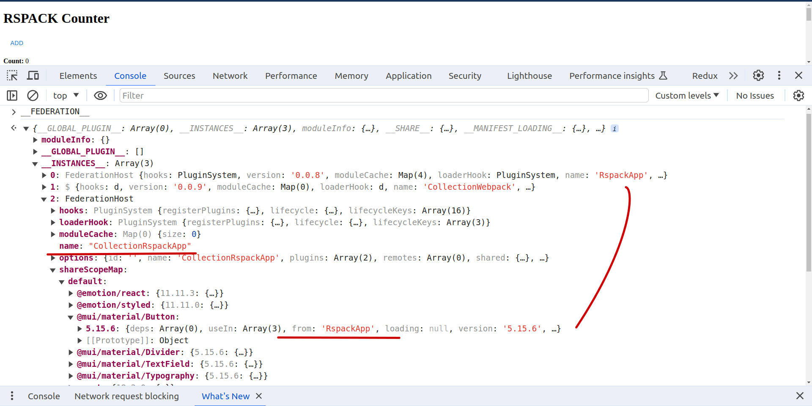

<!--
**Note:** When your BEP is complete, all these pre-existing comments should be removed

When editing BEPs, aim for tightly-scoped, single-topic PRs to keep discussions focused. If you disagree with what is already in a document, open a new PR with suggested changes.
-->

# BEP: <!-- Your short, descriptive title -->

<!-- Before merging the initial BEP PR, create a feature issue and update the below link. You can wait with this step until the BEP is ready to be merged. -->

[**Discussion Issue**](https://github.com/backstage/backstage/issues/22423)

- [Summary](#summary)
- [Motivation](#motivation)
  - [Goals](#goals)
  - [Non-Goals](#non-goals)
- [Proposal](#proposal)
- [Design Details](#design-details)
- [Release Plan](#release-plan)
- [Dependencies](#dependencies)
- [Alternatives](#alternatives)

## Summary

<!--
The summary of the BEP is a few paragraphs long and give a high-level overview of the features to be implemented. It should be possible to read *only* the summary and understand what the BEP is proposing to accomplish and what impact it has for users.
-->

The dynamic frontend plugins feature is a way of loading additional frontend plugins at runtime, without the requirement of rebuilding and restarting a running Backstage instance. It also provides a method for packaging and distributing plugins as standalone artifacts, which can be installed directly into Backstage.

This system should significantly improve frontend plugin management for Backstage instances, and makes it possible to deploy changes to the app without rebuilding the app itself.

The dynamic plugins leverage the declarative nature of the new frontend system to define what a plugin is and how it is integrated into the rest of the app.

## Motivation

<!--
This section is for explicitly listing the motivation, goals, and non-goals of
this BEP. Describe why the change is important and the benefits to users.
-->

Being able to dynamically install plugins unlocks new ways of deploying and managing Backstage, and has the potential to hugely improve adoption by lowering the barrier of entry. A Backstage installation currently requires quite a lot of care to maintain, meaning it may not be worth the investment for smaller organizations. By making it possible to set up and maintain a Backstage instance without the need to manage a codebase, we can make Backstage more accessible to a wider audience.

The ability to dynamically install plugins also allows for more isolated development and deployment of plugins. This can benefit organizations with large Backstage projects, where splitting the codebase into multiple smaller projects can improve development experience and autonomy.

### Goals

<!--
List the specific goals of the BEP. What is it trying to achieve? How will we
know that this has succeeded?
-->

The overarching goal of this proposal is to outline the full path of how frontend plugin code in a repository makes it way into an existing Backstage app. As part of this, we define the following:

- **Bundling**: How plugin code is packaged into a portable artifact.
- **Distribution**: How these artifacts are deployed or published and made available for apps to load.
- **Loading**: How an app is able to load these artifacts from remote or local sources at runtime.

Each of these may have multiple possible solutions, in particular the loading and distribution steps. This proposal should aim to provide the minimum solutions that avoids the need for each adopter to have to re-bundle open source plugins, while still making it simple to use dynamic installation for their own internal plugins.

There are a couple of sub-goals that are important for this to work:

- Discover and choose the underlying tooling to enable dynamic frontend plugins.
- An easy way to package existing frontend plugins for dynamic installation.
- Reconfiguring the installed plugins at runtime without rebuilding the app, either declaratively or through code.

### Non-Goals

<!--
What is out of scope for this BEP? Listing non-goals helps to focus discussion
and make progress.
-->

The **integration** of installed plugins and features is not in scope for this proposal, that is the responsibility of the new frontend system.

This proposal does not contain any form of visual interface for managing dynamically installed plugins. The scope of this proposal only includes configuration of dynamic plugins through static configuration and TypeScript interfaces.

This proposal does not aim to make it possible to add or remove plugins into an already running frontend app instance as created by `createApp` from the Backstage core APIs. The page must be reloaded for any updates to take effect.

## Proposal

<!--
This is where we get down to the specifics of what the proposal actually is.
This should have enough detail that reviewers can understand exactly what
you're proposing, but should not include things like API designs or
implementation.
-->

### Definition of UI dynamic plugin

A dynamic UI plugin (from now just plugin) is a plugin that is not part of the output of a backstage instance build. The plugin and its assets are injected into backstage at runtime. In this case, its injected into the browser at some point during user session.

From the user POV, there is no difference between classic and dynamic plugins.

The difference is known only to maintainers and should be limited to

- build requirements
- integration into backstage

### Dynamic loading tool

Traditional plugins are not dynamic out of the box. Additional changes are required during build time to make a plugin dynamic.

The main application (shell) also requires some changes to be able to load, inject, and propagate mandatory context to dynamic plugins.

Over the last few year, [Module Federation](https://github.com/module-federation) has become the standard when it comes to dynamically load JS modules browser (and nodejs) environment from remote locations and sharing context between the shell and the remote module.

Although there are other options, like externalizing dependencies, the module federation has proven itself as a robust solution to this particular problem.

### Module federation implementation

There are multiple available implementations of module federation.

Historically, module federation was implemented as a [Webpack feature](https://webpack.js.org/). Since then, additional implementations were created. Mainly for [`rspack`](https://www.rspack.dev/) and [Vite](https://github.com/originjs/vite-plugin-federation).

Recent changes _claim_, that all of these module federation implementations should be compatible with each other and there should be no need for locking backstage into a single implementation.

Compatibility between Webpack and `rspack` should available via the [@module-federation/enhanced](https://www.npmjs.com/package/@module-federation/enhanced) package. The compatibility is further [described here](https://www.rspack.dev/blog/module-federation-added-to-rspack.html#introducing-rspack-050).

The Vite plugin claims webpack compatibility as well. The Vite plugin _is not part of the @module-federation_ organization. The extend of compatibility is at this time unknown.

**The level of compatibility has to be tested.** Before then, no decision in regards to which implementation(s) will be used should be made. The chosen tool, or their mix, will shape the design and implementation.

That said, packages from the `@module-federation/*` organization should have higher priority as they are based directly on the module federation concepts and are well supported.

### Plugin integration into shell applications

Plugins should be integrated via the new UI system. The system already provides an asynchronous way of loading plugins. The dynamic plugins can be loaded in a similar fashion.

Plugins should be defined declaratively through configuration. Similar to what was described in this [RFC](https://github.com/backstage/backstage/issues/18372) and in this [issue](https://github.com/backstage/backstage/issues/19545).

### Plugin registry

Because plugins are not available at build time, some sort of registry needs to exist to store the information.

This registry needs to be mutable at runtime (add/remove new plugin metadata) and changes have to be reflected on session refresh.

This is currently an issue as the app config is embedded into JS assets during build time.

Each plugin is required to provide manifest file (metadata) in predefined format. This manifest will be used to inject the plugin assets into the browser.

### Plugin discovery

Plugin discovery is a pre-requisite for Plugin registry. This should be responsible for scanning for available plugins and generating/modifying the plugin registry to always keep it up to date.

## Design Details

> NOTE The details are based on the Janus implementation of dynamic frontend plugins. The implementation leverages [Scalprum](https://github.com/scalprum/scaffolding) which is a Webpack based dynamic plugin manager for React applications.

### Module federation implementation experiments

Test should consist of trying to run permutations of webpack/Rspack/vite based shell apps/plugins and discover if we can freely choose any tool, or if we should restrict the tooling to just a subset of the available options.

The outcome of initial testing is positive and it is possible to mix and match different build tools and consume different remote modules in a single shell application.

The experimental code can be found in [this repository](https://github.com/scalprum/mf-mixing-experiments).

So far a lot of custom code needs to be written to bridge Webpack, Rspack, @module-federation/enhanced with Vite. The first three are compatible out of the box, but Vite requires extra bridge to be able to consume/provide modules with/to other builds.

#### React context and singleton sharing

We can share React context and its values. Meaning a shell application (or a plugin parent) can have a context provider and a plugin will consume the context value.

An example is this [package](https://github.com/scalprum/mf-mixing-experiments/tree/master/shared-package) in the experiment repo.

The shell apps supply the provider and remote modules consume it. There are no issues with any combination of tooling.

#### Optimized module sharing

Module sharing optimizations are also working nicely. ([Optimization description](https://medium.com/@marvusm.mmi/webpack-module-federation-think-twice-before-sharing-a-dependency-18b3b0e352cb))

Mixing shared scope is working between various modules using various build tools.

Sample configuration:
https://github.com/scalprum/mf-mixing-experiments/blob/master/mixed-remote-modules-collection/webpack.config.js#L27-L41

```js
const plugin = new ModuleFederationPlugin({
  ...
  shared: {
    '@mui/material/Button': {
      requiredVersion: '>=5.0.0',
      version: '5.15.6',
    },
    '@mui/material/TextField': {
      requiredVersion: '>=5.0.0',
      version: '5.15.6',
    },
    '@mui/material/Typography': {
      requiredVersion: '>=5.0.0',
      version: '5.15.6',
    },
    '@mui/material/Divider': {
      requiredVersion: '>=5.0.0',
      version: '5.15.6',
    },
    ...
  },
});

```

This config ensures that only those modules (from @mui/material) that are used in the code will be shared. If a relative imports and the entire dependency name is used, the entire dependency will be shared, regardless of which modules are consumed. Tree shaking does not work when an entire dependency is shared! Explanation of why is described [here](https://medium.com/@marvusm.mmi/webpack-module-federation-think-twice-before-sharing-a-dependency-18b3b0e352cb).

This can be checked by debugging network traffic and shared scopes:



### Plugin manifest

Each plugin should have a manifest file with important metadata. This metadata is used to load the remote assets to browser. The plugin manifest should be part of a build output.

A manifest should have:

- name of plugin
- how can be the init container accessed
- what is the base URL (assets pathname)
- name of the entry script(s)

#### Scalprum compatible manifest

```TS
type PluginManifest = {
  name: string;
  version: string;
  dependencies?: Record<string, string>;
  customProperties?: AnyObject;
  baseURL: string;
  extensions: Extension[];
  loadScripts: string[];
  registrationMethod: 'callback' | 'custom';
  buildHash?: string;
}
```

```js
{
  "name": "backstage.plugin-github-actions",
  "version": "0.6.6",
  "extensions": [],
  "registrationMethod": "callback", // where container init is available  in browser
  "baseURL": "auto",
  "loadScripts": [
    "backstage.plugin-github-actions.804b91040fcbca6585ce.js"
  ],
  "buildHash": "804b91040fcbca6585ce1bcd4b1f8aa2"
}
```

##### `registrationMethod`

Refers to [webpack output.libraryTarget](https://webpack.js.org/configuration/output/#outputlibrarytarget).

Callback refers to `jsonp` and a the `custom` is used if other available target configuration has been picked.

It is recommended to use either `global` or `jsonp` as these are environment agnostic (browser VS node). `jsonp` requires additional configurations. The `global` is preferable due to its simplicity.

##### `baseURL`

The `baseURL` is derived from [webpack public path](https://webpack.js.org/configuration/output/#outputpublicpath)

The public path can also be set to `auto` to remove the need to specify origin or pathname and resolve the pathname at runtime.

In Scalprum, some manifest [post processing](https://github.com/janus-idp/backstage-showcase/blob/main/packages/app/src/components/DynamicRoot/DynamicRoot.tsx#L323) is required to load the initial scripts if the `auto` baseURL is chosen.

### Plugin registry

Plugin registry can be fairly simplistic. It can be as simple as JSON file containing list/map of available plugins and their manifests

```TS
type RegistryEntry = {
  name: string // plugin name
  manifestLocation: string // path to the manifest resource
}

// object for easy access
type PluginRegistry = {
  [pluginName: string]: RegistryEntry
}

// or as an array
type PluginRegistry = RegistryEntry[]
```

Example of such registry

```JS
// as object
{
  "backstage.plugin-github-actions": {
    "name": "backstage.plugin-github-actions",
    "manifestLocation": "https://foo-bar.com/api/plugin-storage/plugin-manifest.json"
  },
  // ..rest of plugins
}

// as array
[
  {
    "name": "backstage.plugin-github-actions",
    "manifestLocation": "https://foo-bar.com/api/plugin-storage/plugin-manifest.json"
  },
  // ...rest of plugins
]
```

Scalprum by default lazy loads plugins and manifests. That is because Scalprum initializes plugins only once they are supposed to be rendered in browser.

Because backstage does not require that functionality in initial dynamic plugin implementation and loads all plugins at bootstrap, there is an alternative to embed manifest data into the registry itself.

```TS
type RegistryEntry = {
  name: string // plugin name
  pluginManifest: PluginManifest
}

// object for easy access
type PluginRegistry = {
  [pluginName: string]: RegistryEntry
}

// or as an array
type PluginRegistry = RegistryEntry[]

```

Example of registry with embedded manifests

```JS
// as object
{
  "backstage.plugin-github-actions": {
    "name": "backstage.plugin-github-actions",
    "pluginManifest": {
      "name": "backstage.plugin-github-actions",
      "version": "0.6.6",
      "extensions": [],
      "registrationMethod": "callback",
      "baseURL": "auto",
      "loadScripts": [
        "backstage.plugin-github-actions.804b91040fcbca6585ce.js"
      ],
      "buildHash": "804b91040fcbca6585ce1bcd4b1f8aa2"
    }
  },
  // ..rest of plugins
}

// as array
[
  {
    "name": "backstage.plugin-github-actions",
    "pluginManifest": {
      "name": "backstage.plugin-github-actions",
      "version": "0.6.6",
      "extensions": [],
      "registrationMethod": "callback",
      "baseURL": "auto",
      "loadScripts": [
        "backstage.plugin-github-actions.804b91040fcbca6585ce.js"
      ],
      "buildHash": "804b91040fcbca6585ce1bcd4b1f8aa2"
    }
  },
  // ...rest of plugins
]

```

### Webpack build configuration

> NOTE This is a sample current configuration in the Janus project. It uses Scalprum webpack based build plugin to generate the output. It does not take the [all options](#Module-federation-implementation-experiments) in consideration. This section will likely change considerably.

Part of a Scalprum tooling is also [dynamic-plugins-sdk](https://github.com/openshift/dynamic-plugin-sdk). Right now the package is a part of a different project, but that is about to change. More details in the [Scalprum roadmap](https://github.com/scalprum/scaffolding/blob/main/ROADMAP.md).

#### Sample plugin configuration using Scalprum SDK

```TS
import { DynamicRemotePlugin } from '@openshift/dynamic-plugin-sdk-webpack';

const sharedModules = {
  /**
   * Mandatory singleton packages for sharing
   */
  react: {
    singleton: true,
    requiredVersion: '*',
  },
  'react-dom': {
    singleton: true,
    requiredVersion: '*',
  },
  'react-router-dom': {
    singleton: true,
    requiredVersion: '*',
  },
  'react-router': {
    singleton: true,
    requiredVersion: '*',
  },
  ...
  /**
   * Full list of shared modules in Janus
   * https://github.com/janus-idp/backstage-plugins/blob/87a6b045c7b0f301ebed8b8f99dc1741fa2b044b/packages/cli/src/lib/bundler/scalprumConfig.ts#L16
  */

}

const dynamicPluginPlugin = new DynamicRemotePlugin({
  extensions: [],
  sharedModules,
  entryScriptFilename: `${options.pluginMetadata.name}.[contenthash].js`,
  pluginMetadata: {
    // version cna be used from the package.json version field
    version: '1.0.0',
    /**
     * Name can be easily derived from the plugin name
     * https://github.com/janus-idp/backstage-plugins/blob/87a6b045c7b0f301ebed8b8f99dc1741fa2b044b/packages/cli/src/commands/export-dynamic-plugin/frontend.ts#L40
    */
    name: 'backstage.plugin-github-actions',
    /**
     * Path to the plugin entry point.
     * It can default to the same entry point as in regular build.
     * Plugins can expose multiple modules. We have found that one is sufficient from backstage plugins.
    */
    exposedModules: {
      PluginRoot: './src/index.ts'
    }
  },
});
```

The `DynamicRemotePlugin` webpack plugin takes care of the rest, including the manifest generation.

#### Sample plugin raw webpack configuration

The Scalprum config translates to a following base webpack plugin configuration:

```JS
import { container } from 'webpack';

const dynamicPlugin = new container.ModuleFederationPlugin({
  name: 'backstage.plugin-github-actions',
  library: {
    type: 'global',
    /**
     * Some library.type has name limitation
     * for example, if "type": "var" is used, the library.name can contain the "-" character
    */
    name: 'backstage.plugin-github-actions'
  },
  filename: 'backstage.plugin-github-actions.[contenthash].js',
  exposes: {
    PluginRoot: './src/index.ts'
  },
  // list of shared modules like "react", "react-dom", etc
  shared: sharedModules,
});
```

Additional plugin would have to be written from scratch to generate the plugin manifest file.

### Sample shell application webpack configuration

Shell application (backstage) has very simple module federation configuration. It does not require anything special to be able to inject plugins. Main requirement is to provide core shared packages like react and react-dom.

```JS
import { container } from 'webpack';

const scalprumPlugin = new container.ModuleFederationPlugin({
  name: 'backstageHost',
  filename: 'backstageHost.[contenthash].js',
  // same share modules list as with plugin config
  shared: [sharedModules],
});
```

Nothing else is required.

### Plugin storage

Where will the dynamic plugin assets be hosted? Module federation does not strictly require the remote assets to be all hosted on the same origin.

Theoretically plugins can be hosted on some "public CDN" which is detached from individual backstage instances.

Assets can be also be hosted in the same way as they have always been.

### Plugin discovery

How to notify/send data to browser

### Plugin initialization

Currently all plugins have to be initialized at UI bootstrap (page refresh). The new UI async API can be used to initialize the remote assets.

The `CreateAppFeatureLoader` can be leveraged to initialize the remote container.

```TS
const allPluginManifests = {...} // get this from the config

const asyncFeatureLoaders: CreateAppFeatureLoader[] = Object.values(allPluginManifests).map(({ manifest }) => {
  return {
      getLoaderName: () => manifest.name,
      load: (options) => {
        // initialize the remote container, depends on tooling
        const plugin = initDynamicPlugin(manifest)
      }
  }
})

const app = createApp({
  features: [
    ...asyncFeatureLoaders,
    // rest of classic features
  ]
})
```

### Plugin declarative configuration

Janus dynamic plugins ref: https://github.com/janus-idp/backstage-showcase/blob/main/showcase-docs%2Fdynamic-plugins.md#frontend-layout-configuration

TBD, depends heavily on the new UI system

<!--
This section should contain enough information that the specifics of your
change are understandable. This may include API specs or even code snippets.
If there's any ambiguity about HOW your proposal will be implemented, this is the place to discuss them.
-->

## Release Plan

<!--
This section should describe the rollout process for any new features. It must take our version policies into account and plan for a phased rollout if this change affects any existing stable APIs.

If there is any particular feedback to be gathered during the rollout, this should be described here as well.
-->

## Dependencies

<!--
List any dependencies that this work has on other BEPs or features.
-->

## Alternatives

<!--
What other approaches did you consider, and why did you rule them out? These do
not need to be as detailed as the proposal, but should include enough
information to express the idea and why it was not acceptable.
-->
