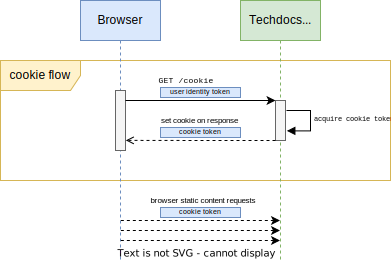
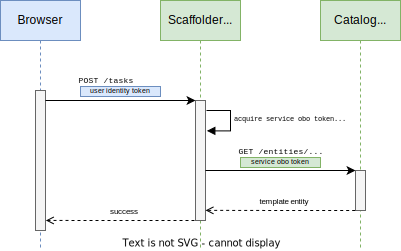

# BEP: Auth Architecture Evolution

<!-- Before merging the initial BEP PR, create a feature issue and update the below link. You can wait with this step until the BEP is ready to be merged. -->

[**Discussion Issue**](https://github.com/backstage/backstage/issues/22605)

- [Summary](#summary)
- [Motivation](#motivation)
  - [Goals](#goals)
  - [Non-Goals](#non-goals)
- [Proposal](#proposal)
- [Design Details](#design-details)
- [Release Plan](#release-plan)
- [Dependencies](#dependencies)
- [Alternatives](#alternatives)

## Summary

This proposal outlines a new architecture for authenticating users and services in Backstage. It adds built-in access restriction to Backstage instances that protects them from outside access, and enables more granular access control for inter-plugin communication and access from external services.

It proposes a new `AuthService` interface that handles all user and service authentication and token management available to plugins, as well as a new `HttpAuthService` interface that is a higher level service used to protect endpoints of plugin routers. The `auth-backend` will also be extended to support issuing of user tokens with a reduced scope for cookie-based authentication of requests.

The changes to the service-to-service auth are aimed to be the minimum needed to get the necessary interfaces in place, and will rely on the existing symmetrical keys for now.

## Motivation

This proposal aims to address several of the points in the [Auth Meta issue](https://github.com/backstage/backstage/issues/15999), with the overarching goal being to replace the existing [API request authentication](https://github.com/backstage/backstage/blob/master/contrib/docs/tutorials/authenticate-api-requests.md) tutorial in `contrib/` with a more robust and secure built-in solution. The tutorial exists for two purposes: to add authentication of API requests as part of using the permission system in Backstage, and to protect a Backstage instance from external access. It does a fairly good job of the former, although we want to avoid placing user tokens in cookies, but it does a quite poor job of the latter, which we want to fix.

A secondary goal is to do this work before stabilizing the APIs in the new Backend system, as it will have some impact on how plugin backends are built. This will inevitably also lead to the need to improve the way that service-to-service auth is handled in Backstage, although that is not the primary goal of this work.

By providing protection of Backstage instances out of the box we drastically reduce both the barrier of entry as well as security risks for Backstage adopters. It will no longer be a requirement to either set up protection of your Backstage instance or not do so and risk exposing your instance to malicious actors. It also drastically reduces the complexity of enabling the permission system of Backstage, since access restrictions are already built-in.

### Goals

The following goals are the primary focus of this BEP:

- Built-in protection of Backstage instances such that it is safe to deploy Backstage directly towards the internet.
  - Protection of the frontend app bundle from being accessed by unauthenticated users.
  - Basic rate limiting of non-authenticated requests.
  - Cookie-based authentication of requests for static assets that protects against CSRF attacks and does not unnecessarily expose user tokens.
  - A solution where plugin builders need to opt-out of endpoint protection, for example allowing cookie or unauthenticated access.
- Basic improvements to the service-to-service auth service interfaces such that we are confident that we do not need to break them in the near future.
  - If possible we will keep using the existing symmetrical keys that are used today, but it is likely that we will need to break compatibility of existing tokens.
  - Encapsulation of user credentials in upstream service requests, avoiding the pattern where backend plugins re-use the user token directly for their outgoing requests.
- Separate out the ownership information out of the Backstage user tokens, since user tokens have been growing large enough to have an impact on performance and reliability.

### Non-Goals

- No advanced rate limiting or other protection against DDoS attacks. If this is a concern then adopters should still use other external technologies to protect access to their Backstage instance.
- As part of the immediate work we will only add as much support for service-to-service auth as is needed for a stable API, and not necessarily make it very capable from the start.
- We will not aim to provide an abstraction that makes it possible to switch out the `Authorization` header for service-to-service communication.

## Proposal

Two new backend service interfaces are introduced to support these new features. The new `AuthService` is a low-level service that encapsulates authentication and creation of bearer tokens for all types of Backstage identities, including user, service, and services making requests on behalf of users. The new `HttpAuthService` is a higher level service that lets you access the credentials and identity of incoming requests, and issue credentials for outgoing requests. These new services replace the existing `IdentityService` and `TokenManagerService`

The proposed design leaves the decision for how different endpoints are protected to the implementation of the plugin backends themselves. This includes whether particular routes should allow anonymous access, access from users authenticated via a cookie, or perhaps only allow access from other plugin backends and external services. This means that integrators do not need to - and do not have the ability to - configure access controls of individual endpoints, except for what the permission system already provides, and what is made available through static configuration or extension points.

To ensure a secure-by-default design, there is a default access control policy that applies to all plugin routes, known as the "default auth policy". This policy is to only allow access from authenticated users and services, and is implemented in the `HttpRouterService` interface. In order to allow either unauthenticated access or cookie-based access, a plugin must opt-out of the default auth policy for specific path prefixes, effectively leaving the access control implementation to the plugin itself. This is done through the new `addAuthPolicy` method that is added to the `HttpRouterService` interface.

In order to allow for cookie-based authentication of incoming user requests, the `AuthService` is able to issue user tokens with limited scope. These limited scope tokens can still be used to fetch user information and in on-behalf-of service calls, but they are rejected by the default auth policy. The `HttpAuthService` provides a standardized way of handling cookies, which integrates with the `'user-cookie'` auth policy. The limited tokens can also be used in other contexts where it is beneficial to avoid storing full user credentials, but instead use credentials that can be upgraded in a controlled manner, such as scaffolder tasks. The `AuthService` implementation can choose to have a longer expiry of the limited tokens compared to the full user tokens, but this is not a requirement.

For service-to-service communication we will move away from reusing user tokens in upstream requests. We will instead implement an "On-Behalf-Of" flow where incoming user credentials are encapsulated in a service token for the upstream request. In line with this the new auth service interfaces will aim to make it difficult to directly forward credentials from incoming requests, and instead encourage that plugin backends issue new service credentials for upstream requests.

An issue that has been identified in the current auth implementation is that the user information embedded in the Backstage user tokens can grow fairly large. In order to avoid that this becomes a widespread problem, especially as we implement cookie auth with a 4kb size limit, we will remove the ownership entity refs (`ent` claim) from the user tokens. There were already very few consumers of this information in practice - only the `permission-backend` and `signal-backend` plugin packages currently rely on this information. The ownership data will instead be available via a new `UserInfoService`, owned by the `auth-backend`. The implementation of this new service will keep relying on the `ent` claim of the user token initially, but we will also implement a new `/v1/userinfo` endpoint in the `auth-backend` that will migrate to transparently in the future.

Finally, it is also important to be able to disable the built-in protection of Backstage instances, for example when access protection is already provided by an external service, and one wishes to allow unauthenticated access for internal use. All built-in service implementation therefore support a common configuration for specifying the desired access control.

## Design Details

### `AuthService` Interface

The new `AuthService` interface is defined as follows:

```ts
// These credential types are opaque and will also store some internal information, for example bearer tokens

export type BackstageNonePrincipal = {
  type: 'none';
};

export type BackstageUserPrincipal = {
  type: 'user';

  userEntityRef: string;
};

export type BackstageServicePrincipal = {
  type: 'service';

  // Exact format TBD, possibly 'plugin:<pluginId>' or 'external:<externalServiceId>'
  subject: string;

  // Not implemented in the first iteration, but this is how we might extend this in the future
  permissions?: string[];
};

export type BackstageCredentials<TPrincipal = unknown> = {
  $$type: '@backstage/BackstageCredentials';

  expiresAt?: Date;

  principal: TPrincipal;
};

export type BackstagePrincipalTypes = {
  user: BackstageUserPrincipal;
  service: BackstageServicePrincipal;
  none: BackstageNonePrincipal;
};

export interface AuthService {
  authenticate(
    token: string,
    options?: {
      allowLimitedAccess?: boolean;
    },
  ): Promise<BackstageCredentials>;

  isPrincipal<TType extends keyof BackstagePrincipalTypes>(
    credentials: BackstageCredentials,
    type: TType,
  ): credentials is BackstageCredentials<BackstagePrincipalTypes[TType]>;

  getNoneCredentials(): Promise<BackstageCredentials<BackstageUserPrincipal>>;

  getOwnServiceCredentials(): Promise<
    BackstageCredentials<BackstageServicePrincipal>
  >;

  getPluginRequestToken(options: {
    onBehalfOf: BackstageCredentials;
    targetPluginId: string;
  }): Promise<{ token: string }>;

  getLimitedUserToken(
    credentials: BackstageCredentials<BackstageUserPrincipal>,
  ): Promise<{ token: string; expiresAt: Date }>;
}
```

### `UserInfoService` Interface

The new `UserInfoService` interface is defined as follows:

```ts
export interface BackstageUserInfo {
  userEntityRef: string;
  ownershipEntityRefs: string[];
}

export interface UserInfoService {
  // The implementation of this method should support both regular and limited user credentials
  getUserInfo(credentials: BackstageCredentials): Promise<BackstageUserInfo>;
}
```

The `UserInfoService` is exported by `@backstage/auth-node`, and the initial implementation will simply read the ownership refs from the `ent` claim of the underlying token of the user credentials. The next iteration will instead call the `/v1/userinfo` endpoint of the `auth-backend`, once that has been implemented.

### `HttpRouterService` Interface

> Open question: Should this instead be added to the `HttpAuthService`? It may fit a bit better there, but on the other hand it might make sense to add additional policies unrelated to authentication too, such as rate limiting.

The `HttpRouterService` interface will be extended with the ability to opt-out of the default protection of endpoints, enabling cookie or unauthenticated access.

```ts
export interface HttpRouterServiceAuthPolicy {
  // The path matches in the same way as if it was passed to `express.Router.use(path, ...)`
  path: string;
  allow: 'unauthenticated' | 'user-cookie';
}

export interface HttpRouterService {
  // All routes only allow authenticated users and services by default.
  use(handler: Handler): void;

  // These are additive and the most relaxed access level takes precedence
  addAuthPolicy(policy: HttpRouterServiceAuthPolicy): void;
}
```

### `HttpRouterService` Usage Patterns

All of these usages patterns are from the perspective of a plugin backend.

#### Standard plugin that only allows access from authenticated users and services

```ts
export default createBackendPlugin({
  pluginId: 'todo',
  register(env) {
    env.registerInit({
      deps: {
        http: coreServices.httpRouter,
      },
      async init({ http }) {
        http.use(await createRouter(/* ... */));
      },
    });
  },
});
```

This is expected to be the pattern for the vast majority of plugins.

#### A plugin with a cookie-based authentication endpoint

```ts
export default createBackendPlugin({
  pluginId: 'techdocs',
  register(env) {
    env.registerInit({
      deps: {
        auth: coreServices.auth,
        httpAuth: coreServices.httpAuth,
        http: coreServices.httpRouter,
      },
      async init({ auth, httpAuth, http }) {
        const router = Router();

        // Endpoint that sets the cookie for the user
        router.get('/cookie', async (req, res) => {
          const { expiresAt } = await httpAuth.issueUserCookie(res);

          res.json({ expiresAt: expiresAt.toISOString() });
        });

        // Endpoint protected by cookie auth
        router.get('/static', express.static(/* ... */));

        // The order of these two calls does not matter
        http.use(router);
        http.addAuthPolicy({
          path: '/static',
          allow: 'user-cookie',
        });
      },
    });
  },
});
```

#### A plugin that disabled the default auth policy and handles auth by itself

```ts
export default createBackendPlugin({
  pluginId: 'app',
  register(env) {
    env.registerInit({
      deps: {
        http: coreServices.httpRouter,
      },
      async init({ http }) {
        http.use(await createRouter(/* ... */));
        http.addAuthPolicy({
          path: '/',
          allow: 'unauthenticated',
        });
      },
    });
  },
});
```

### `HttpAuthService` Interface

The new `HttpAuthService` interface is defined as follows:

```ts
type BackstageHttpAccessToPrincipalTypesMapping = {
  user: BackstageUserPrincipal;
  service: BackstageServicePrincipal;
  unauthenticated: BackstageNonePrincipal;
  unknown: unknown;
};

export interface HttpAuthService {
  // Implementations should cache resolved credentials on the request object
  credentials<
    TAllowed extends
      keyof BackstageHttpAccessToPrincipalTypesMapping = 'unknown',
  >(
    req: Request,
    options?: {
      allow?: Array<TAllowed>;
      allowLimitedAccess?: boolean;
    },
  ): Promise<
    BackstageCredentials<BackstageHttpAccessToPrincipalTypesMapping[TAllowed]>
  >;

  issueUserCookie(
    res: Response,
    options?: {
      // If credentials are not provided, they will be read from the request
      credentials?: BackstageCredentials<BackstageUserPrincipal>;
    },
  ): Promise<{ expiresAt: Date }>;
}
```

### `AuthService`, `HttpAuthService` and `UserInfoService` Usage Patterns

All of these usages patterns are from the perspective of a plugin backend.

#### Authenticate incoming request that requires user authentication

```ts
// All routes only allow authenticated users and services by default.
router.get('/read-data', (req, res) => {
  const credentials = await httpAuth.credentials(req, { allow: ['user'] }); // throws if not: user (or obo), user-cookie
  const { ownershipEntityRefs } = await userInfo.getUserInfo(credentials);
  console.log(
    `User ref=${credentials.principal.userEntityRef} ownership=${ownershipEntityRefs} claims=${credentials.principal.extraClaims}`,
  );
  // ...
});
```

#### Issue a service token for a backend-to-backend request

NOTE: This is not what we want this kind of request to look like in practice. The goal is to forward credential objects as far as possible, keeping the `auth.getPluginRequestToken(...)` in API client code rather than plugin app code.

```ts
const { token } = await auth.getPluginRequestToken({
  onBehalfOf: await auth.getOwnServiceCredentials(),
  targetPluginId: 'example',
});

const baseUrl = await discovery.getBaseUrl('example');
const res = await fetch(`${baseUrl}/some-resource`, {
  headers: {
    // A utility may be provided for this in the future if needed, this is currently fairly rare
    Authorization: `Bearer ${token}`,
  },
});
```

#### Forward the user credentials from an incoming requests to upstream plugin backend

```ts
class CatalogIntegration {
  async getEntity(
    res: string,
    options: {
      credentials: BackstageCredentials;
    },
  ) {
    return catalogClient.getEntityByRef(req.params.entityRef, {
      token: await auth.getPluginRequestToken({
        onBehalfOf: options.credentials,
        targetPluginId: 'catalog',
      }),
    });
  }
}

// Earlier in the router setup
const catalogIntegration = new CatalogIntegration();

router.get('/read-data', (req, res) => {
  // The catalogClient will have a reference to the (plugin scoped) HttpAuthService,
  // which it uses to create the credential headers for the upstream request.
  const entity = await catalogIntegration.getEntity(req.params.entityRef, {
    credentials: await httpAuth.credentials(req),
  });
  // ...
});
```

#### Allow both user and service request

```ts
router.get('/read-data', (req, res) => {
  const credentials = await httpAuth.credentials(req, {
    allow: ['user', 'service'],
  });
  if (credentials.principal.type === 'user') {
    res.json(
      todoStore.listOwnedTodos({ owner: credentials.principal.userEntityRef }),
    );
  } else {
    res.json(
      todoStore.listTodos({
        serviceId: credentials.principal.subject,
      }),
    );
  }
});
```

#### Using limited user tokens to access user info

```ts
router.get('/read-data', (req, res) => {
  const credentials = await httpAuth.credentials(req, {
    allow: ['user'],
    allowLimitedAccess: true,
  });

  const { userEntityRef, ownershipEntityRefs } =
    await userInfo.getUserInfo(credentials);

  console.log(`User ref=${userEntityRef} ownership=${ownershipEntityRefs}`);
  // ...
});
```

### Access Control Configuration

In order to disable access control for a Backstage instance, the following configuration can be used:

```yaml
backend:
  dangerouslyDisableServiceAuth: true
```

The exact impact that this has is that it disables the check in the `HttpRouterService` implementation, effectively applying the `unauthenticated` access level to all routes. Furthermore, it will also change `AuthService` so that the `getPluginRequestToken()` method will now issue an empty token for a `'none'` principal, rather than throwing.

### Token Details

Note that this section is NOT normative. It illustrates the token shapes and major token flows that are involved in this proposal, but intentionally leaves out some low level details and is subject to change.

#### Backstage Identity Tokens

These are the regular tokens, commonly in short referred to just as "Backstage Tokens", that the auth backend generates for the user during sign-in. These are sent along with calls to backend plugins to identify the user. This BEP does not aim to change the shape of these tokens; this section is only here for informative purposes to convey what pieces of information that are at play.

This is a JWT token.

```yaml
# Header
{
  "alg": "ES256",
  "kid": "4f5a0543-894a-4176-b0b7-699a7026b72f"
}
# Payload
{
  "iss": "http://localhost:7007/api/auth",
  "sub": "user:default/example-user",
  "ent": ["user:default/example-user", "group:default/my-team"],
  "aud": "backstage",
  "iat": 1708333140,
  "exp": 1708336740
}
```

The key ID is some random UUID. The `iss` (issuer) is the external base URL of your auth backend. Note that it uses the `ES256` asymmetric signature algorithm, and the auth backend exposes a JWKS that contains the public parts of the signing keys. The `sub` is an entity ref denoting who the signed in user is, and the `ent` is an array of entity refs that they claim ownership through. The `aud` (audience) is hardcoded to the string `"backstage"` always.

#### Legacy Service Tokens

These are the tokens that have been used for backend-to-backend communications before this BEP, and they will likely have changes as part of this work.

This is a JWT token.

```yaml
# Header
{
  "alg": "HS256"
}
# Payload
{
  "sub": "backstage-server",
  "exp": 1708337056
}
```

Note that unlike the identity token in the previous section, it uses the `HS256` symmetric signature algorithm. The key used is the first of the `backend.auth.keys` entries in your `app-config`, which is a shared secret among all backend plugins, enabling them to know that the caller is a legitimate one. But the token does not contain any information about who the caller is (it's just a generic `"backstage-server"`), nor who the receiver (audience) is.

#### New Cookie Token Flow

Some plugins serve static content that the browser engine requests directly, e.g. the TechDocs plugin. Those calls cannot easily have a bearer token attached to them. For these use cases a cookie based flow will be used instead.



The frontend part of the plugin ensures that a cookie endpoint on the backend part of the plugin is called before attempting to render static content. This endpoint validates the user's identity token and sets a corresponding cookie on the response. Subsequent requests for getting static content will automatically have this cookie attached to them by the browser.

We intentionally do not specify here how the cookie token is acquired. It might be issued by the plugin itself or by the auth backend depending on how the architecture evolves, but this does not have any effect on plugin code.

The cookie token contains the user's identifying information just like the identity cookie but is severely limited. It has the plugin itself specified as its audience. Thus, this token is not usable in any bearer token context, nor as a cookie toward any other plugin.

#### New Service OBO Token Flow

When a backend service needs to in turn make a request to another upstream service to fulfil the original request, it uses an On-Behalf-Of (OBO) token for the purpose.



The initial request in this picture is a frontend plugin, but the same concept applies if it is initiated by a service. The scaffolder backend in this example acquires an OBO token to be able to talk to the catalog plugin.

We intentionally do not specify here how the OBO token is acquired. It might be issued by the plugin itself or by the auth backend depending on how the architecture evolves, but this does not have any effect on plugin code.

The OBO token specifies the target service as its audience and itself as the subject, but additionally also contains the original caller's identifying information. Thus, the target service can identify who the nearest caller is but also apply permissions that are relevant to the original caller. The token is thus scoped to not be usable toward other backend plugins.

## Release Plan

The existing `IdentityService` and `TokenManagerService` will be deprecated and instead implemented in terms of the new `AuthService`.

The new `AuthService` and `HttpAuthService` will need backwards compatible implementations for the old backend system. The plan is to not apply any access restrictions for the old Backend system, only implementing that in the new system. The backwards compatibility helpers will use the provided `identity` and `tokenManager` services if available, and plugins should provide fallbacks in the same way as they currently do. If these are not provided, the `identity` client will fall back to `DefaultIdentityClient`, and `tokenManager` will fall back to `ServicerTokenManager.noop()`.

The backwards compatibility helpers will have the following behavior for each individual service call:

- `auth.authenticate(token, options)`: If the decoded token has the `backstage` audience, authenticate the token for a user principal using `identity.getIdentity(...)`, otherwise authenticate it using `tokenManager.authenticate(...)` and return a service principal with the subject `external:backstage-plugin`. If a no-op token manager is used then anything but a user token will be treated as a valid service token, which is consistent with existing behavior. The limited access option is ignored.
- `auth.getOwnServiceCredentials()`: Use original implementation.
- `auth.isPrincipal()`: Use original implementation.
- `auth.getPluginRequestToken(options)`: Same behavior as the original implementation, using the `tokenManager` to issue service tokens, with the exception that a `none` principal will translate to an empty token rather than an error in order to properly forward calls with a no-op token manager.
- `auth.getLimitedUserToken(credentials)`: This is a no-op and returns the underlying user token with full scope.
- `httpAuth.credentials(...)`: Use original implementation.
- `httpAuth.issueUserCookie(...)`: This is a no-op as we do not need to support cookie auth in the legacy adapter.

With this compatibility layer in place all plugins will be refactored to always use the new `AuthService` and `HttpAuthService` internally. The old deprecated services are only accepted at the public API boundaries, i.e. `createRouter` and similar. All plugin code beyond that point uses the new services.

We do not roll out support for the new auth services for the old backend system, the full implementation is only supported in the new backend system. In particular this means that the new default protection in the `HttpRouterService` only apply to the new backend system.

Users of the old backend system may already have their own protection set up, which we need to take into account, ensuring that we do not break these existing implementations.

Several API clients will be updated to support passing `BackstageCredentials` instead of a token, although it is not a requirement to update all clients. In particular we will hold off on migrating isomorphic clients, leaving them to keep consuming tokens where possible. Adding support for credentials to be passed to these clients is a separate future improvement.

## Dependencies

No significant dependencies have been identified for this work, although any future security audits of Backstage are considered dependent on this work.

## Alternatives

An alternative to built-in protection from external access would be to keep relying on external mechanisms to protect access to Backstage. We feel that this is a suboptimal solution since it adds complexity to the adoption of Backstage, and increases the risk of misconfiguration and security breaches. Regardless of whether we add built-in protection or not the ability to protect API endpoints needs to be addressed in some way, since it is a requirement for the permission system to work. This means that the extra steps to ensure protection out of the box are fairly minimal when looking at just the delta for protecting API access.

### Access Control Patterns

These are the different patterns that we've considered for how plugins should control access to their endpoints.

#### Separate methods / configuration for `use`

This approach extends the `HttpRouterService` with separate methods or options for specifying the access control for different handlers.

Pros:

- We can make strict access control the default, making relaxed controls an opt-in
- The routing setup is quite explicit in what handlers allow for what access levels

Cons:

- Forces separation of the router, splitting it into separate handlers for different levels of access.
- Can be extremely confusing because the top-level middleware for more lax access will also apply to the more strict access levels. For example

  ```ts
  const publicRouter = Router();
  publicRouter.use(rateLimit());
  http.useWithoutAuthentication(publicRouter);

  const mainRouter = Router();
  // rateLimit() will apply here too
  http.use(mainRouter);
  ```

This applied to any similar way of structuring this API, such as a single `.use()` method with additional options:

```ts
http.use(publicRouter, { allow: ['unauthenticated'] });
```

#### Separate configuration on different paths for `use`

Similar to the previous approach, but also require that a path is provided. This removes much of the confusion around what middleware are applied.

The downside of this approach is that it still has the drawback of forcing a separation of the router, but at the same it provides very little benefit over a top-level path configuration approach like `http.addAuthPolicy()`. The `'/static'` path in the below example essentially has the exact same logic as `.addAuthPolicy({ path: '/static', allow: 'user-cookie' })` since it'd be implemented in the same way. The `.addAuthPolicy()` approach has the benefit of allowing plugin authors to decide whether they want to keep the routes separate or not.

This does have the benefit of letting the framework know which exact routes are protected, which can be useful for introspection, although that benefit also applies to the `.addAuthPolicy()` approach.

```ts
// This isn't too bad, but it's extremely similar to the addAuthPolicy() method since
// we're just matching on the path. The benefit of addAuthPolicy is that it allows you
// to keep everything in a singe router if desired.
http.use('/static', cookieRouter, { allow: ['user-cookie'] });
```

#### Complete opt-out

This approach simply enabled plugins to opt-out of the default access control, and instead require that they implement the necessary endpoint protection using `httpAuth.middleware()`.

This approach makes it a bit easier to make mistakes compared to the `.configure()` approach, but at the same time it has the benefit of collection all access control login in a single place (the plugin router). It also doesn't allow the framework to see which endpoints have relaxed protection, which is a downside.

Still, this is a pattern that is currently second in line if we don't go with the `.configure()` approach.

```ts
http.dangerouslyDisableAuthentication();
```

#### Leave access control to the plugin router

Having strict access control be the default with explicit opt-out is an explicit goal of this work, so this is not an option that we are considering.
