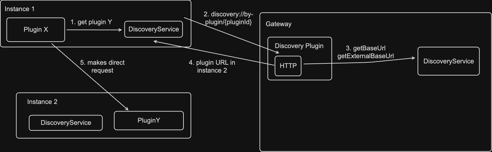
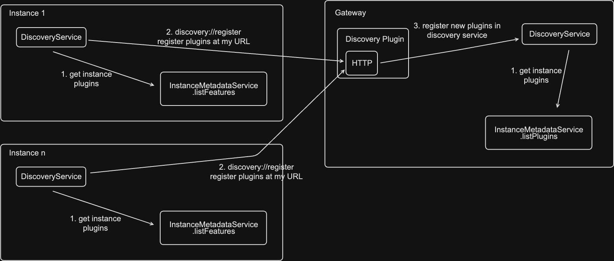
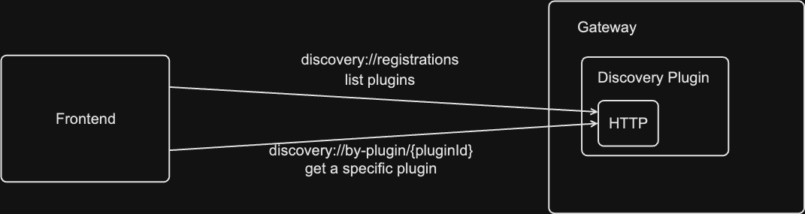

<!--
**Note:** When your BEP is complete, all these pre-existing comments should be removed

When editing BEPs, aim for tightly-scoped, single-topic PRs to keep discussions focused. If you disagree with what is already in a document, open a new PR with suggested changes.
-->

# BEP: Discovery API - Split Backends

<!-- Before merging the initial BEP PR, create a feature issue and update the below link. You can wait with this step until the BEP is ready to be merged. -->

[**Discussion Issue**](https://github.com/backstage/backstage/issues/23496)

- [Summary](#summary)
- [Motivation](#motivation)
  - [Goals](#goals)
  - [Non-Goals](#non-goals)
- [Proposal](#proposal)
- [Design Details](#design-details)
- [Release Plan](#release-plan)
- [Dependencies](#dependencies)
- [Alternatives](#alternatives)

## Summary

<!--
The summary of the BEP is a few paragraphs long and give a high-level overview of the features to be implemented. It should be possible to read *only* the summary and understand what the BEP is proposing to accomplish and what impact it has for users.
-->

The goal of this BEP is to define the architecture that we will be using for an automatic discovery API that handles split backends. While users can use the current target-based config, it is not runtime driven and adding plugins requires a config update. This new system allows existing backends to register with gateway nodes at start time, allows them to unregister before the program exits and catches system errors by timing out plugin registrations that haven't been refreshed recently.

## Motivation

<!--
This section is for explicitly listing the motivation, goals, and non-goals of
this BEP. Describe why the change is important and the benefits to users.
-->

Split backends are a consistently difficult space to operate in and design for. There has been a growing desire for the framework to provide a way to get a list of the installed plugins. This was nearly impossible in the old backend, where plugins were hosted on denormalized routes and had non-standard startup sequences. In the new backend, this has become significantly more doable. Moving this forward would unblock a number of cases that require knowledge of your entire Backstage installation, namely a single OpenAPI spec for your instance, checking installed permissions, and DevTools information.

Ideally, this work will also make it easier for adopters to go down the path of split backends.

### Goals

<!--
List the specific goals of the BEP. What is it trying to achieve? How will we
know that this has succeeded?
-->

1. As an integrator, I can now get a list of currently installed plugins across my deployment.
1. As an administrator, I can use the default discovery API across both frontend and backend for complex situations like split backends, without writing my own.
1. As an administrator, I can add/remove plugins without having to do a full redeployment of all of my Backstage nodes.
1. Registrations will be authenticated and any plugins that are added to the registry will have a proof of access to write to the registry.

### Non-Goals

<!--
What is out of scope for this BEP? Listing non-goals helps to focus discussion
and make progress.
-->

1. I can't install plugins using the new discovery API.
1. I can't control my deployments using the new discovery API.
1. If I fork the BackendInitialization logic, I may not be able to use this API.

## Proposal

<!--
This is where we get down to the specifics of what the proposal actually is.
This should have enough detail that reviewers can understand exactly what
you're proposing, but should not include things like API designs or
implementation.
-->

## Design Details

<!--
This section should contain enough information that the specifics of your
change are understandable. This may include API specs or even code snippets.
If there's any ambiguity about HOW your proposal will be implemented, this is the place to discuss them.
-->

### Glossary

#### Gateway Node

A node that serves as the primary discovery point. A gateway node will have all of the information necessary to route traffic through your system. The gateway node is _not_ an API gateway, it only has knowledge of which plugins are on which nodes, it will not automatically route traffic to the correct instance.

#### Non-gateway Node

A node that needs to call a Gateway node for routing outside of its own plugins. This node will still fire requests to other instances, but does not know which instances have which plugins.

### New Discovery Plugin

We propose a new Discovery plugin that exposes a set of HTTP endpoints that allow dynamic registration and unregistration of plugins across multiple instances in a deployment. This will allow a single instance or type of instance ("gateway node") to have information about all installed plugins across your entire deployment, which may be multiple instances. The API would look like this,

```yaml
openapi: 3.0.3
info:
  title: Discovery API
  version: v1
paths:
  /register:
    post:
      summary: Register a plugin with the gateway.
      operationId: registerPlugin
      requestBody:
        content:
          application/json:
            schema:
              type: object
              properties:
                pluginId:
                  type: string
                externalUrl:
                  type: string
                internalUrl:
                  type: string
        required: true
      responses:
        '200':
          description: Successful operation
        '400':
          description: Invalid input
  /unregister:
    post:
      summary: Unregister a plugin with the gateway.
      operationId: unregisterPlugin
      requestBody:
        content:
          application/json:
            schema:
              type: object
              properties:
                pluginId:
                  type: string
                externalUrl:
                  type: string
                internalUrl:
                  type: string
        required: true
      responses:
        '200':
          description: Successful operation
        '400':
          description: Invalid input or already unregistered.
  /registrations:
    get:
      summary: Get all registered pluginIds
      operationId: listRegistrations
      responses:
        '200':
          description: Success
          content:
            application/json:
              schema:
                type: array
                items:
                  type: string
  /by-plugin/{pluginId}:
    get:
      summary: Get registration URLs for a given pluginId.
      operationId: getRegistrationByPlugin
      parameters:
        - name: pluginId
          in: path
          description: The plugin ID to get information for.
          required: true
          schema:
            type: string
      responses:
        '200':
          description: Success
          content:
            application/json:
              schema:
                type: object
                properties:
                  internal:
                    type: string
                  external:
                    type: string
```

### Backend Requests



Backend [`DiscoveryService`](https://github.com/backstage/backstage/blob/master/packages/backend-plugin-api/src/services/definitions/DiscoveryService.ts) requests will either

1. route to their own instance and can use the existing `HostDiscovery` implementation, or
2. need to route to a separate instance and will have to go to the gateway node for routing information.

To get that extra information, the backend instances will call the gateway node's `by-plugin/{pluginId}` endpoint and route with the given response.

We also propose adding a new method to this service to give a list of plugins across the deployment,

```ts
interface DiscoveryService {
  ...
  listPlugins: () => Promise<string[]>;
}
```

This new method is expected to call the gateway node's `discovery://registrations` method.

### Registration Flow



On startup, _instances_ will send a request to the gateway node, `discovery://register` with information about the instance and what plugins it owns. This request must be signed using service-to-service auth keys between the two instances to prevent malicious registrations. We may revisit this in the future.

### New `InstanceMetadataService`

While we could attach the existing information to the `PluginMetadataService`, we propose a new service that handles instance-level information. The existing `PluginMetadataService` should reveal information about the plugin itself, its `pluginId`, dependencies or similar. The new `InstanceMetadataService` should give you information about the entire Backstage instance that you're interrogating. At launch, this should include the list of features installed _on your instance_ that can then be aggregated by the discovery API across the gateway nodes. One could imagine this service also having information about instance URLs, health or gateway status.

```ts
interface InstanceMetadataService {
  listFeatures: () => BackendFeature[];
  // or
  listFeatures: () => string[]; // list of pluginIds/moduleIds.
}
```

### Frontend Requests



This will leverage the existing [`DiscoveryApi`](https://github.com/backstage/backstage/blob/master/packages/core-plugin-api/src/apis/definitions/DiscoveryApi.ts). We propose adding a new method, `listPlugins` that will return a list of all plugins installed in your Backstage deployment.

```ts
interface DiscoveryApi {
  ...
  listPlugins: () => Promise<string[]>;
}
```

All methods will just call the gateway node's HTTP discovery endpoint for the data, see diagram for more information.

### Gateway Scaling

The primary concern with having multiple gateway nodes is alignment on what plugins are installed across the instance. For this, we propose a new database that will store,

```ts
export interface PluginRegistrations {
  plugin_id: string;
  internal_url: string;
  external_url: string;
  last_health_check: timestamp;
}
```

As any gateway node _could_ be hit by any given plugin, the implementation should not rely on in-memory values per node. Gateway nodes should read and write from/to the database directly.

The triplet `plugin_id`, `internal_url`, `external_url` should be unique. We may have multiple plugins on multiple URLs either internal or external. Routing in those cases is not covered in this BEP. Horizontally scaled plugins should use external technologies to route requests and handle load balancing. This should be reflected in their `backend.baseUrl` properties. Instance IP addresses should _not_ be sent or stored in this database.

### Heartbeats

To prevent stale data, we propose implementing heartbeats. Each plugin should expose a `/health` endpoint (this will be configurable per plugin). When registering, the plugin will send its internal and external reachable URLs to the gateway node. After registering, every x seconds the gateway node will send a heartbeat request to the health endpoint. That endpoint is expected to return a 200 HTTP response. If it doesn't respond with a 200 or doesn't respond within a reasonable timeout, that plugin will be considered unregistered at its instance URL. If this represents the last instance URL for a given plugin, the entire plugin will be considered unavailable.

The goal with adopting heartbeats is to leverage the decentralized nature of health checks per plugin to enable horizontal scaling easily. Only a single instance has to respond to a health check for it to pass.

These would initially be naively implemented, using in memory intervals on each gateway node that a plugin registers with. This brings with it 2 risks that would result in lost traffic.

1. The gateway node handling heartbeats crashes.
1. The instance handling traffic crashes.

Both may cause a temporary outage in plugin traffic.

<!-- TODO: Figure out a good story around error handling and restoring state. -->

### Unregistering Plugins

Each plugin will send a request to the gateway node's `/unregister` endpoint on shutdown. Any responses will not block the shutdown process. This will remove the plugin/instance combination from the database. As we have to consider horizontally scaled deployments, this may be triggered multiple times for a given plugin/instance combination. For duplicates, the endpoint will send a 400.

## Release Plan

<!--
This section should describe the rollout process for any new features. It must take our version policies into account and plan for a phased rollout if this change affects any existing stable APIs.

If there is any particular feedback to be gathered during the rollout, this should be described here as well.
-->

## Dependencies

<!--
List any dependencies that this work has on other BEPs or features.
-->

## Alternatives

<!--
What other approaches did you consider, and why did you rule them out? These do
not need to be as detailed as the proposal, but should include enough
information to express the idea and why it was not acceptable.
-->

## Per-instance registration

This would involve sending a request on instance startup with a list of the current plugins and information about how to route to them. While this is useful with the instance restarts on every plugin addition, it has issues with unregistering plugins when the instance crashes and doesn't restart and causes extra stress on the gateway node in comparison to a pure health check/heartbeat.
