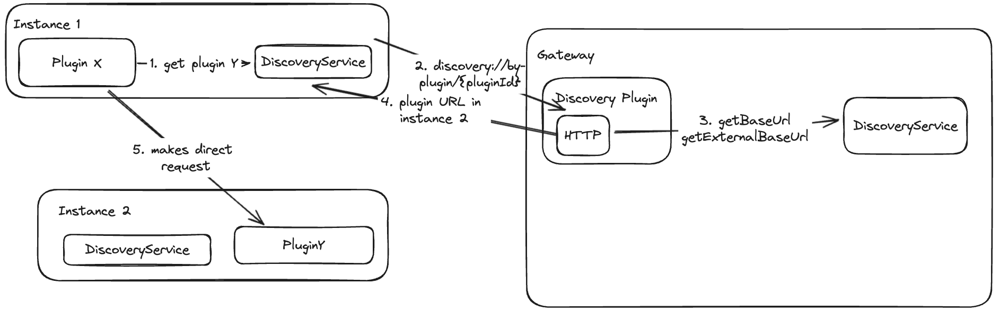
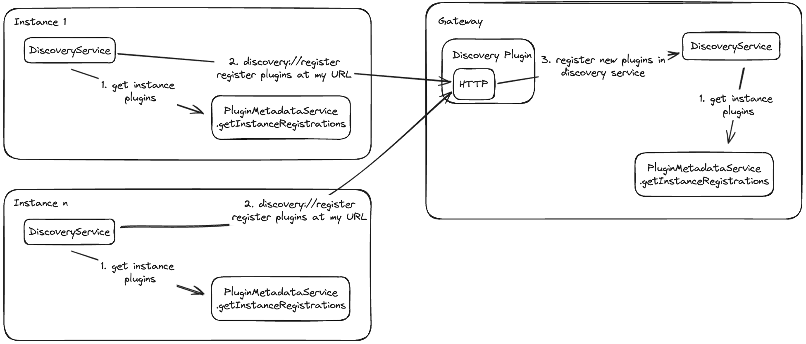
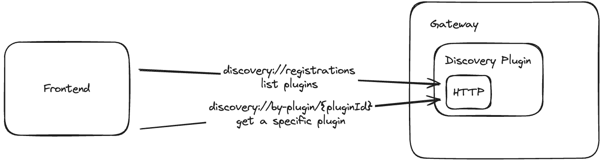

<!--
**Note:** When your BEP is complete, all these pre-existing comments should be removed

When editing BEPs, aim for tightly-scoped, single-topic PRs to keep discussions focused. If you disagree with what is already in a document, open a new PR with suggested changes.
-->

# BEP: Discovery API - Split Backends

<!-- Before merging the initial BEP PR, create a feature issue and update the below link. You can wait with this step until the BEP is ready to be merged. -->

[**Discussion Issue**](https://github.com/backstage/backstage/issues/NNNNN)

- [Summary](#summary)
- [Motivation](#motivation)
  - [Goals](#goals)
  - [Non-Goals](#non-goals)
- [Proposal](#proposal)
- [Design Details](#design-details)
- [Release Plan](#release-plan)
- [Dependencies](#dependencies)
- [Alternatives](#alternatives)

## Glossary

### Gateway Node

A node that serves as the primary discovery point. A gateway node will have all of the information necessary to route traffic through your system.

### Non-gateway Node

A node that needs to call a Gateway node for routing.

## Summary

<!--
The summary of the BEP is a few paragraphs long and give a high-level overview of the features to be implemented. It should be possible to read *only* the summary and understand what the BEP is proposing to accomplish and what impact it has for users.
-->

The goal of this BEP is to define the architecture that we will be using for an automatic discovery API that handles split backends. While users can use the current target-based config, it is not runtime driven and adding plugins requires a config update. This new system allows existing backends to register with gateway nodes at start time and based on reachability, can be deregistered.

## Motivation

<!--
This section is for explicitly listing the motivation, goals, and non-goals of
this BEP. Describe why the change is important and the benefits to users.
-->

Split backends are a consistently difficult space to operate in and design for. There has been a growing desire for the framework to provide a way to get a list of the installed plugins. This was nearly impossible in the old backend, where plugins were hosted on unnormalized routes and had non-standard startup sequences. In the new backend, this has become significantly more doable. Moving this forward would unblock a number of cases that require knowledge of your entire Backstage installation, namely a single OpenAPI spec for your instance, checking installed permissions, and DevTools information.

Ideally, this work will also make it easier for adopters to go down the path of split backends.

### Goals

<!--
List the specific goals of the BEP. What is it trying to achieve? How will we
know that this has succeeded?
-->

1. As an integrator, I can now get a list of currently installed plugins across my deployment.
1. As an administrator, I can add/remove plugins without having to do a full redeployment of all of my Backstage nodes.

### Non-Goals

<!--
What is out of scope for this BEP? Listing non-goals helps to focus discussion
and make progress.
-->

1. I can't install plugins using the new discovery API.
1. I can't control my deployments using the new discovery API.
1. If I fork the BackendInitialization logic, I may not be able to use this API.

## Proposal

<!--
This is where we get down to the specifics of what the proposal actually is.
This should have enough detail that reviewers can understand exactly what
you're proposing, but should not include things like API designs or
implementation.
-->

## Design Details

<!--
This section should contain enough information that the specifics of your
change are understandable. This may include API specs or even code snippets.
If there's any ambiguity about HOW your proposal will be implemented, this is the place to discuss them.
-->







### Gateway Scaling

The primary concern with having multiple gateway nodes is alignment on what plugins are installed across the instance. For this, we propose a new database that will store,

```ts
export interface PluginRegistrations {
  plugin_id: string;
  internal_url: string;
  external_url: string;
  last_check_in: timestamp;
}
```

As any gateway node _could_ be hit by any given plugin, the implementation should not rely on in-memory values per node. Gateway nodes should read and write from/to the database directly.

The triplet `plugin_id`, `internal_url`, `external_url` should be unique. We may have multiple plugins on multiple URLs either internal or external. Routing in those cases is not covered in this BEP. Horizontally scaled plugins should use external technologies to route requests and handle load balancing. This should be reflected in their `backend.baseUrl` properties. Instance IP addresses should _not_ be sent or stored in this database.

### Check ins

To prevent stale data, we propose implementing "check ins". Each check in will write to the database's `last_check_in` row, these will be infrequent enough that this isn't a crazy load on the database. These check ins serve 2 purposes,

1. to verify that the gateway node is reachable by the non-gateway node.
1. to verify that the gateway node has the most up to date data from the non-gateway node.

The first is necessary to prevent a case where the non-gateway node loses network access or crashes. In this case, we will use the `last_check_in` timestamp. If an instance hasn't contacted the gateway plugin in x checkins (or seconds), we remove that instance's plugins. This will most likely be an optimistic update and will happen at read time for other operations. So the database may still have entries with expired `last_check_in` rows if the discovery API is not actively used.

The second is necessary to prevent a case where an instance may restart with more/less plugins. The gateway needs a way of knowing that the instance data changed. This is why we propose a "check in" approach over just a heartbeat. The non-gateway plugin should send its list of plugins to the gateway plugin to check if anything has changed since it last checked in. This allows us to be much more specific about when the instance will re-register.

In the case of horizontally scaled plugins, we should be able to keep the current check-ins, but we may revisit if the volume is too high.

## Release Plan

<!--
This section should describe the rollout process for any new features. It must take our version policies into account and plan for a phased rollout if this change affects any existing stable APIs.

If there is any particular feedback to be gathered during the rollout, this should be described here as well.
-->

## Dependencies

<!--
List any dependencies that this work has on other BEPs or features.
-->

## Alternatives

<!--
What other approaches did you consider, and why did you rule them out? These do
not need to be as detailed as the proposal, but should include enough
information to express the idea and why it was not acceptable.
-->
