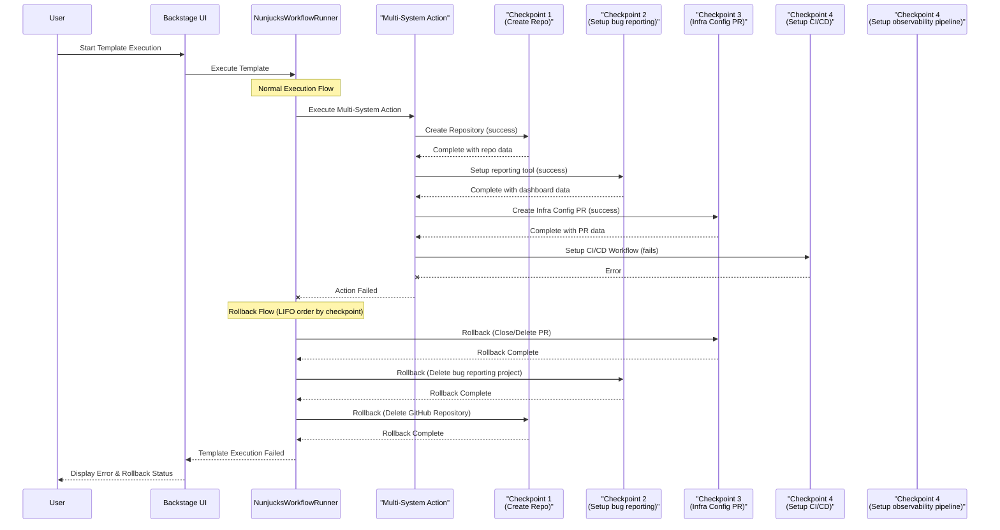

# BEP: Scaffolder Checkpoint Rollback

[**Discussion Issue**](https://github.com/backstage/backstage/issues/28818)

- [Summary](#summary)
- [Problem Statement](#problem-statement)
- [Motivation](#motivation)
  - [Goals](#goals)
  - [Non-Goals](#non-goals)
- [Proposal](#proposal)
- [Example Scenario](#example-scenario)
- [Design Details](#design-details)
  - [Extending Checkpoint API for Rollback](#extending-checkpoint-api-for-rollback)
  - [WorkflowRunner Enhancements](#workflowrunner-enhancements)
  - [Enabling Rollback for Checkpoints](#enabling-rollback-for-checkpoints)
  - [Auditing and Permissions](#auditing-and-permissions)
  - [Securing Rollbacks](#securing-rollbacks)
- [Release Plan](#release-plan)
- [Dependencies](#dependencies)
- [Alternatives](#alternatives)

## Summary

Introducing rollback capabilities to scaffolder checkpoints provides a systematic approach to recover from template execution failures, allowing resources to be cleanly returned to their initial state.

## Problem Statement

When a template execution fails after creating a number of resources but before completing, the system is left in an inconsistent state. Currently, there is no standardized way to clean up these partially created resources, leading to orphaned resources in external systems requiring manual cleanup.

## Motivation

Mitigate the issue of manual cleanup from partially created resources during template execution failures. By leveraging the existing checkpoint system as the foundation for rollback capabilities, we can provide a more granular and atomic approach to resource cleanup based on well-defined operation boundaries.

### Goals

- Extend the existing checkpoint mechanism to support rollback operations
- Enable proper cleanup of resources created in third-party systems when template execution fails
- Improve the developer experience by reducing manual intervention for cleanup after failures
- Provide a clear indicator of which checkpoints have rollbacks in the UI (/create/actions)
- Ensure atomic operations for more predictable rollback behavior
- Ensure auditing is a first-class concern

### Non-Goals

- Modifying existing actions to implement rollback (this proposal only provides the framework)
- Adding automatic rollback triggers for all possible error scenarios
- Implementing rollbacks outside of the checkpoint system

## Proposal

Rollback will be implemented as an extension to the existing checkpoint system, leveraging its idempotency characteristics and database persistence. When a template execution fails, the system will:

1. Identify all successfully completed checkpoints that have rollback functions defined
2. Execute these rollback functions in reverse order (LIFO - Last In, First Out)
3. Track and report on the success/failure status of each rollback operation

This approach aligns with the atomic nature of checkpoints and provides a more granular level of control compared to action-level rollbacks.

## Example Scenario

Consider a service creation template with the following checkpoints that interact with multiple external systems:

1. Create repository (GitHub, GitLab, etc.)
1. Setup bug report tool (Sentry, Bugsnag, etc.)
1. Create configuration PR in infrastructure repository (Terraform, CloudFormation, etc.)
1. Setup CI/CD workflow (CircleCi, GitHub Actions, etc.)
1. Setup observability (Datadog, New Relic, etc.)

If the template fails during the "Setup CI/CD workflow" step, step 5 would not execute and the rollback process would:

1. Attempt to rollback "Create configuration PR in infrastructure repository" by closing and deleting the PR
1. Attempt to rollback "Setup bug reporting tool" by deleting the project
1. Attempt to rollback "Create repository" by deleting the repository

Each checkpoint's rollback function handles cleanup of resources in its respective external system, ensuring atomic operations with clear boundaries across different platforms.



## Design Details

### Extending Checkpoint API for Rollback

The checkpoint API will be extended to include an optional rollback function that can utilize the data saved by the checkpoint:

```typescript
/**
 * Extended Checkpoint API with rollback support
 */
async checkpoint<T>(
  key: string,
  fn: () => Promise<T>,
  rollback?: (opts: { data: T }) => Promise<void>
): Promise<T>;
```

This allows the checkpoint to save data during forward execution that can be used to properly rollback the operation if needed.

Example usage:

```typescript
// Repository creation with rollback
await ctx.checkpoint(
  key: 'repository-created',
  fn: async () => {
    const { owner, repo } = ctx.input;
    const repository = await githubClient.repos.create({ owner, repo });
    return {
      repositoryId: repository.id,
      owner,
      repo,
    };
  },
  // Optional rollback function where data represents the data saved by the checkpoint
  rollback: async ({ data }) => {
    // Rollback function using saved checkpoint data
    const { owner, repo } = data;

    ctx.logger.info('Rolling back repository creation', {
      id: data.repository.id,
    });

    await githubClient.repos.delete({ owner, repo });
  },
);
```

The checkpoint state will be extended to include a new status for rolled back operations. This could include new statuses for failed and rolled back operations.

```typescript
type CheckpointState =
  | {
      status: 'failed';
      reason: string;
    }
  | {
      status: 'success';
      value: JsonValue;
    }
  | {
      status: 'rolledback';
      originalValue: JsonValue;
    }
  | {
      status: 'rollback-failed';
      originalValue: JsonValue;
      reason: string;
    };
```

This enhancement allows us to identify checkpoints that failed to rollback for potential manual intervention, thus tracking the complete lifecycle of a checkpoint (creation → potential rollback).

### WorkflowRunner Enhancements

The `NunjucksWorkflowRunner` will be modified to track successfully completed checkpoints with their rollback functions. When a scaffolder task fails, the system will:

1. Query the database for completed checkpoints associated with the task
2. Filter for checkpoints that have rollback functions defined
3. Execute these rollback functions in reverse order

The implementation will ensure that:

- Rollbacks are executed in proper LIFO order across all actions
- Each rollback operation is properly logged and tracked
- **Failures in one rollback don't prevent other rollbacks from being attempted**

```typescript
// Pseudo-code for rollback execution
for (const checkpoint of completedCheckpointsWithRollback.reverse()) {
  try {
    await checkpoint.rollback?.(checkpoint.data);
    logger.info(`Successfully rolled back checkpoint: ${checkpoint.key}`);
  } catch (error) {
    logger.error(`Failed to rollback checkpoint ${checkpoint.key}: ${error}`);
    // Continue with next rollback
  }
}
```

### Enabling Rollback for Checkpoints

!!! warning Work in progress

Rollbacks will be disabled by default and need to be explicitly enabled. We will add a flag to enable rollback functionality at the task level, with the option to override this at the action level.

```yaml
apiVersion: scaffolder.backstage.io/v1beta3
kind: Template
metadata:
  name: example-template
spec:
  parameters:
    # ...
  steps:
    - id: github-repo
      name: Create GitHub Repository
      action: github:repo:create
      rollbackEnabled: true # Enable rollback for this action
      input:
        # ...
```

Additionally, we will add a system-level configuration option to enable/disable rollback functionality globally.

### Auditing and Permissions

1. Implement the [AuditorService](https://backstage.io/docs/backend-system/core-services/auditor) for key operations related to checkpoints and rollbacks
2. Add a rollback permission definition with permission checks in the `NunjucksWorkflowRunner`
3. Add specific rules for rollback operations to `scaffolderActionRules`
4. Log all rollback attempts and outcomes to provide a clear audit trail

<!-- ### Securing Rollbacks

!!! warning Is this still needed?

For checkpoints that require additional security checks during rollback, we provide a secure rollback helper function. This function will ensure that the resources being rolled back match what was originally created by validating the checkpoint data.

```typescript
export function createSecureCheckpointRollback<T>(
  rollbackFn: (data: T) => Promise<void>,
  validator: (data: T, input: JsonObject) => boolean,
) {
  return async (data: T, context: { input: JsonObject; logger: Logger }) => {
    // Validate the resource matches expected values
    if (!validator(data, context.input)) {
      context.logger.error(
        `Security check failed: checkpoint data doesn't match expected values from input`,
      );
      throw new Error(`Resource validation failed during rollback`);
    }

    // Execute the rollback with validated data
    await rollbackFn(data);
  };
}
``` -->

## Release Plan

This feature enhancement will be optional, ensuring backward compatibility. It will be released as an opt-in feature for both action maintainers and template authors. It can initially be released as part of the [experimental features](https://backstage.io/docs/features/software-templates/experimental).

We will update the documentation to include:

- Description of the checkpoint rollback feature
- Usage examples with the extended checkpoint API
- Migration guide for action maintainers
- Best practices for defining atomic checkpoints with rollback capabilities

## Dependencies

- Existing checkpoint implementation in the scaffolder
- Database schema for storing checkpoint data

## Alternatives

- Action-level rollback: Initially considered attaching rollback functions directly to template actions, but this approach lacks the granularity and atomic nature of checkpoint-based rollbacks.
- Manual rollback templates: Requiring template authors to create separate rollback templates (introduces burden and could lead to inconsistent implementations.
- No rollback: Continue with the current approach of manual cleanup, which leads to orphaned resources and poor user experience.
- Allow the template author to specify a rollback mechanism for each step in yaml

## FAQ

> What happens when a single rollback function fails?

The system will continue to attempt to rollback the remaining checkpoints, and report the failure in a summary of the task.

> How are tasks which provide rollback functions tracked?

The system will track the checkpoints that have rollback functions defined, and execute them in reverse order when a task fails.

> What order are rollback functions executed in?

The system will execute the rollback functions in reverse order of the checkpoints that have rollback functions defined.

> How can someone writing a template disable a rollback function for a given action?

The template author can set the `rollbackEnabled` flag to `false` for the action.

> What security issues are introduced if the scaffolder rollback means the deletion of the resource?

The system will validate the resources being rolled back match what was originally created by validating the checkpoint data.

> Should rollbacks be an opt-in only approach, rather than requiring the template writer to set rollback: false?

Yes, the system will be opt-in only.

> What does a runtime validation mechanism to ensure rollbacks only operate on resources that were actually created by the action look like?

The system will validate the resources being rolled back match what was originally created by validating the checkpoint data.
