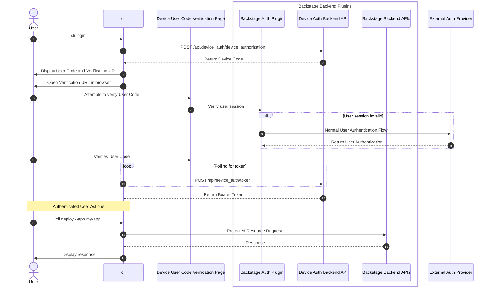

<!--
**Note:** When your BEP is complete, all these pre-existing comments should be removed

When editing BEPs, aim for tightly-scoped, single-topic PRs to keep discussions focused. If you disagree with what is already in a document, open a new PR with suggested changes.
-->

# BEP: Device Authentication

<!-- Before merging the initial BEP PR, create a feature issue and update the below link. You can wait with this step until the BEP is ready to be merged. -->

[**Discussion Issue**](https://github.com/backstage/backstage/issues/NNNNN)

- [Summary](#summary)
- [Motivation](#motivation)
  - [Goals](#goals)
  - [Non-Goals](#non-goals)
- [Proposal](#proposal)
- [Design Details](#design-details)
- [Release Plan](#release-plan)
- [Dependencies](#dependencies)
- [Alternatives](#alternatives)

## Summary

<!--
The summary of the BEP is a few paragraphs long and give a high-level overview of the features to be implemented. It should be possible to read *only* the summary and understand what the BEP is proposing to accomplish and what impact it has for users.
-->

This device authorization flow takes advantage of Backstage's [Auth Plugin](https://github.com/backstage/backstage/blob/master/docs/auth/oauth.md) to authenticate users with the Auth Provider, returning the Backstage User Token to the CLI for use in subsequent calls to the Backstage backend API.

From a User's perspective, this flow is identical to the OAuth2 Device Authorization Grant flow. However, the implementation of the authorization flow is somewhat unique, in that the actual authorization is performed by the Backstage Auth Plugin, which is responsible for authenticating users with the configured Auth Provider.

This flow is heavily inspired by the [OAuth 2.0 Device Authorization Grant](https://tools.ietf.org/html/rfc8628) specification and [OAuth device flow documentation](https://www.oauth.com/oauth2-servers/device-flow/user-flow/), with some modifications to accommodate the unique requirements of a CLI authenticating with Backstage.

## Motivation

<!--
This section is for explicitly listing the motivation, goals, and non-goals of
this BEP. Describe why the change is important and the benefits to users.
-->

Today, there is no way to authenticate a CLI user with Backstage. This BEP aims to provide a way for CLI users to authenticate with Backstage using the Device Authorization Grant flow. CLI implementation itself can be addressed in a separate BEP.

### Goals

<!--
List the specific goals of the BEP. What is it trying to achieve? How will we
know that this has succeeded?
-->

The Device Authorization flow should allow a CLI user to authenticate with Backstage using the Device Authorization Grant flow.
Best effort support for implementation of refresh token should be included, but may require additional auth redesign to fully support.

### Non-Goals

The following are out of scope for this BEP:

- Access delegation, using OAuth providers, such as the ability to acquire a Github token when running a template task.
- Implementation of refresh flow, as we expect future design of the auth sign-in to make this easier to implement.
- A client implementation for CLIs, including a TypeScript API for CLI developers to use. This requires support for profiles or similar in the CLI, and is considered a future effort.

## Proposal

<!--
This is where we get down to the specifics of what the proposal actually is.
This should have enough detail that reviewers can understand exactly what
you're proposing, but should not include things like API designs or
implementation.
-->

The authorization flow is initiated with a user CLI command to `login`. The CLI first performs a request to the authorization token endpoint in the Device Auth Backend API, which returns a device code, user code, and a verification URI. The CLI then displays the device code, user code, and the verification URI to the user, and opens the verification URI in the user's default browser.

When the browser opens the verification page a check is performed to confirm the user has an active Backstage session. If they don't have an active session, a popup is opened by the Backstage Auth plugin for the user to authenticate with the configured Auth Provider. Once this is complete and a valid session is established, the user is able to verify the pre-filled user code by clicking the verify button. Clicking the button to verify the user code sends a request to the CLI Auth Backend API's device_authorization endpoint.

The CLI then polls the Device Auth `/token` endpoint until the user has successfully authenticated with the configured Auth Provider and verified the user code. Once the user has authenticated, the Device Auth Backend API returns the users' Backstage Identity token to the CLI, which is then used to authenticate the user on subsequent called to Backstage Backend APIs.

## Design Details

<!--
This section should contain enough information that the specifics of your
change are understandable. This may include API specs or even code snippets.
If there's any ambiguity about HOW your proposal will be implemented, this is the place to discuss them.
-->

### Sequence Diagram



### CLI Auth API Endpoints

#### POST `/api/cli/device_authorization`

Handles the initial request from the CLI to start the device authorization flow.

The request body includes the `client_id` as well as an optional `scope`, and the CLI Auth Backend API returns a device code, user code, and verification URI. The backend also creates a database record for the device code and user code, and a field to indicate if the user has verified the user code. Request body:

```
{
  "client_id": "launchpad-cli",
  "scope": "launchpad"
}
```

Response body:

```
{
  "device_code": "device_code",
  "user_code": "user_code",
  "verification_uri": "https://backstage.mgt-itbl.co/api/cli/device_authorization",
  "verification_uri_complete": "https://backstage.mgt-itbl.co/api/cli/device_authorization?device_code=device_code",
  "interval": 5,
  "expires_in": 300
}
```

#### POST `/api/auth/oauth/token`

The CLI Auth Backend API checks the database record for the provided `client_id` and `device_code` to see if the user has verified the user code. Request body:

```
{
  "client_id": "launchpad-cli",
  "device_code": "device_code",
  "grant_type": "urn:ietf:params:oauth:grant-type:device_code",
}
```

If the user has verified the user code, the backend will return the user's Backstage identity token. Response body:

```
{
  "access_token": "access_token"
}
```

** in the future this will include refresh token **

If the user has not verified the user code, the backend will return a 401 Unauthorized response.

```
{
  "error": "authorization_pending"
}
```

The endpoint may also return a 400 Bad Request response if the device code is expired.

```
{
  "error": "expired_token"
}
```

Or a 403 Forbidden response if the user denied the request.

```
{
  "error": "access_denied"
}
```

The server may also return a 429 Too Many Requests response if the client is polling too frequently.

```
{
  "error": "slow_down"
}
```

#### POST `/api/cli/user_code/verify`

Handles the request from the browser to verify the user code. This endpoint has the side effect of updating the database record for the device code and user code to indicate that the user has verified the user code.

Request body:

```
{
  "device_code": "device_code",
  "user_code": "user_code"
}
```

Response body:

```
{
  "status": "verified"
}
```

### State Management

The CLI Auth backend must store the device code and user code in state in order to determine if the user has verified the user code. This state could technically live in any storage mechanism, such as memory, file, database, or external cache. The state should be stored in a way that is accessible by all instances of the CLI Auth backend API, as the CLI may be running in multiple instances. Given this requirement, the state should be stored in a shared database or cache. While it possible to use an external cache, such as Redis, for this purpose, there is no guarantee that the cache will be secure (e.g. if the cache is not encrypted or authenticated). Therefore, it is recommended to store the state in a the Backstage database, where Backstage itself stores its secure state.

### Security Considerations

The primary risk of this implementation is that the CLI Auth Backend returns a Backstage Identity token to the CLI for which an attacker does not have valid access to. In other words, an attacker somehow bypasses the Backstage Auth flow and does not authorize against the configured Auth Provider.

This could happen if the attacker brute forces the token endpoint, randomly guessing a device code and user code which have been authorized by a legitimate user. To mitigate this risk, the CLI Auth Backend should immediately remove the device code and user code from the state once the user has verified the user code. This will prevent an attacker from guessing a valid device code and user code after the legitimate user has verified the user code.

This could also happen if the attacker generates a device code and user code and is able to verify the user code without authenticating with a Auth Provider to create a user session. To mitigate this risk, the Backstage authentication system must be configured to require authorization against an Auth Provider before allowing the user to verify the user code. This is the default behavior of the Backstage Auth Plugin, but it is important to ensure that this behavior is enforced.

## Release Plan

<!--
This section should describe the rollout process for any new features. It must take our version policies into account and plan for a phased rollout if this change affects any existing stable APIs.

If there is any particular feedback to be gathered during the rollout, this should be described here as well.
-->

## Dependencies

<!--
List any dependencies that this work has on other BEPs or features.
-->

## Alternatives

<!--
What other approaches did you consider, and why did you rule them out? These do
not need to be as detailed as the proposal, but should include enough
information to express the idea and why it was not acceptable.
-->
