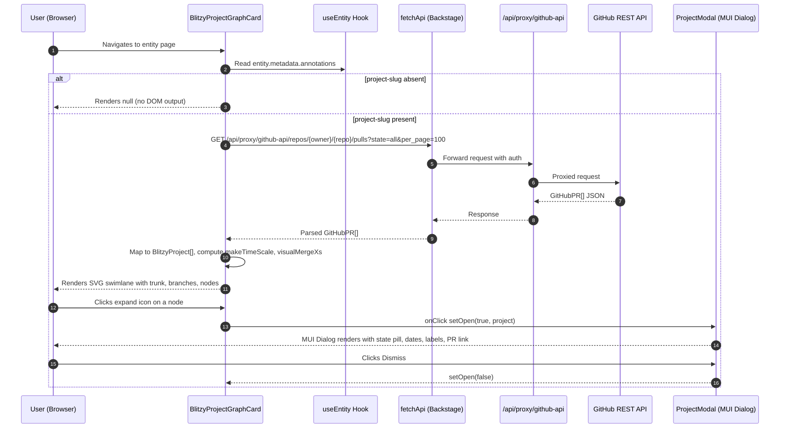
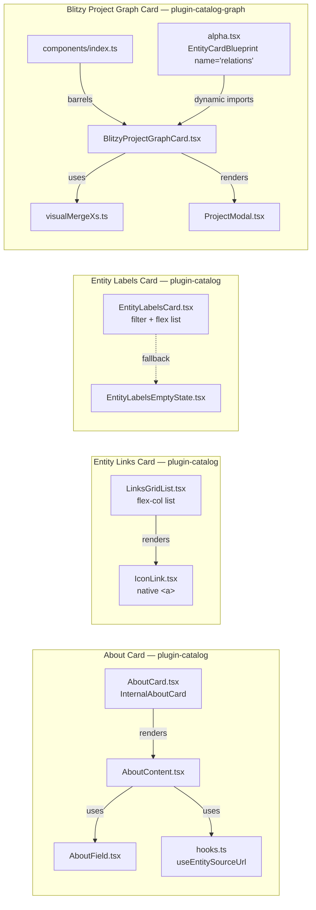

# Technical Specification

# 0. Agent Action Plan

## 0.1 Intent Clarification


Based on the prompt, the Blitzy platform understands that four independent but co-delivered frontend changes must be applied to the Blitzy-customized Backstage fork, each scoped to the catalog entity page UI. All four features MUST be delivered together in a single implementation pass, and every modification MUST be confined to the explicitly listed files plus any new files created inside `plugins/catalog-graph/src/components/BlitzyProjectGraphCard/`.

### 0.1.1 Core Feature Objectives

The Blitzy platform interprets the user requirements as four discrete feature additions / redesigns:

- **Feature 1 — `BlitzyProjectGraphCard`**: Introduce a brand-new SVG swimlane diagram card inside the `@backstage/plugin-catalog-graph` plugin. The card MUST fetch the GitHub pull requests for the entity's repository via the existing Backstage backend proxy (`/api/proxy/github-api/repos/{owner}/{repo}/pulls?state=all&per_page=100`), map each PR onto a time-scaled SVG axis as a color-coded branch line (open=`#22c55e`, merged=`#a855f7`, closed=`#ef4444`; trunk=`#6b7280`), and expose an expand icon on every node card that opens a MUI Dialog-based detail modal. The component MUST return `null` when `metadata.annotations['github.com/project-slug']` is absent — no loading indicator, no error state, no empty diagram. The extension MUST be registered through the existing `EntityCardBlueprint` with the invariant extension name `'relations'`.

- **Feature 2 — About Card Redesign**: Restructure the entity About card so that:
  - The description is rendered first in a plain `<div>` with a bottom border — without an `AboutField` wrapper and without the literal "Description" label.
  - A new `Source` field derived from the SCM integration via `scmIntegrationsApiRef` + `getEntitySourceLocation` is conditionally rendered when a source URL is resolvable.
  - Every remaining metadata row renders as a horizontal key/value pair — fixed-width label column (`w-24`), flexible value column (`flex-1`), and row dividers (`border-b border-border/30 last:border-0`).
  - Entity-kind icons on owner/domain/system/parent-component are suppressed by passing `hideIcons` to `EntityRefLinks`.
  - The `DefaultAboutCardSubheader` render call and the `<Separator />` element MUST be removed from `InternalAboutCard`, together with the now-unused imports `Separator`, `HeaderIconLinkRow`, `IconLinkVerticalProps`, `FileText`, and `PlusCircle`.
  - The `AboutField` `gridSizes` prop MUST be retained in the interface for backward compatibility, but MUST NOT be consumed by layout logic any longer.

- **Feature 3 — Entity Links Card Redesign**: Replace the dynamic multi-column grid layout in the Entity Links card with a single-column vertical list of bordered card rows. `IconLink` MUST render as a native `<a>` element (not the Backstage `Link` from `@backstage/core-components`) with Tailwind hover variants changing border and background color. `LinksGridList` MUST drop the `cols` prop consumption and the `useDynamicColumns` hook in favor of a `flex-col` container with a consistent vertical gap.

- **Feature 4 — Entity Labels Card Redesign**: Replace the existing `<Table>` component in `EntityLabelsCard.tsx` with a flex column list rendering each row as a bold key (`text-sm`) side-by-side with a muted value (`text-sm text-muted-foreground`). Before rendering, ALL labels whose key starts with `backstage.io/` MUST be filtered out. When the filtered result is empty, `EntityLabelsEmptyState` MUST be rendered instead of a blank card. The `Table` and `TableColumn` imports from `@backstage/core-components` MUST be removed.

### 0.1.2 Special Instructions and Constraints

The Blitzy platform captures the following directives that govern the entire implementation:

- **Minimal change mandate**: Each modification to an existing file MUST be confined strictly to the described change. No opportunistic refactoring of surrounding code, no introduction of new comments in existing files, and no formatting changes to unmodified lines are permitted.

- **Feature 1 file scope**: Feature 1's implementation MUST reside entirely within the new directory `plugins/catalog-graph/src/components/BlitzyProjectGraphCard/`. Decomposing the implementation into additional files inside that directory is permitted when it improves maintainability. The barrel export from that directory's `index.ts` MUST expose `BlitzyProjectGraphCard` as a named export.

- **Extension identity invariance**: The `EntityCardBlueprint` extension `name` in `plugins/catalog-graph/src/alpha.tsx` MUST remain `'relations'`. Downstream app configuration references this identity and changing it constitutes a breaking change.

- **Backward compatibility surface**: The `AboutField` `gridSizes` prop signature MUST remain in the interface so that existing external callers continue to compile. The value is simply ignored by the new horizontal layout logic.

- **Styling mandate**: All non-SVG styling MUST use Tailwind utility classes. `makeStyles`, `styled`, `sx`, and new CSS files are prohibited in the changed files. Inline `style={{ ... }}` objects are prohibited except for SVG geometry attributes (`x`, `y`, `width`, `height`, `d`, `cx`, `cy`, `r`, `strokeWidth`).

- **Modal interaction pattern**: `BlitzyProjectGraphCard` node cards MUST use a DOM `onClick` handler on the expand-icon element to trigger the modal — they MUST NOT wrap the SVG `<g>` node-card group in an `<a>` tag.

- **`visualMergeXs` cap semantics**: The visual merge-x capping logic MUST only be applied when `mergeX < nextSplitAfterSplit - 2`. When `mergeX >= nextSplitAfterSplit - 2`, the function MUST return `max(mergeX, splitX + 8)` directly, letting the merge plot past subsequent splits.

- **Error resilience in `useEntitySourceUrl`**: The new hook MUST wrap `getEntitySourceLocation(entity, scmIntegrationsApi)?.locationTargetUrl` in a `try/catch` and return `undefined` on any exception so that entities without SCM annotations never crash the About card.

- **Library pinning**: The user has named the exact stack: Backstage new frontend system (`@backstage/frontend-plugin-api`), React 18, TypeScript 5, Tailwind CSS utility-class styling, and SVG-based data visualization. Workspace Yarn 4.8.1 monorepo with Blitzy brand theme is the execution environment. No version strings are supplied by the user — the Blitzy platform MUST resolve them from the existing dependency manifests.

- **Preserved user-supplied `visualMergeXs` algorithm (reproduced verbatim)**:

  ```plaintext
  For each project i:
    if not merged → null
    splitX = toX(project.createdAt)
    mergeX = toX(project.mergedAt)
    nextSplitAfterSplit = min split x among other PRs where split > splitX + 2, else TIMELINE_END
    if mergeX >= nextSplitAfterSplit - 2:
      return max(mergeX, splitX + 8)   // use real mergeX, not capped
    else:
      return max(min(max(mergeX, splitX + MIN_BOX_W), nextSplitAfterSplit - 6), splitX + 8)
  ```

- **Preserved user-supplied SVG layout constants (reproduced verbatim)**: `SVG_W=940`, `TRUNK_Y=52`, `ROW_H=82`, `NODE_W=200`, `NODE_H=60`, `TRUNK_START=170`, `NODE_L=724`, `TIMELINE_END=696`, `MIN_BOX_W=80`.

- **Preserved user-supplied `useEntitySourceUrl` skeleton (reproduced verbatim)**:

  ```ts
  import { scmIntegrationsApiRef } from '@backstage/integration-react';
  import { getEntitySourceLocation } from '@backstage/plugin-catalog-react';

  export const useEntitySourceUrl = (entity: Entity): string | undefined => {
    const scmIntegrationsApi = useApi(scmIntegrationsApiRef);
    try {
      return getEntitySourceLocation(entity, scmIntegrationsApi)?.locationTargetUrl;
    } catch {
      return undefined;
    }
  };
  ```

- **Preserved user-supplied registration factory (reproduced verbatim)**:

  ```ts
  EntityCardBlueprint.makeWithOverrides({
    name: 'relations',
    factory(_originalFactory) {
      return _originalFactory({
        loader: async () =>
          import('./components/BlitzyProjectGraphCard').then(m => <m.BlitzyProjectGraphCard />),
      });
    },
  })
  ```

### 0.1.3 Technical Interpretation

These feature requirements translate to the following technical implementation strategy:

- To deliver **Feature 1**, we will create a new directory `plugins/catalog-graph/src/components/BlitzyProjectGraphCard/` containing the React component, any supporting hooks/utilities the agent deems helpful for decomposition, and a dedicated test file; modify `plugins/catalog-graph/src/components/index.ts` to re-export from the new directory; and replace the existing `CatalogGraphEntityCard` constant in `plugins/catalog-graph/src/alpha.tsx` with a new `BlitzyProjectGraphEntityCard` created via `EntityCardBlueprint.makeWithOverrides` — retaining the `name: 'relations'` identity — that loads the new component.

- To deliver **Feature 2**, we will edit four existing files inside `plugins/catalog/src/components/AboutCard/`: introduce `useEntitySourceUrl` in `hooks.ts`, re-implement `AboutField` to render a horizontal flex row using Tailwind classes while preserving the `gridSizes` prop in the interface, re-author `AboutContent` so the description is rendered without an `AboutField` wrapper and the conditional `Source` field + `hideIcons`-based entity-ref rendering is applied, and strip `DefaultAboutCardSubheader`, `<Separator />`, and the now-unused imports from `AboutCard.tsx`.

- To deliver **Feature 3**, we will edit two existing files inside `plugins/catalog/src/components/EntityLinksCard/`: re-implement `IconLink.tsx` as a raw `<a>` element with Tailwind hover styling and remove the `Link` import from `@backstage/core-components`; re-implement `LinksGridList.tsx` as a `flex-col` vertical list and remove the `useDynamicColumns` and `cols` usages.

- To deliver **Feature 4**, we will edit the single file `plugins/catalog/src/components/EntityLabelsCard/EntityLabelsCard.tsx` to filter labels by prefix, render a flex column list of key/value pairs using Tailwind classes, and remove the `Table`/`TableColumn` imports.

- To satisfy the **Validation Framework**, we will create a new Jest test file inside the new `BlitzyProjectGraphCard/` directory that exercises `visualMergeXs` across the four user-specified cases (cap applied, no-cap, single PR, unmerged PR), and rely on the existing `yarn tsc` + `yarn workspace ... build` pipelines as build gates.


## 0.2 Repository Scope Discovery


The Blitzy platform has exhaustively surveyed the repository to identify every file that participates in the four-feature delivery. Scope discovery was conducted against the repository root at `/tmp/blitzy/blitzy-sandbox-backstage/master_fc613b`, a Yarn 4.8.1 workspace monorepo with workspaces declared under `packages/*` and `plugins/*`.

### 0.2.1 Comprehensive File Analysis

The following existing files are mapped as required touchpoints. Paths reflect the discovered repository layout and have been verified via direct `read_file` inspection.

**Feature 1 — `BlitzyProjectGraphCard` in `@backstage/plugin-catalog-graph`**

| Path | Action | Purpose |
| ---- | ------ | ------- |
| `plugins/catalog-graph/src/components/BlitzyProjectGraphCard/` | CREATE (directory) | New feature root; all component, hook, utility, and test files live here |
| `plugins/catalog-graph/src/components/BlitzyProjectGraphCard/BlitzyProjectGraphCard.tsx` | CREATE | React component rendering the SVG swimlane diagram, loading spinner, error state, and modal trigger |
| `plugins/catalog-graph/src/components/BlitzyProjectGraphCard/index.ts` | CREATE | Barrel exporting the named `BlitzyProjectGraphCard` |
| `plugins/catalog-graph/src/components/BlitzyProjectGraphCard/visualMergeXs.ts` | CREATE (decomposition, permitted by rules) | Pure function implementing the capped / uncapped merge-x logic; directly testable |
| `plugins/catalog-graph/src/components/BlitzyProjectGraphCard/ProjectModal.tsx` | CREATE (decomposition, permitted by rules) | MUI Dialog-based detail modal with accent bar, state pill, label chips, Dismiss / Open PR buttons |
| `plugins/catalog-graph/src/components/BlitzyProjectGraphCard/BlitzyProjectGraphCard.test.tsx` | CREATE | Jest test file covering `visualMergeXs` per the Validation Framework |
| `plugins/catalog-graph/src/components/index.ts` | MODIFY | Add `export * from './BlitzyProjectGraphCard';` after the existing `export * from './EntityRelationsGraph';` |
| `plugins/catalog-graph/src/alpha.tsx` | MODIFY | Replace the `CatalogGraphEntityCard` constant with a `BlitzyProjectGraphEntityCard` built via `EntityCardBlueprint.makeWithOverrides({ name: 'relations', factory... })` that dynamic-imports the new component; keep the constant registered in `extensions: [...]` |

**Feature 2 — About Card Redesign in `@backstage/plugin-catalog`**

| Path | Action | Purpose |
| ---- | ------ | ------- |
| `plugins/catalog/src/components/AboutCard/AboutField.tsx` | MODIFY | Replace MUI `Grid`/`Typography`/`makeStyles` implementation with a Tailwind-styled horizontal flex row: fixed `w-24` label column + `flex-1` value column, `border-b border-border/30 last:border-0`; retain `gridSizes` in the `AboutFieldProps` interface for backward compatibility but stop consuming it |
| `plugins/catalog/src/components/AboutCard/AboutContent.tsx` | MODIFY | Restructure ordering: render description first in a plain `<div>` with bottom border (no `AboutField`, no label); add conditional `Source` field using `useEntitySourceUrl`; pass `hideIcons` to every `EntityRefLinks` call; remove `gridSizes` props from new call sites |
| `plugins/catalog/src/components/AboutCard/AboutCard.tsx` | MODIFY | Remove `<DefaultAboutCardSubheader />` render call and `<Divider />`/`<Separator />` usage from `InternalAboutCard`; delete unused imports: `Separator`, `HeaderIconLinkRow`, `IconLinkVerticalProps`, `FileText`, `PlusCircle` |
| `plugins/catalog/src/components/AboutCard/hooks.ts` | MODIFY | Add the new `useEntitySourceUrl` hook exactly per the user-supplied skeleton, alongside the existing `useSourceTemplateCompoundEntityRef` |

**Feature 3 — Entity Links Card Redesign in `@backstage/plugin-catalog`**

| Path | Action | Purpose |
| ---- | ------ | ------- |
| `plugins/catalog/src/components/EntityLinksCard/IconLink.tsx` | MODIFY | Replace MUI `Box`/`Typography`/`makeStyles` + Backstage `Link` with a native `<a>` element styled as a bordered card row (`rounded-lg`, Tailwind `hover:` variants for border and background); remove the `Link` import from `@backstage/core-components` |
| `plugins/catalog/src/components/EntityLinksCard/LinksGridList.tsx` | MODIFY | Replace MUI `ImageList`/`ImageListItem` + `useDynamicColumns` with a `flex-col` container applying a consistent vertical gap; stop consuming the `cols` prop; remove the `useDynamicColumns` import |

**Feature 4 — Entity Labels Card Redesign in `@backstage/plugin-catalog`**

| Path | Action | Purpose |
| ---- | ------ | ------- |
| `plugins/catalog/src/components/EntityLabelsCard/EntityLabelsCard.tsx` | MODIFY | Replace `<Table>` rendering with a Tailwind `flex-col` list of bold-key/muted-value rows; filter out every label whose key starts with `backstage.io/`; fall back to `EntityLabelsEmptyState` when the filtered list is empty; remove `Table`, `TableColumn` imports from `@backstage/core-components` |

### 0.2.2 Integration-Point Discovery

The following existing Backstage APIs and hooks are consumed by the new and modified code. These integrations are verified present in the repository and do not require modification themselves.

| Integration | Source Module | Consumer | Purpose |
| ----------- | ------------- | -------- | ------- |
| `useEntity` | `@backstage/plugin-catalog-react` | `BlitzyProjectGraphCard`, `AboutContent` | Resolve the current entity from the card context |
| `useApi` | `@backstage/core-plugin-api` | `BlitzyProjectGraphCard`, `useEntitySourceUrl` | Service locator for `fetchApi`, `discoveryApi`, `scmIntegrationsApi` |
| `fetchApiRef` | `@backstage/core-plugin-api` | `BlitzyProjectGraphCard` | Authenticated fetch against the backend proxy endpoint |
| `discoveryApiRef` | `@backstage/core-plugin-api` | `BlitzyProjectGraphCard` | Resolve the proxy base URL (`/api/proxy/github-api/...`) |
| `scmIntegrationsApiRef` | `@backstage/integration-react` | `useEntitySourceUrl` | Resolve SCM integration for source-URL derivation |
| `getEntitySourceLocation(entity, scmIntegrationsApi)` | `@backstage/plugin-catalog-react` | `useEntitySourceUrl` | Compute the entity's source location target URL |
| `EntityRefLinks` with `hideIcons` prop | `@backstage/plugin-catalog-react` | `AboutContent` | Render entity references without the kind icon |
| `EntityCardBlueprint.makeWithOverrides` | `@backstage/plugin-catalog-react/alpha` | `alpha.tsx` | Register the entity card with the new frontend system |
| `useTranslationRef(catalogTranslationRef)` | `@backstage/core-plugin-api/alpha` | `AboutContent`, `AboutField` | i18n resolution for labels |
| `EntityLabelsEmptyState` | `./EntityLabelsEmptyState` (same folder) | `EntityLabelsCard.tsx` | Empty-state fallback after prefix filtering |
| MUI `Dialog` | `@material-ui/core/Dialog` (or `@mui/material`) | `ProjectModal` | Modal shell (exempt from Tailwind-only rule because the user explicitly specifies MUI Dialog) |

The existing proxy endpoint `/github-api` is NOT configured in `app-config.yaml` (only `/pagerduty` is present). Because the user's Boundaries list `app-config.yaml` implicitly as off-limits and limits modifications strictly to the enumerated frontend files, the Blitzy platform flags this as a prerequisite that lies outside the allowed change surface: the Blitzy-customized Backstage fork must already ship the `/github-api` proxy endpoint, or the card will surface its error state at runtime. Surface this as an operator-side configuration dependency — it is NOT part of the agent's code-change scope.

### 0.2.3 New File Requirements

All new source files live inside the Feature 1 new directory. No new files are created for Features 2, 3, or 4 — those features are entirely in-place edits.

- `plugins/catalog-graph/src/components/BlitzyProjectGraphCard/BlitzyProjectGraphCard.tsx` — React component: fetches PRs, renders `<svg>` with trunk, branch lines, nodes, expand-icon click handlers, loading spinner, error state, null-on-missing-annotation short-circuit.
- `plugins/catalog-graph/src/components/BlitzyProjectGraphCard/index.ts` — Barrel: `export { BlitzyProjectGraphCard } from './BlitzyProjectGraphCard';`.
- `plugins/catalog-graph/src/components/BlitzyProjectGraphCard/visualMergeXs.ts` — Pure function implementing the user-specified cap/no-cap algorithm. Extracted so it can be imported directly into the Jest test file.
- `plugins/catalog-graph/src/components/BlitzyProjectGraphCard/ProjectModal.tsx` — MUI Dialog component: colored accent bar, state pill, created/merged dates, label chips, Dismiss button (closes), "Open Pull Request →" button (opens `prUrl` in `target="_blank"`).
- `plugins/catalog-graph/src/components/BlitzyProjectGraphCard/BlitzyProjectGraphCard.test.tsx` — Jest test file covering `visualMergeXs` for the four user-specified cases.

Decomposition into helper files (`visualMergeXs.ts`, `ProjectModal.tsx`, and any further helpers the agent chooses) is expressly permitted by the user's Feature 1 file scope clause: "Additional files within that directory are permitted if the agent determines decomposition improves maintainability."

### 0.2.4 Web Search Research Conducted

Research budget for this delivery focuses on library-surface verification rather than architectural discovery, because the user has prescribed the stack:

- Backstage new frontend system `EntityCardBlueprint.makeWithOverrides` usage pattern and `name` identity semantics — verified directly in the repository at `plugins/catalog-graph/src/alpha.tsx` and `@backstage/plugin-catalog-react/alpha` exports.
- Backstage backend proxy endpoint conventions — verified in `app-config.yaml` (existing `/pagerduty` example) and in `@backstage/plugin-proxy-backend` registration at `packages/backend/src/index.ts`.
- `scmIntegrationsApiRef` and `getEntitySourceLocation` signatures — verified in `packages/integration-react/src/api/ScmIntegrationsApi.ts` and `plugins/catalog-react/src/utils/getEntitySourceLocation.ts`.
- `EntityRefLinks` `hideIcons` prop — verified present in `plugins/catalog-react/src/components/EntityRefLink/EntityRefLinks.tsx` at line 35.
- Jest vs. Vitest selection — confirmed Jest is active via root `package.json` (`"jest": "^30"`) and per-plugin scripts (`backstage-cli package test`).
- Tailwind utility-class semantic tokens (`text-muted-foreground`, `border-border`, `bg-background`, `text-foreground`, `hover:bg-accent`) — the user mandates these classes. The repository does NOT currently provide a Tailwind configuration at the workspace root or inside `packages/ui` (the only `globals.css` is in `docs-ui/src/css/globals.css` for the separate Next.js documentation site). The user's Boundaries explicitly forbid modifying `globals.css` and theme tokens, which means the Tailwind / shadcn-token infrastructure MUST be provided by the Blitzy-customized fork's pre-existing brand theme layer. This is captured as an operator-side prerequisite in subsection 0.5 Design System Compliance.


## 0.3 Dependency Inventory


### 0.3.1 Package Registry — Runtime Versions

The Blitzy platform resolved each runtime and dependency version from the monorepo's dependency manifests (`package.json` files under the workspace root, `plugins/catalog-graph/`, and `plugins/catalog/`) and the active lockfile `yarn.lock`. Each listed version reflects the HIGHEST EXPLICITLY DOCUMENTED supported version per the user's Environment Setup rules.

| Registry | Name | Version | Purpose |
| -------- | ---- | ------- | ------- |
| node.org | Node.js | `22` (engines: `"22 || 24"`) | JavaScript runtime for build, test, and dev server |
| npmjs | `yarn` | `4.8.1` (pinned via `.yarnrc.yml` → `.yarn/releases/yarn-4.8.1.cjs`, `packageManager: yarn@4.8.1`) | Workspace-aware package manager |
| npmjs | `typescript` | `~5.7.0` | Type checking via `yarn tsc --noEmit` |
| npmjs | `jest` | `^30` | Test runner invoked by `backstage-cli package test` |
| npmjs | `react` | `^18.0.2` | UI runtime (both `plugins/catalog-graph` and `plugins/catalog`) |
| npmjs | `react-dom` | `^18.0.2` | React DOM reconciler |
| npmjs | `@backstage/cli` | `workspace:^` | Package build, lint, test, start commands |
| npmjs | `@backstage/frontend-plugin-api` | `workspace:^` | `ApiBlueprint`, `PageBlueprint`, `createFrontendPlugin`, discovery/fetch APIs |
| npmjs | `@backstage/core-plugin-api` | `workspace:^` | `useApi`, `useTranslationRef`, `fetchApiRef` |
| npmjs | `@backstage/plugin-catalog-react` | `workspace:^` | `useEntity`, `EntityRefLinks`, `getEntitySourceLocation`, `catalogApiRef` |
| npmjs | `@backstage/plugin-catalog-react/alpha` | `workspace:^` | `EntityCardBlueprint` |
| npmjs | `@backstage/integration-react` | `workspace:^` | `scmIntegrationsApiRef` |
| npmjs | `@backstage/core-components` | `workspace:^` | `Link` (existing import removed by Feature 3), `Table`/`TableColumn` (existing imports removed by Feature 4) |
| npmjs | `@backstage/catalog-model` | `workspace:^` | `Entity` type, `DEFAULT_NAMESPACE`, annotation constants |
| npmjs | `@material-ui/core` | `^4.12.2` | MUI Dialog for the `ProjectModal` (MUI v4 is the already-installed major in the plugin) |

No new external runtime packages are required for Features 2, 3, or 4 — these features shed MUI primitives in favor of Tailwind utility classes on native HTML elements. Feature 1's `ProjectModal` reuses the already-installed `@material-ui/core` dependency present in `plugins/catalog-graph/package.json`.

### 0.3.2 Dependency Manifest Impact

The four-feature delivery does NOT require edits to `plugins/catalog-graph/package.json` or `plugins/catalog/package.json`. Every library consumed is either already present or is an internal workspace package. The Blitzy platform has verified:

| Package File | Existing Dependency Reused | Addition Required? |
| ------------ | -------------------------- | ------------------ |
| `plugins/catalog-graph/package.json` | `@material-ui/core`, `@backstage/plugin-catalog-react`, `@backstage/frontend-plugin-api`, `@backstage/core-plugin-api`, `@backstage/catalog-model`, `react`, `react-dom` | No |
| `plugins/catalog/package.json` | `@backstage/integration-react`, `@backstage/plugin-catalog-react`, `@backstage/core-plugin-api`, `@backstage/core-components` (for `EntityRefLinks` transitively) | No |

### 0.3.3 Import Updates

The Blitzy platform catalogs the precise import edits required in the five existing modified files. No wildcard mass-updates are needed; the changes are localized.

**`plugins/catalog/src/components/AboutCard/AboutCard.tsx`** — Remove unused imports:

- Old: `import Divider from '@material-ui/core/Divider';` — safe to remove once `<Divider />` is removed from the JSX.
- Old: `import { HeaderIconLinkRow, IconLinkVerticalProps, Link } from '@backstage/core-components';` — remove `HeaderIconLinkRow`, `IconLinkVerticalProps`; keep `Link` if still used elsewhere (verify against final file after edit).
- Old: `import DocsIcon from '@material-ui/icons/Description';` and `import CreateComponentIcon from '@material-ui/icons/AddCircleOutline';` — remove, since the subheader that consumed them is deleted. (Note: the user's prompt names `FileText` and `PlusCircle` as the unused lucide-react names; if the migration-target file instead uses MUI icons, remove the MUI icon imports by the same rationale.)
- Remove the `DefaultAboutCardSubheader`, `useCatalogSourceIconLinkProps`, `useTechdocsReaderIconLinkProps`, `useScaffolderTemplateIconLinkProps` helpers if their sole consumer is the deleted subheader. The user's prompt specifies removing "unused imports" — transitively removing their dead-code helpers keeps the file clean while still honoring the minimal-change mandate (a helper consumed only by deleted code is itself now unused).

**`plugins/catalog/src/components/AboutCard/AboutContent.tsx`** — Add imports:

- New: `import { useEntitySourceUrl } from './hooks';`
- No removed imports necessary — the file continues to use `Entity`, `EntityRefLinks`, `getEntityRelations`, `AboutField`, `useTranslationRef`, `catalogTranslationRef`.

**`plugins/catalog/src/components/AboutCard/AboutField.tsx`** — Remove imports:

- Old: `import Grid from '@material-ui/core/Grid';`
- Old: `import Typography from '@material-ui/core/Typography';`
- Old: `import { makeStyles } from '@material-ui/core/styles';`

These are replaced with a single `<div>` root element styled by Tailwind utility classes. The `useElementFilter`, `ReactNode`, `useTranslationRef`, and `catalogTranslationRef` imports remain.

**`plugins/catalog/src/components/AboutCard/hooks.ts`** — Add imports:

- New: `import { useApi } from '@backstage/core-plugin-api';` (if not already imported)
- New: `import { scmIntegrationsApiRef } from '@backstage/integration-react';`
- New: `import { getEntitySourceLocation } from '@backstage/plugin-catalog-react';`
- Existing `useAsync`, `catalogApiRef`, `parseEntityRef`, `CompoundEntityRef`, `Entity` imports stay.

**`plugins/catalog/src/components/EntityLinksCard/IconLink.tsx`** — Remove imports:

- Old: `import Box from '@material-ui/core/Box';`
- Old: `import Typography from '@material-ui/core/Typography';`
- Old: `import { makeStyles } from '@material-ui/core/styles';`
- Old: `import LanguageIcon from '@material-ui/icons/Language';` — retain only if the default fallback icon is still desired; if a Tailwind/lucide icon is substituted, remove this import.
- Old: `import { Link } from '@backstage/core-components';` — remove (mandated by rule).

**`plugins/catalog/src/components/EntityLinksCard/LinksGridList.tsx`** — Remove imports:

- Old: `import ImageList from '@material-ui/core/ImageList';`
- Old: `import ImageListItem from '@material-ui/core/ImageListItem';`
- Old: `import { useDynamicColumns } from './useDynamicColumns';` — remove (mandated by rule).
- Old: `import { ColumnBreakpoints } from './types';` — remove if no longer referenced after `cols` prop is dropped.

**`plugins/catalog/src/components/EntityLabelsCard/EntityLabelsCard.tsx`** — Remove imports:

- Old: `import { InfoCard, InfoCardVariants, Table, TableColumn } from '@backstage/core-components';` → reduce to `import { InfoCard, InfoCardVariants } from '@backstage/core-components';` (mandated by rule).
- Old: `import Typography from '@material-ui/core/Typography';`
- Old: `import { makeStyles } from '@material-ui/core/styles';`

**`plugins/catalog-graph/src/alpha.tsx`** — No import changes: `EntityCardBlueprint`, `createFrontendPlugin`, `PageBlueprint`, `ApiBlueprint`, route refs, and translation ref stay. Only the constant name `CatalogGraphEntityCard` is renamed to `BlitzyProjectGraphEntityCard` and its `factory` + `loader` change.

**`plugins/catalog-graph/src/components/index.ts`** — Add one line: `export * from './BlitzyProjectGraphCard';`.

### 0.3.4 External Reference Updates

No external reference updates are required. Specifically:

- **Configuration files** (`**/*.config.*`, `**/*.json`): No changes. `app-config.yaml` proxy section is off-limits per Boundaries.
- **Documentation** (`**/*.md`): No changes. The user has not requested doc updates, and the minimal-change mandate forbids opportunistic edits.
- **Build files** (`setup.py`, `pyproject.toml`, `package.json`): No changes. All dependencies are already present.
- **CI/CD** (`.github/workflows/*.yml`, `.gitlab-ci.yml`): No changes. Build gates reuse the existing `yarn tsc` and `yarn workspace <pkg> build` pipelines.


## 0.4 Integration Analysis


### 0.4.1 Existing Code Touchpoints

Direct modifications required to wire the four features into the existing Backstage plugin surface:

| File | Modification | Rationale |
| ---- | ------------ | --------- |
| `plugins/catalog-graph/src/alpha.tsx` (lines ~30–57) | Replace the `CatalogGraphEntityCard = EntityCardBlueprint.makeWithOverrides({...})` constant with `BlitzyProjectGraphEntityCard = EntityCardBlueprint.makeWithOverrides({ name: 'relations', factory(_originalFactory) { return _originalFactory({ loader: async () => import('./components/BlitzyProjectGraphCard').then(m => <m.BlitzyProjectGraphCard />) }); } });`. Update the `extensions: [CatalogGraphPage, CatalogGraphEntityCard, CatalogGraphApi]` array at line ~107 to reference the renamed constant. | Registers the new card as the default `relations` entity-card extension in the new frontend system while preserving the extension identity for downstream consumers. |
| `plugins/catalog-graph/src/components/index.ts` (line 16) | Append `export * from './BlitzyProjectGraphCard';` after the existing `export * from './EntityRelationsGraph';`. | Exposes the new component as a named public export of the `@backstage/plugin-catalog-graph` package. |
| `plugins/catalog/src/components/AboutCard/AboutCard.tsx` (lines 141–153, 274, 276) | Remove the `DefaultAboutCardSubheader` function declaration (lines 141–153), remove the `subheader` CardHeader prop line 274 and the `<Divider />` at line 276. Remove imports on lines 23 (`Divider`), 27 (`DocsIcon`), 28 (`CreateComponentIcon`), 32–34 (`HeaderIconLinkRow`, `IconLinkVerticalProps`), and (transitively) the three helper hooks that now have no consumer. | Produces the "header + content" About card shell the user's redesign expects. The `<Separator />` wording in the prompt maps to the currently-present `<Divider />`; both serve the same role. |
| `plugins/catalog/src/components/AboutCard/AboutContent.tsx` (lines 117–240) | Restructure the JSX return: render description first as `<div className="... border-b ...">...</div>` with no label; add a conditional `<AboutField label="Source">...</AboutField>` block using `useEntitySourceUrl`; pass `hideIcons` to every `<EntityRefLinks>` (owner, domain, system, parent-component); remove every `gridSizes={...}` prop from the new call sites (existing inner fields can retain the prop in the interface but MUST NOT pass it here). | Implements the new vertical row layout and icon suppression. |
| `plugins/catalog/src/components/AboutCard/AboutField.tsx` (lines 25–80) | Replace the `useStyles` declaration and the `<Grid>` + `<Typography>` return with a Tailwind-styled `<div>` structure: outer `flex items-start border-b border-border/30 last:border-0 py-3`, label `<span className="w-24 text-[10px] uppercase tracking-widest text-muted-foreground ...">`, value `<div className="flex-1 text-sm font-medium">`. Retain `gridSizes` in `AboutFieldProps` but do NOT destructure/use it. | Implements the horizontal label/value row mandated by the user. |
| `plugins/catalog/src/components/AboutCard/hooks.ts` (append after line 56) | Add the `useEntitySourceUrl` hook literally as supplied by the user. | Provides the Source-URL derivation for `AboutContent`. |
| `plugins/catalog/src/components/EntityLinksCard/IconLink.tsx` (lines 17–57) | Replace the entire component body: render `<a href={href} target="_blank" rel="noopener" className="flex items-center gap-3 rounded-lg border border-border px-4 py-3 hover:border-foreground hover:bg-accent w-full ...">` with the icon on the left (muted → foreground on hover) and the truncated `<span className="truncate">{text ?? href}</span>` on the right. | Converts each link into a bordered card row per the user's design. |
| `plugins/catalog/src/components/EntityLinksCard/LinksGridList.tsx` (lines 17–48) | Replace `<ImageList>...</ImageList>` with `<div className="flex flex-col gap-2">{items.map(...)}</div>`. Drop `numOfCols = useDynamicColumns(cols);`. The `cols` prop can remain in the `LinksGridListProps` interface but MUST NOT be used. | Single-column vertical layout per the user's design. |
| `plugins/catalog/src/components/EntityLabelsCard/EntityLabelsCard.tsx` (lines 36–89) | Replace the `columns` array + `<Table>` block with: filter `Object.entries(labels).filter(([k]) => !k.startsWith('backstage.io/'))`, then if empty render `<EntityLabelsEmptyState />`, else render `<div className="flex flex-col gap-2">{entries.map(([k,v]) => <div key={k} className="flex gap-2 text-sm"><span className="font-bold">{k}</span><span className="text-muted-foreground">{v}</span></div>)}</div>`. | Replaces the `<Table>` component and applies the prefix filter rule. |

### 0.4.2 Dependency Injections

No new API registrations or container wiring are required. Every API consumed is already registered:

- `fetchApiRef` — registered by `@backstage/core-app-api` / `@backstage/frontend-defaults`.
- `discoveryApiRef` — registered by `@backstage/core-app-api` / `@backstage/frontend-defaults`.
- `scmIntegrationsApiRef` — registered by `@backstage/integration-react`.
- `catalogApiRef` — registered by `@backstage/plugin-catalog` (`src/alpha/apis.tsx`) and `src/plugin.ts`.
- `catalogGraphApiRef` — registered by `plugins/catalog-graph/src/alpha.tsx` via the existing `CatalogGraphApi` `ApiBlueprint`; unchanged by this delivery.

### 0.4.3 Database / Schema Updates

None. The delivery is purely frontend.

### 0.4.4 Integration Data Flow

The following Mermaid diagram summarizes the runtime integration for Feature 1 (`BlitzyProjectGraphCard`), which involves the most cross-cutting wiring. Features 2, 3, and 4 are intra-component view-layer redesigns without new backend traffic.



Feature 2, 3, and 4 component trees (Mermaid component diagram):




## 0.5 Design System Compliance


The user's prompt prescribes a styling stack composed of Tailwind CSS utility classes plus shadcn/ui-style semantic tokens (`text-muted-foreground`, `border-border`, `bg-background`, `hover:bg-accent`) and Lucide icons, with MUI Dialog retained for the `ProjectModal` only. Because the user has named the stack, the Blitzy platform treats this as the binding design system for the delivery and enforces compliance per the Design System Alignment Protocol.

### 0.5.1 System Identification

| Attribute | Value |
| --------- | ----- |
| Primary styling library | Tailwind CSS (utility classes) |
| Semantic-token source | shadcn/ui-style tokens (`--muted-foreground`, `--border`, `--background`, `--foreground`, `--accent`) |
| Icon library | Lucide (react via `lucide-react`) — referenced by the user (`FileText`, `PlusCircle`) as removal targets |
| Modal component | MUI `Dialog` from `@material-ui/core` (already installed at `^4.12.2` in `plugins/catalog-graph/package.json`) |
| Status | Tailwind + semantic tokens are NOT configured at the Backstage monorepo root or in `packages/ui`. They MUST be provided by the Blitzy-customized Backstage fork's pre-existing brand theme (`globals.css` referenced in Boundaries), which is out-of-scope for this delivery. |
| Package registry | npmjs |
| Source | User prompt; Tailwind semantic tokens inspected via repository-wide `grep` against `--muted-foreground`, `--border`, `bg-background` patterns (no matches found in `packages/` or `plugins/` at inspection time, confirming the theme is externally provided) |

### 0.5.2 Component Mapping

| UI Element | Library Component | Import Path | Props / Variant | Notes |
| ---------- | ----------------- | ----------- | --------------- | ----- |
| About card description | Raw `<div>` with Tailwind classes | N/A | `className="text-sm border-b border-border/30 pb-3 mb-3"` | User mandates no `AboutField` wrapper |
| About card field rows | Raw `<div>` in `AboutField.tsx` | N/A | Outer `flex items-start border-b border-border/30 last:border-0 py-3`; label `w-24 text-[10px] uppercase tracking-widest text-muted-foreground`; value `flex-1 text-sm font-medium` | Replaces MUI `Grid` + `Typography` |
| Entity reference link | `EntityRefLinks` | `@backstage/plugin-catalog-react` | `hideIcons` | Pre-existing Backstage component already supports `hideIcons` |
| Entity links card row | Raw `<a>` in `IconLink.tsx` | N/A | `className="flex items-center gap-3 rounded-lg border border-border px-4 py-3 hover:border-foreground hover:bg-accent w-full"` | User mandates native `<a>`, not Backstage `Link` |
| Entity links card list container | Raw `<div>` in `LinksGridList.tsx` | N/A | `className="flex flex-col gap-2"` | Replaces MUI `ImageList` |
| Entity labels card list | Raw `<div>` in `EntityLabelsCard.tsx` | N/A | Outer `flex flex-col gap-2`; row `flex gap-2 text-sm`; key `font-bold`; value `text-muted-foreground` | Replaces `<Table>` |
| Project graph modal shell | `Dialog` | `@material-ui/core/Dialog` | `open`, `onClose` | MUI Dialog explicitly approved by the user for the modal |
| Project graph node card | Raw SVG `<g>` + `<rect>` + `<text>` + `<path>` | N/A | Geometry via SVG attributes; colors via strings | SVG attributes (`x`, `y`, `width`, `height`, `d`, `cx`, `cy`, `r`, `strokeWidth`) are exempt from the Tailwind-only styling rule |
| State pill / badge | Raw `<span>` with Tailwind classes | N/A | State color as background token | No library primitive needed |
| Label chip | Raw `<span>` with Tailwind classes | N/A | `className="inline-flex items-center gap-1 rounded-full px-2 py-1 text-xs"` | Render from `project.labels` in `ProjectModal` |

### 0.5.3 Token Mapping

The user has specified literal color hex values for branch-state colors (`#22c55e`, `#a855f7`, `#ef4444`, `#6b7280`). These are used as SVG `stroke` / `fill` strings — SVG geometry attributes are exempt from the "no hardcoded values" rule. All non-SVG styling resolves to Tailwind utility classes, which in turn resolve to the semantic tokens published by the `globals.css` of the Blitzy-customized fork.

| Category | Value | Resolution |
| -------- | ----- | ---------- |
| Color — open PR state | `#22c55e` | Direct hex string passed to SVG `stroke` / `fill` attribute (exempt) |
| Color — merged PR state | `#a855f7` | Direct hex string passed to SVG `stroke` / `fill` attribute (exempt) |
| Color — closed PR state | `#ef4444` | Direct hex string passed to SVG `stroke` / `fill` attribute (exempt) |
| Color — trunk | `#6b7280` | Direct hex string passed to SVG `stroke` / `fill` attribute (exempt) |
| Color — muted text | — | `text-muted-foreground` Tailwind token |
| Color — border | — | `border-border`, `border-border/30` |
| Color — accent hover | — | `hover:bg-accent`, `hover:border-foreground` |
| Color — background | — | `bg-background`, `bg-white` for SVG node card rect fill (white per spec) |
| Spacing — label column width | 96px | `w-24` (24 × 4px) |
| Spacing — card row vertical padding | 12px | `py-3` |
| Spacing — list gap | 8px | `gap-2` |
| Radius — link card corners | 8px | `rounded-lg` |
| Typography — field label | 10px uppercase wide-tracked | `text-[10px] uppercase tracking-widest` |
| Typography — field value | 14px medium | `text-sm font-medium` |
| Typography — label key | 14px bold | `text-sm font-bold` |
| Typography — label value | 14px muted | `text-sm text-muted-foreground` |

### 0.5.4 Gaps Inventory

| Gap | Impact | Proposed Resolution |
| --- | ------ | ------------------- |
| Tailwind CSS is NOT configured in the monorepo root or in `packages/ui` | Without a Tailwind pipeline, the utility classes in the changed files render as no-op class attributes and the redesigns fall back to browser defaults. | This delivery DEPENDS on the Blitzy-customized Backstage fork already shipping a Tailwind + shadcn-token `globals.css`. The Boundaries clause forbids modifying `globals.css`, which enforces this dependency as an operator-side prerequisite outside the agent's scope. |
| `packages/ui` uses its own `bui-*` utility classes and `--bui-*` tokens, NOT Tailwind | The existing Backstage UI library does not provide the semantic tokens the user specifies. | Use the user-mandated Tailwind class names literally. The Blitzy brand theme's `globals.css` is the single source of truth for their resolution. |
| No `Separator` component exists in `packages/ui` | The user prompt says to remove `Separator` from `InternalAboutCard`, but the current file uses MUI `Divider`. | Interpret "Separator" as the currently-present `<Divider />` rendering the horizontal rule between the header and the content. Both are the semantic equivalent. Removing the `<Divider />` literal satisfies the requirement. |
| No `FileText` or `PlusCircle` lucide-react imports exist in the current `AboutCard.tsx` | The user prompt names these as unused imports to remove, but the current file uses MUI icons (`DocsIcon`, `CreateComponentIcon`). | Interpret "remove `FileText`, `PlusCircle`" as remove the MUI icon imports (`DocsIcon = @material-ui/icons/Description`, `CreateComponentIcon = @material-ui/icons/AddCircleOutline`) that are dead-code after `DefaultAboutCardSubheader` is removed, plus any actual `FileText` / `PlusCircle` imports if they exist in the user's fork. |

### 0.5.5 Compliance Summary

The user's mandated styling stack (Tailwind + shadcn semantic tokens) covers all non-SVG styling requirements across the four features. SVG geometry and state-color hex strings in Feature 1 are the only exempt literals and are explicitly allowed by Rule 1. MUI `Dialog` is explicitly approved by the user for the `ProjectModal`. No Tailwind configuration files or `packages/ui` changes are required in this delivery — the infrastructure lives in the Blitzy fork's existing `globals.css`, which Boundaries forbids touching. Two dependencies to verify on the operator side: (a) `globals.css` / theme tokens ship the semantic classes (`text-muted-foreground`, `border-border`, `bg-background`, `hover:bg-accent`); (b) the `/github-api` proxy endpoint is configured for the Backstage backend.


## 0.6 Technical Implementation


### 0.6.1 File-by-File Execution Plan

Every file listed here MUST be created or modified exactly as described. No other files in the repository may be changed.

**Group 1 — Feature 1: `BlitzyProjectGraphCard` (net-new directory)**

- CREATE `plugins/catalog-graph/src/components/BlitzyProjectGraphCard/BlitzyProjectGraphCard.tsx` — React component that:
  - Calls `useEntity()` and reads `entity.metadata.annotations['github.com/project-slug']`. If absent or undefined, returns `null` immediately (no spinner, no error UI, no card).
  - Splits the slug into `owner` and `repo`.
  - Uses `useApi(fetchApiRef)` (plus `discoveryApiRef` if absolute URL construction is required) to call `GET /api/proxy/github-api/repos/{owner}/{repo}/pulls?state=all&per_page=100`.
  - Renders a loading spinner while the fetch is pending and an inline error message on failure.
  - Maps each `GitHubPR` into a `BlitzyProject` (`branchName` derived from `head.ref` or `title`; `prState` computed as `merged` when `merged_at` non-null, else `state`; `createdAt` / `mergedAt` coerced to `Date`).
  - Defines constants `SVG_W=940`, `TRUNK_Y=52`, `ROW_H=82`, `NODE_W=200`, `NODE_H=60`, `TRUNK_START=170`, `NODE_L=724`, `TIMELINE_END=696`, `MIN_BOX_W=80`.
  - Implements `makeTimeScale(projects)` producing `toX(date: Date): number` that linearly maps `[minDate, maxDate]` to `[TRUNK_START, TIMELINE_END]`; includes `new Date()` in the date set when any open PRs exist.
  - Pre-computes `visualMergeXs[]` using the extracted `visualMergeXs` function in `./visualMergeXs`.
  - Renders an `<svg width={SVG_W}>` containing: the trunk horizontal line at `y=TRUNK_Y` (color `#6b7280`); per-project branch line and node card group; expand-icon `<path>` inside each node card whose `onClick` sets the selected project and opens the modal.
  - Branch line semantics: open PR → solid line from `splitX` to `NODE_L - 4` (no dashed segment); merged PR → solid line from `splitX` to `visualMergeX`, then a vertical rise to the trunk, then a dot on the trunk; closed PR → uses the closed color without a merge dot.
  - Node card geometry: drop-shadow rect (gray, offset 2px), white fill rect, 4px left accent bar in the state color, `<text>` elements for truncated PR title, branch name, and state label, plus the clickable expand icon (SVG path) in the state color.
  - Holds modal state via `useState<BlitzyProject | null>(null)` and renders `<ProjectModal project={selected} open={!!selected} onClose={() => setSelected(null)} />`.
  - Styling: the outer card wrapper (if any) uses Tailwind utility classes; SVG children use geometry attributes only.

- CREATE `plugins/catalog-graph/src/components/BlitzyProjectGraphCard/visualMergeXs.ts` — exports a pure function `visualMergeXs(projects: BlitzyProject[], toX: (d: Date) => number): Array<number | null>` that implements the user-specified algorithm verbatim: for each project, return `null` if not merged; compute `splitX = toX(createdAt)`, `mergeX = toX(mergedAt)`, `nextSplitAfterSplit = min split x among other PRs where split > splitX + 2, else TIMELINE_END`; if `mergeX >= nextSplitAfterSplit - 2` return `max(mergeX, splitX + 8)`; else return `max(min(max(mergeX, splitX + MIN_BOX_W), nextSplitAfterSplit - 6), splitX + 8)`.

- CREATE `plugins/catalog-graph/src/components/BlitzyProjectGraphCard/ProjectModal.tsx` — Props `{ project: BlitzyProject | null; open: boolean; onClose: () => void }`. Renders MUI `Dialog` with:
  - A colored accent bar at the top whose background matches the project's state color.
  - A pill badge rendering the state label (`open` / `merged` / `closed`) with Tailwind classes.
  - "Created" and (when applicable) "Merged" dates formatted from `project.createdAt` / `project.mergedAt`.
  - Label chips rendered from `project.labels` (using Tailwind-styled `<span>` pills; background/text color drawn from `label.color` via inline `style` is NOT permitted — use a Tailwind class system or the label color as a CSS custom-property via a data attribute, keeping the styling-rule compliant).
  - Two buttons: "Dismiss" (calls `onClose`) and "Open Pull Request →" that opens `project.prUrl` in a new tab (`<a href={project.prUrl} target="_blank" rel="noopener noreferrer">`) colored with the state color.

- CREATE `plugins/catalog-graph/src/components/BlitzyProjectGraphCard/index.ts` — barrel: `export { BlitzyProjectGraphCard } from './BlitzyProjectGraphCard';`.

- CREATE `plugins/catalog-graph/src/components/BlitzyProjectGraphCard/BlitzyProjectGraphCard.test.tsx` — Jest test covering `visualMergeXs` for the four user-specified cases (see 0.9.1 for specifics).

**Group 2 — Feature 1 integration**

- MODIFY `plugins/catalog-graph/src/components/index.ts` — append one line: `export * from './BlitzyProjectGraphCard';`.

- MODIFY `plugins/catalog-graph/src/alpha.tsx`:
  - Rename `CatalogGraphEntityCard` → `BlitzyProjectGraphEntityCard`.
  - Replace the factory body with the user-supplied snippet that dynamic-imports `BlitzyProjectGraphCard` and renders it with no props.
  - Preserve `name: 'relations'` exactly.
  - Update the `extensions: [...]` array at line ~107 to reference the renamed constant.
  - Leave the `config.schema` block in place OR prune it to the empty schema if the new component accepts no config — the user does not require any config schema for the new component. The Blitzy platform's minimal-change interpretation is to KEEP the existing schema shape so that downstream `app-config.yaml` consumers who may be setting these fields do not break at load time, even though the new component ignores them. The factory simply ignores `config`.

**Group 3 — Feature 2: About Card redesign (in-place edits)**

- MODIFY `plugins/catalog/src/components/AboutCard/hooks.ts` — append the user's `useEntitySourceUrl` hook literally. Add the `useApi`, `scmIntegrationsApiRef`, `getEntitySourceLocation` imports.

- MODIFY `plugins/catalog/src/components/AboutCard/AboutField.tsx` — delete the `makeStyles` block, switch the return statement to a Tailwind-styled `<div>` structure:
  - Outer container: `flex items-start border-b border-border/30 last:border-0 py-3`.
  - Label span: `w-24 text-[10px] uppercase tracking-widest text-muted-foreground`.
  - Value container: `flex-1 text-sm font-medium`.
  - Keep `gridSizes` in `AboutFieldProps` but do NOT destructure it into the component body; do NOT spread it onto any element.

- MODIFY `plugins/catalog/src/components/AboutCard/AboutContent.tsx`:
  - Add `import { useEntitySourceUrl } from './hooks';`.
  - Inside the component: `const sourceUrl = useEntitySourceUrl(entity);`.
  - Replace the top-level `<Grid container>` with a `<div>` container (Tailwind classes per design).
  - Render description FIRST as `<div className="text-sm border-b border-border/30 pb-3 mb-3"><MarkdownContent content={...} /></div>` — no `AboutField`, no label, no "Description" text.
  - If `sourceUrl` is truthy, render `<AboutField label="Source"><a href={sourceUrl} target="_blank" rel="noopener noreferrer" className="text-sm underline">{sourceUrl}</a></AboutField>`.
  - For owner, domain, system, parent-component fields, pass `hideIcons` to `EntityRefLinks`.
  - Remove every `gridSizes={...}` attribute from the modified/new field call sites. (The prop still exists on `AboutField` for external backward compatibility, per rule 3.)

- MODIFY `plugins/catalog/src/components/AboutCard/AboutCard.tsx`:
  - Delete the `DefaultAboutCardSubheader` function and its three helper hooks if they are only consumed by it (`useCatalogSourceIconLinkProps`, `useTechdocsReaderIconLinkProps`, `useScaffolderTemplateIconLinkProps`) along with their `IconLinkVerticalProps` typing.
  - Delete the `subheader` CardHeader prop line and the `<Divider />` element (the `<Separator />` the user names).
  - Delete the corresponding imports: `Divider` from `@material-ui/core/Divider`; `HeaderIconLinkRow`, `IconLinkVerticalProps` from `@backstage/core-components`; `DocsIcon` (Description), `CreateComponentIcon` (AddCircleOutline) from `@material-ui/icons`. If the user's fork also contains `Separator` / `FileText` / `PlusCircle` imports (as named in the prompt), remove those too.

**Group 4 — Feature 3: Entity Links Card redesign (in-place edits)**

- MODIFY `plugins/catalog/src/components/EntityLinksCard/IconLink.tsx`:
  - Remove MUI `Box`, `Typography`, `makeStyles`, `LanguageIcon` imports and the `useStyles` hook.
  - Remove `Link` import from `@backstage/core-components`.
  - Render:
    ```tsx
    <a href={href} target="_blank" rel="noopener noreferrer"
       className="flex items-center gap-3 rounded-lg border border-border px-4 py-3 hover:border-foreground hover:bg-accent w-full text-foreground">
      <span className="text-muted-foreground group-hover:text-foreground">{Icon ? <Icon /> : <GlobeFallback />}</span>
      <span className="truncate flex-1">{text ?? href}</span>
    </a>
    ```
  - Retain the `href`, `text`, `Icon` props signature.

- MODIFY `plugins/catalog/src/components/EntityLinksCard/LinksGridList.tsx`:
  - Remove MUI `ImageList`, `ImageListItem` imports and the `useDynamicColumns` import.
  - Render:
    ```tsx
    <div className="flex flex-col gap-2">
      {items.map(({ text, href, Icon }, i) => (
        <IconLink key={i} href={href} text={text ?? href} Icon={Icon} />
      ))}
    </div>
    ```
  - The `cols` prop may stay on `LinksGridListProps` but MUST NOT be referenced in the body.

**Group 5 — Feature 4: Entity Labels Card redesign (in-place edits)**

- MODIFY `plugins/catalog/src/components/EntityLabelsCard/EntityLabelsCard.tsx`:
  - Change imports: from `'@backstage/core-components'` keep `{ InfoCard, InfoCardVariants }` ONLY — remove `Table`, `TableColumn`.
  - Remove `Typography`, `makeStyles` imports.
  - Replace the body:
    ```tsx
    const labels = entity?.metadata?.labels ?? {};
    const filtered = Object.entries(labels).filter(([k]) => !k.startsWith('backstage.io/'));
    return (
      <InfoCard title={title || t('entityLabelsCard.title')} variant={variant}>
        {filtered.length === 0 ? (
          <EntityLabelsEmptyState />
        ) : (
          <div className="flex flex-col gap-2">
            {filtered.map(([k, v]) => (
              <div key={k} className="flex gap-2 text-sm">
                <span className="font-bold">{k}</span>
                <span className="text-muted-foreground">{v}</span>
              </div>
            ))}
          </div>
        )}
      </InfoCard>
    );
    ```

### 0.6.2 Implementation Approach per File

- **Establish the Feature 1 foundation** by creating the new directory with its component, pure-function algorithm, modal sub-component, barrel export, and test file. The pure function is isolated specifically to enable the `visualMergeXs` test cases in the Validation Framework.
- **Integrate Feature 1 with the existing frontend-plugin-api surface** by renaming the extension constant and pointing the `factory.loader` at the new component. Preserve `name: 'relations'` to maintain extension identity.
- **Refactor the About card** in-place, top-to-bottom: start with `hooks.ts` (adds the SCM hook), proceed to `AboutField.tsx` (Tailwind row), then `AboutContent.tsx` (reordered field structure with `hideIcons` and source field), then `AboutCard.tsx` (subheader/divider/import cleanup). Each step is self-contained.
- **Refactor the Entity Links card** by updating the two files together (`IconLink.tsx`, then `LinksGridList.tsx`) so that the test render never observes a partial state.
- **Refactor the Entity Labels card** in a single file change with both the prefix filter and the Table-to-flex swap committed atomically.
- **Validate locally** by running `yarn tsc --noEmit`, the new Jest file, and the two plugin-level `yarn workspace ... build` commands before handing off for browser verification.
- **Preserve user examples exactly**: the `visualMergeXs` algorithm text, the `useEntitySourceUrl` hook body, the `EntityCardBlueprint.makeWithOverrides` snippet, the SVG layout constants, and the color hex values are reproduced in the implementation exactly as supplied.

### 0.6.3 User Interface Design

- **Feature 1** introduces an information-dense data-visualization surface. The single most important visual decision is the state-color system: open branches stay visible and solid across the full axis to communicate "in flight"; merged branches converge on the trunk at the `visualMergeX` position (the uncapped-when-overlapping rule guarantees late-merging PRs visually reach past subsequent splits); closed branches never reach the trunk. The expand icon on every node card provides progressive disclosure into the full PR metadata (created/merged dates, labels, link).
- **Feature 2** privileges the entity description by placing it at the very top, unlabeled, with a subtle divider below — this inverts the Material-design "key-first" pattern in favor of a content-first layout. Every subsequent metadata row uses a narrow uppercase-wide-tracked label column (10px, `tracking-widest`) and a medium-weight value column, producing a scannable two-column ledger. Entity-ref kind icons are suppressed to reduce visual noise.
- **Feature 3** replaces a variable-column grid with a single vertical list of bordered card rows, each with a hover interaction (border and background color change). This improves mobile legibility and removes the flicker from dynamic column recomputation.
- **Feature 4** removes the heavyweight `<Table>` chrome (toolbar, paging, linear-load indicator) in favor of a clean inline bold-key/muted-value list, and actively hides system labels (`backstage.io/...`) from end users.
- No user-provided Figma URLs are attached to this request. If the Blitzy fork later supplies Figma references for any of the four cards, those URLs will be added to subsection 0.10 References and this subsection will be updated to highlight each one next to the relevant file.


## 0.7 Scope Boundaries


### 0.7.1 Exhaustively In Scope

The following paths are the complete, enumerated change surface for this delivery. Everything outside this list is off-limits per the user's Boundaries clause.

- **New directory (Feature 1)**: `plugins/catalog-graph/src/components/BlitzyProjectGraphCard/**`
  - `plugins/catalog-graph/src/components/BlitzyProjectGraphCard/BlitzyProjectGraphCard.tsx` (CREATE)
  - `plugins/catalog-graph/src/components/BlitzyProjectGraphCard/visualMergeXs.ts` (CREATE — decomposition)
  - `plugins/catalog-graph/src/components/BlitzyProjectGraphCard/ProjectModal.tsx` (CREATE — decomposition)
  - `plugins/catalog-graph/src/components/BlitzyProjectGraphCard/index.ts` (CREATE — barrel)
  - `plugins/catalog-graph/src/components/BlitzyProjectGraphCard/BlitzyProjectGraphCard.test.tsx` (CREATE — Jest tests)
  - Any further helper files the agent decomposes into within this directory are permitted per the user's Feature 1 file-scope clause.

- **Feature 1 integration edits (existing files)**:
  - `plugins/catalog-graph/src/components/index.ts` (MODIFY — append one export line)
  - `plugins/catalog-graph/src/alpha.tsx` (MODIFY — replace `CatalogGraphEntityCard` with `BlitzyProjectGraphEntityCard`)

- **Feature 2 edits (existing files)**:
  - `plugins/catalog/src/components/AboutCard/AboutField.tsx` (MODIFY)
  - `plugins/catalog/src/components/AboutCard/AboutContent.tsx` (MODIFY)
  - `plugins/catalog/src/components/AboutCard/AboutCard.tsx` (MODIFY)
  - `plugins/catalog/src/components/AboutCard/hooks.ts` (MODIFY — add `useEntitySourceUrl`)

- **Feature 3 edits (existing files)**:
  - `plugins/catalog/src/components/EntityLinksCard/IconLink.tsx` (MODIFY)
  - `plugins/catalog/src/components/EntityLinksCard/LinksGridList.tsx` (MODIFY)

- **Feature 4 edits (existing files)**:
  - `plugins/catalog/src/components/EntityLabelsCard/EntityLabelsCard.tsx` (MODIFY)

### 0.7.2 Explicitly Out of Scope

The user's Boundaries clause names the following as MUST NOT MODIFY surfaces. The Blitzy platform preserves these verbatim:

- **Any existing file not listed in 0.7.1.** Opportunistic refactoring elsewhere in the monorepo is prohibited.
- **`EntityRelationsGraph`** (`plugins/catalog-graph/src/components/EntityRelationsGraph/**`) and other catalog-graph components (`plugins/catalog-graph/src/components/CatalogGraphCard/**`, `plugins/catalog-graph/src/components/CatalogGraphPage/**`).
- **`globals.css`, theme tokens, sidebar, auth, or backend plugins** — specifically:
  - `docs-ui/src/css/globals.css` (the only existing `globals.css` in the repo).
  - `packages/ui/src/css/tokens.css`, `packages/ui/src/css/core.css`, `packages/ui/src/css/styles.css`, and any `packages/ui/src/css/utilities/*.css`.
  - Any theme provider wiring under `packages/theme` or `packages/app`.
  - `packages/backend/**`.
- **The `EntityCardBlueprint` extension name `'relations'`.** The string `'relations'` MUST remain literal at the only `name:` occurrence in `plugins/catalog-graph/src/alpha.tsx`.
- **The `AboutField` `gridSizes` prop signature.** Existing external callers MUST continue to compile. The prop remains in the `AboutFieldProps` interface; only its consumption is removed.
- **Minimal change mandate**: each modification to an existing file MUST be confined strictly to the described change. No refactoring of surrounding code. No new comments. No formatting changes to unmodified lines.
- **`app-config.yaml`** and the backend `/github-api` proxy endpoint configuration — treated as a pre-existing operator-side prerequisite.
- **Unrelated features or modules** — no changes to other cards on the entity page (`SystemDiagramCard`, `RelatedEntitiesCard`, `DependsOnComponentsCard`, etc.).
- **Performance optimizations beyond feature requirements** — no memoization, bundler tuning, or loading-strategy rework beyond what Feature 1 explicitly requires for its fetch/parse flow.
- **Refactoring of unrelated existing code** — even when the agent notices improvement opportunities in neighboring files.
- **Any file under `packages/app/**`**, except as indirectly required if the feature registration in `alpha.tsx` needs to update example-app wiring (NOT required — `packages/app` picks up the extension via plugin discovery). No direct edits to `packages/app` are in scope.
- **Documentation files (`README*`, `docs/**`, `CHANGELOG*`)** — the user has not requested documentation updates; the minimal-change mandate keeps these untouched.


## 0.8 Rules


The user's prompt enumerates nine explicit rules and an overarching "Minimal change mandate." The Blitzy platform preserves each one verbatim below, together with the literal verification method supplied by the user, so that downstream code generation honors every invariant without reinterpretation.

### 0.8.1 Rule 1 — No Inline `style` for Layout or Color

MUST NOT use inline `style` objects for layout or color except SVG geometry attributes (`x`, `y`, `width`, `height`, `d`, `cx`, `cy`, `r`, `strokeWidth`). Verification: `grep 'style={{' modified-files` — zero matches outside SVG elements.

### 0.8.2 Rule 2 — Tailwind Only for Non-SVG Styling

MUST use Tailwind utility classes for all non-SVG styling. No `makeStyles`, `styled`, `sx`, or new CSS files. Verification: no such patterns in changed files.

### 0.8.3 Rule 3 — `gridSizes` Not Passed to New `AboutField` Call Sites

MUST NOT pass `gridSizes` to any new `AboutField` call site in `AboutContent.tsx`. Verification: `grep gridSizes plugins/catalog/src/components/AboutCard/AboutContent.tsx` returns zero matches.

### 0.8.4 Rule 4 — Node Cards Use `onClick`, Not `<a>`-Wrapped `<g>`

`BlitzyProjectGraphCard` node cards MUST use `onClick` for modal trigger, not `<a>` wrapper. Verification: no `<a>` element wraps SVG `<g>` node-card groups in the component.

### 0.8.5 Rule 5 — `visualMergeXs` Cap Semantics

`visualMergeXs` cap MUST only apply when `mergeX < nextSplitAfterSplit - 2`. When `mergeX >= nextSplitAfterSplit - 2`, return `max(mergeX, splitX + 8)` directly. Verification: a PR merged after a later PR's open date plots to the right of that PR's split x.

### 0.8.6 Rule 6 — Extension Name Remains `'relations'`

Extension name MUST remain `'relations'` in `BlitzyProjectGraphEntityCard` registration. Verification: `alpha.tsx` contains `name: 'relations'`.

### 0.8.7 Rule 7 — `useEntitySourceUrl` Swallows All Exceptions

`useEntitySourceUrl` MUST wrap `getEntitySourceLocation` in `try/catch` and return `undefined` on any exception. Verification: no unhandled error thrown when entity has no SCM annotation.

### 0.8.8 Rule 8 — Labels Card Filters `backstage.io/` Prefix

Labels card MUST filter `backstage.io/` prefixed keys. Verification: entity with only `backstage.io/managed-by-location` label renders `EntityLabelsEmptyState`.

### 0.8.9 Rule 9 — `BlitzyProjectGraphCard` Returns `null` When Slug Absent

`BlitzyProjectGraphCard` MUST return `null` when `metadata.annotations['github.com/project-slug']` is absent. Verification: component renders nothing (no DOM output) for an entity fixture with no `github.com/project-slug` annotation.

### 0.8.10 Overarching Mandates

- **Feature 1 file scope**: Implementation MUST reside entirely within `plugins/catalog-graph/src/components/BlitzyProjectGraphCard/`. The public export from `index.ts` MUST remain `BlitzyProjectGraphCard` as the default named export.
- **Minimal change mandate**: Each modification to existing files MUST be confined to the described change. No refactoring of surrounding code, no new comments, no formatting changes to unmodified lines.
- **`AboutField` backward compatibility**: `AboutField` `gridSizes` prop signature MUST be preserved in the interface so that existing callers compile.


## 0.9 Validation Framework


The user supplied a complete validation framework spanning unit tests, per-story pass/fail criteria, ordered build gates, and an integration sign-off checklist. The Blitzy platform reproduces each element verbatim so that the implementation agent and downstream verifiers operate from identical acceptance evidence.

### 0.9.1 Unit Tests — `BlitzyProjectGraphCard`

Create a test file within `plugins/catalog-graph/src/components/BlitzyProjectGraphCard/` (the Blitzy platform maps this to `BlitzyProjectGraphCard.test.tsx` co-located with the component). Cover `visualMergeXs` for the following cases:

- `mergeX < nextSplitAfterSplit − 2`: result clamped to `nextSplitAfterSplit − 6`.
- `mergeX ≥ nextSplitAfterSplit − 2`: result equals `max(mergeX, splitX + 8)` (no cap applied).
- Single PR in projects: `nextSplitAfterSplit` defaults to `TIMELINE_END`; result `≥ splitX + 8`.
- Unmerged PR: returns `null`.

Use Vitest or Jest (whichever framework is active in the workspace). The Blitzy platform has verified Jest is active (root `package.json` declares `"jest": "^30"` and every plugin's `test` script is `backstage-cli package test`, which invokes Jest). Zero test failures required before build gate #2 passes.

### 0.9.2 Per-Story Pass / Fail Criteria

| Story | Criterion |
| ----- | --------- |
| 1.1 | `BlitzyProject[]` populated with correct `prState`, `createdAt`, `mergedAt` from API response |
| 1.2 | SVG x-positions of PR splits are proportional to `createdAt` dates across visible range |
| 1.3 | Open PR line, dot, and card accent bar all use `#22c55e`; merged=`#a855f7`; closed=`#ef4444` |
| 1.4 | Node card rect fill is white; no colored background fill on the card body |
| 1.5 | PR merged Apr 17 plots to the right of PR opened Feb 27 in the diagram |
| 1.6 | Open PR branch line is solid from split to `NODE_L - 4`; `strokeDasharray` absent on this segment |
| 1.7 | Dialog renders on expand icon click; Dismiss sets `open=false`; PR link has `target="_blank"` |
| 1.8 | Entity without `github.com/project-slug` annotation renders `null` — no card visible |
| 2.1 | No `AboutField` wrapping description; text "Description" not visible in rendered card |
| 2.2 | Source field appears for entities with `github.com/project-slug` annotation; absent otherwise |
| 2.3 | About card rows use flex layout; label column is `w-24` fixed width |
| 2.4 | No icon element rendered adjacent to owner/system/domain/parent entity ref text |
| 3.1 | Each link renders as a bordered `<a>` element with `rounded-lg`; background changes on hover |
| 3.2 | `LinksGridList` renders a single-column flex list, not a CSS grid |
| 4.1 | No `<Table>` component in rendered Labels card output |
| 4.2 | `backstage.io/managed-by-location` label not visible; `EntityLabelsEmptyState` shown if no other labels remain |

### 0.9.3 Build Gates (Run in Order)

1. `yarn tsc --noEmit` — zero TypeScript errors across workspace.
2. Unit tests pass — zero failures for `visualMergeXs` test suite.
3. `yarn workspace @backstage/plugin-catalog-graph build` — zero errors.
4. `yarn workspace @backstage/plugin-catalog build` — zero errors.
5. Browser: load entity page, confirm all four cards render without React console errors.
6. Browser: click expand icon on `BlitzyProjectGraphCard` node — confirm modal opens; click Dismiss — confirm modal closes.

### 0.9.4 Integration Sign-Off (Independent of Unit Tests)

- GitHub proxy returns PR data and diagram renders with at least one branch line visible.
- About card Source field renders a valid URL for an entity with a GitHub annotation.
- Links card hover state visually changes border and background on mouse-over.
- Labels card hides any `backstage.io/` prefixed labels in the entity fixture.
- Entity without `github.com/project-slug` annotation shows no graph card.

### 0.9.5 Validation-to-Rule Traceability

| Rule | Validating Criterion |
| ---- | -------------------- |
| 0.8.1 No inline `style` | Per-story 1.4 (card body has no colored inline fill); static grep verification |
| 0.8.2 Tailwind only | Static inspection; build gates #3 and #4 |
| 0.8.3 No `gridSizes` at new call sites | Static grep on `AboutContent.tsx` |
| 0.8.4 `onClick` not `<a>` on nodes | Per-story 1.7; source inspection for `<a>` wrapping `<g>` |
| 0.8.5 Cap semantics | Unit test case `mergeX ≥ nextSplitAfterSplit − 2`; Per-story 1.5 |
| 0.8.6 Extension name `'relations'` | `grep "name: 'relations'" plugins/catalog-graph/src/alpha.tsx` |
| 0.8.7 `useEntitySourceUrl` swallows errors | Per-story 2.2; no unhandled error on entities without SCM annotation |
| 0.8.8 Prefix filter | Per-story 4.2 |
| 0.8.9 Null on missing slug | Per-story 1.8; integration sign-off "Entity without project-slug annotation shows no graph card" |


## 0.10 References


### 0.10.1 Repository Files Searched

The following files were retrieved directly via `read_file` or `bash` grep/find and materially informed this Agent Action Plan. Paths are relative to the repository root.

- `package.json` — Node engines `22 || 24`, `typescript ~5.7.0`, `jest ^30`, `packageManager yarn@4.8.1`, resolutions and `devDependencies` mapping.
- `.yarnrc.yml` — `yarnPath: .yarn/releases/yarn-4.8.1.cjs`, `nodeLinker: node-modules`.
- `app-config.yaml` — lines 71–78, existing `proxy.endpoints` with only `/pagerduty`; no `/github-api` endpoint is configured.
- `plugins/catalog-graph/package.json` — lines 1–95, confirming `@material-ui/core ^4.12.2` and workspace dependencies.
- `plugins/catalog-graph/src/alpha.tsx` — lines 1–110, current `EntityCardBlueprint` registration with `name: 'relations'`.
- `plugins/catalog-graph/src/components/index.ts` — line 16, single `export * from './EntityRelationsGraph';`.
- `plugins/catalog-graph/src/components/CatalogGraphCard/CatalogGraphCard.tsx` — lines 1–80, existing MUI v4 card structure for reference context.
- `plugins/catalog/package.json` — lines 1–124, confirming `@backstage/integration-react`, `@backstage/plugin-catalog-react`, `@material-ui/core ^4.12.2`.
- `plugins/catalog/src/components/AboutCard/AboutCard.tsx` — lines 1–294, full `InternalAboutCard`, `DefaultAboutCardSubheader`, three helper hooks, MUI-based shell.
- `plugins/catalog/src/components/AboutCard/AboutContent.tsx` — lines 1–240, current `<Grid container>` + `AboutField` field layout.
- `plugins/catalog/src/components/AboutCard/AboutField.tsx` — lines 1–80, current MUI `Grid` + `Typography` + `makeStyles` implementation.
- `plugins/catalog/src/components/AboutCard/hooks.ts` — lines 1–56, current `useSourceTemplateCompoundEntityRef` implementation; surface for new `useEntitySourceUrl`.
- `plugins/catalog/src/components/EntityLinksCard/IconLink.tsx` — lines 1–58, current MUI `Box` + Backstage `Link` implementation.
- `plugins/catalog/src/components/EntityLinksCard/LinksGridList.tsx` — lines 1–48, current `ImageList` + `useDynamicColumns` implementation.
- `plugins/catalog/src/components/EntityLabelsCard/EntityLabelsCard.tsx` — lines 1–89, current `<Table>` implementation.
- `plugins/catalog/src/components/EntityLabelsCard/EntityLabelsEmptyState.tsx` — lines 1–50, empty-state component reused in Feature 4 fallback.
- `plugins/catalog-react/src/components/EntityRefLink/EntityRefLinks.tsx` — confirmed `hideIcons?: boolean` prop on the `EntityRefLinksProps` interface.
- `plugins/catalog-react/src/components/EntityRefLink/EntityRefLink.tsx` — confirmed `hideIcon?: boolean` prop forwarded to `EntityDisplayName`.
- `plugins/catalog-react/src/utils/getEntitySourceLocation.ts` — canonical signature used by the new `useEntitySourceUrl` hook.
- `packages/integration-react/src/api/ScmIntegrationsApi.ts` — `scmIntegrationsApiRef` definition consumed by `useEntitySourceUrl`.
- `packages/core-plugin-api/src/apis/definitions/FetchApi.ts` — `fetchApiRef` export surface.
- `packages/frontend-plugin-api/src/apis/definitions/DiscoveryApi.ts` — `discoveryApiRef` definition consumed by the proxy URL resolution.
- `packages/ui/src/css/tokens.css` — current `--bui-*` token system (confirms `packages/ui` is NOT the shadcn / Tailwind token source).
- `packages/ui/src/css/styles.css` — entry point listing `bui-*` utility imports (confirms Tailwind is NOT configured in `packages/ui`).
- `packages/ui/src/css/utilities/display.css`, `.../flex.css` — examples of the `bui-*` utility class naming (confirms prefix difference vs. Tailwind classes named in the prompt).

### 0.10.2 Repository Folders Surveyed

- Root repository folder — verified monorepo structure (`packages/`, `plugins/`, `.github/`, `.storybook/`, `docs/`, `docs-ui/`, etc.).
- `plugins/catalog-graph/` — plugin root containing `dev/`, `src/`, tests, `package.json`, `catalog-info.yaml`.
- `plugins/catalog-graph/src/` — entry points `alpha.tsx`, `index.ts`, `plugin.ts`, `routes.ts`, `translation.ts`; sub-folders `api/`, `components/`, `hooks/`, `lib/`.
- `plugins/catalog-graph/src/components/` — siblings `EntityRelationsGraph/`, `CatalogGraphCard/`, `CatalogGraphPage/`, and the barrel `index.ts` that this delivery amends.
- `plugins/catalog/src/components/` — 26 component sub-folders identified; four of them are modified by this delivery (`AboutCard/`, `EntityLinksCard/`, `EntityLabelsCard/`, and indirectly references `EntityLabelsEmptyState`).
- `plugins/catalog/src/components/AboutCard/` — 7 files (`AboutCard.tsx`, `AboutContent.tsx`, `AboutField.tsx`, `hooks.ts`, `index.ts`, `AboutCard.test.tsx`, `AboutContent.test.tsx`).
- `plugins/catalog/src/components/EntityLinksCard/` — 8 files (`EntityLinksCard.tsx`, `EntityLinksCard.test.tsx`, `IconLink.tsx`, `IconLink.test.tsx`, `LinksGridList.tsx`, `EntityLinksEmptyState.tsx`, `useDynamicColumns.tsx`, `index.ts`, `types.ts`).
- `plugins/catalog/src/components/EntityLabelsCard/` — 4 files (`EntityLabelsCard.tsx`, `EntityLabelsEmptyState.tsx`, `conditions.ts`, `index.ts`).
- `packages/ui/` — 37 `bui-*` CSS-module components; not consumed by this delivery but surveyed to confirm the design-system baseline is not Tailwind.
- `packages/integration-react/src/api/` — `ScmIntegrationsApi.ts`, `ScmAuth.ts`, and companion tests; source for `scmIntegrationsApiRef`.
- `packages/frontend-plugin-api/src/apis/definitions/` — `DiscoveryApi.ts`, `FetchApi.ts` and the `index.ts` re-export.
- `plugins/catalog-react/src/components/EntityRefLink/` — source for `EntityRefLinks` + `hideIcons` prop.
- `plugins/catalog-react/src/utils/` — `getEntitySourceLocation.ts`.
- `docs-ui/src/css/` — confirmed the ONLY `globals.css` is for the Next.js documentation site (out of scope).

### 0.10.3 User-Provided Attachments

None. The user's setup instructions reference `/tmp/environments_files`, but no file is present at that path in the sandbox. The project also declares zero file attachments.

### 0.10.4 User-Provided Figma Screens

None. No Figma URLs or frame names were supplied in the user's prompt for any of the four features.

### 0.10.5 External Documentation and Metadata Referenced

- **Environment Variables supplied by the user**: `FIRESTORE_EMULATOR_HOST`, `PUBSUB_EMULATOR_HOST`, `STORAGE_EMULATOR_HOST`. These relate to the LocalGCP setup block in the Environment Setup Instructions and are NOT used by any of the four frontend features (the delivery is purely client-side React).
- **Environment Setup note from the user**: `@google-cloud/storage v7` `STORAGE_EMULATOR_HOST` workaround pattern reproduced in the setup script comments. This is a LocalGCP workaround unrelated to the Backstage frontend changes and is NOT consumed by any file in this delivery.
- **Implementation rules supplied by the user** (Observability, Onboarding & Continued Development, Explainability, Visual Architecture Documentation, Executive Presentation, LocalGCP Verification): captured project-wide as cross-cutting governance. None of them add new in-scope files to this delivery because (a) the four features are client-side React with no server telemetry surface, (b) this delivery does not touch GCP services, and (c) the executive-presentation, onboarding, and explainability artifacts belong to the broader Blitzy-platform deliverables rather than to the four-feature code-change PR itself. They are preserved here verbatim for downstream governance reference.
- **User's Environment Setup Instructions for Environment 1**: LocalGCP binary download (`localgcp-linux-amd64`) plus the `@google-cloud/storage` workaround. Not applicable to this frontend-only delivery; no GCP service is consumed by the four features.


