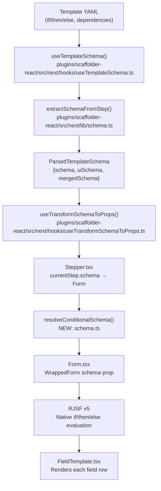
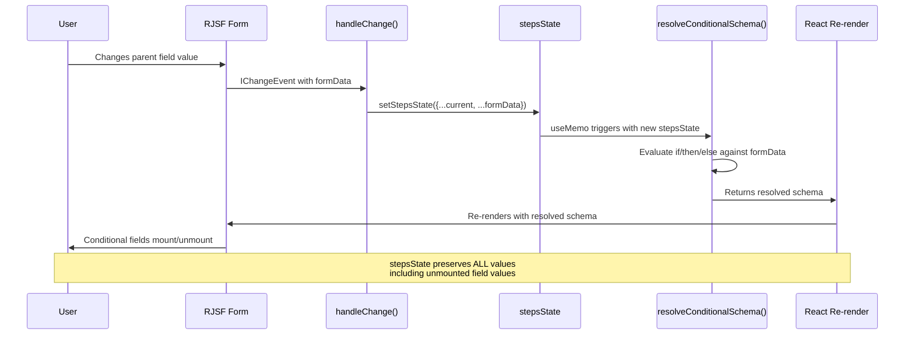
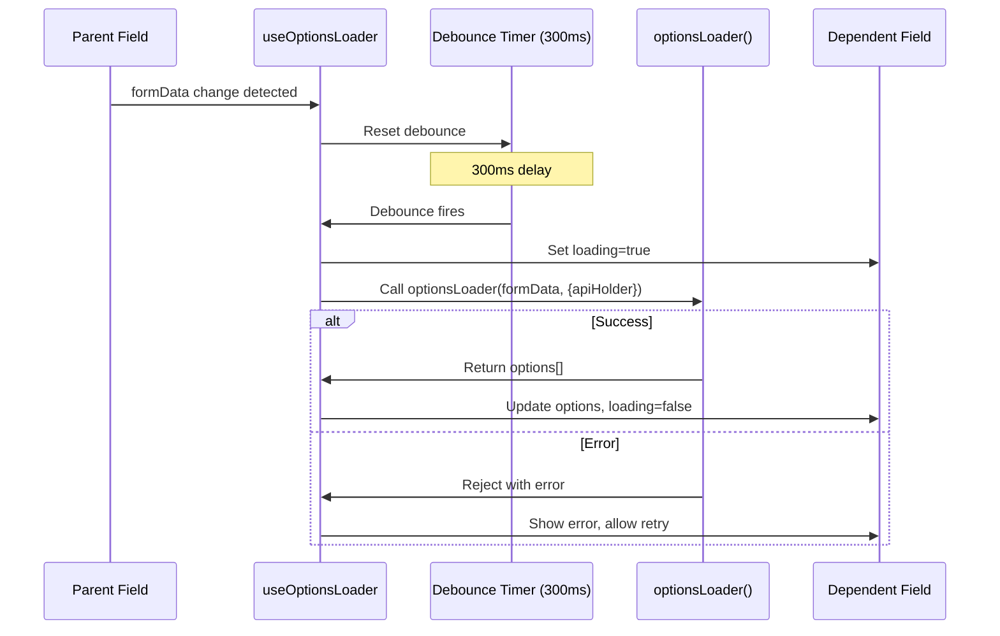

# Technical Specification

# 0. Agent Action Plan

## 0.1 Intent Clarification

### 0.1.1 Core Feature Objective

Based on the prompt, the Blitzy platform understands that the new feature requirement is to **add cascading/dynamic form capabilities to the Backstage Scaffolder's multi-step wizard**, enabling reactive field behavior driven by standard JSON Schema conditional keywords. The existing Scaffolder form system renders static forms from JSON Schema definitions in template YAML files. Template authors cannot currently declare that one field's visibility, options, or validation depend on another field's current value. This feature closes that gap entirely on the frontend — no backend changes are required.

The specific feature requirements are:

- **Reactive JSON Schema conditional rendering**: Template authors declare field dependencies using standard JSON Schema keywords (`if/then/else`, `dependencies`) in their template YAML files. The scaffolder form MUST honor these declarations reactively, mounting and unmounting fields within the same render cycle as the triggering field change. Currently, `extractSchemaFromStep()` in `plugins/scaffolder-react/src/next/lib/schema.ts` parses and extracts `ui:*` metadata from `if/then/else` and `dependencies` branches, but these conditional keywords are not actively leveraged by RJSF for reactive field updates due to potential interference from the extraction pipeline.

- **Dependent dropdown filtering**: When a parent field changes (e.g., selecting "AWS" in a `cloudProvider` enum), dependent fields (e.g., `region`) MUST update their available options to reflect only valid choices for the selected parent value, within 200ms of the parent change.

- **Async option loading for dependent fields**: Field extensions MUST be able to declare an `optionsLoader(formData, apiHolder)` function that re-fetches options when watched fields change. This enables dynamic data retrieval from existing Backstage APIs (catalog, custom backends) triggered by sibling field value changes.

- **Conditional field visibility**: Fields governed by `if/then/else` or `dependencies` keywords MUST mount and unmount reactively as their conditions evaluate to true or false, without requiring page navigation or manual refresh.

- **Zero regression on existing templates**: All current scaffolder E2E tests, field extensions, and form behaviors MUST remain unchanged. The feature is purely additive.

**Implicit requirements detected:**

- Form value preservation across conditional mount/unmount cycles (if a user fills a conditional field, switches the parent value, then switches back, the previously entered value MUST be restored)
- Debounced invocation of `optionsLoader` to prevent network request storms during rapid parent field changes (300ms default)
- Loading indicator and error state UI for fields with pending async option loads
- Backward-compatible type signature changes to `FieldExtensionOptions` (new fields MUST be optional)
- Dependency-triggered revalidation in the existing `createAsyncValidators` pipeline

### 0.1.2 Special Instructions and Constraints

**Critical directives from the user:**

- **MUST use RJSF's built-in conditional rendering where possible.** RJSF v5 already evaluates `if/then/else` and `dependencies` at the form level. The primary work is ensuring Backstage's schema extraction (`extractSchemaFromStep`) preserves these keywords through to RJSF rather than stripping them or interfering with RJSF's native evaluation.
- **MUST NOT modify `@rjsf/core` or fork RJSF.** All customization MUST go through RJSF's documented extension points: custom fields, custom widgets, custom templates, and form props.
- **MUST debounce `optionsLoader` calls** at 300ms by default (configurable via `ui:options`).
- **MUST preserve form values** when conditional fields unmount and remount.
- **Field extensions MUST remain backward-compatible.** Adding `dependencies` and `optionsLoader` to `FieldExtensionOptions` MUST be optional (`undefined` by default).
- **MUST NOT add UI framework dependencies.** Loading indicators and error states MUST use existing `@backstage/core-components` primitives.
- **Schema resolution MUST be pure and synchronous.** `resolveConditionalSchema(schema, formData)` MUST be a pure function with signature `(schema: JsonObject, formData: JsonObject) => JsonObject`.

**Architectural requirements:**

- All modifications are scoped exclusively to `plugins/scaffolder-react/` — no files outside this plugin directory may be modified
- Follow existing barrel-export patterns (every new module must be re-exported through the appropriate `index.ts`)
- Follow existing testing patterns using `@testing-library/react`, `renderInTestApp`, and `jest.fn()` mocks as demonstrated in `Stepper.test.tsx` and `createAsyncValidators.test.ts`

**Build and verification commands:**

- User Example: `yarn install` → `yarn tsc` → `yarn test --no-watch plugins/scaffolder-react`
- User Example: `yarn lint --fix`
- User Example: `yarn build:api-reports` (required if public API surface changes)

### 0.1.3 Technical Interpretation

These feature requirements translate to the following technical implementation strategy:

- To **enable reactive JSON Schema conditional rendering**, we will ensure `extractSchemaFromStep()` in `plugins/scaffolder-react/src/next/lib/schema.ts` preserves `if`, `then`, `else`, and `dependencies` structural keywords in the returned schema (currently the function extracts `ui:*` metadata but may interfere with conditional keyword forwarding), and create a new `resolveConditionalSchema(schema, formData)` pure utility function in the same module that performs synchronous schema resolution against current form data.

- To **support dependent dropdown filtering**, we will add a `useMemo`-based reactive schema resolution in `plugins/scaffolder-react/src/next/components/Stepper/Stepper.tsx` that re-resolves the active step's schema whenever `formData` changes within a step, passing the resolved schema (rather than the raw extracted schema) to the `<Form>` component.

- To **enable async option loading**, we will extend the `FieldExtensionOptions` type in `plugins/scaffolder-react/src/extensions/types.ts` with optional `dependencies: string[]` and `optionsLoader: (formData: JsonObject, context: { apiHolder: ApiHolder }) => Promise<Array<{ label: string; value: string | number }>>` fields, and create a new `useOptionsLoader` hook that manages debouncing, loading state, and error handling.

- To **provide loading/error UI for async fields**, we will modify `plugins/scaffolder-react/src/next/components/Form/FieldTemplate.tsx` to detect fields with pending `optionsLoader` calls and render appropriate loading indicators (using MUI `LinearProgress` already imported in the Stepper) and inline error states (using `FormHelperText` from MUI v4, consistent with the existing `ScaffolderField` pattern).

- To **preserve form values across conditional mount/unmount**, we will leverage the existing `stepsState` accumulator in `Stepper.tsx` combined with the `formData` prop passed to the `<Form>` component, ensuring that RJSF receives the full accumulated form state on every render so remounted fields can restore their previous values.

- To **trigger dependency-aware revalidation**, we will modify `createAsyncValidators.ts` to detect fields with `dependencies` declarations and re-run validation for dependent fields when their parent values change.


## 0.2 Repository Scope Discovery

### 0.2.1 Comprehensive File Analysis

All modifications are scoped exclusively within `plugins/scaffolder-react/`. The following analysis maps every existing file requiring modification, every new file to be created, and all integration points discovered through systematic repository exploration.

**Existing Files Requiring Modification:**

| File Path | Current Purpose | Required Change |
|---|---|---|
| `plugins/scaffolder-react/src/next/lib/schema.ts` | Extracts JSON Schema and UI Schema from template step definitions; handles `ui:*` key separation via `extractUiSchema()` | Add `resolveConditionalSchema(schema, formData)` pure utility; verify `if` keyword preservation through extraction pipeline; ensure `dependencies` schema branches are properly forwarded to RJSF |
| `plugins/scaffolder-react/src/next/lib/index.ts` | Barrel export for `extractSchemaFromStep` and `createFieldValidation` | Add export for `resolveConditionalSchema` |
| `plugins/scaffolder-react/src/next/components/Stepper/Stepper.tsx` | Multi-step wizard orchestrator; passes extracted schema to `<Form>` via `currentStep.schema` | Add `useMemo`-based reactive schema resolution that re-resolves schema when `formData` changes within a step; enhance `stepsState` to preserve conditional field values across mount/unmount |
| `plugins/scaffolder-react/src/next/components/Form/Form.tsx` | Wraps RJSF `withTheme(MuiTheme)` and adapts field/template props | Pass resolved (not raw) schema to RJSF `<WrappedForm>`; integrate `formContext` extensions for `optionsLoader` metadata propagation |
| `plugins/scaffolder-react/src/next/components/Form/FieldTemplate.tsx` | Custom RJSF FieldTemplate rendering each field row with `ScaffolderField` wrapper | Add loading indicator and inline error state rendering for fields with pending `optionsLoader`; detect `ui:options.loading` and `ui:options.loadError` states |
| `plugins/scaffolder-react/src/extensions/types.ts` | Defines `FieldExtensionOptions`, `FieldExtensionComponentProps`, `CustomFieldValidator`, and related types | Add optional `dependencies?: string[]` and `optionsLoader?` to `FieldExtensionOptions` type |
| `plugins/scaffolder-react/src/extensions/createScaffolderFieldExtension.tsx` | Runtime factory that attaches field extension metadata to placeholder components | Forward new `dependencies` and `optionsLoader` metadata through `FIELD_EXTENSION_KEY` attachment |
| `plugins/scaffolder-react/src/next/components/Stepper/createAsyncValidators.ts` | Recursive async validation engine that traverses schema to invoke field validators | Add dependency-triggered revalidation logic; when a parent field changes, re-run validation for fields that declare it as a dependency |
| `plugins/scaffolder-react/src/next/hooks/useTemplateSchema.ts` | Parses template manifest into `ParsedTemplateSchema[]` with feature flag filtering | Verify that conditional schema keywords (`if/then/else`, `dependencies`) survive the extraction and filtering pipeline without loss |
| `plugins/scaffolder-react/src/next/components/ScaffolderField/ScaffolderField.tsx` | Accessible field shell with markdown descriptions, errors, and disabled state | Add optional `isLoading` prop to render loading indicator within the field shell |

**Existing Test Files Requiring Updates:**

| File Path | Current Coverage | Required Change |
|---|---|---|
| `plugins/scaffolder-react/src/next/lib/schema.test.ts` | Tests `extractSchemaFromStep` for properties, anyOf/oneOf/allOf, dependencies, if/then/else UI extraction | Add tests for `resolveConditionalSchema()`: simple if/then/else, nested conditions, property dependencies, schema dependencies, oneOf discrimination |
| `plugins/scaffolder-react/src/next/components/Stepper/Stepper.test.tsx` | 842-line integration suite covering step rendering, navigation, state preservation, async validation | Add integration tests for reactive conditional field visibility; test form value preservation across conditional mount/unmount; test cascading dropdown behavior |
| `plugins/scaffolder-react/src/next/components/Stepper/createAsyncValidators.test.ts` | Tests nested object dispatch, schema propagation, error aggregation, dependency branches | Add tests for dependency-triggered revalidation; test that parent field changes cause dependent field revalidation |
| `plugins/scaffolder-react/src/next/hooks/useTemplateSchema.test.tsx` | Tests feature flag filtering at step and property level | Add tests verifying if/then/else and dependencies keywords survive schema parsing |

**Configuration and Documentation Files:**

| File Path | Required Change |
|---|---|
| `plugins/scaffolder-react/package.json` | No dependency changes required (all needed libraries already present); verify version compatibility |
| `plugins/scaffolder-react/report.api.md` | Will be auto-regenerated by `yarn build:api-reports` if public API surface changes |
| `plugins/scaffolder-react/report-alpha.api.md` | Will be auto-regenerated; new alpha exports (`resolveConditionalSchema`, updated `FieldExtensionOptions`) will appear |
| `plugins/scaffolder-react/README.md` | Add documentation section for cascading/dynamic forms feature |

### 0.2.2 Integration Point Discovery

**Schema Resolution Chain:**

The form rendering pipeline flows through these integration points, each of which must preserve conditional keywords:



**RJSF Integration Points:**

- `@rjsf/core` v5.24.13 `withTheme()` — used in `Form.tsx` line 25 to create `WrappedForm`
- `@rjsf/validator-ajv8` v5.24.13 `customizeValidator()` — used in `Stepper.tsx` line 60 to create the AJV8 validator
- `@rjsf/utils` — `FieldTemplateProps`, `UiSchema`, `ErrorSchema`, `FieldValidation` types used throughout
- `json-schema-library` v9.x `Draft07` — used in `createAsyncValidators.ts` line 21 for schema traversal during validation

**Form State Management Points:**

- `Stepper.tsx` lines 133-134: `stepsState` accumulates form data across steps via `useState<Record<string, JsonValue>>`
- `Stepper.tsx` lines 183-190: `handleChange` callback merges step-level formData changes into `stepsState`
- `Stepper.tsx` line 280: `formContext={{ ...propFormContext, formData: stepsState }}` propagates full form state to field extensions
- `Stepper.tsx` line 279: `formData={stepsState}` passes accumulated state to RJSF for value restoration

**API and Extension System Points:**

- `createScaffolderFieldExtension()` in `extensions/createScaffolderFieldExtension.tsx` — the factory function that field extension authors call; must forward new `dependencies` and `optionsLoader` metadata
- `FIELD_EXTENSION_KEY` in `extensions/keys.ts` — the metadata key under which field extension options are attached
- `FieldExtensionComponentProps` — the props interface that field extension components receive, including `formContext.formData` for accessing sibling field values

### 0.2.3 New File Requirements

**New source files to create:**

| File Path | Purpose |
|---|---|
| `plugins/scaffolder-react/src/next/hooks/useOptionsLoader.ts` | Custom React hook that manages `optionsLoader` lifecycle: watches specified dependency fields, debounces calls (300ms default, configurable), manages loading/error/data state, and exposes results to field components |
| `plugins/scaffolder-react/src/next/hooks/useOptionsLoader.test.ts` | Unit tests for the `useOptionsLoader` hook covering debounce behavior, loading states, error handling, retry logic, and dependency change detection |
| `plugins/scaffolder-react/src/next/hooks/useConditionalSchema.ts` | Custom React hook wrapping `resolveConditionalSchema()` with `useMemo` to reactively resolve schema when formData changes |

**New test fixtures:**

| File Path | Purpose |
|---|---|
| Test cases within `schema.test.ts` | New `describe('resolveConditionalSchema')` block with fixtures for if/then/else resolution, nested conditions, property and schema dependencies, oneOf discrimination |
| Test cases within `Stepper.test.tsx` | New integration tests for cascading field behavior, value preservation across mount/unmount, and async option loading UI states |

### 0.2.4 Web Search Research Conducted

- RJSF v5 conditional schema evaluation behavior with `if/then/else` and `dependencies` keywords
- Best practices for debounced async data fetching in React hooks with AbortController cleanup
- JSON Schema Draft 07 conditional keyword semantics and evaluation order
- RJSF custom field extension patterns for dynamic option loading


## 0.3 Dependency Inventory

### 0.3.1 Private and Public Packages

All packages listed below are already installed in the `plugins/scaffolder-react/package.json` manifest. **No new dependencies are required.** The user explicitly states: "No new dependencies. RJSF v5 and AJV8 already support the JSON Schema keywords needed. `json-schema-library` already provides schema traversal utilities."

**Core Form Rendering Packages:**

| Registry | Package Name | Version | Purpose | Status |
|---|---|---|---|---|
| npm | `@rjsf/core` | 5.24.13 | React JSON Schema Form engine; provides `withTheme()`, `Form` component, and conditional schema evaluation | Installed |
| npm | `@rjsf/utils` | 5.24.13 | RJSF type definitions (`FieldTemplateProps`, `UiSchema`, `ErrorSchema`, `FieldValidation`, `RegistryFieldsType`) | Installed |
| npm | `@rjsf/validator-ajv8` | 5.24.13 | AJV8-based validator for RJSF; provides `customizeValidator()` used in Stepper.tsx | Installed |
| npm | `@rjsf/material-ui` | 5.24.13 | MUI v4 theme for RJSF; provides `Theme` used in `withTheme(MuiTheme)` in Form.tsx | Installed |
| npm | `ajv` | ^8.0.1 | JSON Schema validator; supports Draft 07 including `if/then/else` and `dependencies` | Installed |
| npm | `ajv-errors` | ^3.0.0 | Custom error messages for AJV validation; used in Stepper.tsx | Installed |
| npm | `json-schema-library` | ^9.0.0 | Schema traversal and resolution; provides `Draft07` class used in `createAsyncValidators.ts` for pointer-based schema lookup | Installed |

**Backstage Platform Packages:**

| Registry | Package Name | Version | Purpose | Status |
|---|---|---|---|---|
| workspace | `@backstage/core-plugin-api` | workspace:^ | Provides `useApiHolder()`, `useAnalytics()`, `ApiHolder` type | Installed |
| workspace | `@backstage/frontend-plugin-api` | workspace:^ | Provides `useTranslationRef()` for i18n | Installed |
| workspace | `@backstage/core-components` | workspace:^ | UI primitives: `MarkdownContent`, `Progress` (loading indicator), `AlertDisplay`, `WarningPanel` | Installed |
| workspace | `@backstage/types` | workspace:^ | Provides `JsonObject`, `JsonValue` types | Installed |
| workspace | `@backstage/plugin-scaffolder-common` | workspace:^ | Provides `TemplateParameterSchema`, `TemplatePresentationV1beta3` | Installed |
| workspace | `@backstage/theme` | workspace:^ | Theme integration for component style overrides | Installed |

**UI Framework Packages (already used in scaffolder-react):**

| Registry | Package Name | Version | Purpose | Status |
|---|---|---|---|---|
| npm | `@material-ui/core` | ^4.12.2 | MUI v4 components: `Button`, `LinearProgress`, `Step`, `StepLabel`, `Stepper`, `FormControl`, `FormHelperText` | Installed |
| npm | `@material-ui/icons` | ^4.9.1 | Material Design icons | Installed |
| npm | `@material-ui/lab` | 4.0.0-alpha.61 | Experimental MUI v4 components (e.g., `Skeleton`) | Installed |

**Utility Packages:**

| Registry | Package Name | Version | Purpose | Status |
|---|---|---|---|---|
| npm | `flatted` | 3.3.3 | Cyclic-safe JSON clone via `stringify`/`parse`; used in `extractSchemaFromStep()` | Installed |
| npm | `lodash` | ^4.17.21 | `merge()` used for uiSchema merging in Stepper.tsx | Installed |
| npm | `react-use` | ^17.2.4 | Composable React hooks (e.g., `useDebounce`) | Installed |
| npm | `immer` | ^9.0.6 | Immutable state management | Installed |
| npm | `use-immer` | ^0.11.0 | Immer-powered React state hooks | Installed |

**Testing Packages (devDependencies):**

| Registry | Package Name | Version | Purpose | Status |
|---|---|---|---|---|
| npm | `@testing-library/react` | ^16.0.0 | React component testing utilities | Installed |
| npm | `@testing-library/jest-dom` | ^6.0.0 | Custom Jest matchers for DOM assertions | Installed |
| npm | `@testing-library/user-event` | ^14.0.0 | User interaction simulation | Installed |
| workspace | `@backstage/test-utils` | workspace:^ | Provides `renderInTestApp`, `mockApis`, `TestApiRegistry` | Installed |

### 0.3.2 Dependency Updates

**No new packages need to be added to `package.json`.** All required functionality is available through existing dependencies.

**Import Updates Required:**

Files requiring new internal imports (within `plugins/scaffolder-react/`):

- `plugins/scaffolder-react/src/next/lib/schema.ts` — No new external imports; new `resolveConditionalSchema` function uses existing `JsonObject` type from `@backstage/types`
- `plugins/scaffolder-react/src/next/lib/index.ts` — Add export: `export { resolveConditionalSchema } from './schema'`
- `plugins/scaffolder-react/src/next/components/Stepper/Stepper.tsx` — Add import of `resolveConditionalSchema` from `../../lib`; potentially add import of `useOptionsLoader` from `../../hooks`
- `plugins/scaffolder-react/src/extensions/types.ts` — Add `ApiHolder` import from `@backstage/core-plugin-api` (already available); add `JsonObject` from `@backstage/types`
- `plugins/scaffolder-react/src/next/hooks/useOptionsLoader.ts` — Import `useCallback`, `useEffect`, `useRef`, `useState` from React; `ApiHolder` from `@backstage/core-plugin-api`; `JsonObject` from `@backstage/types`
- `plugins/scaffolder-react/src/next/hooks/index.ts` — Add export: `export { useOptionsLoader } from './useOptionsLoader'`

**External Reference Updates:**

- `plugins/scaffolder-react/report.api.md` — Auto-regenerated via `yarn build:api-reports`; will reflect updated `FieldExtensionOptions` type with new optional fields
- `plugins/scaffolder-react/report-alpha.api.md` — Auto-regenerated; will reflect new `resolveConditionalSchema` export and updated alpha API surface


## 0.4 Integration Analysis

### 0.4.1 Existing Code Touchpoints

**Direct modifications required:**

- **`plugins/scaffolder-react/src/next/lib/schema.ts`** (lines 24–134): The `extractUiSchema()` private function currently destructures `then` and `else` from the schema at line 37–38 and recursively extracts `ui:*` keys from them (lines 114–121). The `if` keyword is NOT destructured or explicitly handled — it passes through untouched, which is correct. However, the function needs verification that `dependencies` keyword branches (lines 104–112) properly preserve their structural schema content (not just extract UI metadata). The new `resolveConditionalSchema()` function will be added after the existing `extractSchemaFromStep()` at approximately line 134.

- **`plugins/scaffolder-react/src/next/components/Stepper/Stepper.tsx`** (lines 117–349): The core integration point is between `currentStep` computation (line 173) and the `<Form>` render (line 275). Currently, `currentStep.schema` is passed directly. The modification adds a `useMemo` between these points that calls `resolveConditionalSchema(currentStep.schema, stepsState)` to produce a resolved schema. The `handleChange` callback (lines 183–190) already merges formData changes into `stepsState`, which feeds back into the resolution. The `stepsState` accumulator (lines 133–134) already preserves all field values across the form lifecycle, which naturally supports value restoration when conditional fields remount. The `key={activeStep}` prop on `<Form>` (line 276) causes full remount on step change but NOT on formData change within a step, which is the correct behavior for reactive conditional rendering.

- **`plugins/scaffolder-react/src/next/components/Form/Form.tsx`** (lines 31–68): The `Form` component receives props including `schema`, `formData`, and `formContext`. The resolved schema from Stepper will flow through as the `schema` prop. The `formContext` needs extension to carry `optionsLoader` registrations so that `FieldTemplate` can detect fields with pending async loads. The `wrappedFields` memo (lines 34–53) wraps field extension components — this wrapper may need enhancement to inject `optionsLoader`-aware behavior.

- **`plugins/scaffolder-react/src/next/components/Form/FieldTemplate.tsx`** (lines 32–100): The custom `FieldTemplate` renders every field via `ScaffolderField`. The modification adds detection of loading/error states from `formContext` for fields with active `optionsLoader` calls. When a field is in loading state, the template renders a `LinearProgress` indicator below the field children. When in error state, it renders an inline error message with retry affordance.

- **`plugins/scaffolder-react/src/extensions/types.ts`** (lines 77–87): The `FieldExtensionOptions` type gains two new optional properties:
  ```ts
  dependencies?: string[];
  optionsLoader?: (formData: JsonObject, context: { apiHolder: ApiHolder }) => Promise<Array<{ label: string; value: string | number }>>;
  ```
  Both default to `undefined`, preserving full backward compatibility.

- **`plugins/scaffolder-react/src/extensions/createScaffolderFieldExtension.tsx`** (lines 33–52): The `createScaffolderFieldExtension` factory attaches the full `options` object (including the new `dependencies` and `optionsLoader` fields) to the placeholder component via `attachComponentData`. Since the entire `options` object is already passed as the metadata value (line 43–46), no structural change to the attachment mechanism is needed — the type expansion in `types.ts` automatically flows through.

- **`plugins/scaffolder-react/src/next/components/Stepper/createAsyncValidators.ts`** (lines 43–179): The validation engine traverses the schema and invokes field-level validators. The modification adds awareness of `dependencies` declarations: when iterating form data entries (line 85), fields that declare dependencies are flagged so that when their parent fields change, revalidation is triggered. This integrates with the existing `validateForm` inner function (lines 61–83).

### 0.4.2 Dependency Injection Points

- **`Stepper.tsx` line 129**: `const apiHolder = useApiHolder()` — already provides the `ApiHolder` instance needed by `optionsLoader` functions. This will be passed through `formContext` so field extensions can access it.

- **`Stepper.tsx` lines 146–150**: The `extensions` memo maps `FieldExtensionOptions` to field components. This mapping needs extension to also extract `dependencies` and `optionsLoader` metadata for each extension, building a registry that the `useOptionsLoader` hook can consume.

- **`Stepper.tsx` lines 157–161**: The `validators` memo maps extension names to validation functions. This will be enhanced to also track dependency relationships between fields.

- **`Stepper.tsx` lines 163–167**: The `validation` memo creates async validators per active step. The `createAsyncValidators` call already receives `steps[activeStep]?.mergedSchema` and `validators` — the enhancement adds `dependencies` metadata as an additional parameter.

### 0.4.3 Form State Flow

The reactive form update cycle follows this path:



### 0.4.4 Async Options Loading Flow




## 0.5 Design System Compliance

### 0.5.1 System Identification

The scaffolder-react plugin operates within a **dual design system** environment:

- **Primary (Active in Scaffolder):** Material UI v4 (`@material-ui/core` ^4.12.2, `@material-ui/icons` ^4.9.1, `@material-ui/lab` 4.0.0-alpha.61) — currently used by all scaffolder components
- **Secondary (Platform-wide Legacy):** `@backstage/core-components` — provides `MarkdownContent`, `Progress`, `AlertDisplay`, `WarningPanel`, and other higher-level Backstage primitives
- **Emerging (Not yet adopted by Scaffolder):** Backstage UI (`@backstage/ui` / `packages/ui/`) — the new BUI design system with `Skeleton`, `Alert`, and token-driven components

| Attribute | Value |
|---|---|
| Library | `@material-ui/core` (MUI v4) + `@backstage/core-components` |
| Version | ^4.12.2 (MUI v4), workspace:^ (core-components) |
| Status | Installed and actively used |
| Package | `@material-ui/core`, `@backstage/core-components` |
| Source | `plugins/scaffolder-react/package.json` dependencies |

Per the user's Rule #6: "Loading indicators and error states MUST use existing `@backstage/core-components` primitives (Skeleton, Alert, etc.) — no new UI libraries." The implementation will use MUI v4 and `@backstage/core-components` primitives that are already imported throughout the scaffolder plugin.

### 0.5.2 Component Mapping

The following table maps each new UI element required by the cascading forms feature to an existing library component already in use within `plugins/scaffolder-react/`:

| UI Element | Library Component | Import Source | Props / Variant | Notes |
|---|---|---|---|---|
| Loading indicator (field-level) | `LinearProgress` | `@material-ui/core/LinearProgress` | `variant="indeterminate"` | Already imported in `Stepper.tsx` line 27; reuse for field-level loading |
| Loading indicator (global) | `LinearProgress` | `@material-ui/core/LinearProgress` | `variant="indeterminate"` | Already rendered at `Stepper.tsx` line 245 during validation |
| Field error message | `FormHelperText` | `@material-ui/core/FormHelperText` | `error={true}` | Already used in `PasswordWidget.tsx` line 19 |
| Field container | `FormControl` | `@material-ui/core/FormControl` | `fullWidth`, `error`, `disabled` | Already used in `ScaffolderField.tsx` line 69 |
| Field description | `MarkdownContent` | `@backstage/core-components` | `content`, `linkTarget="_blank"` | Already used in `ScaffolderField.tsx` line 77 |
| Retry button | `Button` | `@material-ui/core/Button` | `variant="text"`, `size="small"` | Already imported in `Stepper.tsx` line 26 |
| Error icon | `ErrorIcon` | `@material-ui/icons/Error` | — | Already used in `ErrorListTemplate/errorListTemplate.tsx` line 23 |
| Field shell wrapper | `ScaffolderField` | `../ScaffolderField` | `displayLabel`, `rawErrors`, `errors`, `help`, `disabled` | Custom Backstage component; primary field wrapper in `FieldTemplate.tsx` |
| Styled container | `makeStyles` | `@material-ui/core/styles` | Theme-aware CSS-in-JS | Used in `ScaffolderField.tsx` line 22, `Stepper.tsx` line 69 |

### 0.5.3 Compliance Principles

**Precedence order for this feature:**

- Design system compliance — every new UI element uses an existing MUI v4 or `@backstage/core-components` primitive
- Visual consistency — new loading/error states match the existing scaffolder visual language
- Accessibility — loading states announce via `aria-busy`, error states use `aria-invalid` and `role="alert"`
- No hardcoded values — spacing and colors use MUI v4 `theme.spacing()` and `theme.palette.*` via `makeStyles`

**Non-negotiable rules applied:**

- Zero new UI library dependencies — verified by checking `package.json` diff shows zero new entries
- All loading indicators use `LinearProgress` from `@material-ui/core` (already a dependency)
- All error states use `FormHelperText` with `error={true}` (already a pattern in `PasswordWidget.tsx`)
- All field layout uses `FormControl` from `@material-ui/core` (already a pattern in `ScaffolderField.tsx`)
- Theme-aware styling via `makeStyles` from `@material-ui/core/styles` (established pattern across all scaffolder components)

### 0.5.4 Gaps Inventory

| Gap | Description | Resolution |
|---|---|---|
| Skeleton placeholder for async-loading select fields | No Skeleton component is currently imported in scaffolder-react | Use `LinearProgress` with `variant="indeterminate"` inside the field container, matching the existing loading pattern in `Stepper.tsx` line 245. This maintains consistency without adding new component imports. Alternatively, import `Skeleton` from `@material-ui/lab` (already a dependency at `4.0.0-alpha.61`) |
| Inline retry button for optionsLoader failures | No retry button pattern exists in current scaffolder | Compose `Button` (variant="text", size="small") with `FormHelperText` (error=true) in a horizontal layout using `makeStyles`. This follows the existing button styling in `Stepper.tsx` |
| Disabled field state during loading | `ScaffolderField` already supports `disabled` prop but no `isLoading` prop | Extend `ScaffolderFieldProps` with optional `isLoading?: boolean` and apply `disabled` + `aria-busy="true"` when loading is active |

### 0.5.5 Compliance Summary

All UI elements required for the cascading forms feature are covered by existing MUI v4 components and `@backstage/core-components` primitives that are already dependencies of `plugins/scaffolder-react`. The loading indicator (`LinearProgress`), error messages (`FormHelperText`), field containers (`FormControl`), and action buttons (`Button`) are all imported and used in the current codebase. No new UI framework dependencies need to be added. Three minor gaps exist (Skeleton placeholder, retry pattern, loading prop) that are resolved through composition of existing primitives, maintaining zero new dependency overhead.


## 0.6 Technical Implementation

### 0.6.1 File-by-File Execution Plan

Every file listed below MUST be created or modified. Files are grouped by functional concern and ordered within each group by dependency (foundational files first).

**Group 1 — Core Schema Resolution (Foundation):**

- **MODIFY: `plugins/scaffolder-react/src/next/lib/schema.ts`**
  - Verify that `extractUiSchema()` preserves the `if` keyword in the returned schema (currently not destructured, which is correct — confirm no side effects remove it)
  - Add new exported function `resolveConditionalSchema(schema: JsonObject, formData: JsonObject): JsonObject` that evaluates `if/then/else` conditions against current formData and returns a merged schema reflecting active branches
  - The resolution function MUST be pure and synchronous with no side effects
  - Implementation uses `json-schema-library` `Draft07` for schema evaluation, consistent with existing usage in `createAsyncValidators.ts`

- **MODIFY: `plugins/scaffolder-react/src/next/lib/index.ts`**
  - Add `resolveConditionalSchema` to the barrel export alongside existing `extractSchemaFromStep` and `createFieldValidation`

**Group 2 — Type System Extensions (API Surface):**

- **MODIFY: `plugins/scaffolder-react/src/extensions/types.ts`**
  - Extend `FieldExtensionOptions` with two new optional fields:
    ```ts
    dependencies?: string[];
    optionsLoader?: (
      formData: JsonObject,
      context: { apiHolder: ApiHolder },
    ) => Promise<Array<{ label: string; value: string | number }>>;
    ```
  - Both fields are `undefined` by default, maintaining backward compatibility

- **MODIFY: `plugins/scaffolder-react/src/extensions/createScaffolderFieldExtension.tsx`**
  - No structural changes needed — the factory already passes the full `options` object to `attachComponentData`, so the new type fields flow through automatically
  - Verify TypeScript compilation confirms the type expansion propagates correctly

**Group 3 — Reactive Hooks (Behavioral Infrastructure):**

- **CREATE: `plugins/scaffolder-react/src/next/hooks/useOptionsLoader.ts`**
  - Implement hook signature: `useOptionsLoader(fieldName: string, dependencies: string[], optionsLoader: OptionsLoaderFn, formData: JsonObject, apiHolder: ApiHolder)`
  - Track watched field values using `useRef` for previous value comparison
  - Implement 300ms debounce (configurable via `debounceMs` parameter) using `setTimeout`/`clearTimeout`
  - Manage tri-state: `{ options: EnumOption[], loading: boolean, error: Error | null }`
  - Implement AbortController-based cleanup for pending requests on unmount
  - Provide `retry()` function in return value for error recovery

- **CREATE: `plugins/scaffolder-react/src/next/hooks/useOptionsLoader.test.ts`**
  - Test debounce: rapid parent changes produce only one loader call after 300ms
  - Test loading state: `loading=true` while fetch is pending
  - Test error handling: rejected loader sets `error` and `loading=false`
  - Test retry: calling `retry()` re-invokes the loader
  - Test cleanup: unmounting during pending fetch does not cause state updates
  - Test dependency detection: loader only fires when watched dependency values change

- **MODIFY: `plugins/scaffolder-react/src/next/hooks/index.ts`**
  - Add export for `useOptionsLoader`

**Group 4 — Stepper Integration (Orchestration):**

- **MODIFY: `plugins/scaffolder-react/src/next/components/Stepper/Stepper.tsx`**
  - Add `useMemo` after `currentStep` computation (line 173) that calls `resolveConditionalSchema(currentStep.schema, stepsState)` to produce a resolved schema
  - Pass resolved schema to `<Form>` instead of `currentStep.schema` at line 281
  - Extend `formContext` (line 280) to include `optionsLoaderRegistry` built from extensions that declare `dependencies` and `optionsLoader`
  - Enhance the `extensions` memo (lines 146–150) to also extract and map `dependencies` and `optionsLoader` per extension name
  - Ensure `stepsState` accumulation preserves values from conditionally unmounted fields (already handled by the merge pattern at lines 183–190; verify no overwrites occur)

- **MODIFY: `plugins/scaffolder-react/src/next/components/Stepper/createAsyncValidators.ts`**
  - Accept optional `fieldDependencies: Record<string, string[]>` parameter in the factory function
  - When validating a field, check if any of its dependencies have changed since last validation run
  - If dependencies changed, force revalidation of the dependent field even if its own value hasn't changed
  - Maintain backward compatibility — existing call sites pass `undefined` for the new parameter

**Group 5 — Form Rendering (UI Layer):**

- **MODIFY: `plugins/scaffolder-react/src/next/components/Form/Form.tsx`**
  - Pass `formContext` through to `WrappedForm` (already happens via `{...props}` spread at line 66)
  - Verify that the `wrappedFields` memo (lines 34–53) correctly forwards `formContext` to wrapped field components so they can access `optionsLoaderRegistry`

- **MODIFY: `plugins/scaffolder-react/src/next/components/Form/FieldTemplate.tsx`**
  - Access `formContext` from RJSF `registry` to check for active loading/error states on the current field
  - When `formContext.fieldLoadingStates[fieldId]?.loading === true`: render `LinearProgress` inside `ScaffolderField`, set `aria-busy="true"` on the field container
  - When `formContext.fieldLoadingStates[fieldId]?.error !== null`: render inline `FormHelperText` with error message and retry `Button`

- **MODIFY: `plugins/scaffolder-react/src/next/components/ScaffolderField/ScaffolderField.tsx`**
  - Add optional `isLoading?: boolean` prop to `ScaffolderFieldProps`
  - When `isLoading` is true, render `LinearProgress` below children and set `aria-busy="true"` on the `FormControl`
  - Import `LinearProgress` from `@material-ui/core/LinearProgress`

**Group 6 — Tests and Documentation:**

- **MODIFY: `plugins/scaffolder-react/src/next/lib/schema.test.ts`**
  - Add `describe('resolveConditionalSchema')` test block with cases for:
    - Simple if/then/else with single boolean condition
    - Nested if/then/else with multiple conditions
    - Property dependencies (field B required when field A present)
    - Schema dependencies (additional schema applied when dependency present)
    - `oneOf` discriminated rendering with enum values
    - Schema with no conditionals (passthrough behavior)

- **MODIFY: `plugins/scaffolder-react/src/next/components/Stepper/Stepper.test.tsx`**
  - Add integration test: render Stepper with `if/then/else` schema; toggle parent field; assert dependent field mounts/unmounts
  - Add integration test: fill conditional field, toggle parent away and back; assert value is preserved
  - Add integration test: render with `optionsLoader` extension; change parent; assert loading state appears; assert options update

- **MODIFY: `plugins/scaffolder-react/src/next/components/Stepper/createAsyncValidators.test.ts`**
  - Add test: dependency-triggered revalidation when parent field changes
  - Add test: no redundant revalidation when unrelated field changes

- **MODIFY: `plugins/scaffolder-react/src/next/hooks/useTemplateSchema.test.tsx`**
  - Add test: verify if/then/else keywords survive `useTemplateSchema()` parsing pipeline

- **MODIFY: `plugins/scaffolder-react/README.md`**
  - Add "Cascading/Dynamic Forms" section documenting the feature, JSON Schema patterns, and `optionsLoader` API

### 0.6.2 Implementation Approach per File

The implementation follows a bottom-up dependency order:

- **Establish schema resolution foundation** by adding `resolveConditionalSchema()` to `schema.ts` — this pure function is independently testable and has zero dependencies beyond `@backstage/types` and `json-schema-library`
- **Extend the type system** by adding optional fields to `FieldExtensionOptions` — this is a type-only change that enables TypeScript compilation of downstream consumers
- **Build behavioral hooks** by creating `useOptionsLoader` — this encapsulates the debounce, loading, and error management logic as a reusable hook
- **Integrate at the orchestration layer** by modifying `Stepper.tsx` to wire schema resolution and options loading into the form lifecycle
- **Adapt the rendering layer** by modifying `FieldTemplate.tsx` and `ScaffolderField.tsx` to display loading/error states
- **Validate comprehensively** by updating all existing test files and creating new test cases

For files that reference observability requirements (per project rules), structured logging correlation IDs will be added to `optionsLoader` error paths so that failed async loads can be traced in development environments.

### 0.6.3 User Interface Design

The cascading forms feature introduces three new visual states for dependent fields:

**Loading State:**
- A `LinearProgress` bar (indeterminate variant) renders below the field input area
- The field input is set to `disabled` with `aria-busy="true"`
- Appears within 100ms of parent field change (debounce fires at 300ms, but the loading indicator appears immediately when the debounce is scheduled)

**Error State:**
- An inline `FormHelperText` with `error={true}` displays the error message below the field
- A "Retry" `Button` (text variant, small size) is rendered alongside the error message
- The field remains interactive so users can manually enter values if the loader fails

**Conditional Mount/Unmount:**
- Fields governed by `if/then/else` appear and disappear based on parent field values
- No animation or transition is applied (matches existing RJSF behavior for consistency)
- Previously entered values are restored when a field remounts (verified by the `stepsState` accumulation pattern)

**No changes to existing visual elements:**
- The multi-step wizard navigation (MUI Stepper) remains unchanged
- The Review step rendering remains unchanged
- All existing field extension components render identically to their current behavior


## 0.7 Scope Boundaries

### 0.7.1 Exhaustively In Scope

**All feature source files:**

- `plugins/scaffolder-react/src/next/lib/schema.ts` — `resolveConditionalSchema()` implementation
- `plugins/scaffolder-react/src/next/lib/index.ts` — barrel export update
- `plugins/scaffolder-react/src/next/components/Stepper/Stepper.tsx` — reactive schema resolution integration
- `plugins/scaffolder-react/src/next/components/Stepper/createAsyncValidators.ts` — dependency-triggered revalidation
- `plugins/scaffolder-react/src/next/components/Form/Form.tsx` — resolved schema passthrough, formContext extension
- `plugins/scaffolder-react/src/next/components/Form/FieldTemplate.tsx` — loading/error state rendering
- `plugins/scaffolder-react/src/next/components/ScaffolderField/ScaffolderField.tsx` — `isLoading` prop addition
- `plugins/scaffolder-react/src/extensions/types.ts` — `dependencies` and `optionsLoader` type additions
- `plugins/scaffolder-react/src/extensions/createScaffolderFieldExtension.tsx` — type verification
- `plugins/scaffolder-react/src/next/hooks/useOptionsLoader.ts` — NEW: async options loading hook
- `plugins/scaffolder-react/src/next/hooks/index.ts` — barrel export update

**All feature tests:**

- `plugins/scaffolder-react/src/next/lib/schema.test.ts` — `resolveConditionalSchema` unit tests
- `plugins/scaffolder-react/src/next/components/Stepper/Stepper.test.tsx` — integration tests for conditional fields
- `plugins/scaffolder-react/src/next/components/Stepper/createAsyncValidators.test.ts` — dependency revalidation tests
- `plugins/scaffolder-react/src/next/hooks/useOptionsLoader.test.ts` — NEW: options loader hook tests
- `plugins/scaffolder-react/src/next/hooks/useTemplateSchema.test.tsx` — conditional keyword preservation tests

**Integration points:**

- `plugins/scaffolder-react/src/next/hooks/useTemplateSchema.ts` — verification that conditionals survive extraction
- `plugins/scaffolder-react/src/next/hooks/useTransformSchemaToProps.ts` — verification that layout transform preserves conditionals
- `plugins/scaffolder-react/src/next/components/Stepper/utils.ts` — `hasErrors()` utility used for validation result checking

**Configuration and API reports:**

- `plugins/scaffolder-react/package.json` — no changes needed (all deps present)
- `plugins/scaffolder-react/report.api.md` — auto-regenerated if public types change
- `plugins/scaffolder-react/report-alpha.api.md` — auto-regenerated for alpha exports

**Documentation:**

- `plugins/scaffolder-react/README.md` — feature documentation section

**Observability deliverables (per project rules):**

- Structured logging in `useOptionsLoader` error paths with correlation IDs
- Error boundary integration for unhandled `optionsLoader` failures
- Metrics tracking for optionsLoader call count/latency (via Backstage analytics API)
- Health check: `optionsLoader` timeout behavior (configurable, default 10s)

**Onboarding documentation (per project rules):**

- README.md updates covering cascading form authoring patterns
- Inline JSDoc on all new public/alpha API exports
- Decision log as Markdown table documenting non-trivial decisions

**Executive presentation (per project rules):**

- reveal.js HTML artifact summarizing the feature, architecture changes, and risk assessment
- Mermaid diagrams on every slide (schema resolution flow, component interaction, state management)

**Visual architecture documentation (per project rules):**

- Before/after Mermaid diagram of schema resolution pipeline
- Component interaction diagram for Stepper → Form → FieldTemplate → RJSF
- Data flow diagram for async options loading lifecycle

### 0.7.2 Explicitly Out of Scope

- **Cross-step dependencies** — Step 2 fields depending on Step 1 values; the existing `stepsState` accumulation already provides this data, but cross-step reactivity is a separate feature
- **Server-side dynamic schema generation** — The backend stays unchanged; all schema evaluation is purely frontend
- **New built-in field extensions** — Template authors compose with existing extensions plus JSON Schema conditionals; no new default field extension components
- **Changes to `@rjsf/core` itself** — All customization goes through RJSF's documented extension points
- **Files outside `plugins/scaffolder-react/`** — No modifications to `packages/core-components/`, `packages/ui/`, `plugins/scaffolder-backend/`, or any other package
- **Performance optimizations beyond feature requirements** — Schema re-resolution must complete in <50ms for ≤20 conditional branches, but broader performance work is out of scope
- **Refactoring of existing MUI v4 code to BUI** — The scaffolder-react plugin continues to use MUI v4; the ongoing MUI-to-BUI migration is a separate initiative
- **New UI library dependencies** — No new packages added; all UI from existing MUI v4 and core-components
- **Backend API changes** — No new backend endpoints, no server-side schema manipulation
- **Cross-plugin API changes** — `@backstage/plugin-scaffolder-common` types remain unchanged


## 0.8 Rules for Feature Addition

### 0.8.1 User-Specified Rules

The following rules are explicitly mandated by the user and MUST be followed during implementation:

**Rule 1 — MUST use RJSF's built-in conditional rendering where possible.**
RJSF v5 already evaluates `if/then/else` and `dependencies` at the form level. The primary work is ensuring Backstage's schema extraction (`extractSchemaFromStep`) preserves these keywords through to RJSF rather than stripping them. Verification: a raw RJSF form with `if/then/else` works; the same schema through Backstage's `Form` component also works. Scope: `plugins/scaffolder-react/src/next/lib/schema.ts` and `Form.tsx`.

**Rule 2 — MUST NOT modify `@rjsf/core` or fork RJSF.**
All customization MUST go through RJSF's documented extension points: custom fields, custom widgets, custom templates, and form props. Verification: no files outside `plugins/scaffolder-react/` are modified. Scope: all form rendering code.

**Rule 3 — MUST debounce `optionsLoader` calls.**
Rapid parent field changes (e.g., typing in a text field that others depend on) MUST NOT trigger a network request per keystroke. Default debounce: 300ms. Verification: unit test confirms only one loader call after rapid parent changes. Scope: the `useOptionsLoader` hook that invokes `optionsLoader`.

**Rule 4 — MUST preserve form values when conditional fields unmount and remount.**
If a user selects "AWS", fills in region, switches to "GCP", then back to "AWS", the previously entered AWS region MUST be restored. Verification: integration test covers this round-trip. Scope: Stepper state management via `stepsState` accumulator.

**Rule 5 — Field extensions MUST remain backward-compatible.**
Adding `dependencies` and `optionsLoader` to `FieldExtensionOptions` MUST be optional (both `undefined` by default). Existing field extensions MUST compile and behave identically without changes. Verification: existing extension unit tests pass without modification. Scope: `createScaffolderFieldExtension` type signature.

**Rule 6 — MUST NOT add UI framework dependencies.**
Loading indicators and error states MUST use existing `@backstage/core-components` primitives and MUI v4 components already present in the scaffolder (LinearProgress, FormHelperText, FormControl, Button, etc.) — no new UI libraries. Verification: `package.json` diff shows zero new dependencies. Scope: all new UI code.

**Rule 7 — Schema resolution MUST be pure and synchronous.**
`resolveConditionalSchema(schema, formData)` MUST be a pure function with no side effects and no async operations. Async behavior (option loading) is handled separately at the field level via `useOptionsLoader`. Verification: function signature is `(schema: JsonObject, formData: JsonObject) => JsonObject`. Scope: `plugins/scaffolder-react/src/next/lib/schema.ts`.

### 0.8.2 Project-Level Implementation Rules

The following rules derive from the project's global implementation rules and apply to this feature:

**Observability:**
- Ship observability with the initial implementation. The `useOptionsLoader` hook MUST include structured logging for error paths, optionsLoader latency tracking via the Backstage analytics API (`useAnalytics()` already used in `Stepper.tsx`), and correlation IDs for tracing failed async loads through development tooling.

**Onboarding & Continued Development:**
- Update `plugins/scaffolder-react/README.md` with cascading forms documentation. Include setup instructions, JSON Schema patterns for `if/then/else` and `dependencies`, `optionsLoader` API usage examples, and common pitfalls (e.g., circular dependencies, performance with many conditional branches). Suggest next tasks: cross-step reactivity, visual transitions for field mount/unmount.

**Executive Presentation:**
- Deliver a reveal.js HTML artifact covering: what was built (cascading forms), why (template author productivity), architectural changes (schema resolution pipeline), risks (performance with complex schemas, RJSF version coupling), and onboarding path. Every slide MUST include a Mermaid diagram or visual.

**Explainability:**
- Deliver a decision log as a Markdown table documenting: choosing pure synchronous resolution over async, debounce timing selection (300ms), using `stepsState` for value preservation vs. separate cache, `LinearProgress` over `Skeleton` for loading states, and extending `FieldExtensionOptions` type vs. creating a new type.

**Visual Architecture Documentation:**
- All architecture diagrams MUST use Mermaid. Provide before/after diagrams of the schema resolution pipeline showing the addition of `resolveConditionalSchema()`. Include component interaction diagrams and data flow diagrams for the async options loading lifecycle.

### 0.8.3 Non-Functional Requirements

- Schema re-resolution MUST complete in <50ms for schemas with ≤20 conditional branches
- `optionsLoader` UI responsiveness (loading state) MUST appear within 100ms of parent change
- Memory: no leaked subscriptions or stale closures from field mount/unmount cycles (verified via `useEffect` cleanup in `useOptionsLoader`)
- Bundle size impact: <5KB gzipped additional code (verified via build size comparison)
- All existing scaffolder E2E tests MUST pass: `yarn test --no-watch plugins/scaffolder-react`
- Type checking MUST pass: `yarn tsc`
- Linting MUST pass: `yarn lint --fix`
- API reports MUST be regenerated: `yarn build:api-reports`


## 0.9 References

### 0.9.1 Repository Files and Folders Searched

The following files and folders were systematically inspected to derive the conclusions in this Agent Action Plan:

**Root-level configuration files:**

| File | Purpose |
|---|---|
| `package.json` | Root workspace manifest; verified Node engine (`22 \|\| 24`), package manager (Yarn 4.8.1), TypeScript version (~5.7.0), and React type resolutions (^18.0.0) |
| `tsconfig.json` | Root TypeScript configuration |

**Plugin-level files (plugins/scaffolder-react/):**

| File | Purpose |
|---|---|
| `plugins/scaffolder-react/package.json` | Plugin manifest; verified all dependency versions: `@rjsf/core` 5.24.13, `@rjsf/utils` 5.24.13, `@rjsf/validator-ajv8` 5.24.13, `@rjsf/material-ui` 5.24.13, `ajv` ^8.0.1, `json-schema-library` ^9.0.0, `@material-ui/core` ^4.12.2, `@material-ui/lab` 4.0.0-alpha.61, React ^18.0.2, `@testing-library/react` ^16.0.0 |
| `plugins/scaffolder-react/report.api.md` | Public API surface snapshot; confirmed `FieldExtensionOptions` type signature and `createScaffolderFieldExtension` export |
| `plugins/scaffolder-react/report-alpha.api.md` | Alpha API surface; confirmed `extractSchemaFromStep`, `createAsyncValidators`, `Stepper`, `StepperProps`, `ParsedTemplateSchema`, `FormValidation` exports |

**Source files read in full:**

| File | Lines | Key Findings |
|---|---|---|
| `plugins/scaffolder-react/src/next/lib/schema.ts` | 1–150 | `extractUiSchema()` handles `if/then/else/dependencies` for UI metadata extraction; `if` keyword NOT destructured (passes through to RJSF); `extractSchemaFromStep()` clones via flatted and returns `{schema, uiSchema}` |
| `plugins/scaffolder-react/src/next/lib/index.ts` | 1–17 | Exports `extractSchemaFromStep` and `createFieldValidation` only |
| `plugins/scaffolder-react/src/next/components/Stepper/Stepper.tsx` | 1–349 | Full wizard implementation; `stepsState` accumulator (line 133); `currentStep.schema` passed to `<Form>` (line 281); `formContext.formData` set to `stepsState` (line 280); `key={activeStep}` remounts form on step change (line 276) |
| `plugins/scaffolder-react/src/next/components/Form/Form.tsx` | 1–68 | `WrappedForm = withTheme(MuiTheme)` (line 25); wraps fields to provide default props (lines 34–53); passes templates including `FieldTemplate` and `DescriptionFieldTemplate` |
| `plugins/scaffolder-react/src/next/components/Form/FieldTemplate.tsx` | 1–100 | Custom RJSF FieldTemplate; renders `WrapIfAdditionalTemplate` around `ScaffolderField`; handles hidden fields with `display:none` |
| `plugins/scaffolder-react/src/next/components/ScaffolderField/ScaffolderField.tsx` | 1–87 | Accessible field shell with `FormControl`, `MarkdownContent` descriptions, error/help rendering |
| `plugins/scaffolder-react/src/next/components/Stepper/createAsyncValidators.ts` | 1–179 | Recursive async validation engine; traverses schema via `json-schema-library` `Draft07`; handles `ui:field`, items, dependencies branches |
| `plugins/scaffolder-react/src/extensions/types.ts` | 1–87 | `FieldExtensionOptions` type with `name`, `component`, `validation?`, `schema?` — no `dependencies` or `optionsLoader` currently |
| `plugins/scaffolder-react/src/extensions/createScaffolderFieldExtension.tsx` | 1–84 | Factory attaches full `options` to `FIELD_EXTENSION_KEY` metadata |
| `plugins/scaffolder-react/src/next/hooks/useTemplateSchema.ts` | 1–94 | Parses manifest steps via `extractSchemaFromStep()`; filters by feature flags; returns `ParsedTemplateSchema[]` with `mergedSchema` |
| `plugins/scaffolder-react/src/next/hooks/useTransformSchemaToProps.ts` | 1–52 | Resolves `ui:ObjectFieldTemplate` string handles to layout components |

**Source files read partially (first N lines for pattern understanding):**

| File | Lines Read | Key Findings |
|---|---|---|
| `plugins/scaffolder-react/src/next/lib/schema.test.ts` | 1–80 | Test patterns: `describe/it` with `JsonObject` fixtures; `expect(extractSchemaFromStep(input)).toEqual({schema, uiSchema})` |
| `plugins/scaffolder-react/src/next/components/Stepper/Stepper.test.tsx` | 1–80 | Test patterns: `renderInTestApp` with `SecretsContextProvider`; `TemplateParameterSchema` fixtures; `act/fireEvent/waitFor` |
| `plugins/scaffolder-react/src/next/components/Workflow/Workflow.test.tsx` | 48–120 | Test patterns: `ApiProvider` with `TestApiRegistry`; mock scaffolder API; `renderInTestApp` |

**Folders explored:**

| Folder | Depth | Key Findings |
|---|---|---|
| `` (root) | Level 0 | Monorepo with `plugins/`, `packages/`, `docs/`, `scripts/` top-level directories |
| `plugins/` | Level 1 | 155+ plugin packages; `scaffolder-react` identified as the target |
| `plugins/scaffolder-react/` | Level 1 | Package root with `src/`, `package.json`, API reports, README |
| `plugins/scaffolder-react/src/` | Level 2 | Barrel exports, extension subsystem, hooks, layouts, secrets, `next/` |
| `plugins/scaffolder-react/src/next/` | Level 2 | API, blueprints, components, extensions, hooks, lib |
| `plugins/scaffolder-react/src/next/components/` | Level 3 | Form, Stepper, ScaffolderField, Workflow, ReviewState, TemplateCard, and 10+ other component folders |
| `plugins/scaffolder-react/src/next/components/Stepper/` | Level 3 | Stepper.tsx, createAsyncValidators.ts, utils.ts, ErrorListTemplate/, FieldOverrides/ |
| `plugins/scaffolder-react/src/next/components/Form/` | Level 3 | Form.tsx, FieldTemplate.tsx, DescriptionFieldTemplate.tsx, index.ts |
| `plugins/scaffolder-react/src/next/lib/` | Level 3 | schema.ts, schema.test.ts, index.ts |
| `plugins/scaffolder-react/src/next/hooks/` | Level 3 | useTemplateSchema.ts, useTransformSchemaToProps.ts, useFormDataFromQuery.ts, and others |
| `plugins/scaffolder-react/src/extensions/` | Level 3 | createScaffolderFieldExtension.tsx, types.ts, keys.ts, rjsf.ts, index.ts |
| `plugins/scaffolder-react/src/next/components/ScaffolderField/` | Level 3 | ScaffolderField.tsx, index.ts |
| `packages/core-components/src/components/` | Level 2 | AlertDisplay, Progress, WarningPanel, MarkdownContent, and 30+ component directories |
| `packages/ui/src/components/` | Level 2 | Skeleton, Alert (BUI equivalents) confirmed at `packages/ui/src/components/Skeleton/` and `packages/ui/src/components/Alert/` |

**Tech Spec Sections Retrieved:**

| Section | Purpose |
|---|---|
| 2.1 Feature Catalog | Confirmed F-002 (Software Templates/Scaffolder) feature context, dependencies, and technical implementation details |
| 3.2 Frameworks & Libraries | Verified frontend framework versions: React ^18.0.2, MUI v4 ^4.12.2, TypeScript ~5.7.0, Vite ^7.1.5 |
| 7.1 Core UI Technologies | Confirmed active MUI-to-BUI migration, frontend entry points, and extension system architecture |
| 7.2 UI Component Libraries | Cataloged available UI primitives: core-components (MUI v4-based), BUI (React Aria + tokens), design token system |

### 0.9.2 Attachments and External References

**User Attachments:** None (0 attachments provided).

**External References from User Prompt:**

| Reference | Context |
|---|---|
| RJSF v5.24.13 (`@rjsf/core`) | Confirmed as installed dependency in `plugins/scaffolder-react/package.json` |
| AJV8 (`ajv` ^8.0.1) | Confirmed as installed dependency |
| `json-schema-library` ^9.0.0 | Confirmed as installed dependency |
| JSON Schema Draft 07 `if/then/else` specification | Standard keywords used for conditional field rendering |
| JSON Schema Draft 07 `dependencies` specification | Standard keyword for property and schema dependencies |
| `@backstage/frontend-plugin-api` (new frontend system) | Confirmed as workspace dependency |
| `@backstage/core-components` | Confirmed as workspace dependency; provides `MarkdownContent`, layout primitives |

**Figma URLs:** None provided.

**Build and Verification Commands (from user):**

| Command | Purpose |
|---|---|
| `yarn install` | Install all workspace dependencies |
| `yarn tsc` | TypeScript type checking across the monorepo |
| `yarn test --no-watch plugins/scaffolder-react` | Run scaffolder-react test suite (non-watch mode) |
| `yarn test --no-watch plugins/scaffolder-react/src/next/lib/schema.test.ts` | Run schema utility unit tests |
| `yarn lint --fix` | Lint and auto-fix |
| `yarn build:api-reports` | Regenerate API surface reports (required if public API changes) |
| `yarn start` | Start dev server for manual smoke testing at `/create` |


