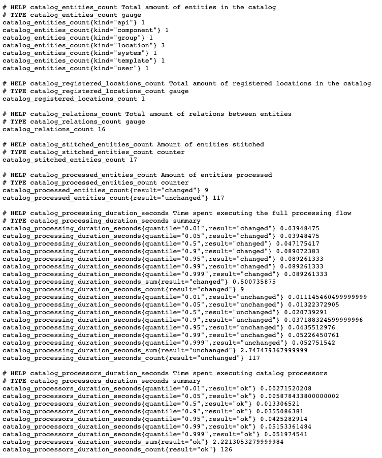

# Prometheus

## Overview

This is a small tutorial that goes over how to setup your Backstage instance to output metrics in a format that can be pulled in by Prometheus.

## How to Setup Prometheus Metrics

1. First we need to add the needed dependencies to the `package.json` in the `\packages\backend`:

   ```diff
   // packages/backend/package.json
       "dependencies": {
   +   "express-prom-bundle": "^6.3.6",
   +   "prom-client": "^14.0.1",
   ```

2. Now we want to run `yarn install` from the root of the project to get those dependencies in place
3. Then we need to add a handler for the metrics by creating a file called `metrics.ts` in the `\packages\backend\src` folder
4. Next we add the following content to the `metrics.ts` file:

   ```ts
   // packages/backend/src/metrics.ts
   import { useHotCleanup } from '@backstage/backend-common';
   import { RequestHandler } from 'express';
   import promBundle from 'express-prom-bundle';
   import prom from 'prom-client';
   import * as url from 'url';

   const rootRegEx = new RegExp('^/([^/]*)/.*');
   const apiRegEx = new RegExp('^/api/([^/]*)/.*');

   export function normalizePath(req: any): string {
     const path = url.parse(req.originalUrl || req.url).pathname || '/';

     // Capture /api/ and the plugin name
     if (apiRegEx.test(path)) {
       return path.replace(apiRegEx, '/api/$1');
     }

     // Only the first path segment at root level
     return path.replace(rootRegEx, '/$1');
   }

   /**
    * Adds a /metrics endpoint, register default runtime metrics and instrument the router.
    */
   export function metricsHandler(): RequestHandler {
     // We can only initialize the metrics once and have to clean them up between hot reloads
     useHotCleanup(module, () => prom.register.clear());

     return promBundle({
       includeMethod: true,
       includePath: true,
       // Using includePath alone is problematic, as it will include path labels with high
       // cardinality (e.g. path params). Instead we would have to template them. However, this
       // is difficult, as every backend plugin might use different routes. Instead we only take
       // the first directory of the path, to have at least an idea how each plugin performs:
       normalizePath,
       promClient: { collectDefaultMetrics: {} },
     });
   }
   ```

5. Now we will extend the router configuration with the `metricsHandler`:

   ```diff
   +import { metricsHandler } from './metrics';

   ...

       const service = createServiceBuilder(module)
       .loadConfig(config)
       .addRouter('', await healthcheck(healthcheckEnv))
   +   .addRouter('', metricsHandler())
       .addRouter('/api', apiRouter);
   ```

6. You now have everything setup, from the `\packages\backend` folder run `yarn start` this will start up the backend
7. Now in a browser load up `http://localhost:7007/metrics`, if everything went smoothly you should see metrics in your browser something like this:

   

## Metrics

The following sections goes over the included and experimental metrics available once you have completed this tutorial

## Included

This tutorials uses the [`express-prom-bundle`](https://github.com/jochen-schweizer/express-prom-bundle) and the [`prom-client`](https://github.com/siimon/prom-client) to make this all work. They both come with some built in metrics:

- `express-prom-bundle` comes with 2 metrics:
  - `up`: this normally will be just 1
  - `http_request_duration_seconds`: http latency histogram/summary labeled with `status_code`, `method` and `path`
- `prom-client` comes with a collection of metrics around memory, CPU, processes, etc. You can see the supported metrics in the `prom-client's` [`lib/metrics`](https://github.com/siimon/prom-client/tree/master/lib/metrics) folder.

### Experimental

There are some custom metrics that have been added to Backstage will be output for you, these are currently deemed experimental and may be changed or removed in a future release. Here is a rough list, again subject to changes:

- `catalog_entities_count`: Total amount of entities in the catalog
- `catalog_registered_locations_count`: Total amount of registered locations in the catalog
- `catalog_relations_count`: Total amount of relations between entities
- `catalog_stitched_entities_count`: Amount of entities stitched
- `catalog_processed_entities_count`: Amount of entities processed
- `catalog_processing_duration_seconds`: Time spent executing the full processing flow
- `catalog_processors_duration_seconds`: Time spent executing catalog processors
- `catalog_processing_queue_delay_seconds`: The amount of delay between being scheduled for processing, and the start of actually being processed
