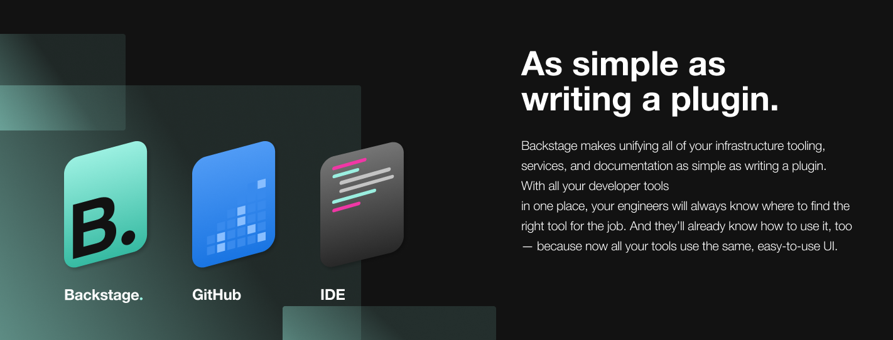

# [Backstage](https://backstage.io)

## What is Backstage?

[Backstage](https://backstage.io/) is an open platform for building developer
portals. It’s based on the developer portal we’ve been using internally at
Spotify for over four years. Backstage can be as simple as a services catalog or
as powerful as the UX layer for your entire tech infrastructure.

For more information go to [backstage.io](https://backstage.io) or join our
[Discord chatroom](https://discord.gg/EBHEGzX).

### Features

- Create and manage all of your organization’s software and microservices in one
  place.
- Services catalog keeps track of all software and its ownership.
- Visualizations provide information about your backend services and tooling,
  and help you monitor them.
- A unified method for managing microservices offers both visibility and
  control.
- Preset templates allow engineers to quickly create microservices in a
  standardized way
  ([coming soon](https://github.com/spotify/backstage/milestone/11)).
- Centralized, full-featured technical documentation with integrated tooling
  that makes it easy for developers to set up, publish, and maintain alongside
  their code ([coming soon](https://github.com/spotify/backstage/milestone/15)).

### Benefits

- For _engineering managers_, it allows you to maintain standards and best
  practices across the organization, and can help you manage your whole tech
  ecosystem, from migrations to test certification.
- For _end users_ (developers), it makes it fast and simple to build software
  components in a standardized way, and it provides a central place to manage
  all projects and documentation.
- For _platform engineers_, it enables extensibility and scalability by letting
  you easily integrate new tools and services (via plugins), as well as
  extending the functionality of existing ones.
- For _everyone_, it’s a single, consistent experience that ties all your
  infrastructure tooling, resources, standards, owners, contributors, and
  administrators together in one place.
