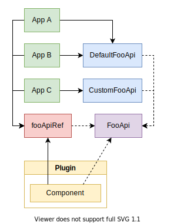

## Introduction

Backstage Plugins strive to be self-contained, with as much functionality as
possible residing within the plugin itself and its backend APIs. There will
however always be a need for plugins to communicate outside of its boundaries,
both with other plugins and the app itself.

Backstage provides two primary methods for plugins to communicate across their
boundaries in client-side code. The first one being the `createPlugin` API and
the registration hooks passed to the `register` method, and the second one being
Utility APIs. While the `createPlugin` API is focused on the initialization
plugins and the app, the Utility APIs provide ways for plugins to communicate
during their entire life cycle.

## Consuming APIs

Each Utility API is tied to an `ApiRef` instance, which is a global singleton
object without any additional state or functionality, its only purpose is to
reference Utility APIs. `ApiRef`s are created using `createApiRef`, which is
exported by `@backstage/core-plugin-api`. There are many
[predefined Utility APIs](../reference/utility-apis/README.md) defined in
`@backstage/core-plugin-api`, and they're all exported with a name of the
pattern `*ApiRef`, for example `errorApiRef`.

To access one of the Utility APIs inside a React component, use the `useApi`
hook exported by `@backstage/core-plugin-api`, or the `withApis` HOC if you
prefer class components. For example, the `ErrorApi` can be accessed like this:

```tsx
import React from 'react';
import { useApi, errorApiRef } from '@backstage/core-plugin-api';

export const MyComponent = () => {
  const errorApi = useApi(errorApiRef);

  // Signal to the app that something went wrong, and display the error to the user.
  const handleError = error => {
    errorApi.post(error);
  };

  // the rest of the component ...
};
```

Note that there is no explicit type given for `ErrorApi`. This is because the
`errorApiRef` has the type embedded, and `useApi` is able to infer the type.

Also note that consuming Utility APIs is not limited to plugins, it can be done
from any component inside Backstage, including the ones in
`@backstage/core-plugin-api`. The only requirement is that they are beneath the
`AppProvider` in the react tree.

## Supplying APIs

### API Factories

APIs are registered in the form of `ApiFactories`, which encapsulate the process
of instantiating an API. It is a collection of three things: the `ApiRef` of the
API to instantiate, a list of all required dependencies, and a factory function
that returns a new API instance.

For example, this is the default `ApiFactory` for the `ErrorApi`:

```ts
createApiFactory({
  api: errorApiRef,
  deps: { alertApi: alertApiRef },
  factory: ({ alertApi }) => {
    const errorApi = new ErrorAlerter(alertApi, new ErrorApiForwarder());
    UnhandledErrorForwarder.forward(errorApi, { hidden: false });
    return errorApi;
  },
});
```

In this example the `errorApiRef` is our API, which encapsulates the `ErrorApi`
type. The `alertApiRef` is our single dependency, which we give the name
`alertApi`, and is then passed on to the factory function, which returns an
implementation of the `ErrorApi`.

The `createApiFactory` function is a thin wrapper that enables TypeScript type
inference. You may notice that there are no type annotations in the above
example, and that is because we're able to infer all types from the `ApiRef`s.
TypeScript will make sure that the return value of the `factory` function
matches the type embedded in `api`'s `ApiRef`, in this case the `ErrorApi`. It
will also match the types between the `deps` and the parameters of the `factory`
function, again using the type embedded within the `ApiRef`s.

## Registering API Factories

The responsibility for adding Utility APIs to a Backstage app lies in three
different locations: the Backstage core library, each plugin included in the
app, and the app itself.

### Core APIs

Starting with the Backstage core library, it provides implementations for all of
the core APIs. The core APIs are the ones exported by
`@backstage/core-plugin-api`, such as the `errorApiRef` and `configApiRef`. You
can find a full list of them [here](../reference/utility-apis/README.md).

The core APIs are loaded for any app created with `createApp` from
`@backstage/core-plugin-api`, which means that there is no step that needs to be
taken to include these APIs in an app.

### Plugin APIs

In addition to the core APIs, plugins can define and export their own APIs.
While doing so they should usually also provide default implementations of their
own APIs, for example, the `catalog` plugin exports `catalogApiRef`, and also
supplies a default `ApiFactory` of that API using the `CatalogClient`. There is
one restriction to plugin-provided API Factories: plugins may not supply
factories for core APIs, trying to do so will cause the app to refuse to start.

Plugins supply their APIs through the `apis` option of `createPlugin`, for
example:

```ts
export const techdocsPlugin = createPlugin({
  id: 'techdocs',
  apis: [
    createApiFactory({
      api: techdocsStorageApiRef,
      deps: { configApi: configApiRef },
      factory({ configApi }) {
        return new TechDocsStorageApi({
          apiOrigin: configApi.getString('techdocs.storageUrl'),
        });
      },
    }),
  ],
});
```

### App APIs

Lastly, the app itself is the final point where APIs can be added, and what has
the final say in what APIs will be loaded at runtime. The app may override the
factories for any of the core or plugin APIs, with the exception of the config,
app theme, and identity APIs. These are static APIs that are tied into the
`createApp` implementation, and therefore not possible to override.

Overriding APIs is useful for apps that want to switch out behavior to tailor it
to their environment. In some cases plugins may also export multiple
implementations of the same API, where they each have their own different
requirements on for example backend storage and surrounding environment.

Supplying APIs to the app works just like for plugins:

```ts
const app = createApp({
  apis: [
    /* ApiFactories */
  ],
  // ... other options
});
```

A common pattern is to export a list of all APIs from `apis.ts`, next to
`App.tsx`. See the
[example app in this repo](https://github.com/backstage/backstage/blob/master/packages/app/src/apis.ts)
for an example.

## Custom implementations of Utility APIs

Defining a custom implementation of a utility API is easy, you simply need to
export a class that `implements` the target API, for example:

```ts
export class IgnoringErrorApi implements ErrorApi {
  post(error: Error, context?: ErrorContext) {
    // ignore error
  }
}
```

The `IgnoringErrorApi` would then be imported in the app, and wired up like
this:

```ts
const app = createApp({
  apis: [
    /* ApiFactories */
    createApiFactory(errorApiRef, new IgnoringErrorApi()),

    // OR
    // If your API has dependencies, you use the object form
    createApiFactory({
      api: errorApiRef,
      deps: { configApi: configApiRef },
      factory({ configApi }) {
        return new IgnoringErrorApi({
          reportingUrl: configApi.getString('error.reportingUrl'),
        });
      },
    }),
  ],
  // ... other options
});
```

Note that the above line will cause an error if `IgnoreErrorApi` does not fully
implement the `ErrorApi`, as it is checked by the type embedded in the
`errorApiRef` at compile time.

## Defining custom Utility APIs

Plugins are free to define their own Utility APIs. Simply define the TypeScript
interface for the API, and create an `ApiRef` using `createApiRef` exported from
`@backstage/core-plugin-api`. Also be sure to provide at least one
implementation of the API, and to declare a default factory for the API in
`createPlugin`.

Custom Utility APIs can be either public or private, which is up to the plugin
to choose. Private APIs do not expose an external API surface, and it's
therefore possible to make breaking changes to the API without affecting other
users of the plugin. If an API is made public however, it opens up for other
plugins to make use of the API, and it also makes it possible for users for your
plugin to override the API in the app. It is however important to maintain
backwards compatibility of public APIs, as you may otherwise break apps that are
using your plugin.

To make an API public, simply export the `ApiRef` of the API, and any associated
types. To make an API private, just avoid exporting the `ApiRef`, but still be
sure to supply a default factory to `createPlugin`.

Private APIs are useful for plugins that want to depend on other APIs outside of
React components, but not have to expose an entire API surface to maintain. When
using private APIs, it is fine to use the `typeof` of an implementing class as
the type parameter passed to `createApiRef`, while public APIs should always
define a separate TypeScript interface type.

Plugins may depend on APIs from other plugins, both in React components and as
dependencies to API factories. Do however be sure to not cause circular
dependencies between plugins.

## Architecture

The `ApiRef` instances mentioned above provide a point of indirection between
consumers and producers of Utility APIs. It allows for plugins and components to
depend on APIs in a type-safe way, without having a direct reference to a
concrete implementation of the APIs. The Apps are also given a lot of
flexibility in what implementations to provide. As long as they adhere to the
contract established by an `ApiRef`, they are free to choose any implementation
they want.

The figure below shows the relationship between
<span style="color: #82b366">different Apps</span>, that provide
<span style="color: #6c8ebf">different implementations</span> of the
<span style="color: #9673a6">FooApi</span>.
<span style="color: #d6b656">Components</span> within Plugins then access the
<span style="color: #9673a6">FooApi</span> via the
<span style="color: #b85450">fooApiRef</span>.

<div style="text-align:center">

</div>

The current method for connecting Utility API providers and consumers is via the
React tree using an `ApiProvider`, which is added to the `AppProvider` of the
`App`. In the future there may potentially be more ways to do this, in ways that
are not tied to React. A design goal of the Utility APIs was to not have them
directly tied to React.

The indirection provided by Utility APIs also makes it straightforward to test
components that depend on APIs, and to provide a standard common development
environment for plugins. A proper test wrapper with mocked API implementations
is not yet ready, but it will be provided as a part of `@backstage/test-utils`.
It will provide mocked variants of APIs, with additional methods for asserting a
component's interaction with the API.

The common development environment for plugins is included in
`@backstage/dev-utils`, where the exported `createDevApp` function creates an
application with implementations for all core APIs already present. Contrary to
the method for wiring up Utility API implementations in an app created with
`createApp`, `createDevApp` uses automatic dependency injection. This is to make
it possible to replace any API implementation, and having that be reflected in
dependents of that API.
