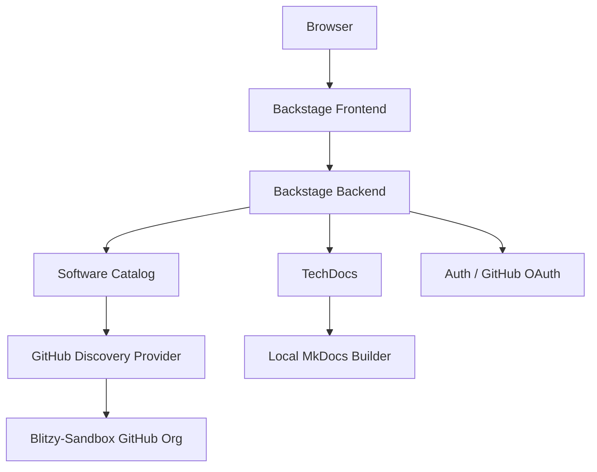

# Architecture

## Overview

The Blitzy Sandbox portal is built on [Backstage](https://backstage.io), an open-source developer portal framework originally created at Spotify. It follows a plugin-based architecture with a React frontend and Node.js backend.

## Key Components

### Frontend (`packages/app`)

The React single-page application serves the portal UI. It uses a custom theme based on shadcn/ui components, migrated from the original Material UI design system.

### Backend (`packages/backend`)

The Node.js backend handles:

- **Catalog processing** — Ingests entity definitions from GitHub repos
- **TechDocs generation** — Builds MkDocs sites on demand
- **Authentication** — GitHub OAuth and guest sign-in
- **Search indexing** — Indexes catalog entities and documentation

### GitHub Discovery

The portal automatically discovers repositories in the `Blitzy-Sandbox` GitHub organization matching the pattern `blitzy-.*`. Each discovered repo with a `catalog-info.yaml` is registered as a catalog entity.

### TechDocs

Documentation is built locally using MkDocs with the `techdocs-core` plugin. Any catalog entity with a `backstage.io/techdocs-ref` annotation and an `mkdocs.yml` file gets auto-generated documentation.

## Technology Stack

| Layer    | Technology                   |
| -------- | ---------------------------- |
| Frontend | React, TypeScript, shadcn/ui |
| Backend  | Node.js, Express             |
| Build    | Yarn 4, Webpack              |
| Docs     | MkDocs, techdocs-core        |
| Auth     | GitHub OAuth, Guest          |
| Database | SQLite (local)               |
