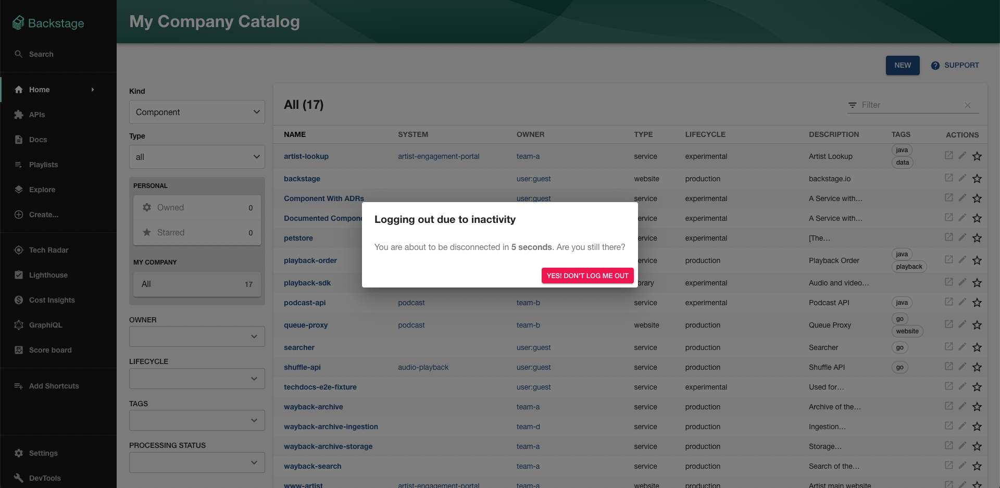

This section describes how to setup the Auto Logout mechanism in Backstage in case your organization needs it.

## Summary

The Auto Logout feature is an optional added security to Backstage, designed to automatically log out users after a preconfigured duration of inactivity. This capability helps to effectively mitigate the risks associated with unauthorized access through abandoned sessions, especially in shared device scenarios.

The Auto Logout mechanism actively tracks user activity such as mouse movements, clicks, key pressing, and taps. If the system detects no activity over a set time span (idle timeout), it invalidates the user session and redirects to the login page.
_Inactive users_ are the ones that don't perform any action on the Backstage app or that are logged in but no Backstage tab is open in the browser.

This feature is particularly beneficial if your application should comply with internal policies within your organization that may require automatic logout after a specific period of inactivity.

This is how it looks like:



## Quick start

To enable and configure Auto Logout, you will need to add the `<AutoLogout>` component to your Backstage's instance entry point, located at `App.tsx`.

Here's how to add it:

```tsx
import { AutoLogout } from '@backstage/core-components';

// ... App.tsx contents

export default app.createRoot(
  <>
    // ...
    <AutoLogout />
    <AppRouter>
      <Root>{routes}</Root>
    </AppRouter>
    // ...
  </>,
);
```

## Configuration

You can further adjust the Auto Logout settings by tweaking the available `<AutoLogout>` properties:

```tsx
<AutoLogout
  idleTimeoutMinutes={30}
  useWorkerTimers={false}
  logoutIfDisconnected={false}
/>
```

If you prefer to have different settings for each Backstage instance deployed at your infrastructure, you can instead leverage your `app-config` and place some configuration properties:

```yaml
auth:
  autologout:
    enabled: true
```

Bear in mind that, properties configured in `app-config` take precedence over the props passed to the `<AutoLogout/>` React component.
These are the available settings:

| Configuration Key                         | Component Property        | Description                                                                                                                                                                                                                                                            | Allowed Values   | Default Value               |
| ----------------------------------------- | ------------------------- | ---------------------------------------------------------------------------------------------------------------------------------------------------------------------------------------------------------------------------------------------------------------------- | ---------------- | --------------------------- |
| `auth.autologout.enabled`                 | `enabled`                 | Enable/disable the Auto Logout feature.                                                                                                                                                                                                                                | `true`/`false`   | Default is enabled (`true`) |
| `auth.autologout.idleTimeoutMinutes`      | `idleTimeoutMinutes`      | Sets the idle time (in minutes) after which the user will be logged out.                                                                                                                                                                                               | `>= 0.5` minutes | `60`                        |
| `auth.autologout.promptBeforeIdleSeconds` | `promptBeforeIdleSeconds` | Determines the time (in seconds) prior to idle state when a prompt will appear. A value of 0 disables the prompt. This must be less than the value of `idleTimeoutMinutes`.                                                                                            | `>= 0` seconds   | `10`                        |
| `auth.autologout.useWorkerTimers`         | `useWorkerTimers`         | Enables or disables the use of Node's worker thread timers instead of main thread timers. This can be beneficial if the browser is terminating timers in inactive tabs, like those used by auto logout. In case of browser incompatibility, try setting this to false. | `true`/`false`   | `true`                      |
| `auth.autologout.logoutIfDisconnected`    | `logoutIfDisconnected`    | Enable/disable auto logout for disconnected users. Disconnected users are those who are logged in but do not have any active Backstage tabs open in their browsers. If enabled, such users will be automatically logged out after `idleTimeoutMinutes`.                | `true`/`false`   | `true`                      |
