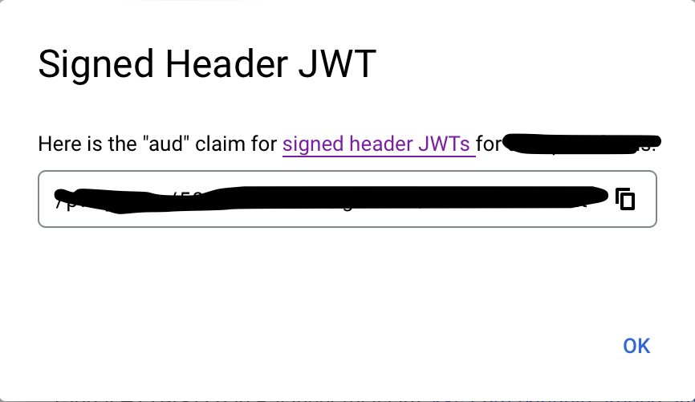

Backstage allows offloading the responsibility of authenticating users to the
Google HTTPS Load Balancer & [IAP](https://cloud.google.com/iap), leveraging the
authentication support on the latter.

This tutorial shows how to use authentication on an IAP sitting in front of
Backstage.

It is assumed an IAP is already serving traffic in front of a Backstage instance
configured to serve the frontend app from the backend.

## Configuration

Let's start by adding the following `auth` configuration in your
`app-config.yaml` or `app-config.production.yaml` or similar:

```yaml
auth:
  providers:
    gcpIap:
      audience: '/projects/<project number>/global/backendServices/<backend service id>'
      jwtHeader: x-custom-header # Optional: Only if you are using a custom header for the IAP JWT
      signIn:
        resolvers:
          # See https://backstage.io/docs/auth/google/gcp-iap-auth#resolvers for more resolvers
          - resolver: emailMatchingUserEntityAnnotation
```

The full `audience` value can be obtained by visiting your [Identity-Aware Proxy Google Cloud console](https://console.cloud.google.com/security/iap), selecting your project, finding your Backend Service to proxy, clicking the 3 vertical dots then "Get JWT Audience Code", and copying from the resulting popup, which will look similar to the following:



This config section must be in place for the provider to load at all. Now let's
add the provider itself.

### Resolvers

This provider includes several resolvers out of the box that you can use:

- `emailMatchingUserEntityProfileEmail`: Matches the email address from the auth provider with the User entity that has a matching `spec.profile.email`. If no match is found it will throw a `NotFoundError`.
- `emailLocalPartMatchingUserEntityName`: Matches the [local part](https://en.wikipedia.org/wiki/Email_address#Local-part) of the email address from the auth provider with the User entity that has a matching `name`. If no match is found it will throw a `NotFoundError`.
- `emailMatchingUserEntityAnnotation`: Matches the email address from the auth provider with the User entity where the value of the `google.com/email` annotation matches. If no match is found it will throw a `NotFoundError`.

:::note Note

The resolvers will be tried in order, but will only be skipped if they throw a `NotFoundError`.

:::

If these resolvers do not fit your needs you can build a custom resolver, this is covered in the [Building Custom Resolvers](../identity-resolver.md#building-custom-resolvers) section of the Sign-in Identities and Resolvers documentation.

## Backend Installation

To add the provider to the backend we will first need to install the package by running this command:

```bash title="from your Backstage root directory"
yarn --cwd packages/backend add @backstage/plugin-auth-backend-module-gcp-iap-provider
```

Then we will need to add this line:

```ts title="in packages/backend/src/index.ts"
backend.add(import('@backstage/plugin-auth-backend'));
/* highlight-add-start */
backend.add(import('@backstage/plugin-auth-backend-module-gcp-iap-provider'));
/* highlight-add-end */
```

## Adding the provider to the Backstage frontend

See [Sign-In with Proxy Providers](../index.md#sign-in-with-proxy-providers) for pointers on how to set up the sign-in page, and to also make it work smoothly for local development. You'll use `gcpIap` as the provider name.

If you [provide a custom sign in resolver](https://backstage.io/docs/auth/identity-resolver#building-custom-resolvers), you can skip the `signIn` block entirely.
