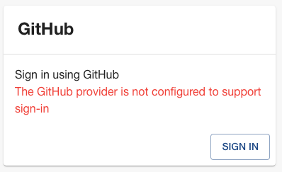
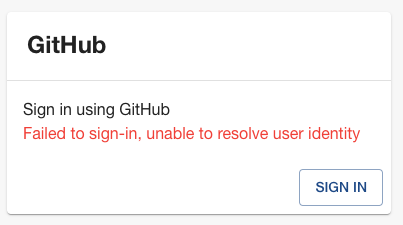

:::info
This documentation is written for [the new backend system](../backend-system/index.md) which is the default since Backstage
[version 1.24](../releases/v1.24.0.md). If you are still on the old backend
system, you may want to read [its own article](./identity-resolver--old.md)
instead, and [consider migrating](../backend-system/building-backends/08-migrating.md)!
:::

By default, every Backstage auth provider is configured only for the use-case of
access delegation. This enables Backstage to request resources and actions from
external systems on behalf of the user, for example re-triggering a build in CI.

If you want to use an auth provider to sign in users, you need to explicitly
configure it have sign-in enabled and also tell it how the external identities
should be mapped to user identities within Backstage. You do this by either
choosing a built-in sign in resolver, or supplying your own. Both methods are
listed below.

## Quick Start

Backstage projects created with `npx @backstage/create-app` come configured with
a [guest auth provider](https://backstage.io/docs/auth/guest/provider). This
provider makes all users share a single "guest" identity. This is useful for
testing purposes and quickly getting started locally, but is not safe for use in
production and that particular provider will refuse to work there.

Because of this, one of the early things you want to do when standing up your
Backstage instance is to choose a production ready auth provider. See [the auth overview page](./index.md) for a full list of providers and how to install and
configure them.

## Backstage User Identity

A user identity within Backstage is built up from two main pieces of
information: a user [entity reference](../features/software-catalog/references.md), and a set of ownership
references. When a user signs in, a Backstage token is generated which is then
used to identify the user within the Backstage ecosystem.

The user entity reference should uniquely identify the logged in user in Backstage.
It is encouraged that a matching user entity also exists within the Software Catalog,
but it is not required. If the user entity exists in the catalog it can be used to
store additional data about the user. There may even be some plugins that require
this for them to be able to function.

The ownership references are also entity references, and it is likewise
encouraged that these entities exist within the catalog, but it is not a requirement.
The ownership references are used to determine what the user owns, as a set
of references that the user claims ownership though. For example, a user
Jane (`user:default/jane`) might have the ownership references `user:default/jane`,
`group:default/team-a`, and `group:default/admins`. Given these ownership claims,
any entity that is marked as owned by either of `user:jane`, `team-a`, or `admins` would
be considered owned by Jane.

The ownership claims often contain the user entity reference itself, but it is not
required. It is also worth noting that the ownership claims can also be used to
resolve other relations similar to ownership, such as a claim for a `maintainer` or
`operator` status.

The Backstage token that encapsulates the user identity is a JWT. The user
entity reference is stored in the `sub` claim of the payload, while the
ownership references are stored in a custom `ent` claim in the old backend
system but instead is made available through a user info API endpoint on the
auth backend in the new system. Both the user and ownership references should
always be full entity references, as opposed to shorthands like just `jane` or
`user:jane`.

## Sign-in Resolvers

:::warning
Be careful when configuring Sign-in resolvers, as they are part of determining who
has access to your Backstage instance, and with what identity. Always only configure
**a single sign-in resolver for one of your auth providers**. The only reason to have
more sign-in resolvers is if you want to allow your users to sign in to Backstage in
multiple ways, but it increases the risk of account hijacking.
:::

Signing in a user into Backstage requires a mapping of the user identity from the
third-party auth provider to a Backstage user identity. This mapping can vary quite
a lot between different organizations and auth providers, and because of that there's
no default way to resolve user identities. The auth provider that one wants to use
for sign-in must instead be configured with a sign-in resolver, which is a function
that is responsible for creating this user identity mapping.

The input to the sign-in resolver function is the result of a successful log in with
the given auth provider, as well as a context object that contains various helpers
for looking up users and issuing tokens. There are also a number of built-in sign-in
resolvers that can be used, which are covered a bit further down.

Note that while it possible to configure multiple auth providers to be used for
sign-in, you should take care when doing so. It is best to make sure that the
different auth providers either do not have any user overlap, or that any users
that are able to log in with multiple providers always end up with the same
Backstage identity. For most organizations, it makes the most sense to provide
only one sign-in method.

### Using Builtin Resolvers

Most auth providers come with a set of builtin sign in providers that you can
choose from. They target the most common use cases, and if they fit your needs,
you can pick one or more of them without having to write any code at all. You
still have to make a choice - as mentioned above, even if there are a set of
builtins, none of them are selected by default.

You set up builtin sign in resolvers using [your app-config](../conf/index.md),
next to the respective provider's configuration. Here's an example for GitHub:

```yaml title="in e.g. app-config.yaml"
auth:
  environment: development
  providers:
    github:
      development:
        clientId: ${AUTH_GITHUB_CLIENT_ID}
        clientSecret: ${AUTH_GITHUB_CLIENT_SECRET}
        enterpriseInstanceUrl: ${AUTH_GITHUB_ENTERPRISE_INSTANCE_URL}
        signIn:
          resolvers:
            - resolver: usernameMatchingUserEntityName
```

The list of available resolvers is different for each provider, since they often
depend on the information model returned from the upstream provider service.
Consult the documentation of the respective provider to find the list.

In the example above, the `usernameMatchingUserEntityName` is specific to the
GitHub provider, but you could also choose to use the
`emailMatchingUserEntityProfileEmail` or `emailLocalPartMatchingUserEntityName`
resolvers, which are common to all auth providers.

:::warning
When using the `emailLocalPartMatchingUserEntityName` resolver it is strongly
recommended to set the `allowedDomains` option to ensure that only authorized users
are able to sign-in.
:::

If you are using the `emailLocalPartMatchingUserEntityName` resolver, it is
recommended to also set the `allowedDomains` option, for example:

```yaml title="Within the provider configuration"
auth:
  providers:
    github:
      development:
        ...
        signIn:
          resolvers:
            - resolver: emailLocalPartMatchingUserEntityName
              allowedDomains:
                - acme.org
```

### Building Custom Resolvers

If the builtins don't work for you, you can also provide a completely custom
sign-in resolver, through code. If you follow the installation instructions of
[one of the available providers](./index.md), you will likely have added a
dependency to your backend along with a line of code and some configuration.

Using GitHub as an example, this is the relevant parts of the backend code:

```ts title="in packages/backend/src/index.ts"
backend.add(import('@backstage/plugin-auth-backend'));
backend.add(import('@backstage/plugin-auth-backend-module-github-provider'));
```

When you want to supply a custom sign-in resolver, as a general pattern you
remove that last import and instead construct your own provider using the
facilities from the same package.

Make sure that your `auth` config in your `app-config.yaml` does not contain
any `resolvers` field - otherwise, they take priority.

```yaml title="in e.g. app-config.yaml"
auth:
  environment: development
  providers:
    github:
      development:
        clientId: ${AUTH_GITHUB_CLIENT_ID}
        clientSecret: ${AUTH_GITHUB_CLIENT_SECRET}
        enterpriseInstanceUrl: ${AUTH_GITHUB_ENTERPRISE_INSTANCE_URL}
/* highlight-remove-start */
        signIn:
          resolvers:
            - resolver: usernameMatchingUserEntityName
/* highlight-remove-end */
```

```ts title="in packages/backend/src/index.ts"
/* highlight-add-start */
import { createBackendModule } from '@backstage/backend-plugin-api';
import { githubAuthenticator } from '@backstage/plugin-auth-backend-module-github-provider';
import {
  authProvidersExtensionPoint,
  createOAuthProviderFactory,
} from '@backstage/plugin-auth-node';

const customAuth = createBackendModule({
  // This ID must be exactly "auth" because that's the plugin it targets
  pluginId: 'auth',
  // This ID must be unique, but can be anything
  moduleId: 'custom-auth-provider',
  register(reg) {
    reg.registerInit({
      deps: { providers: authProvidersExtensionPoint },
      async init({ providers }) {
        providers.registerProvider({
          // This ID must match the actual provider config, e.g. addressing
          // auth.providers.github means that this must be "github".
          providerId: 'github',
          // Use createProxyAuthProviderFactory instead if it's one of the proxy
          // based providers rather than an OAuth based one
          factory: createOAuthProviderFactory({
            authenticator: githubAuthenticator,
            async signInResolver(info, ctx) {
              /*********************************************************************
               * Custom resolver code goes here, see farther down in this article! *
               * "info" is the sign in result from the upstream (github here), and *
               * "ctx" contains useful utilities for token issuance etc.           *
               *********************************************************************/
            },
          }),
        });
      },
    });
  },
});
/* highlight-add-end */

backend.add(import('@backstage/plugin-auth-backend'));
/* highlight-remove-next-line */
backend.add(import('@backstage/plugin-auth-backend-module-github-provider'));
/* highlight-add-next-line */
backend.add(customAuth);
```

Check out [the naming patterns article](../backend-system/architecture/08-naming-patterns.md) for what rules
apply regarding how to form valid IDs. In this example we also put the module
declaration directly in `packages/backend/src/index.ts` but that's just for
simplicity. You can place it anywhere you like, including in other packages, and
import from there if you prefer.

The `createOAuthProviderFactory` / `createProxyAuthProviderFactory` functions
have additional options for profile and state transforms - not covered here, but
good to know about if you need them.

So what would the body of a typical sign in resolver callback look like? Here's
an example:

```ts
// ...
async signInResolver(info, ctx) {
  const { profile: { email } } = info;

  // Profiles are not always guaranteed to have an email address.
  // You can also find more provider-specific information in `info.result`.
  // It typically contains a `fullProfile` object as well as ID and/or access
  // tokens that you can use for additional lookups.
  if (!email) {
    throw new Error('User profile contained no email');
  }

  // You can add your own custom validation logic here.
  // Logins can be prevented by throwing an error like the one above.
  myEmailValidator(email);

  // This example resolver simply uses the local part of the email as the name.
  const [name] = email.split('@');

  // This helper function handles sign-in by looking up a user in the catalog.
  // The lookup can be done either by reference, annotations, or custom filters.
  //
  // The helper also issues a token for the user, using the standard group
  // membership logic to determine the ownership references of the user.
  //
  // There are a number of other methods on the ctx, feel free to explore them!
  return ctx.signInWithCatalogUser({
    entityRef: { name },
  });
}
```

If you throw an error in the sign in resolver function, the sign in attempt is
immediately rejected, and the error details are presented in the user interface.

The `ctx` context [has several useful functions](https://backstage.io/docs/reference/plugin-auth-node.authresolvercontext/)
for issuing tokens in various ways.

### Custom Ownership Resolution

If you want to have more control over the membership resolution and token generation
that happens during sign-in you can replace `ctx.signInWithCatalogUser` with a set
of lower-level calls:

```ts
// File: packages/backend/src/plugins/auth.ts

// ...
async signInResolver({ profile: { email } }, ctx) {
  if (!email) {
    throw new Error('User profile contained no email');
  }

  // This step calls the catalog to look up a user entity. You could for example
  // replace it with a call to a different external system.
  const { entity } = await ctx.findCatalogUser({
    annotations: {
      'acme.org/email': email,
    },
  });

  // In this step we extract the ownership references from the user entity using
  // the standard logic. It uses a reference to the entity itself, as well as the
  // target of each `memberOf` relation where the target is of the kind `Group`.
  //
  // If you replace the catalog lookup with something that does not return
  // an entity you will need to replace this step as well.
  //
  // You might also replace it if you for example want to filter out certain groups.
  //
  // Note that `ctx.resolveOwnershipEntityRefs(...)` by default only includes groups
  // to which the user has a direct MEMBER_OF relationship.
  // It's perfectly fine to include groups that the user is transitively part of
  // in the claims array, but the catalog doesn't currently provide a direct
  // way of accessing this list of groups.
  const { ownershipEntityRefs } = await ctx.resolveOwnershipEntityRefs(entity);

  // The last step is to issue the token, where we might provide more options in the
  // future.
  return ctx.issueToken({
    claims: {
      sub: stringifyEntityRef(entity),
      ent: ownershipEntityRefs,
    },
  });
}
```

### Sign-In without Users in the Catalog

:::warning
Signing in users without verifying that they exist in the catalog can be
dangerous. Take care to ensure that your custom resolvers only allow expected
users to sign in, for example by checking email domains.
:::

While populating the catalog with organizational data unlocks more powerful ways
to browse your software ecosystem, it might not always be a viable or prioritized
option. However, even if you do not have user entities populated in your catalog, you
can still sign in users. As there are currently no built-in sign-in resolvers for
this scenario you will need to implement your own.

Signing in a user that doesn't exist in the catalog is as simple as skipping the
catalog lookup step from the above example. Rather than looking up the user, we
instead immediately issue a token using whatever information is available. One caveat
is that it can be tricky to determine the ownership references, although it can
be achieved for example through a lookup to an external service. You typically
want to at least use the user itself as a lone ownership reference.

Because we no longer use the catalog as an allow-list of users, it is often important
that you limit what users are allowed to sign in. This could be a simple email domain
check like in the example below, or you might for example look up the GitHub organizations
that the user belongs to using the user access token in the provided result object.

```ts
import { stringifyEntityRef, DEFAULT_NAMESPACE } from '@backstage/catalog-model';

// ...
async signInResolver({ profile }, ctx) {
  if (!profile.email) {
    throw new Error(
      'Login failed, user profile does not contain an email',
    );
  }
  // Split the email into the local part and the domain.
  const [localPart, domain] = profile.email.split('@');

  // Next we verify the email domain. It is recommended to include this
  // kind of check if you don't look up the user in an external service.
  if (domain !== 'acme.org') {
    throw new Error(
      `Login failed, '${profile.email}' does not belong to the expected domain`,
    );
  }

  // By using `stringifyEntityRef` we ensure that the reference is formatted correctly
  const userEntity = stringifyEntityRef({
    kind: 'User',
    name: localPart,
    namespace: DEFAULT_NAMESPACE,
  });
  return ctx.issueToken({
    claims: {
      sub: userEntity,
      ent: [userEntity],
    },
  });
}
```

## Profile Transforms

Similar to a custom sign-in resolver, you can also write a custom profile transform
function which is used to verify and convert the auth response into the profile
that will be presented to the user. This is where you can customize things like
display name and profile picture.

This is also the place where you can do authorization and validation of the user
and throw errors if the user should not be allowed access in Backstage.

```ts
const customAuth = createBackendModule({
  // This ID must be exactly "auth" because that's the plugin it targets
  pluginId: 'auth',
  // This ID must be unique, but can be anything
  moduleId: 'custom-auth-provider',
  register(reg) {
    reg.registerInit({
      deps: { providers: authProvidersExtensionPoint },
      async init({ providers }) {
        providers.registerProvider({
          // This ID must match the actual provider config, e.g. addressing
          // auth.providers.github means that this must be "github".
          providerId: 'github',
          // Use createProxyAuthProviderFactory instead if it's one of the proxy
          // based providers rather than an OAuth based one
          factory: createOAuthProviderFactory({
            authenticator: githubAuthenticator,
            async profileTransform(result, ctx) {
              /**********************************************************************
               * Custom transform code goes here!                                   *
               * "info" is the sign in result from the upstream (github here), and  *
               * "ctx" contains useful utilities.                                   *
               **********************************************************************/
              return {
                profile: {
                  email,
                  picture,
                  displayName,
                },
              };
            },
          }),
        });
      },
    });
  },
});
```

Remember to `backend.add` the created module just like above.

## Common Sign-In Resolver Errors

There are two common Sign-In Resolver errors you might run into.

First is: "The 'Auth Provider Name' provider is not configured to support sign-in". Here is what this looks like for the GitHub Auth provider:



This error can be caused by the following:

- The `signIn.resolvers` have not be added to your Auth Provider configuration. Adding this will resolve the error.
- There is a syntax error in your Auth Provider configuration. Running `yarn backstage-cli config:check --strict` will help identify the syntax error.

The second common error is: "Failed to sign-in, unable to resolve user identity". Here is what this looks like for the GitHub Auth provider:



This error is caused by the Sign-In Resolver you configured being unable to find a matching User in the Catalog. To fix this you need to import User, and Group, data from some source of truth for this data at your Organization. To do this you can use one of the existing Org Data providers like the ones for [Entra ID (Azure AD/MS Graph)](../integrations/azure/org.md), [GitHub](../integrations/github/org.md), [GitLab](../integrations/gitlab/org.md), etc. or if none of those fit your needs you can create a [Custom Entity Provider](../features/software-catalog/external-integrations.md#custom-entity-providers).
