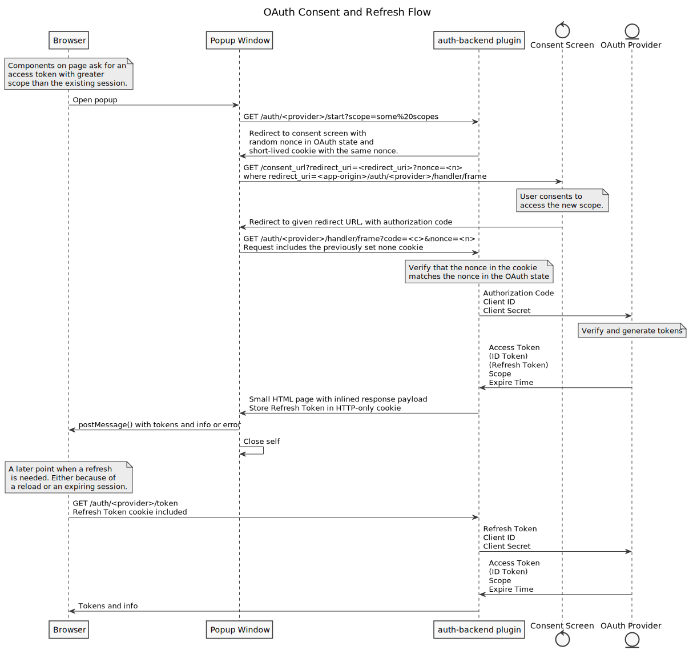

This section describes how Backstage allows plugins to request OAuth Access
Tokens and OpenID Connect ID Tokens on behalf of the user, to be used for auth
to various third party APIs.

## Summary

There are occasions when the user wants to perform actions towards third party
services that require authorization via OAuth. Backstage provides standardized
[Utility APIs](../api/utility-apis.md) such as the
[GoogleAuthApi](https://github.com/backstage/backstage/blob/master/packages/core-plugin-api/src/apis/definitions/auth.ts)
for that use-case. Backstage also includes a set of implementations of these
APIs that integrate with the
[auth-backend](https://github.com/backstage/backstage/tree/master/plugins/auth-backend)
plugin to provide a popup-based OAuth flow.

## Background

Access control in OAuth is implemented in terms of scope, which is a list of
permissions given to the app. An OAuth service can issue Access Tokens that are
tied to a certain set of scopes, such as viewing profile information, reading
and/or writing user data in the service. The scope format and handling is
specific to each OAuth provider, and the set of available scopes are typically
found in the documentation describing the auth solution of the provider, for
example
[developers.google.com/identity/protocols/oauth2/scopes](https://developers.google.com/identity/protocols/oauth2/scopes).

As a part of logging in with an OAuth provider, the user needs to consent to
both the login itself and the set of scopes that the app is requesting to use.
This is done by loading a page provided by the OAuth provider, where a user can
choose an account to log in with, and accept or reject the request. If the user
accepts the login request, a token is issued, and any holder of the token can
use it to make authenticated requests towards the third party service.

## OAuth in @backstage/core-app-api and auth-backend

The default OAuth implementation in Backstage is based on an OAuth server-side
offline access flow, which means that it uses the backend as a helper in order
to trade credentials. A benefit of this type of flow is that it does not require
the use of third party cookies, and is robust on a wide selection of browsers
and privacy browsing plugins, strict security settings, etc.

The implementation also uses a popup-based flow, where auth requests are handled
in a new popup window that is opened by the app. By using a popup-based flow it
is possible to request authentication at any point in the app, without requiring
a redirect. Because of this there is no need to ask for all scopes upfront, or
interrupt the app with a redirect and forcing plugin authors to take care in
restoring state after a redirect has been made. All in all it makes it much
easier to make authenticated requests inside a plugin.

## OAuth Flow

The following describes the OAuth flow implemented by the
[auth-backend](https://github.com/backstage/backstage/tree/master/plugins/auth-backend)
and
[DefaultAuthConnector](https://github.com/backstage/backstage/blob/master/packages/core-app-api/src/lib/AuthConnector/DefaultAuthConnector.ts)
in `@backstage/core-app-api`.

Component and APIs can request Access or ID Tokens from any available Auth
provider. If there already exists a cached fresh token that covers (at least)
the requested scopes, it will be returned immediately. If the OAuth provider
implements token refreshes, this check will also trigger a token refresh attempt
if no session is available.

If new scopes are requested, or the user is not yet logged in with that
provider, a dialog is shown informing the user that they need to log in with the
specified provider. If the user agrees to continue, a separate popup window is
opened that implements the entire consent flow.

The popup window is pointed to the `/start` endpoint of the auth provider in the
`auth-backend` plugin, which then redirects to the OAuth consent screen of the
provider. The consent screen is controlled by the OAuth provider, and will do
things like prompting the user to log in with an account, and possibly reviewing
the set of requested scopes. If the login request is accepted, the popup window
will be redirected back to the `/handler/frame` endpoint of the auth backend.
The redirect URL will contain a short-term authorization code, which is picked
up by the backend and exchanged for long-term tokens via a call to the OAuth
provider. The Access and possibly ID Token is then handed back to the main
Backstage page via `postMessage`. If the OAuth provider implements offline
refresh, a refresh token will be stored in an HTTP-only cookie scoped to the
specific provider in the `auth-backend` plugin.

To protect against certain attacks, the above flow also includes a simple nonce
check and a lightweight CSRF protection header. The nonce check is done to
protect against attacks where an attacker tricks a user to log in with an
account of the attacker's choosing in order to gather data. In the first part of
the flow where the popup is directed to the `/start` endpoint, a nonce is
generated and placed in both a cookie and the OAuth state. The nonces received
in the cookie and OAuth state in the redirect handler are then checked, and the
auth attempt will fail if they're not valid. The CSRF protection for the
`/refresh` and `/logout` endpoints is implemented by simply checking for the
presence of a `X-Requested-With` header.

The target origin of the `postMessage` is also of importance to keep the flow
secure. It is configured to a single value for each auth provider and
environment. Without a single configured origin, any page could open a popup and
request an access token.

### Sequence Diagram

The following diagram visualizes the flow described in the previous section.

<!--
@startuml /../assets/auth/oauth-popup-flow

skinparam monochrome true
skinparam shadowing false
skinparam backgroundColor #fefefe
skinparam defaultFontName Segoe UI, Helvetica, Arial, sans-serif

title OAuth Consent and Refresh Flow

participant Browser
participant "Popup Window" as Popup
participant "auth-backend plugin" as Backend
control "Consent Screen" as Consent
entity "OAuth Provider" as Provider

note over Browser: Components on page ask for an\naccess token with greater\nscope than the existing session.

Browser -> Popup: Open popup
Popup -> Backend: GET /auth/<provider>/start?scope=some%20scopes
Popup <- Backend: Redirect to consent screen with\nrandom nonce in OAuth state and\nshort-lived cookie with the same nonce.
Popup -> Consent: GET /consent_url?redirect_uri=<redirect_uri>?nonce=<n>\nwhere redirect_uri=<app-origin>/auth/<provider>/handler/frame

note over Consent: User consents to\naccess the new scope.

Popup <- Consent: Redirect to given redirect URL, with authorization code
Popup -> Backend: GET /auth/<provider>/handler/frame?code=<c>&nonce=<n>\nRequest includes the previously set none cookie

note over Backend: Verify that the nonce in the cookie\nmatches the nonce in the OAuth state

Backend -> Provider: Authorization Code\nClient ID\nClient Secret

note over Provider: Verify and generate tokens

Backend <- Provider: Access Token\n(ID Token)\n(Refresh Token)\nScope\nExpire Time
Popup <- Backend: Small HTML page with inlined response payload\nStore Refresh Token in HTTP-only cookie
Browser <- Popup: postMessage() with tokens and info or error
Popup -> Popup: Close self

note over Browser: A later point when a refresh\n is needed. Either because of\n a reload or an expiring session.

Browser -> Backend: GET /auth/<provider>/token\nRefresh Token cookie included
Backend -> Provider: Refresh Token\nClient ID\nClient Secret
Backend <- Provider: Access Token\n(ID Token)\nScope\nExpire Time
Browser <- Backend: Tokens and info

@enduml
-->
