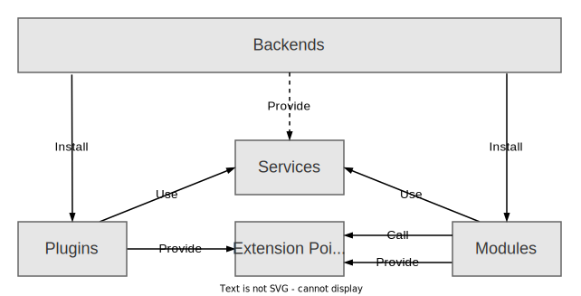

## Building Blocks

This section introduces the high-level building blocks upon which this new
system is built. These are all concepts that exist in our current system in one
way or another, but they have all been lifted up to be first class concerns in
the new system. Regardless of whether you are setting up your own backstage
instance, developing plugins, or extending plugins with new features, it is
important to understand these concepts.

The diagram below provides an overview of the different building blocks, and the other blocks that each of them interact with.

:::note Note

These are all concepts that existed in our old backend system in one way or another, but they have now all been lifted up to be first class concerns.

:::

### Backend

This is the backend instance itself, which you can think of as the unit of deployment. It does not have any functionality in and of itself, but is simply responsible for wiring things together.

It is up to you to decide how many different backends you want to deploy. You can have all features in a single one, or split things out into multiple smaller deployments. All depending on your need to scale and isolate individual features.

### Plugins

Plugins provide the actual features, just like in our existing system. They operate completely independently of each other. If plugins want to communicate with each other, they must do so over the wire. There can be no direct communication between plugins through code. Because of this constraint, each plugin can be considered to be its own microservice.

### Services

Services provide utilities to help make it simpler to implement plugins, so that each plugin doesn't need to implement everything from scratch. There are both many built-in services, like the ones for logging, database access, and reading configuration, but you can also import third-party services, or create your own.

Services are also a customization point for individual backend installations. You can override services with your own implementations, as well as make smaller customizations to existing services.

### Extension Points

Many plugins have ways in which you can extend them, for example entity providers for the Catalog, or custom actions for the Scaffolder. These extension patterns are now encoded into Extension Points.

Extension Points look a little bit like services, since you depended on them just like you would a service. A key difference is that extension points are registered and provided by plugins or modules themselves, based on what customizations each of them want to expose.

Extension Points are exported separately from the plugin or module instance itself, and it is possible to expose multiple different extension points at once. This makes it easier to evolve and deprecate individual Extension Points over time, rather than dealing with a single large API surface.

### Modules

Modules use Extension Points to add new features to other plugins or modules. They might for example add an individual Catalog Entity Provider, or one or more Scaffolder Actions.

Each module may only use Extension Points that belong to a single plugin, and the module must be deployed together with that plugin in the same backend instance. Modules may only communicate with their plugin or other modules through the registered extension points.

Just like plugins, modules also have access to services and can depend on their own service implementations. They will however share services with the plugin that they extend - there are no module-specific service implementations.

## Package structure

A detailed explanation of the package architecture can be found in the
[Backstage Architecture Overview](../../overview/architecture-overview.md#package-architecture). The
most important packages to consider for this system are the following:

- `plugin-<pluginId>-backend` houses the implementation of the backend plugins
  themselves.
- `plugin-<pluginId>-node` houses the backend plugin's extension points and any other utilities
  that modules or other plugins might need.
- `plugin-<pluginId>-backend-module-<moduleId>` houses the modules that extend
  the plugin via its extension points.
- `backend` is the backend itself that wires everything together to something
  that you can deploy.
