:::note Note

If you have an existing backend that is not yet using the new backend
system, see [migrating](./08-migrating.md).

:::

This section covers how to set up and customize your own Backstage backend. It covers some aspects of how backend instances fit into the larger system, but for a more in-depth explanation of the role of backends in the backend system, see [the architecture section](../architecture/02-backends.md).

# Overview

A minimal Backstage backend is very lightweight. It is a single package with a `package.json` file and a `src/index.ts` file, not counting surrounding tooling and documentation. The package is typically placed within the `packages/backend` folder of a Backstage monorepo, but that is up to you. The backend package is part of any project created with `@backstage/create-app`, so you typically do not need to create it yourself.

When you create a new project with `@backstage/create-app`, you'll get a backend package with a `src/index.ts` that looks something like this:

```ts
import { createBackend } from '@backstage/backend-defaults'; // Omitted in the examples below

const backend = createBackend();

backend.add(import('@backstage/plugin-app-backend'));
backend.add(import('@backstage/plugin-catalog-backend'));
backend.add(import('@backstage/plugin-scaffolder-backend'));
backend.add(
  import('@backstage/plugin-catalog-backend-module-scaffolder-entity-model'),
);

backend.start();
```

There will be a couple more plugins and modules in the initial setup, but the overall layout is the same.

What we're doing in this file is creating a new backend using `createBackend`, and then installing a collection of different plugins, modules, and services that we want to be part of that backend. Plugins are standalone features, modules augment existing plugins or modules, while services can be used to override behavior for deeper customizations. Each module can only target a single plugin, and that plugin must also be present in the same backend. Finally, we start up the backend by calling the `start` method.

## Customization

Apart from installing existing plugins and modules in the backend, there are a couple of different ways in which you can customize your backend installation.

### Configuration

Perhaps the most accessible way is through static configuration, which you can read more about in the documentation for how to [write configuration](../../conf/writing.md). Many different aspects of the backend can be configured, including both the behavior of the backend itself, as well as many plugins or modules. You'll need to refer to the documentation of each plugin or module to see what configuration is available. Also be sure to check out the documentation of the [core services](../core-services/01-index.md), as that also covers how to configure those.

### Services

Speaking of services, they are another important point of customization. Services allow you to make deeper and broader customizations of the backend. They are similar to [Utility APIs](../../api/utility-apis.md) in the frontend system, using dependency injection to make common functionality available to plugins and modules. You can read more about services in the [architecture section](../architecture/03-services.md).

There is a core set of services that must be installed in all backends, for things like logging, database access, serving HTTP, and so on. Luckily, all of these services are installed by default when you use `createBackend` from the `@backstage/backend-defaults` package, which is what you have in a standard setup.

All of these services can be replaced with your own implementations if you need to customize them. The simplest way to do this is to use the existing service implementations but with additional options. Many of the core services can be customized this way, but not all, as they don't all have meaningful options.

For example, let's say we want to customize the core configuration service to enable remote configuration loading. That would look something like this:

```ts
import { rootConfigServiceFactory } from '@backstage/backend-app-api';

const backend = createBackend();

backend.add(
  rootConfigServiceFactory({
    remote: { reloadIntervalSeconds: 60 },
  }),
);
```

This will make it possible to pass URLs as configuration targets, and those URLs will be polled every 60 seconds for changes.

There is one exception to the above, which is the built-in `PluginMetadataService` that is provided by the framework and is not possible to override.

### Custom Service Implementations

When overriding services you are not limited to the existing implementations, you can also provide your own custom service factories. This will let you globally override services with completely custom implementations, or build on existing implementations to add additional logic.

To override a service, you provide it in the `services` option just like above, but this time we need to use `createServiceFactory` to create our factory. For example, if you want to replace the default `LoggerService` with your own, it might look like this:

```ts
const backend = createBackend();

backend.add(
  createServiceFactory({
    service: coreServices.logger,
    deps: {
      rootLogger: coreServices.rootLogger,
      plugin: coreServices.pluginMetadata,
      config: coreServices.rootConfig,
    },
    factory({ rootLogger, plugin, config }) {
      const labels = readCustomLogLabelsForPlugin(config, plugin); // custom logic
      return rootLogger.child(labels);
    },
  }),
);
```

The `LoggerService` is responsible for creating a specialized logger instance for each plugin, while the `RootLoggerService` is the actual logging implementation. The default implementation of `LoggerService` will decorate the logger with a `plugin` label that contains the plugin ID. Here in our custom implementation we read out additional labels from the configuration and add those as well.

This example touches on the fact that services can have different scopes, being either scoped to individual plugins or the root backend instance. To read more about this, see the [architecture section](../architecture/03-services.md).

## Split Into Multiple Backends

A more advanced way to deploy Backstage is to split the backend plugins into multiple different backend deployments. Both the [deployment documentation](../../deployment/scaling.md) and [Threat Model](../../overview/threat-model.md#trust-model) explain the benefits of this, so here we'll focus on how to do it.

To create a separate backend we need to create an additional backend package. This package will be built and deployed separately from your existing backend. There is currently no template to create a backend via `yarn new`, so the quickest way is to copy the new package and modify. The naming is up to you and it depends on how you are splitting things up. For this example we'll just use a simple suffix. You might end up with a directory structure like this:

```text
app-config.backend-a.yaml   <- your main app-config.yaml
app-config.backend-b.yaml
packages/
  app/
    src/
      apis.ts    <-  DiscoveryApi and FetchApi custom implementations
  backend-a/
    src/
      index.ts
    package.json <- "name": "backend-a"
  backend-b/
    src/
      index.ts
    package.json <- "name": "backend-b"
```

In `backend-a` you can now trim down the `src/index.ts` imports to only include the plugins and modules that you want to be part of that backend. For example, if you want to split out the scaffolder plugin, you might end up with something like this:

```ts
const backend = createBackend();

backend.add(import('@backstage/plugin-app-backend'));
backend.add(import('@backstage/plugin-catalog-backend'));
backend.add(
  import('@backstage/plugin-catalog-backend-module-scaffolder-entity-model'),
);
// In our example following backend plugin should be moved to backend-b
// backend.add(import('@backstage/plugin-scaffolder-backend'));
backend.start();
```

Then in `backend-b` include in the `src/index.ts` only the scaffolder backend plugin:

```ts
const backend = createBackend();

backend.add(import('@backstage/plugin-app-backend'));
backend.add(import('@backstage/plugin-scaffolder-backend'));
backend.start();
```

And in `backend-b`, don't forget to clean up dependencies in `package.json` as well.

We've now split the backend into two separate deployments, but we still need to make sure that they can communicate with each other. This is the hard and somewhat tedious part, as Backstage currently doesn't provide an out of the box solution that solves this.

You'll need to manually configure the two backends with custom implementations of the `DiscoveryService` and have them return the correct URLs for each other. Likewise, you'll also need to provide a custom implementation of the `DiscoveryApi` in the frontend (in `app/src/apis.ts`), unless you surface the two backends via a proxy that handles the routing instead.

In addition, if you use authentication (and you should), you will need a custom implementation of `FetchApi` in the frontend (in `app/src/apis.ts`) to inject a Backstage token header when sending authenticated requests to `backend-b`.

Regarding all additional necessary changes, you might end up with something like this:

`app/src/apis.ts`:

```ts
export const apis: AnyApiFactory[] = [
  // ...
  createApiFactory({
    api: discoveryApiRef,
    deps: { configApi: configApiRef },
    factory: ({ configApi }) => FrontendHostDiscovery.fromConfig(configApi),
  }),
  createApiFactory({
    api: fetchApiRef,
    deps: {
      configApi: configApiRef,
      identityApi: identityApiRef,
      discoveryApi: discoveryApiRef,
    },
    factory: ({ configApi, identityApi, discoveryApi }) => {
      return createFetchApi({
        middleware: [
          FetchMiddlewares.resolvePluginProtocol({
            discoveryApi,
          }),
          FetchMiddlewares.injectIdentityAuth({
            identityApi,
            config: configApi,
            urlPrefixAllowlist: [
              'http://localhost:7007',
              'http://localhost:7008',
            ],
          }),
        ],
      });
    },
  }),
];
```

app-config.backend-a.yaml (main app-config.yaml):

```yaml
backend:
  listen: ':7007'

discovery:
  endpoints:
    - target: http://localhost:7008/api/scaffolder
      plugins: [scaffolder]
```

app-config.backend-b.yaml:

```yaml
backend:
  listen: ':7008'

discovery:
  endpoints:
    - target: http://localhost:7007/api/auth
      plugins: [auth]
    - target: http://localhost:7007/api/catalog
      plugins: [catalog]
```

### Split backend deployments architecture example

Below is an example of a more elaborate setup where we have three different backend deployments, each with their own set of plugins and modules. Between our frontend app and the backend instances we have a reverse proxy that routes the traffic to the appropriate instance. As an option for securing the Backstage deployment the proxy can be set up as an authenticating reverse proxy as well, denying unauthenticated users access to the backend instances.



In this example we have split out the Catalog and Search plugins into one backend deployment. The proxy routes all traffic for `/api/catalog/` and `/api/search/` to this instance. With this separation we're able to scale and deploy these two plugins independently, and they are also isolated from both a performance and security perspective. Likewise the TechDocs and Scaffolder plugins are split out as well, and then we route the rest of the traffic to our instance that contains the App, Auth, and Proxy plugins.

We also see how each of the plugins have their own logical database, but are often set up to share the actual Database Management System (DBMS) instance. This is of course not a requirement, and you can choose to further divide or consolidate the databases as you see fit.
