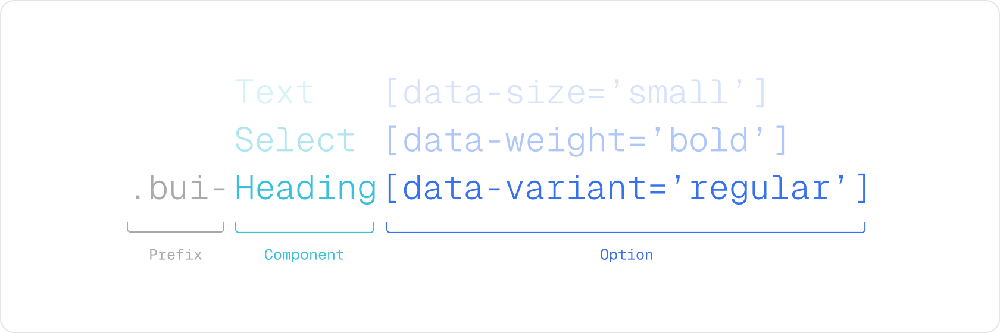

Backstage offers built-in support for both light and dark themes, making it easy to get started with a professional look and feel. But many teams want to go further—tailoring the interface to reflect their organization’s unique brand, identity, and experience.

This section explores the different ways you can customize the appearance of your Backstage instance. You'll learn how the theming system is structured today, how to work with the two coexisting UI systems, and how to define themes that align with your visual language.

## Theming architecture overview

Backstage currently supports two parallel UI systems. The original theming and component model is built on Material UI (MUI), a popular React-based framework. More recently, Backstage introduced Backstage UI (BUI), a custom-designed, CSS-first system developed to meet the platform’s evolving needs. Both systems are supported today, with many parts of the ecosystem still using MUI while new components adopt BUI.

<div style="display: flex; gap: 1rem; flex-wrap: wrap; margin-bottom: 1rem;">
  <div style="flex: 1; min-width: 250px; border: 1px solid #ccc; border-radius: 8px; padding: 1rem;">
    <h3 style="margin-top: 0;">MUI (Legacy)</h3>
    <ul>
      <li><strong>Theming:</strong> JS-based with <code>UnifiedThemeProvider</code></li>
      <li><strong>Coverage:</strong> Most existing plugins</li>
      <li><strong>Documentation:</strong> <a href="https://mui.com/material-ui/" target="_blank">mui.com</a></li>
    </ul>
  </div>
  <div style="flex: 1; min-width: 250px; border: 1px solid #ccc; border-radius: 8px; padding: 1rem;">
    <h3 style="margin-top: 0;">Backstage UI (New)</h3>
    <ul>
      <li><strong>Theming:</strong> CSS variables and tokens</li>
      <li><strong>Coverage:</strong> Growing, focused on new work</li>
      <li><strong>Documentation:</strong> <a href="https://ui.backstage.io" target="_blank">ui.backstage.io</a></li>
    </ul>
  </div>
</div>

:::info
We recognize that maintaining two separate theming systems is not ideal. Because of the fundamental architectural differences between MUI and Backstage UI, it can be challenging to automate theme updates or know exactly which theme to modify for a given component. Our recommendation is to inspect the component’s code and check its class names: if you see a class name starting with `bui`, you should use the Backstage UI theming approach to style it.
:::

## Creating custom themes

During the transition to Backstage UI, you will need to maintain themes in two places: some components and plugins still rely on MUI, while others use Backstage UI. We are working on a plugin that will make help you convert your existing MUI theme into a Backstage UI CSS file you can add to your application. We'll update this page when the plugin is available but for now you can follow progress on this PR [#31140](https://github.com/backstage/backstage/pull/31140).

```tsx title="packages/app/src/App.tsx"
/* highlight-add-start */
import { lightTheme, darkTheme } from './themes'; // MUI themes
import './styles.css'; // Backstage UI (BUI) theme
/* highlight-add-end */

const app = createApp({
  apis,
  components,
  /* highlight-add-start */
  themes: [
    {
      id: 'light',
      title: 'Light theme',
      variant: 'light',
      icon: <LightIcon />,
      Provider: ({ children }) => (
        <UnifiedThemeProvider theme={lightTheme} children={children} />
      ),
    },
    {
      id: 'dark',
      title: 'Dark theme',
      variant: 'dark',
      icon: <DarkIcon />,
      Provider: ({ children }) => (
        <UnifiedThemeProvider theme={darkTheme} children={children} />
      ),
    },
  ],
  /* highlight-add-end */
});
```

| Name       | Description                                                                                                                                                                                                                              |
| ---------- | ---------------------------------------------------------------------------------------------------------------------------------------------------------------------------------------------------------------------------------------- |
| `id`       | Each theme has a unique `id`                                                                                                                                                                                                             |
| `title`    | This will be shown in the settings page to select the right theme.                                                                                                                                                                       |
| `variant`  | This can be either `light` or `dark`. This is also referred to as `mode`. On the `body` of your app we are inserting a data attribute to set the theme based on this value: `data-theme-mode="light"`.                                   |
| `icon`     | This will be shown in the settings page as a visual element to complement the title.                                                                                                                                                     |
| `Provider` | This is needed to set the legacy theme with MUI only. This will be become redundant later on when we fully replace with BUI but for now you need to have it for MUI to work. BUI is based on CSS and don't rely on any global providers. |

:::note
Your list of custom themes overrides the default themes. If you still want to use the default themes, they are exported as `themes.light` and `themes.dark` from [`@backstage/theme`](https://www.npmjs.com/package/@backstage/theme). Be sure to provide both `light` and `dark` modes so users can choose their preference.
:::

## Create a theme for Backstage UI (New)

Backstage UI is built entirely using CSS. By default we are providing a default theme that include all our core CSS variables and component styles. To start customising Backstage UI to match your brand you need to create a new CSS file and import it directly in `packages/app/src/App.tsx`. All styles declared in this file will override the default styles. As your file grow you can organise it the way you want or even import multiple files.

Backstage UI is using light by default under `:root` but you can target it more specifically using the data attribute for mode

```css title="packages/app/src/styles.css"
:root {
  /* Use :root to set styles for both light and dark themes */
  .bui-Button {
    background-color: #000;
    color: #fff;
  }
}

[data-theme-mode='light'] {
  /* Light theme specific styles */
  --bui-bg-app: #f8f8f8;
  --bui-fg-primary: #000;
}

[data-theme-mode='dark'] {
  /* Dark theme specific styles */
  --bui-bg-app: #333333;
  --bui-fg-primary: #fff;
}
```

### CSS variables

By adjusting just a few theme variables, you can easily transform the look and feel of your Backstage instance to align with your brand identity. All colors are defined using these variables, ensuring they adapt seamlessly to both light and dark modes.

We recommend starting with a core set of CSS variables to quickly achieve a branded experience. You’ll also find a complete list of available variables below, giving you full flexibility to fine-tune the design to your needs.

And if you’d like to go even further, you can target specific component class names for advanced customization.

| Token Name           | Description                                                                                   |
| -------------------- | --------------------------------------------------------------------------------------------- |
| `--bui-bg-app` | This is used to define the background color of your app. It will only be used once.           |
| `--bui-bg-neutral-1` | We ar using this color to sit on top of `--bui-bg-app` mostly for `Card`, `Dialog`, ... |
| `--bui-bg-neutral-2` | This is for content inside elevated components. This colour is less common.                   |
| `--bui-bg-solid`     | This is used for main actions like primary buttons.                                           |
| `--bui-fg-solid`     | This is for texts or icons on top of a solid backgrounds.                                     |
| `--bui-fg-primary`   | Your primary text or icon colours.                                                            |
| `--bui-fg-secondary` | Your secondary text or icon colours.                                                          |
| `--bui-fg-danger`    | Used for error states and destructive actions.                                                |
| `--bui-fg-warning`   | Used for warning states and cautionary information.                                           |
| `--bui-fg-success`   | Used for success states and positive feedback.                                                |
| `--bui-fg-info`      | Used for informational content and neutral status.                                            |
| `--bui-border-1`       | Subtle borders for low-contrast separators.                                                   |
| `--bui-border-2`       | Main borders around surfaces like `Card`, `Dialog`, ...                                       |
| `--bui-font-regular` | The main font of your app.                                                                    |

<details>
  <summary>All available CSS variables</summary>

#### Base colors

| Token Name    | Description                                                             |
| ------------- | ----------------------------------------------------------------------- |
| `--bui-black` | Pure black color. This one should be the same in light and dark themes. |
| `--bui-white` | Pure white color. This one should be the same in light and dark themes. |

#### Neutral background colors

These colors form a layered neutral scale for your application backgrounds. `--bui-bg-app` is the base background color. Each subsequent level (1 through 4) represents an elevated layer, with hover, pressed, and disabled variants for interactive states.

| Token Name                    | Description                                                  |
| ----------------------------- | ------------------------------------------------------------ |
| `--bui-bg-app`          | The base background color of your Backstage instance.        |
| `--bui-bg-neutral-1`          | First elevated layer. Use for cards, dialogs, and panels.    |
| `--bui-bg-neutral-1-hover`    | Hover state for elements on neutral-1.                       |
| `--bui-bg-neutral-1-pressed`  | Pressed state for elements on neutral-1.                     |
| `--bui-bg-neutral-1-disabled` | Disabled state for elements on neutral-1.                    |
| `--bui-bg-neutral-2`          | Second elevated layer. Use for elements on top of neutral-1. |
| `--bui-bg-neutral-2-hover`    | Hover state for elements on neutral-2.                       |
| `--bui-bg-neutral-2-pressed`  | Pressed state for elements on neutral-2.                     |
| `--bui-bg-neutral-2-disabled` | Disabled state for elements on neutral-2.                    |
| `--bui-bg-neutral-3`          | Third elevated layer. Use for elements on top of neutral-2.  |
| `--bui-bg-neutral-3-hover`    | Hover state for elements on neutral-3.                       |
| `--bui-bg-neutral-3-pressed`  | Pressed state for elements on neutral-3.                     |
| `--bui-bg-neutral-3-disabled` | Disabled state for elements on neutral-3.                    |
| `--bui-bg-neutral-4`          | Fourth elevated layer. Use for elements on top of neutral-3. |
| `--bui-bg-neutral-4-hover`    | Hover state for elements on neutral-4.                       |
| `--bui-bg-neutral-4-pressed`  | Pressed state for elements on neutral-4.                     |
| `--bui-bg-neutral-4-disabled` | Disabled state for elements on neutral-4.                    |

#### Solid background colors

| Token Name                | Description                                     |
| ------------------------- | ----------------------------------------------- |
| `--bui-bg-solid`          | Used for solid background colors.               |
| `--bui-bg-solid-hover`    | Used for solid background colors when hovered.  |
| `--bui-bg-solid-pressed`  | Used for solid background colors when pressed.  |
| `--bui-bg-solid-disabled` | Used for solid background colors when disabled. |

#### Status background colors

| Token Name         | Description                         |
| ------------------ | ----------------------------------- |
| `--bui-bg-danger`  | Used to show errors information.    |
| `--bui-bg-warning` | Used to show warnings information.  |
| `--bui-bg-success` | Used to show success information.   |
| `--bui-bg-info`    | Used to show informational content. |

#### Foreground colors

Foreground colours are meant to work in pair with a background colours. Typically this would work for icons, texts, shapes, ... Use a matching name to know what foreground color to use. These colors are prefixed with `fg` to make it easier to identify.

| Token Name               | Description                                            |
| ------------------------ | ------------------------------------------------------ |
| `--bui-fg-primary`       | It should be used on top of main background surfaces.  |
| `--bui-fg-secondary`     | It should be used on top of main background surfaces.  |
| `--bui-fg-disabled`      | It should be used on top of main background surfaces.  |
| `--bui-fg-solid`         | It should be used on top of solid background colors.   |
| `--bui-fg-danger`        | Used for error states and destructive actions.         |
| `--bui-fg-warning`       | Used for warning states and cautionary information.    |
| `--bui-fg-success`       | Used for success states and positive feedback.         |
| `--bui-fg-info`          | Used for informational content and neutral status.     |
| `--bui-fg-danger-on-bg`  | It should be used on top of danger background colors.  |
| `--bui-fg-warning-on-bg` | It should be used on top of warning background colors. |
| `--bui-fg-success-on-bg` | It should be used on top of success background colors. |
| `--bui-fg-info-on-bg`    | It should be used on top of info background colors.    |

#### Border colors

These border colors are mostly meant to be used as borders on top of any components with low contrast to help as a separator with the different background colors.

| Token Name              | Description                                         |
| ----------------------- | --------------------------------------------------- |
| `--bui-border-1`          | Subtle border for low-contrast separators.           |
| `--bui-border-2`          | It should be used on top of `--bui-bg-neutral-1`.   |
| `--bui-border-danger`   | It should be used on top of `--bui-bg-danger`.      |
| `--bui-border-warning`  | It should be used on top of `--bui-bg-warning`.     |
| `--bui-border-success`  | It should be used on top of `--bui-bg-success`.     |

#### Special colors

These colors are used for special purposes like ring, scrollbar, ...

| Token Name              | Description                       |
| ----------------------- | --------------------------------- |
| `--bui-ring`            | The color of the ring.            |
| `--bui-scrollbar`       | The color of the scrollbar.       |
| `--bui-scrollbar-thumb` | The color of the scrollbar thumb. |

#### Font families

We have two fonts that we use across Backstage UI. The first one is the sans-serif font that we use for the body of the application. The second one is the monospace font that we use for code blocks and tables.

| Token Name           | Description                        |
| -------------------- | ---------------------------------- |
| `--bui-font-regular` | The sans-serif font for the theme. |
| `--bui-font-mono`    | The monospace font for the theme.  |

#### Font weights

We have two font weights that we use across Backstage UI. Regular or Bold.

| Token Name                  | Description                            |
| --------------------------- | -------------------------------------- |
| `--bui-font-weight-regular` | The regular font weight for the theme. |
| `--bui-font-weight-bold`    | The bold font weight for the theme.    |

#### Spacing

We built a spacing system based on a single value `--bui-space`. This value is used to calculate the spacing for all the components. By default if you would like to increase or decrease the spacing between your components you can do it simply by updating `--bui-space` and it will apply to all spacing values.

`--bui-space` is not used directly in any components but serve as an easy way to calculate the other values.

| Token Name    | Description                                                       |
| ------------- | ----------------------------------------------------------------- |
| `--bui-space` | The base unit for the spacing system. Default value is `0.25rem.` |

#### Radius

We use a radius system to make sure that the components have a consistent look and feel.

| Token Name          | Description                                               |
| ------------------- | --------------------------------------------------------- |
| `--bui-radius-1`    | The radius of the component. Default value is `0.125rem`. |
| `--bui-radius-2`    | The radius of the component. Default value is `0.25rem`.  |
| `--bui-radius-3`    | The radius of the component. Default value is `0.5rem`.   |
| `--bui-radius-4`    | The radius of the component. Default value is `0.75rem`.  |
| `--bui-radius-5`    | The radius of the component. Default value is `1rem`.     |
| `--bui-radius-6`    | The radius of the component. Default value is `1.25rem`.  |
| `--bui-radius-full` | The radius of the component. Default value is `9999px`.   |

</details>

### Component class names

All Backstage UI components come with a set of CSS classes that you can use to style them. To make it easier to identify the class name you can use, we use a specific structure for the class names.



Every component has a unique prefix `.bui-` followed by the component name. Component props are represented using the `data-` attribute. That way, class names are easily identifiable.

## Create a theme for MUI (Legacy)

To customize the appearance of your Backstage app using the legacy MUI theming system, you can define your own theme by extending the built-in light or dark themes. This is done using the createUnifiedTheme utility provided by the [`@backstage/theme`](https://www.npmjs.com/package/@backstage/theme) package. This function allows you to override key aspects of the theme—such as color palette, typography, spacing, and shape—while preserving Backstage’s base configuration and component compatibility.

The example below shows how to create a new theme based on the default light theme:

```ts title="packages/app/src/themes.ts"
import {
  createBaseThemeOptions,
  createUnifiedTheme,
  palettes,
} from '@backstage/theme';

export const lightTheme = createUnifiedTheme({
  ...createBaseThemeOptions({
    palette: palettes.light,
  }),
  fontFamily: 'Comic Sans MS',
  defaultPageTheme: 'home',
});

export const darkTheme = createUnifiedTheme({
  ...createBaseThemeOptions({
    palette: palettes.dark,
  }),
  fontFamily: 'Comic Sans MS',
  defaultPageTheme: 'home',
});
```

You can also create a theme from scratch that matches the `BackstageTheme` type exported by [`@backstage/theme`](https://www.npmjs.com/package/@backstage/theme). See the
[Material UI docs on theming](https://material-ui.com/customization/theming/) for more information about how that can be done.

<details>
  <summary>Example of a custom MUI theme</summary>

For a more complete example of a custom theme including Backstage and Material UI component overrides, see the [Aperture theme](https://github.com/backstage/demo/blob/master/packages/app/src/theme/aperture.ts) from the [Backstage demo site](https://demo.backstage.io).

```ts title="packages/app/src/themes.ts"
import {
  createBaseThemeOptions,
  createUnifiedTheme,
  genPageTheme,
  palettes,
  shapes,
} from '@backstage/theme';

export const myTheme = createUnifiedTheme({
  ...createBaseThemeOptions({
    palette: {
      ...palettes.light,
      primary: {
        main: '#343b58',
      },
      secondary: {
        main: '#565a6e',
      },
      error: {
        main: '#8c4351',
      },
      warning: {
        main: '#8f5e15',
      },
      info: {
        main: '#34548a',
      },
      success: {
        main: '#485e30',
      },
      background: {
        default: '#d5d6db',
        paper: '#d5d6db',
      },
      banner: {
        info: '#34548a',
        error: '#8c4351',
        text: '#343b58',
        link: '#565a6e',
      },
      errorBackground: '#8c4351',
      warningBackground: '#8f5e15',
      infoBackground: '#343b58',
      navigation: {
        background: '#343b58',
        indicator: '#8f5e15',
        color: '#d5d6db',
        selectedColor: '#ffffff',
      },
    },
  }),
  defaultPageTheme: 'home',
  fontFamily: 'Comic Sans MS',
  /* below drives the header colors */
  pageTheme: {
    home: genPageTheme({ colors: ['#8c4351', '#343b58'], shape: shapes.wave }),
    documentation: genPageTheme({
      colors: ['#8c4351', '#343b58'],
      shape: shapes.wave2,
    }),
    tool: genPageTheme({ colors: ['#8c4351', '#343b58'], shape: shapes.round }),
    service: genPageTheme({
      colors: ['#8c4351', '#343b58'],
      shape: shapes.wave,
    }),
    website: genPageTheme({
      colors: ['#8c4351', '#343b58'],
      shape: shapes.wave,
    }),
    library: genPageTheme({
      colors: ['#8c4351', '#343b58'],
      shape: shapes.wave,
    }),
    other: genPageTheme({ colors: ['#8c4351', '#343b58'], shape: shapes.wave }),
    app: genPageTheme({ colors: ['#8c4351', '#343b58'], shape: shapes.wave }),
    apis: genPageTheme({ colors: ['#8c4351', '#343b58'], shape: shapes.wave }),
  },
});
```

</details>

<details>
  <summary>Custom Typography</summary>

When creating a custom theme you can also customize various aspects of the default typography, here's an example using simplified theme:

```ts title="packages/app/src/theme/myTheme.ts"
import {
  createBaseThemeOptions,
  createUnifiedTheme,
  palettes,
} from '@backstage/theme';

export const myTheme = createUnifiedTheme({
  ...createBaseThemeOptions({
    palette: palettes.light,
    typography: {
      htmlFontSize: 16,
      fontFamily: 'Arial, sans-serif',
      h1: {
        fontSize: 54,
        fontWeight: 700,
        marginBottom: 10,
      },
      h2: {
        fontSize: 40,
        fontWeight: 700,
        marginBottom: 8,
      },
      h3: {
        fontSize: 32,
        fontWeight: 700,
        marginBottom: 6,
      },
      h4: {
        fontWeight: 700,
        fontSize: 28,
        marginBottom: 6,
      },
      h5: {
        fontWeight: 700,
        fontSize: 24,
        marginBottom: 4,
      },
      h6: {
        fontWeight: 700,
        fontSize: 20,
        marginBottom: 2,
      },
    },
    defaultPageTheme: 'home',
  }),
});
```

If you wanted to only override a sub-set of the typography setting, for example just `h1` then you would do this:

```ts title="packages/app/src/theme/myTheme.ts"
import {
  createBaseThemeOptions,
  createUnifiedTheme,
  defaultTypography,
  palettes,
} from '@backstage/theme';

export const myTheme = createUnifiedTheme({
  ...createBaseThemeOptions({
    palette: palettes.light,
    typography: {
      ...defaultTypography,
      htmlFontSize: 16,
      fontFamily: 'Roboto, sans-serif',
      h1: {
        fontSize: 72,
        fontWeight: 700,
        marginBottom: 10,
      },
    },
    defaultPageTheme: 'home',
  }),
});
```

</details>

<details>
  <summary>Custom Fonts</summary>

To add custom fonts, you first need to store the font so that it can be imported. We suggest creating the `assets/fonts` directory in your front-end application `src` folder.

You can then declare the font style following the `@font-face` syntax from [Material UI Typography](https://mui.com/material-ui/customization/typography/).

After that you can then utilize the `styleOverrides` of `MuiCssBaseline` under components to add a font to the `@font-face` array.

```ts title="packages/app/src/theme/myTheme.ts"
import MyCustomFont from '../assets/fonts/My-Custom-Font.woff2';

const myCustomFont = {
  fontFamily: 'My-Custom-Font',
  fontStyle: 'normal',
  fontDisplay: 'swap',
  fontWeight: 300,
  src: `
    local('My-Custom-Font'),
    url(${MyCustomFont}) format('woff2'),
  `,
};

export const myTheme = createUnifiedTheme({
  fontFamily: 'My-Custom-Font',
  palette: palettes.light,
  components: {
    MuiCssBaseline: {
      styleOverrides: {
        '@font-face': [myCustomFont],
      },
    },
  },
});
```

If you want to utilize different or multiple fonts, then you can set the top level `fontFamily` to what you want for your body, and then override `fontFamily` in `typography` to control fonts for various headings.

```ts title="packages/app/src/theme/myTheme.ts"
import MyCustomFont from '../assets/fonts/My-Custom-Font.woff2';
import myAwesomeFont from '../assets/fonts/My-Awesome-Font.woff2';

const myCustomFont = {
  fontFamily: 'My-Custom-Font',
  fontStyle: 'normal',
  fontDisplay: 'swap',
  fontWeight: 300,
  src: `
    local('My-Custom-Font'),
    url(${MyCustomFont}) format('woff2'),
  `,
};

const myAwesomeFont = {
  fontFamily: 'My-Awesome-Font',
  fontStyle: 'normal',
  fontDisplay: 'swap',
  fontWeight: 300,
  src: `
    local('My-Awesome-Font'),
    url(${myAwesomeFont}) format('woff2'),
  `,
};

export const myTheme = createUnifiedTheme({
  fontFamily: 'My-Custom-Font',
  components: {
    MuiCssBaseline: {
      styleOverrides: {
        '@font-face': [myCustomFont, myAwesomeFont],
      },
    },
  },
  ...createBaseThemeOptions({
    palette: palettes.light,
    typography: {
      ...defaultTypography,
      htmlFontSize: 16,
      fontFamily: 'My-Custom-Font',
      h1: {
        fontSize: 72,
        fontWeight: 700,
        marginBottom: 10,
        fontFamily: 'My-Awesome-Font',
      },
    },
    defaultPageTheme: 'home',
  }),
});
```

</details>

<details>
  <summary>Overriding Backstage and Material UI components styles</summary>

When creating a custom theme you would be applying different values to component's CSS rules that use the theme object. For example, a Backstage component's styles might look like this:

```tsx
const useStyles = makeStyles<BackstageTheme>(
  theme => ({
    header: {
      padding: theme.spacing(3),
      boxShadow: '0 0 8px 3px rgba(20, 20, 20, 0.3)',
      backgroundImage: theme.page.backgroundImage,
    },
  }),
  { name: 'BackstageHeader' },
);
```

Notice how the `padding` is getting its value from `theme.spacing`, that means that setting a value for spacing in your custom theme would affect this component padding property and the same goes for `backgroundImage` which uses `theme.page.backgroundImage`. However, the `boxShadow` property doesn't reference any value from the theme, that means that creating a custom theme wouldn't be enough to alter the `box-shadow` property or to add css rules that aren't already defined like a margin. For these cases you should also create an override.

Here's how you would do that:

```ts title="packages/app/src/theme/myTheme.ts"
import {
  createBaseThemeOptions,
  createUnifiedTheme,
  palettes,
} from '@backstage/theme';

export const myTheme = createUnifiedTheme({
  ...createBaseThemeOptions({
    palette: palettes.light,
  }),
  fontFamily: 'Comic Sans MS',
  defaultPageTheme: 'home',
  components: {
    BackstageHeader: {
      styleOverrides: {
        header: ({ theme }) => ({
          width: 'auto',
          margin: '20px',
          boxShadow: 'none',
          borderBottom: `4px solid ${theme.palette.primary.main}`,
        }),
      },
    },
  },
});
```

</details>
