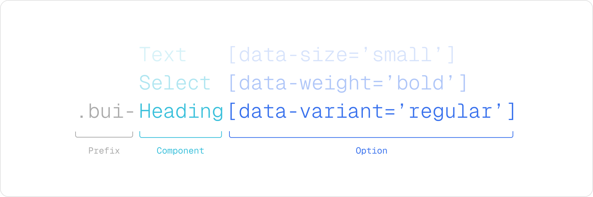

Backstage offers built-in support for both light and dark themes, making it easy to get started with a professional look and feel. But many teams want to go further—tailoring the interface to reflect their organization's unique brand, identity, and experience.

This section explores the different ways you can customize the appearance of your Backstage instance. You'll learn how the theming system is structured today, how to work with the three coexisting UI systems, and how to define themes that align with your visual language.

## Theming architecture overview

Backstage currently supports three parallel UI and theming systems. The **primary** system uses **shadcn/ui** components styled with **CSS custom property tokens** and **Tailwind CSS** — this is the recommended theming mechanism for all core packages and in-scope plugins. **Backstage UI (BUI)** is a CSS-first system using `--bui-*` tokens, aligned with the shadcn token naming where applicable. The **legacy** system is built on **Material UI (MUI)**, retained for backward compatibility with community plugins via the `UnifiedThemeProvider`.

<div style="display: flex; gap: 1rem; flex-wrap: wrap; margin-bottom: 1rem;">
  <div style="flex: 1; min-width: 220px; border: 1px solid #ccc; border-radius: 8px; padding: 1rem;">
    <h3 style="margin-top: 0;">shadcn/ui (Primary)</h3>
    <ul>
      <li><strong>Theming:</strong> CSS custom properties + Tailwind CSS</li>
      <li><strong>Coverage:</strong> Core packages and in-scope plugins</li>
      <li><strong>Documentation:</strong> <a href="https://ui.shadcn.com" target="_blank">ui.shadcn.com</a></li>
    </ul>
  </div>
  <div style="flex: 1; min-width: 220px; border: 1px solid #ccc; border-radius: 8px; padding: 1rem;">
    <h3 style="margin-top: 0;">Backstage UI (Growing)</h3>
    <ul>
      <li><strong>Theming:</strong> CSS variables and tokens (<code>--bui-*</code>)</li>
      <li><strong>Coverage:</strong> Growing, focused on new work</li>
      <li><strong>Documentation:</strong> <a href="https://ui.backstage.io" target="_blank">ui.backstage.io</a></li>
    </ul>
  </div>
  <div style="flex: 1; min-width: 220px; border: 1px solid #ccc; border-radius: 8px; padding: 1rem;">
    <h3 style="margin-top: 0;">MUI (Legacy)</h3>
    <ul>
      <li><strong>Theming:</strong> JS-based with <code>UnifiedThemeProvider</code></li>
      <li><strong>Coverage:</strong> Community plugins (backward compat)</li>
      <li><strong>Documentation:</strong> <a href="https://mui.com/material-ui/" target="_blank">mui.com</a></li>
    </ul>
  </div>
</div>

:::info
Backstage uses three theming systems today. **Core components use shadcn/ui** styled with CSS custom property tokens (`--background`, `--foreground`, `--primary`, etc.) and Tailwind CSS utility classes. If a component has class names starting with `bui-`, use the **Backstage UI** theming approach to style it. **Community plugins** may still use MUI internally — the `UnifiedThemeProvider` continues to provide MUI v4 and v5 theme contexts for backward compatibility. Dark mode is activated via the `[data-theme-mode='dark']` selector across all three systems.
:::

The following CSS custom property tokens drive the shadcn/ui component styling and serve as the primary theming mechanism:

| Token Name             | Description                                |
| ---------------------- | ------------------------------------------ |
| `--background`         | Application background color               |
| `--foreground`         | Primary foreground/text color              |
| `--primary`            | Primary brand color (buttons, links)       |
| `--primary-foreground` | Text color on primary backgrounds          |
| `--secondary`          | Secondary accent color                     |
| `--destructive`        | Error/danger color for destructive actions |
| `--muted`              | Muted/subdued background color             |
| `--accent`             | Accent color for highlights                |
| `--popover`            | Popover and tooltip background color       |
| `--card`               | Card surface background color              |
| `--border`             | Default border color                       |
| `--input`              | Input field border color                   |
| `--ring`               | Focus ring color                           |

### Sidebar Tokens

The collapsible sidebar uses dedicated CSS custom property tokens for its branded navigation experience. These tokens allow you to customize the sidebar independently from the main application theme:

| Token Name                     | Description                                           |
| ------------------------------ | ----------------------------------------------------- |
| `--sidebar-background`         | Sidebar background color (dark surface in light mode) |
| `--sidebar-foreground`         | Sidebar text and icon color                           |
| `--sidebar-primary`            | Active/selected sidebar item color                    |
| `--sidebar-primary-foreground` | Text color on active sidebar items                    |
| `--sidebar-accent`             | Sidebar hover/accent background color                 |
| `--sidebar-accent-foreground`  | Text color on sidebar accent backgrounds              |
| `--sidebar-border`             | Sidebar divider/border color                          |
| `--sidebar-ring`               | Focus ring color within the sidebar context           |

### Status Indicator Tokens

Status indicator tokens drive catalog health displays, CI/CD pipeline status, and progress indicators. These are direct indicator colors used for status dots, progress bars, and pipeline visualizations. Components using these tokens **must** also use shape or icon differentiation alongside color to meet WCAG 2.1 AA color-independence requirements:

| Token Name         | Description                                |
| ------------------ | ------------------------------------------ |
| `--status-ok`      | Healthy/passing status indicator color     |
| `--status-warning` | Warning status indicator color             |
| `--status-error`   | Error/failing status indicator color       |
| `--status-running` | In-progress/running status indicator color |
| `--status-pending` | Pending/queued status indicator color      |
| `--status-aborted` | Aborted/cancelled status indicator color   |

## Creating custom themes

Backstage supports three theming systems. The **primary** system uses CSS custom properties to style shadcn/ui components, **Backstage UI (BUI)** uses CSS variables with `--bui-*` tokens, and the **legacy MUI** system uses JavaScript-based themes via `UnifiedThemeProvider`. During the transition, you may need to maintain themes in multiple places depending on which systems your plugins use.

```tsx title="packages/app/src/App.tsx"
/* highlight-add-start */
import { lightTheme, darkTheme } from './themes'; // MUI themes (legacy, for community plugins)
import '@backstage/core-components/src/styles/globals.css'; // shadcn/ui tokens
import './styles.css'; // Backstage UI (BUI) theme + custom overrides
/* highlight-add-end */

const app = createApp({
  apis,
  components,
  /* highlight-add-start */
  themes: [
    {
      id: 'light',
      title: 'Light theme',
      variant: 'light',
      icon: <LightIcon />,
      Provider: ({ children }) => (
        <UnifiedThemeProvider theme={lightTheme} children={children} />
      ),
    },
    {
      id: 'dark',
      title: 'Dark theme',
      variant: 'dark',
      icon: <DarkIcon />,
      Provider: ({ children }) => (
        <UnifiedThemeProvider theme={darkTheme} children={children} />
      ),
    },
  ],
  /* highlight-add-end */
});
```

| Name       | Description                                                                                                                                                                                                                                   |
| ---------- | --------------------------------------------------------------------------------------------------------------------------------------------------------------------------------------------------------------------------------------------- |
| `id`       | Each theme has a unique `id`                                                                                                                                                                                                                  |
| `title`    | This will be shown in the settings page to select the right theme.                                                                                                                                                                            |
| `variant`  | This can be either `light` or `dark`. This is also referred to as `mode`. On the `body` of your app we are inserting a data attribute to set the theme based on this value: `data-theme-mode="light"`.                                        |
| `icon`     | This will be shown in the settings page as a visual element to complement the title.                                                                                                                                                          |
| `Provider` | This is needed to set the legacy MUI theme only. The `UnifiedThemeProvider` supplies MUI v4 and v5 theme contexts for backward compatibility with community plugins. shadcn/ui and BUI are CSS-based and do not rely on any global providers. |

:::note
Your list of custom themes overrides the default themes. If you still want to use the default themes, they are exported as `themes.light` and `themes.dark` from [`@backstage/theme`](https://www.npmjs.com/package/@backstage/theme). Be sure to provide both `light` and `dark` modes so users can choose their preference.
:::

## Create a theme with CSS Custom Properties (Primary)

The primary theming mechanism for Backstage core components uses **CSS custom properties** (also known as CSS variables) that drive shadcn/ui component styling. These tokens are defined at the `:root` level for light mode and overridden under `[data-theme-mode='dark']` for dark mode. No JavaScript is required — all theming is done in pure CSS.

### Token mapping

The shadcn/ui token system aligns with the existing Backstage UI (BUI) token naming. The following table maps BUI tokens to their shadcn/ui equivalents:

| BUI Token (`--bui-*`)  | shadcn/ui Token        | Purpose                     |
| ---------------------- | ---------------------- | --------------------------- |
| `--bui-bg-app`         | `--background`         | Application background      |
| `--bui-fg-primary`     | `--foreground`         | Primary text/foreground     |
| `--bui-bg-solid`       | `--primary`            | Primary brand color         |
| `--bui-fg-solid`       | `--primary-foreground` | Text on primary backgrounds |
| `--bui-bg-danger`      | `--destructive`        | Error/danger color          |
| `--bui-border-1`       | `--border`             | Default border color        |
| `--bui-radius-3`       | `--radius`             | Default border radius       |
| `--bui-ring`           | `--ring`               | Focus ring color            |
| `--bui-bg-neutral-1`   | `--card`               | Card surface background     |
| `--bui-bg-popover`     | `--popover`            | Popover background          |
| `--bui-bg-neutral-2`   | `--muted`              | Muted/subdued background    |
| `--bui-font-regular`   | `--font-sans`          | Sans-serif font family      |
| `--bui-font-monospace` | `--font-mono`          | Monospace font family       |

### Defining custom tokens

To customize the theme, create a CSS file and override the token values at `:root` for light mode and `[data-theme-mode='dark']` for dark mode:

```css title="packages/app/src/styles.css"
:root {
  --background: #f8f8f8;
  --foreground: #000000;
  --primary: #1f5493;
  --primary-foreground: #ffffff;
  --destructive: #dc2626;
  --border: #d9d9d9;
  --radius: 0.5rem;
  --ring: #1f5493;
  --card: #ffffff;
  --popover: #ffffff;
  --muted: #f1f1f1;
  --font-sans: system-ui, sans-serif;
  --font-mono: ui-monospace, 'Menlo', 'Monaco', monospace;
}

[data-theme-mode='dark'] {
  --background: #0a0a0a;
  --foreground: #fafafa;
  --primary: #3b82f6;
  --primary-foreground: #ffffff;
  --destructive: #ef4444;
  --border: #27272a;
  --card: #09090b;
  --popover: #09090b;
  --muted: #27272a;
}
```

### Importing the token file

Import the global shadcn/ui token file in your app entry point to apply the default tokens:

```tsx title="packages/app/src/App.tsx"
import '@backstage/core-components/src/styles/globals.css';
```

### Using the `cn()` helper

The `cn()` utility function combines [`clsx`](https://github.com/lukeed/clsx) and [`tailwind-merge`](https://github.com/dcastil/tailwind-merge) for composing Tailwind CSS class names. It resolves conflicts and supports conditional classes:

```tsx
import { cn } from '@backstage/core-components/lib/utils';

function MyComponent({ className, variant }) {
  return (
    <div
      className={cn(
        'rounded-lg border bg-card text-card-foreground shadow-sm',
        variant === 'destructive' && 'border-destructive',
        className,
      )}
    >
      {/* content */}
    </div>
  );
}
```

### Using shadcn/ui components

shadcn/ui components are available from `@backstage/core-components` and are built on [Radix UI](https://www.radix-ui.com/) primitives with Tailwind CSS styling. Icons come from the [Lucide](https://lucide.dev/) library:

```tsx
import { Button } from '@backstage/core-components/ui/button';
import {
  Card,
  CardHeader,
  CardTitle,
  CardContent,
} from '@backstage/core-components/ui/card';
import { Home } from 'lucide-react';

function MyPage() {
  return (
    <Card>
      <CardHeader>
        <CardTitle className="flex items-center gap-2">
          <Home className="h-5 w-5" />
          Welcome
        </CardTitle>
      </CardHeader>
      <CardContent>
        <p className="text-sm text-muted-foreground">
          Browse your software catalog
        </p>
        <Button variant="default" className="mt-4">
          Get Started
        </Button>
      </CardContent>
    </Card>
  );
}
```

:::note WCAG 2.1 AA Compliance
Both light and dark themes **must** meet [WCAG 2.1 AA contrast requirements](https://www.w3.org/WAI/WCAG21/Understanding/contrast-minimum.html) for all text and interactive elements. When defining custom token values, verify sufficient contrast ratios (4.5:1 for normal text, 3:1 for large text). Color-blind-friendly status indicators should use shape and pattern differentiation alongside color — avoid relying solely on red/green differentiation. All shadcn/ui components leverage [Radix UI](https://www.radix-ui.com/) built-in accessibility features including ARIA attributes, keyboard navigation, and screen reader support.
:::

## Create a theme for Backstage UI (BUI)

Backstage UI is built entirely using CSS. By default we are providing a default theme that include all our core CSS variables and component styles. To start customising Backstage UI to match your brand you need to create a new CSS file and import it directly in `packages/app/src/App.tsx`. All styles declared in this file will override the default styles. As your file grow you can organise it the way you want or even import multiple files.

Backstage UI is using light by default under `:root` but you can target it more specifically using the data attribute for mode

```css title="packages/app/src/styles.css"
:root {
  /* Use :root to set styles for both light and dark themes */
  .bui-Button {
    background-color: #000;
    color: #fff;
  }
}

[data-theme-mode='light'] {
  /* Light theme specific styles */
  --bui-bg-app: #f8f8f8;
  --bui-fg-primary: #000;
}

[data-theme-mode='dark'] {
  /* Dark theme specific styles */
  --bui-bg-app: #333333;
  --bui-fg-primary: #fff;
}
```

### CSS variables

By adjusting just a few theme variables, you can easily transform the look and feel of your Backstage instance to align with your brand identity. All colors are defined using these variables, ensuring they adapt seamlessly to both light and dark modes.

We recommend starting with a core set of CSS variables to quickly achieve a branded experience. You'll also find a complete list of available variables below, giving you full flexibility to fine-tune the design to your needs.

And if you'd like to go even further, you can target specific component class names for advanced customization.

| Token Name           | Description                                                                              |
| -------------------- | ---------------------------------------------------------------------------------------- |
| `--bui-bg-app`       | This is used to define the background color of your app. It will only be used once.      |
| `--bui-bg-neutral-1` | We are using this color to sit on top of `--bui-bg-app` mostly for `Card`, `Dialog`, ... |
| `--bui-bg-neutral-2` | This is for content inside elevated components. This colour is less common.              |
| `--bui-bg-solid`     | This is used for main actions like primary buttons.                                      |
| `--bui-fg-solid`     | This is for texts or icons on top of a solid backgrounds.                                |
| `--bui-fg-primary`   | Your primary text or icon colours.                                                       |
| `--bui-fg-secondary` | Your secondary text or icon colours.                                                     |
| `--bui-fg-danger`    | Used for error states and destructive actions.                                           |
| `--bui-fg-warning`   | Used for warning states and cautionary information.                                      |
| `--bui-fg-success`   | Used for success states and positive feedback.                                           |
| `--bui-fg-info`      | Used for informational content and neutral status.                                       |
| `--bui-border-1`     | Subtle borders for low-contrast separators.                                              |
| `--bui-border-2`     | Main borders around surfaces like `Card`, `Dialog`, ...                                  |
| `--bui-font-regular` | The main font of your app.                                                               |

<details>
  <summary>All available CSS variables</summary>

#### Base colors

| Token Name    | Description                                                             |
| ------------- | ----------------------------------------------------------------------- |
| `--bui-black` | Pure black color. This one should be the same in light and dark themes. |
| `--bui-white` | Pure white color. This one should be the same in light and dark themes. |

#### Neutral background colors

These colors form a layered neutral scale for your application backgrounds. `--bui-bg-app` is the base background color. Each subsequent level (1 through 4) represents an elevated layer, with hover, pressed, and disabled variants for interactive states.

| Token Name                    | Description                                                  |
| ----------------------------- | ------------------------------------------------------------ |
| `--bui-bg-app`                | The base background color of your Backstage instance.        |
| `--bui-bg-popover`            | The background color used for popovers, tooltips, and menus. |
| `--bui-bg-neutral-1`          | First elevated layer. Use for cards, dialogs, and panels.    |
| `--bui-bg-neutral-1-hover`    | Hover state for elements on neutral-1.                       |
| `--bui-bg-neutral-1-pressed`  | Pressed state for elements on neutral-1.                     |
| `--bui-bg-neutral-1-disabled` | Disabled state for elements on neutral-1.                    |
| `--bui-bg-neutral-2`          | Second elevated layer. Use for elements on top of neutral-1. |
| `--bui-bg-neutral-2-hover`    | Hover state for elements on neutral-2.                       |
| `--bui-bg-neutral-2-pressed`  | Pressed state for elements on neutral-2.                     |
| `--bui-bg-neutral-2-disabled` | Disabled state for elements on neutral-2.                    |
| `--bui-bg-neutral-3`          | Third elevated layer. Use for elements on top of neutral-2.  |
| `--bui-bg-neutral-3-hover`    | Hover state for elements on neutral-3.                       |
| `--bui-bg-neutral-3-pressed`  | Pressed state for elements on neutral-3.                     |
| `--bui-bg-neutral-3-disabled` | Disabled state for elements on neutral-3.                    |
| `--bui-bg-neutral-4`          | Fourth elevated layer. Use for elements on top of neutral-3. |
| `--bui-bg-neutral-4-hover`    | Hover state for elements on neutral-4.                       |
| `--bui-bg-neutral-4-pressed`  | Pressed state for elements on neutral-4.                     |
| `--bui-bg-neutral-4-disabled` | Disabled state for elements on neutral-4.                    |

#### Solid background colors

| Token Name                | Description                                     |
| ------------------------- | ----------------------------------------------- |
| `--bui-bg-solid`          | Used for solid background colors.               |
| `--bui-bg-solid-hover`    | Used for solid background colors when hovered.  |
| `--bui-bg-solid-pressed`  | Used for solid background colors when pressed.  |
| `--bui-bg-solid-disabled` | Used for solid background colors when disabled. |

#### Status background colors

| Token Name         | Description                         |
| ------------------ | ----------------------------------- |
| `--bui-bg-danger`  | Used to show errors information.    |
| `--bui-bg-warning` | Used to show warnings information.  |
| `--bui-bg-success` | Used to show success information.   |
| `--bui-bg-info`    | Used to show informational content. |

#### Foreground colors

Foreground colours are meant to work in pair with a background colours. Typically this would work for icons, texts, shapes, ... Use a matching name to know what foreground color to use. These colors are prefixed with `fg` to make it easier to identify.

| Token Name               | Description                                            |
| ------------------------ | ------------------------------------------------------ |
| `--bui-fg-primary`       | It should be used on top of main background surfaces.  |
| `--bui-fg-secondary`     | It should be used on top of main background surfaces.  |
| `--bui-fg-disabled`      | It should be used on top of main background surfaces.  |
| `--bui-fg-solid`         | It should be used on top of solid background colors.   |
| `--bui-fg-danger`        | Used for error states and destructive actions.         |
| `--bui-fg-warning`       | Used for warning states and cautionary information.    |
| `--bui-fg-success`       | Used for success states and positive feedback.         |
| `--bui-fg-info`          | Used for informational content and neutral status.     |
| `--bui-fg-danger-on-bg`  | It should be used on top of danger background colors.  |
| `--bui-fg-warning-on-bg` | It should be used on top of warning background colors. |
| `--bui-fg-success-on-bg` | It should be used on top of success background colors. |
| `--bui-fg-info-on-bg`    | It should be used on top of info background colors.    |

#### Border colors

These border colors are mostly meant to be used as borders on top of any components with low contrast to help as a separator with the different background colors.

| Token Name             | Description                                       |
| ---------------------- | ------------------------------------------------- |
| `--bui-border-1`       | Subtle border for low-contrast separators.        |
| `--bui-border-2`       | It should be used on top of `--bui-bg-neutral-1`. |
| `--bui-border-danger`  | It should be used on top of `--bui-bg-danger`.    |
| `--bui-border-warning` | It should be used on top of `--bui-bg-warning`.   |
| `--bui-border-success` | It should be used on top of `--bui-bg-success`.   |
| `--bui-border-info`    | It should be used on top of `--bui-bg-info`.      |

#### Special colors

These colors are used for special purposes like ring, scrollbar, ...

| Token Name              | Description                       |
| ----------------------- | --------------------------------- |
| `--bui-ring`            | The color of the ring.            |
| `--bui-scrollbar`       | The color of the scrollbar.       |
| `--bui-scrollbar-thumb` | The color of the scrollbar thumb. |

#### Font families

We have two fonts that we use across Backstage UI. The first one is the sans-serif font that we use for the body of the application. The second one is the monospace font that we use for code blocks and tables.

| Token Name           | Description                        |
| -------------------- | ---------------------------------- |
| `--bui-font-regular` | The sans-serif font for the theme. |
| `--bui-font-mono`    | The monospace font for the theme.  |

#### Font weights

We have two font weights that we use across Backstage UI. Regular or Bold.

| Token Name                  | Description                            |
| --------------------------- | -------------------------------------- |
| `--bui-font-weight-regular` | The regular font weight for the theme. |
| `--bui-font-weight-bold`    | The bold font weight for the theme.    |

#### Spacing

We built a spacing system based on a single value `--bui-space`. This value is used to calculate the spacing for all the components. By default if you would like to increase or decrease the spacing between your components you can do it simply by updating `--bui-space` and it will apply to all spacing values.

`--bui-space` is not used directly in any components but serve as an easy way to calculate the other values.

| Token Name    | Description                                                       |
| ------------- | ----------------------------------------------------------------- |
| `--bui-space` | The base unit for the spacing system. Default value is `0.25rem.` |

#### Radius

We use a radius system to make sure that the components have a consistent look and feel.

| Token Name          | Description                                               |
| ------------------- | --------------------------------------------------------- |
| `--bui-radius-1`    | The radius of the component. Default value is `0.125rem`. |
| `--bui-radius-2`    | The radius of the component. Default value is `0.25rem`.  |
| `--bui-radius-3`    | The radius of the component. Default value is `0.5rem`.   |
| `--bui-radius-4`    | The radius of the component. Default value is `0.75rem`.  |
| `--bui-radius-5`    | The radius of the component. Default value is `1rem`.     |
| `--bui-radius-6`    | The radius of the component. Default value is `1.25rem`.  |
| `--bui-radius-full` | The radius of the component. Default value is `9999px`.   |

</details>

### Component class names

All Backstage UI components come with a set of CSS classes that you can use to style them. To make it easier to identify the class name you can use, we use a specific structure for the class names.



Every component has a unique prefix `.bui-` followed by the component name. Component props are represented using the `data-` attribute. That way, class names are easily identifiable.

## Custom Typography

### Typography with Tailwind CSS (Primary)

The shadcn/ui component system uses a **dual-font approach** optimized for code-adjacent content:

- **`--font-sans`** (system-ui stack) — Used for prose, navigation, headings, and body text
- **`--font-mono`** — Used for identifiers, metadata values, entity names, and code content

Typography is controlled entirely through Tailwind CSS utility classes. There is no need for a JavaScript theme object — all typography styling is applied via `className`:

```tsx
{
  /* Heading */
}
<h1 className="text-3xl font-bold tracking-tight">Catalog</h1>;

{
  /* Body text */
}
<p className="text-sm text-muted-foreground">Browse your software catalog</p>;

{
  /* Monospace for identifiers */
}
<code className="font-mono text-sm">my-service</code>;

{
  /* Secondary text */
}
<span className="text-xs text-muted-foreground">Last updated 2 hours ago</span>;
```

Common Tailwind typography utilities used across Backstage components:

| Utility Class           | Purpose                                   |
| ----------------------- | ----------------------------------------- |
| `text-sm`               | Small body text (0.875rem)                |
| `text-base`             | Default body text (1rem)                  |
| `text-lg`               | Large text (1.125rem)                     |
| `text-xl` to `text-4xl` | Heading sizes                             |
| `font-bold`             | Bold weight                               |
| `font-mono`             | Monospace font for code/identifiers       |
| `tracking-tight`        | Tighter letter-spacing for headings       |
| `text-muted-foreground` | Subdued text color (uses `--muted` token) |
| `text-destructive`      | Error/danger text (uses `--destructive`)  |

To customize font families, override the CSS custom properties:

```css title="packages/app/src/styles.css"
:root {
  --font-sans: 'Inter', system-ui, sans-serif;
  --font-mono: 'JetBrains Mono', ui-monospace, monospace;
}
```

<details>
  <summary>Custom Typography (Legacy — MUI)</summary>

:::note
The following MUI typography customization applies only when using the legacy MUI theming system for backward compatibility with community plugins. For new theme work, use the Tailwind CSS typography approach documented above.
:::

When creating a custom theme you can also customize various aspects of the default typography, here's an example using simplified theme:

```ts title="packages/app/src/theme/myTheme.ts"
import {
  createBaseThemeOptions,
  createUnifiedTheme,
  palettes,
} from '@backstage/theme';

export const myTheme = createUnifiedTheme({
  ...createBaseThemeOptions({
    palette: palettes.light,
    typography: {
      htmlFontSize: 16,
      fontFamily: 'Arial, sans-serif',
      h1: {
        fontSize: 54,
        fontWeight: 700,
        marginBottom: 10,
      },
      h2: {
        fontSize: 40,
        fontWeight: 700,
        marginBottom: 8,
      },
      h3: {
        fontSize: 32,
        fontWeight: 700,
        marginBottom: 6,
      },
      h4: {
        fontWeight: 700,
        fontSize: 28,
        marginBottom: 6,
      },
      h5: {
        fontWeight: 700,
        fontSize: 24,
        marginBottom: 4,
      },
      h6: {
        fontWeight: 700,
        fontSize: 20,
        marginBottom: 2,
      },
    },
    defaultPageTheme: 'home',
  }),
});
```

If you wanted to only override a sub-set of the typography setting, for example just `h1` then you would do this:

```ts title="packages/app/src/theme/myTheme.ts"
import {
  createBaseThemeOptions,
  createUnifiedTheme,
  defaultTypography,
  palettes,
} from '@backstage/theme';

export const myTheme = createUnifiedTheme({
  ...createBaseThemeOptions({
    palette: palettes.light,
    typography: {
      ...defaultTypography,
      htmlFontSize: 16,
      fontFamily: 'Roboto, sans-serif',
      h1: {
        fontSize: 72,
        fontWeight: 700,
        marginBottom: 10,
      },
    },
    defaultPageTheme: 'home',
  }),
});
```

</details>

## Custom Fonts

### Font Loading with CSS (Primary)

To add custom fonts, store the font files in your front-end application's `src/assets/fonts` directory. Then declare the fonts using standard CSS `@font-face` rules and update the CSS custom property tokens to reference them:

```css title="packages/app/src/styles.css"
@font-face {
  font-family: 'My-Custom-Font';
  font-style: normal;
  font-display: swap;
  font-weight: 300;
  src: url('./assets/fonts/My-Custom-Font.woff2') format('woff2');
}

:root {
  --font-sans: 'My-Custom-Font', system-ui, sans-serif;
}
```

If you want to use multiple fonts — for example, one for body text and another for headings or code — declare both fonts and assign them to the appropriate tokens:

```css title="packages/app/src/styles.css"
@font-face {
  font-family: 'My-Custom-Font';
  font-style: normal;
  font-display: swap;
  font-weight: 300;
  src: url('./assets/fonts/My-Custom-Font.woff2') format('woff2');
}

@font-face {
  font-family: 'My-Mono-Font';
  font-style: normal;
  font-display: swap;
  font-weight: 400;
  src: url('./assets/fonts/My-Mono-Font.woff2') format('woff2');
}

:root {
  --font-sans: 'My-Custom-Font', system-ui, sans-serif;
  --font-mono: 'My-Mono-Font', ui-monospace, monospace;
}
```

This approach requires no JavaScript — fonts are loaded purely through CSS.

<details>
  <summary>Custom Fonts (Legacy — MUI)</summary>

:::note
The following MUI font loading approach applies only when using the legacy MUI theming system for backward compatibility with community plugins. For new theme work, use the CSS `@font-face` approach documented above.
:::

To add custom fonts, you first need to store the font so that it can be imported. We suggest creating the `assets/fonts` directory in your front-end application `src` folder.

You can then declare the font style following the `@font-face` syntax from [Material UI Typography](https://mui.com/material-ui/customization/typography/).

After that you can then utilize the `styleOverrides` of `MuiCssBaseline` under components to add a font to the `@font-face` array.

```ts title="packages/app/src/theme/myTheme.ts"
import MyCustomFont from '../assets/fonts/My-Custom-Font.woff2';

const myCustomFont = {
  fontFamily: 'My-Custom-Font',
  fontStyle: 'normal',
  fontDisplay: 'swap',
  fontWeight: 300,
  src: `
    local('My-Custom-Font'),
    url(${MyCustomFont}) format('woff2'),
  `,
};

export const myTheme = createUnifiedTheme({
  fontFamily: 'My-Custom-Font',
  palette: palettes.light,
  components: {
    MuiCssBaseline: {
      styleOverrides: {
        '@font-face': [myCustomFont],
      },
    },
  },
});
```

If you want to utilize different or multiple fonts, then you can set the top level `fontFamily` to what you want for your body, and then override `fontFamily` in `typography` to control fonts for various headings.

```ts title="packages/app/src/theme/myTheme.ts"
import MyCustomFont from '../assets/fonts/My-Custom-Font.woff2';
import myAwesomeFont from '../assets/fonts/My-Awesome-Font.woff2';

const myCustomFont = {
  fontFamily: 'My-Custom-Font',
  fontStyle: 'normal',
  fontDisplay: 'swap',
  fontWeight: 300,
  src: `
    local('My-Custom-Font'),
    url(${MyCustomFont}) format('woff2'),
  `,
};

const myAwesomeFont = {
  fontFamily: 'My-Awesome-Font',
  fontStyle: 'normal',
  fontDisplay: 'swap',
  fontWeight: 300,
  src: `
    local('My-Awesome-Font'),
    url(${myAwesomeFont}) format('woff2'),
  `,
};

export const myTheme = createUnifiedTheme({
  fontFamily: 'My-Custom-Font',
  components: {
    MuiCssBaseline: {
      styleOverrides: {
        '@font-face': [myCustomFont, myAwesomeFont],
      },
    },
  },
  ...createBaseThemeOptions({
    palette: palettes.light,
    typography: {
      ...defaultTypography,
      htmlFontSize: 16,
      fontFamily: 'My-Custom-Font',
      h1: {
        fontSize: 72,
        fontWeight: 700,
        marginBottom: 10,
        fontFamily: 'My-Awesome-Font',
      },
    },
    defaultPageTheme: 'home',
  }),
});
```

</details>

## Overriding Component Styles

### CSS Custom Property Overrides (Primary)

Core Backstage components styled with shadcn/ui can be customized through **CSS custom properties** — no JavaScript required. Each component exposes overridable CSS variables that control its appearance. Override them at the `:root` level or scope them to specific selectors:

```css title="packages/app/src/styles.css"
/* Override Header component */
:root {
  --header-background: linear-gradient(90deg, #1f5493, #3b82f6);
  --header-padding: 1.5rem;
  --header-border-bottom: 4px solid var(--primary);
}

/* Override Card component */
:root {
  --card-border-radius: var(--radius);
  --card-shadow: 0 1px 3px rgba(0, 0, 0, 0.12);
}
```

**Comparison with the legacy MUI approach:**

| Aspect           | CSS Custom Properties (Primary)                            | MUI `styleOverrides` (Legacy)                                          |
| ---------------- | ---------------------------------------------------------- | ---------------------------------------------------------------------- |
| **Language**     | Pure CSS                                                   | JavaScript objects                                                     |
| **Runtime cost** | Zero — resolved by the browser                             | JavaScript execution at render time                                    |
| **Example**      | `:root { --header-background: value; }`                    | `components: { BackstageHeader: { styleOverrides: { header: ... } } }` |
| **Dark mode**    | `[data-theme-mode='dark'] { --header-background: value; }` | Requires `theme.palette.mode` checks in JS                             |

You can also use Tailwind CSS utility classes directly on components via the `className` prop and the `cn()` helper:

```tsx
import { cn } from '@backstage/core-components/lib/utils';
import { Card, CardContent } from '@backstage/core-components/ui/card';

function MyCard({ className, children }) {
  return (
    <Card className={cn('border-2 border-primary shadow-lg', className)}>
      <CardContent>{children}</CardContent>
    </Card>
  );
}
```

<details>
  <summary>Overriding Backstage and Material UI component styles (Legacy — MUI)</summary>

:::note
The following MUI style override approach applies only when using the legacy MUI theming system for backward compatibility with community plugins. For new theme work, use the CSS custom property approach documented above.
:::

When creating a custom theme you would be applying different values to component's CSS rules that use the theme object. For example, a Backstage component's styles might look like this:

```tsx
const useStyles = makeStyles<BackstageTheme>(
  theme => ({
    header: {
      padding: theme.spacing(3),
      boxShadow: '0 0 8px 3px rgba(20, 20, 20, 0.3)',
      backgroundImage: theme.page.backgroundImage,
    },
  }),
  { name: 'BackstageHeader' },
);
```

Notice how the `padding` is getting its value from `theme.spacing`, that means that setting a value for spacing in your custom theme would affect this component padding property and the same goes for `backgroundImage` which uses `theme.page.backgroundImage`. However, the `boxShadow` property doesn't reference any value from the theme, that means that creating a custom theme wouldn't be enough to alter the `box-shadow` property or to add css rules that aren't already defined like a margin. For these cases you should also create an override.

Here's how you would do that:

```ts title="packages/app/src/theme/myTheme.ts"
import {
  createBaseThemeOptions,
  createUnifiedTheme,
  palettes,
} from '@backstage/theme';

export const myTheme = createUnifiedTheme({
  ...createBaseThemeOptions({
    palette: palettes.light,
  }),
  fontFamily: 'Comic Sans MS',
  defaultPageTheme: 'home',
  components: {
    BackstageHeader: {
      styleOverrides: {
        header: ({ theme }) => ({
          width: 'auto',
          margin: '20px',
          boxShadow: 'none',
          borderBottom: `4px solid ${theme.palette.primary.main}`,
        }),
      },
    },
  },
});
```

</details>

## Visual Coexistence: shadcn/ui and MUI

Core Backstage components now use **shadcn/ui** with Tailwind CSS styling, while community plugins may continue to use **MUI** internally. Both styling systems coexist in the same application without CSS conflicts.

### How it works

- **Tailwind CSS cascade isolation:** Tailwind uses `@layer base`, `@layer components`, and `@layer utilities` cascade layers. This prevents Tailwind's styles from bleeding into MUI-rendered plugin content and vice versa.
- **UnifiedThemeProvider:** The theme system's `UnifiedThemeProvider` continues to inject MUI v4 and v5 theme contexts into the React tree. MUI-based community plugins consume these contexts and render correctly alongside shadcn/ui core surfaces.
- **No CSS conflicts:** shadcn/ui components use Tailwind utility classes (e.g., `bg-card`, `text-foreground`) while MUI components use its own CSS-in-JS system with `makeStyles`. These two systems operate in separate styling namespaces.

### Testing coexistence

When building or upgrading your Backstage instance, validate that community plugins rendering MUI internally continue to function alongside the redesigned core surfaces. Mount at least one MUI-based community plugin and verify:

- The plugin renders without visual artifacts or style conflicts
- Interactive elements (buttons, dialogs, menus) work correctly in both MUI and shadcn/ui components
- Theme switching between light and dark modes applies correctly to both systems

## Accessibility

### WCAG 2.1 AA Compliance

All Backstage themes — both light and dark — must meet **WCAG 2.1 AA** accessibility standards:

- **Contrast ratios:** Minimum 4.5:1 for normal text, 3:1 for large text and UI components
- **Focus indicators:** All interactive elements must have clearly visible focus rings (controlled by the `--ring` token)
- **Color independence:** Never rely solely on color to convey information — status indicators in the catalog and CI/CD displays use shape, pattern, or icon differentiation alongside color to support color-blind users

### Radix UI Accessibility

All shadcn/ui components are built on [Radix UI](https://www.radix-ui.com/) primitives, which provide:

- Correct **ARIA attributes** out of the box (roles, states, properties)
- Full **keyboard navigation** support (arrow keys, Enter, Escape, Tab)
- **Screen reader** compatibility with proper announcements and live regions
- **Focus management** including focus trapping in dialogs and returning focus on close

When building custom components on top of Radix primitives, these accessibility features are inherited automatically.

## Create a theme for MUI (Legacy — for backward compatibility only)

:::caution
This section is **only needed** if you are supporting community plugins that still use MUI internally. Core Backstage components now use **shadcn/ui** with CSS custom properties — see the [CSS Custom Properties (Primary)](#create-a-theme-with-css-custom-properties-primary) section above for new theme work. The `UnifiedThemeProvider` continues to provide MUI v4 and v5 theme contexts for backward compatibility.
:::

To customize the appearance of your Backstage app using the legacy MUI theming system, you can define your own theme by extending the built-in light or dark themes. This is done using the createUnifiedTheme utility provided by the [`@backstage/theme`](https://www.npmjs.com/package/@backstage/theme) package. This function allows you to override key aspects of the theme—such as color palette, typography, spacing, and shape—while preserving Backstage's base configuration and component compatibility.

The example below shows how to create a new theme based on the default light theme:

```ts title="packages/app/src/themes.ts"
import {
  createBaseThemeOptions,
  createUnifiedTheme,
  palettes,
} from '@backstage/theme';

export const lightTheme = createUnifiedTheme({
  ...createBaseThemeOptions({
    palette: palettes.light,
  }),
  fontFamily: 'Comic Sans MS',
  defaultPageTheme: 'home',
});

export const darkTheme = createUnifiedTheme({
  ...createBaseThemeOptions({
    palette: palettes.dark,
  }),
  fontFamily: 'Comic Sans MS',
  defaultPageTheme: 'home',
});
```

You can also create a theme from scratch that matches the `BackstageTheme` type exported by [`@backstage/theme`](https://www.npmjs.com/package/@backstage/theme). See the
[Material UI docs on theming](https://material-ui.com/customization/theming/) for more information about how that can be done.

<details>
  <summary>Example of a custom MUI theme</summary>

For a more complete example of a custom theme including Backstage and Material UI component overrides, see the [Aperture theme](https://github.com/backstage/demo/blob/master/packages/app/src/theme/aperture.ts) from the [Backstage demo site](https://demo.backstage.io).

```ts title="packages/app/src/themes.ts"
import {
  createBaseThemeOptions,
  createUnifiedTheme,
  genPageTheme,
  palettes,
  shapes,
} from '@backstage/theme';

export const myTheme = createUnifiedTheme({
  ...createBaseThemeOptions({
    palette: {
      ...palettes.light,
      primary: {
        main: '#343b58',
      },
      secondary: {
        main: '#565a6e',
      },
      error: {
        main: '#8c4351',
      },
      warning: {
        main: '#8f5e15',
      },
      info: {
        main: '#34548a',
      },
      success: {
        main: '#485e30',
      },
      background: {
        default: '#d5d6db',
        paper: '#d5d6db',
      },
      banner: {
        info: '#34548a',
        error: '#8c4351',
        text: '#343b58',
        link: '#565a6e',
      },
      errorBackground: '#8c4351',
      warningBackground: '#8f5e15',
      infoBackground: '#343b58',
      navigation: {
        background: '#343b58',
        indicator: '#8f5e15',
        color: '#d5d6db',
        selectedColor: '#ffffff',
      },
    },
  }),
  defaultPageTheme: 'home',
  fontFamily: 'Comic Sans MS',
  /* below drives the header colors */
  pageTheme: {
    home: genPageTheme({ colors: ['#8c4351', '#343b58'], shape: shapes.wave }),
    documentation: genPageTheme({
      colors: ['#8c4351', '#343b58'],
      shape: shapes.wave2,
    }),
    tool: genPageTheme({ colors: ['#8c4351', '#343b58'], shape: shapes.round }),
    service: genPageTheme({
      colors: ['#8c4351', '#343b58'],
      shape: shapes.wave,
    }),
    website: genPageTheme({
      colors: ['#8c4351', '#343b58'],
      shape: shapes.wave,
    }),
    library: genPageTheme({
      colors: ['#8c4351', '#343b58'],
      shape: shapes.wave,
    }),
    other: genPageTheme({ colors: ['#8c4351', '#343b58'], shape: shapes.wave }),
    app: genPageTheme({ colors: ['#8c4351', '#343b58'], shape: shapes.wave }),
    apis: genPageTheme({ colors: ['#8c4351', '#343b58'], shape: shapes.wave }),
  },
});
```

</details>
