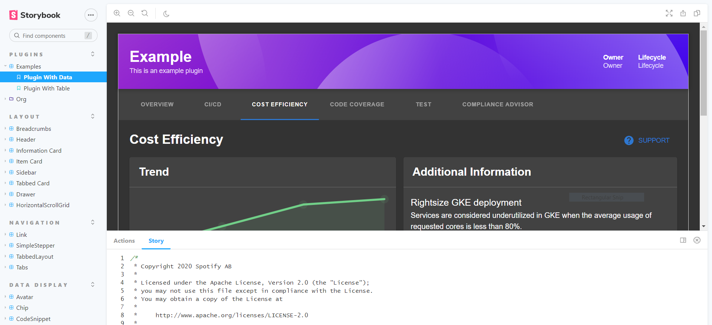
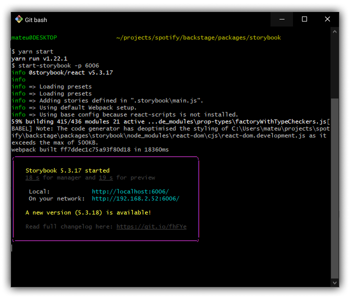

The Backstage Storybook provides you a way to explore reusable Backstage User
Interface elements and how to use them in developing the Backstage core and its
plugins. These UI elements are commonly called "components", and include things
such as buttons, tables, specialized widgets with specific formatting, and so
on.

You'll find our storybook at
[http://backstage.io/storybook](http://backstage.io/storybook).

As noted in the [design introduction](design.md), Backstage's design is based
off of [Material-UI](https://material-ui.com/). Much of the UI elements use
direct Material-UI, while we've also extended and written custom ones to provide
specific functionality.



Storybook "Stories" are used to provide examples for how to use a specific
component, which are then displayed both visually and with sample code to be
copied.

When custom Backstage components are created, they are placed in the
`@backstage/core-components` package and added to the Storybook.

There may be times where an existing Material-UI component (in
`@material-ui/core`) is sufficient and doesn't need to be wrapped or duplicated.
However, we may want to identify an _opinionated_ way to use that component
inside of Backstage. In these cases, stories showing how to use those existing
components will also be put into our storybook.

When a story example using Material-UI becomes more complex, requiring a
specific set of colors, variants, parameters, etc., it may become a candidate to
be refactored to become a full Backstage core component.

## Creating a new Story

> A Story basically represents a single visual state of a component.

To create a new story, create a new file located alongside the component you
want to document on Storybook.

See below an example of the structure:

```
core
└── src
    └── components
        └── Progress
            ├── Progress.tsx
            └── Progress.stories.tsx
```

> _Note: make sure your component story file has the following format
> componentName.stories.tsx_

## Running locally

Go to `packages/storybook`, run `yarn install` and install the dependencies,
then run the following on your command line: `yarn start`



_You should see a log like the image above._

If everything worked out, your server will be running on **port 6006**, go to
your browser and navigate to `http://localhost:6006/`. You should be able to
navigate and see the Storybook page.
