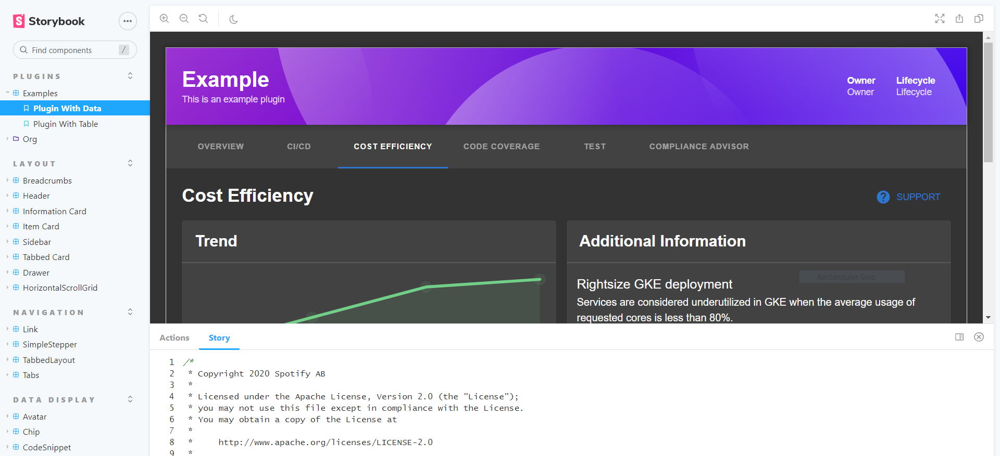
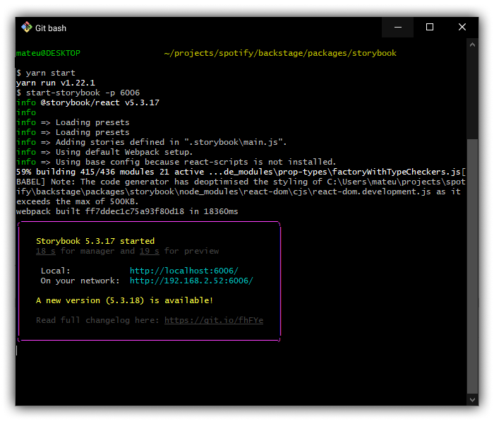

The Backstage Storybook provides you a way to explore reusable Backstage User
Interface elements and how to use them in developing the Backstage core and its
plugins. These UI elements are commonly called "components", and include things
such as buttons, tables, specialized widgets with specific formatting, and so
on.

You'll find our storybook at
[http://backstage.io/storybook](http://backstage.io/storybook).

As noted in the [design introduction](design.md), Backstage's design is built
on [shadcn/ui](https://ui.shadcn.com/) — a collection of accessible, composable UI
components built with Radix UI primitives and styled with Tailwind CSS. Components are
distributed as first-party code within the `@backstage/core-components` package, and
we've extended them with custom components to provide Backstage-specific functionality.



Storybook "Stories" are used to provide examples for how to use a specific
component, which are then displayed both visually and with sample code to be
copied.

When custom Backstage components are created, they are placed in the
`@backstage/core-components` package and added to the Storybook.

There may be times where an existing shadcn/ui primitive component (in
`@backstage/core-components/src/components/ui/`) is sufficient and doesn't need
to be wrapped or duplicated.
However, we may want to identify an _opinionated_ way to use that component
inside of Backstage. In these cases, stories showing how to use those existing
shadcn/ui components will also be put into our storybook.

When a story example using a shadcn/ui primitive becomes more complex, requiring
a specific set of colors, variants, parameters, etc., it may become a candidate
to be refactored to become a full Backstage core component.

## Creating a new Story

> A Story basically represents a single visual state of a component.

To create a new story, create a new file located alongside the component you
want to document on Storybook.

See below an example of the structure:

```
core
└── src
    └── components
        └── Progress
            ├── Progress.tsx
            └── Progress.stories.tsx
```

:::note Note

Make sure your component story file has the following format
componentName.stories.tsx
:::

## Running locally

Go to `storybook`, run `yarn install` and install the dependencies, then run the
following on your command line: `yarn storybook`



_You should see a log like the image above._

If everything worked out, your server will be running on **port 6006**, go to
your browser and navigate to `http://localhost:6006/`. You should be able to
navigate and see the Storybook page.

## Storybook and Tailwind CSS

The `.storybook/main.ts` configuration includes Tailwind CSS support via the
`@tailwindcss/vite` plugin. Stories render with shadcn/ui styles and Tailwind CSS
utility classes automatically, so you can use Tailwind utility classes directly in
your story source code.
