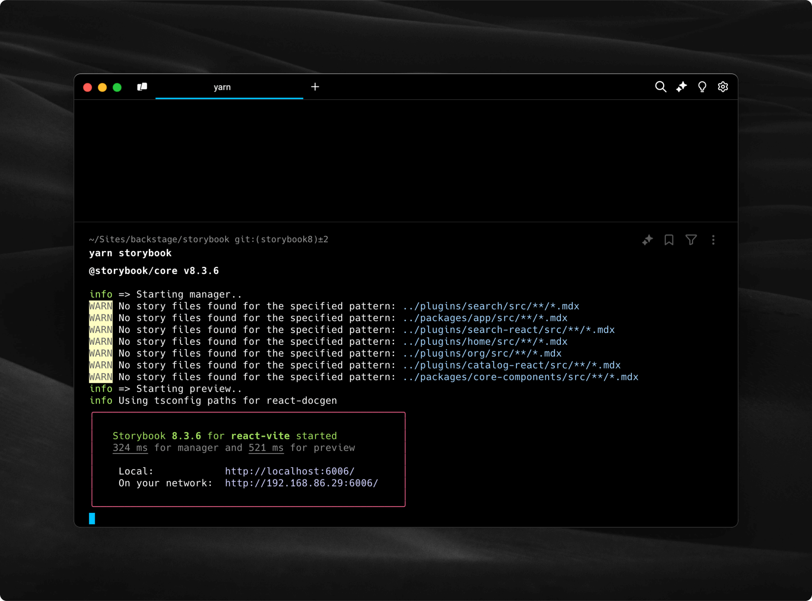
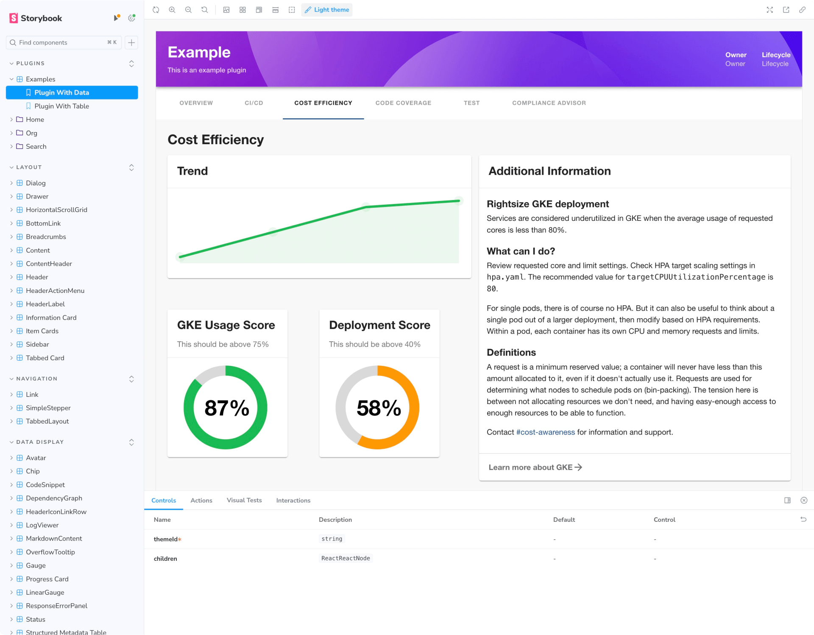

You find our storybook at
[http://backstage.io/storybook](http://backstage.io/storybook)

## Creating a new Story

> A Story basically represents a single visual state of a component.

To create a new story, create a new file located alongside the component you
want to document on Storybook.

See below an example of the structure:

```
core
└── src
    └── components
        └── Progress
            ├── Progress.tsx
            └── Progress.stories.tsx
```

> _Note: make sure your component story file has the following format
> componentName.stories.tsx_

## Running locally

Go to `packages/storybook`, run `yarn install` and install the dependencies,
then run the following on your command line: `yarn start`



_You should see a log like the image above._

If everything worked out, your server will be running on **port 6006**, go to
your browser and navigate to `http://localhost:6006/`. You should be able to
navigate and see the Storybook page.


