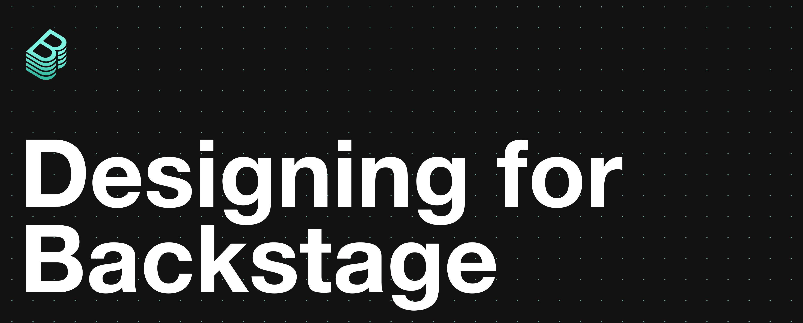
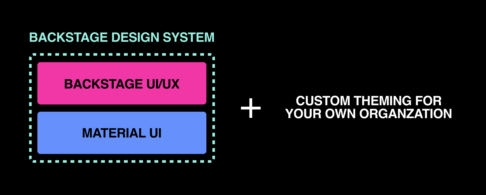

Much like Backstage Open Source, this is a _living_ document! We'll keep this
updated as we evolve our practices!

## 📚 Our Philosophy

### Iterative

Backstage Open Source is a newly launched endeavor, and we’re excited to scale
up our design practices! With that said, we’ll be working closely with you, the
community, and iterating and experimenting as we go to see what works best. As a
continual work in progress, we aspire to release early and often. Not only that,
we are committed to working with developers to create a seamless and easy
handoff. If you’re curious to see how we grow and would like to play a role in
that growth, check out the issues in this GitHub repo!

### Collaborative

The Backstage Design Team is small but mighty, and we truly cherish the amazing
opportunity we have to work with the Backstage Open Source community! Have an
idea? A component request? Feel free to communicate with us via
[Discord](https://discord.gg/EBHEGzX) (_#design_ channel). Collaboration trumps
individual speed, and we want to work with you to make Backstage work for all of
our users.

### Transparent

There are a lot of exciting things coming up and we want to keep you in the
loop! Keep an eye on our
[Milestones in GitHub](https://github.com/backstage/backstage/milestones) to see
where we're headed and review the
[open design issues](https://github.com/backstage/backstage/issues?q=is%3Aopen+is%3Aissue+label%3Adesign),
to see if you can help. We'll also be posting updates in the _#design_ channel
on [Discord](https://discord.gg/EBHEGzX). Not only that, we want to keep you
informed on the decisions we've made and why we've made them.

## 🛠 Our Practice

The chart below details how we work. We have a
[Figma workspace for Backstage Open Source](figma.md), and we plan on
referencing Figma documents to share specs and prototypes with the community.

### Creating a New Design Component

| Step 1                                                                                              | Step 2                                                                             | Step 3                                                                                        | Step 4                                                                     | Step 5                                                                       | Step 6                                                                                 |
| :-------------------------------------------------------------------------------------------------- | :--------------------------------------------------------------------------------- | :-------------------------------------------------------------------------------------------- | :------------------------------------------------------------------------- | :--------------------------------------------------------------------------- | :------------------------------------------------------------------------------------- |
| Platform design team submits an issue to **backstage/backstage GitHub** with a potential component. | Backstage community offers feedback or approval on **backstage/backstage GitHub**. | Platform design team adjusts accordingly (as they see fit) and update the Figma DLS document. | Designed component is added to **backstage/backstage GitHub** as an issue. | External or internal Backstage open source contributors build the component. | External or internal contributors add the component to the **Backstage Storybook**. 🎉 |

### Building for Backstage

| Step 1                                                                                                        | Step 2                                                                                                                      | Step 3                                                                                             | Step 4                                                          |
| :------------------------------------------------------------------------------------------------------------ | :-------------------------------------------------------------------------------------------------------------------------- | :------------------------------------------------------------------------------------------------- | :-------------------------------------------------------------- |
| External or internal contributors use Backstage and come up with an idea of an entity to build for Backstage. | External or internal contributors refer to the Backstage Open Source design system documentation in the Figma DLS document. | External or internal contributors leverage the components and tokens from the Backstage Storybook. | External or internal contributors build their Backstage entity. |

| Step 5                                                                                                           | Step 6                                                                                                       | Step 7                                                                                                                            | Step 8                                                                                            |
| :--------------------------------------------------------------------------------------------------------------- | :----------------------------------------------------------------------------------------------------------- | :-------------------------------------------------------------------------------------------------------------------------------- | :------------------------------------------------------------------------------------------------ |
| External or internal contributors make a pull request for their entity on backstage/backstage GitHub for review. | Platform designers and devs review the entity and submit feedback or approval on backstage/backstage GitHub. | External or internal contributors make the changes, pull request is approved and the entity is merged. It’s live on Backstage! 🎉 | If the entity happens to be or include a UX component, it’s added to Backstage Storybook as well. |

The following diagram shows the relationship between the Backstage Design System
and our foundation, which comprises of [Material UI](https://material-ui.com/)
that is shaped by user experience and user interface decisions made by our
Backstage Design Team. Also note, we encourage you to take the core experience
we’ve crafted and add custom theming to better represent your organization!

## ✅ Our Priorities

### Backstage Design System

This is the set of building blocks for Backstage contributors to leverage as
they create rad plugins for Backstage! Why reinvent the wheel when you can use
components that have already been vetted by our team and the Backstage
community? In the spirit of crafting a cohesive and consistent user experience
across all of Backstage, we strongly urge all plugin developers to utilize our
Storybook as a reference. Our design system is new and evolving, and we’ll be
building it up with your help!

### Core Backstage User Experience

This is the universal user experience that is shared amongst all Backstage
users. From more concrete aspects like the plugins marketplace to more abstract
ones like end-to-end workflows on Backstage, we’ll be working with the community
to create a core user experience that best serves you and your organization.

## ⭐️ How to Contribute

### Pick up an issue!

In the beginning, most of our issues will be centered around creating universal
components for our Backstage Design System and adding them to our Storybook so
plugin developers can reference them. We’ll also be creating issues that are
focused on building up our core Backstage user experience. We’ll be labeling our
issues in GitHub with ‘design’ and/or ‘storybook’ - so feel free to browse and
tackle the tasks that interest you. If you have any questions regarding an
issue, you can ask them in the comments section of the issue or on
[Discord](https://discord.gg/EBHEGzX). We absolutely adore our external
contributors and will send you virtual
[semlas](https://en.wikipedia.org/wiki/Semla) for your contributions!

### Request a component

Create an issue (label it design and assign it to katz95) or send us a message
on [Discord](https://discord.gg/EBHEGzX) (_#design_ channel) with details of
what the component is and its relevant use cases. Your request will be reviewed
by our design team and you should hear back from us within 1-2 business days.
We’ll get back to you and let you know whether your requested component will get
picked up by our team as something to be added to our design system.

## ✏️ Resources

**[Storybook](http://backstage.io/storybook)** - where you can view our
components. If you’d like to help build up our design system, you can also add
components we’ve designed to the Storybook as well.

**[Figma](https://www.figma.com/@backstage)** - we're stoked to be using Figma
Community to share our design assets. You can duplicate our UI Kit and design
your own plugin for Backstage.

**[Discord](https://discord.gg/EBHEGzX)** - all design questions should be
directed to the _#design_ channel.

**[Customize Backstage's look and feel](https://backstage.io/docs/getting-started/app-custom-theme)** -
How to customize the look and feel of your Backstage instance by extending the
theme.

## 🔮 Future

### Contributions from designers

Are you a designer at an organisation that’s implementing Backstage? A designer
who’s fascinated by the developer productivity problem space? A designer who’s
curious about open source design? We’d love for you to contribute. Behind the
scenes, we’re setting up a few foundational elements to make sure that
contributing to Backstage as a designer is easy. From styling guidelines to UX
principles to Figma documents, we’ll make sure you’re equipped to chip in on
this project. We’re excited to work with you! In the meantime, we’d love to hear
from you on [Discord](https://discord.gg/EBHEGzX).
