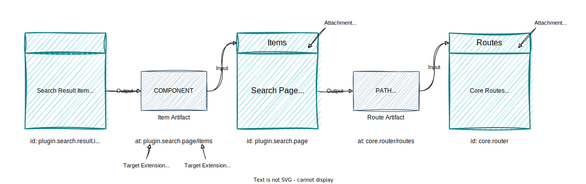

# Declarative Integrated Search Plugin

> **Disclaimer:**
> Declarative integration is in an experimental stage and is not recommended for production.

This is a guide for experimenting with `Search` in a declarative integrated Backstage front-end application.

## Main Concepts

Using declarative integration, you can customize your Backstage instance without writing code, see this [RFC](https://github.com/backstage/backstage/issues/18372) for more information.

In the new frontend system, everything that extends Backstage's core features is called an extension, so an extension can be anything from an API to a page component.

Extensions produces output artifacts and these artifacts are inputs consumed by other extensions:



In the image above, a `SearchResultItem` extension outputs a component and this component is injected as input to the `SearchPage` "items" attachment point. The `SearchPage` in turn uses the search result items to compose a search page element and outputs a route path and the page element so they are used as inputs attached to the `CoreRoutes` extension. Finally, the `CoreRoutes` renders the page element when the location matches the search page path.

The basic concepts briefly mentioned are crucial to understanding how the declarative version of the `Search` plugin works.

## Search Plugin

The search plugin is a collection of extensions that implement the search feature in Backstage.

### Installation

Only one step is required to start using the `Search` plugin within declarative integration, so all you have to do is to install the `@backstage/plugin-catalog` and `@backstage/plugin-search` packages, (e.g., [app-next](https://github.com/backstage/backstage/tree/master/packages/app-next)):

```sh
yarn add @backstage/plugin-catalog @backstage/plugin-search
```

The `Search` plugin depends on the `Catalog API`, that's the reason we have to install the ` @backstage/plugin-catalog` package too.

### Extensions

The `Search` plugin provides the following [extensions preset](https://github.com/backstage/backstage/blob/3f4a44aef39bd8dbf5098e60b6fdf66fd754c6d9/plugins/search/src/alpha.tsx#L246):

- **SearchApi**: Outputs a concrete implementation for the `Search API` that is attached as an input to the `Core` apis holder;
- **SearchPage**: Outputs a component that represents the advanced `Search` page interface, this extension expects `Search` result items components as inputs to use them for rendering results in a custom way;
- **SearchNavItem**: It is an extension that outputs a data that represents a `Search` item in the main application sidebar, in other words, it inputs a sidebar item to the `Core` nav extension.

### Configurations

The `Search` extensions are configurable via `app-config.yaml` file in the `app.extensions` field using the extension id as the configuration key:

_Example disabling the search page extension_

```yaml
# app-config.yaml
app:
  extensions:
    - page:search: false # ✨
    - nav-item:search: false # ✨
```

_Example setting the search sidebar item title_

```yaml
# app-config.yaml
app:
  extensions:
    - nav-item:search: # ✨
        config:
          title: 'Search Page'
```

> **Known limitations:**
> It is currently not possible to open modals in sidebar items and also configure a different icon via configuration file, but it is already on the maintainers' radar.

### Customizations

Plugin developers can use the `createSearchResultItemExtension` factory provided by the `@backstage/plugin-search-react` for building their own custom `Search` result item extensions.

_Example creating a custom `TechDocsSearchResultItemExtension`_

```tsx
// plugins/techdocs/alpha.tsx
import { createSearchResultListItemExtension } from '@backstage/plugin-search-react/alpha';

/** @alpha */
export const TechDocsSearchResultListItemExtension =
  createSearchResultListItemExtension({
    id: 'techdocs',
    configSchema: createSchemaFromZod(z =>
      z.object({
        noTrack: z.boolean().default(false),
        lineClamp: z.number().default(5),
      }),
    ),
    predicate: result => result.type === 'techdocs',
    component: async ({ config }) => {
      const { TechDocsSearchResultListItem } = await import(
        './components/TechDocsSearchResultListItem'
      );
      return props => <TechDocsSearchResultListItem {...props} {...config} />;
    },
  });
```

In the snippet above, a plugin developer is providing a custom component for rendering search results of type "techdocs". The custom result item extension will be enabled by default once the `@backstage/plugin-techdocs` package is installed, that means adopters don't have to enable the extension manually via configuration file.

When a Backstage adopter doesn't want to use the custom `TechDocs` search result item after installing the `TechDocs` plugin, they could disable it via Backstage configuration file:

```yaml
# app-config.yaml
app:
  extensions:
    - plugin.search.result.item.techdocs: false # ✨
```

Because a configuration schema was provided to the extension factory, Backstage adopters will be able to customize `TechDocs` search results **line clamp** that defaults to 3 and also **disable automatic analytics events tracking**:

```yaml
# app-config.yaml
app:
  extensions:
    - plugin.search.result.item.techdocs:
        config: # ✨
          noTrack: true
          lineClamp: 3
```

[comment]: <> (TODO: Extract this explanation to a more central place in the future)
The `createSearchResultItemExtension` function returns a Backstage's extension representation as follows:

```ts
{
  "$$type": "@backstage/Extension", // [1]
  "id": "plugin.search.result.item.techdocs", // [2]
  "at": "plugin.search.page/items", // [3]
  "inputs": {} // [4️]
  "output": { // [5️]
    "item": {
      "$$type": "@backstage/ExtensionDataRef",
      "id": "plugin.search.result.item.data",
      "config": {}
    }
  },
  "configSchema": { // [6️]
    "schema": {
      "type": "object",
      "properties": {
        "noTrack": {
          "type": "boolean",
          "default": false
        },
        "lineClamp": {
          "type": "number",
          "default": 5
        }
      },
      "additionalProperties": false,
      "$schema": "http://json-schema.org/draft-07/schema#"
    }
  },
  "disabled": false, // [7️]
}
```

In this object, you can see exactly what will happen once the custom extension is installed:

- **[1] $$type**: declares that the object represents an extension;
- **[2] id**: Is a unique identification for the extension, the `plugin.search.result.item.techdocs` is the key used to configure the extension in the `app-config.yaml` file;
- **[3] at**: It represents the extension attachment point, so the value `plugin.search.page/items` says that the `TechDocs`'s search result item output will be injected as input on the "items" attachment expected by the search page extension;
- **[4] inputs**: in this case is an empty object because this extension doesn't expect inputs;
- **[5] output**: Object representing the artifact produced by the `TechDocs` result item extension, on the example, it is a react component reference;
- **[6] configSchema**: represents the `TechDocs` search result item configuration definition, this is the same schema that adopters will use for customizing the extension via `app-config.yaml` file;
- **[7] disable**: Says that the result item extension will be enable by default when the `TechDocs` plugin is installed in the app.

To complete the development cycle for creating a custom search result item extension, we should provide the extension via `TechDocs` plugin:

```tsx
// plugins/techdocs/alpha.tsx
import { createPlugin } from "@backstage/frontend-plugin-api";

// plugins should be always exported as default
export default createPlugin({
  id: 'techdocs'
  extensions: [TechDocsSearchResultItemExtension]
})
```

Here is the `plugins/techdocs/alpha.tsx` final version, and you can also take a look at the [actual implementation](https://github.com/backstage/backstage/blob/master/plugins/techdocs/src/alpha.tsx) of a custom `TechDocs` search result item:

```tsx
// plugins/techdocs/alpha.tsx
import { createPlugin } from '@backstage/frontend-plugin-api';
import { createSearchResultListItemExtension } from '@backstage/plugin-search-react/alpha';

/** @alpha */
export const TechDocsSearchResultListItemExtension =
  createSearchResultListItemExtension({
    id: 'techdocs',
    configSchema: createSchemaFromZod(z =>
      z.object({
        noTrack: z.boolean().default(false),
        lineClamp: z.number().default(5),
      }),
    ),
    predicate: result => result.type === 'techdocs',
    component: async ({ config }) => {
      const { TechDocsSearchResultListItem } = await import(
        './components/TechDocsSearchResultListItem'
      );
      return props => <TechDocsSearchResultListItem {...props} {...config} />;
    },
  });

/** @alpha */
export default createPlugin({
  // plugins should be always exported as default
  id: 'techdocs',
  extensions: [TechDocsSearchResultListItemExtension],
});
```

### Future Enhancement Opportunities

Backstage maintainers are currently working on the extension replacement feature, and with this release, adopters will also be able to replace extensions provided by plugins, so stay tuned for future updates to this documentation.

The first version of the `SearchPage` extension makes room for the `Search` plugin maintainers to convert filters into extensions as well in the future, if you also would like to collaborate with them on this idea, don't hesitate to open an issue and submit a pull request, your contribution is more than welcome!
