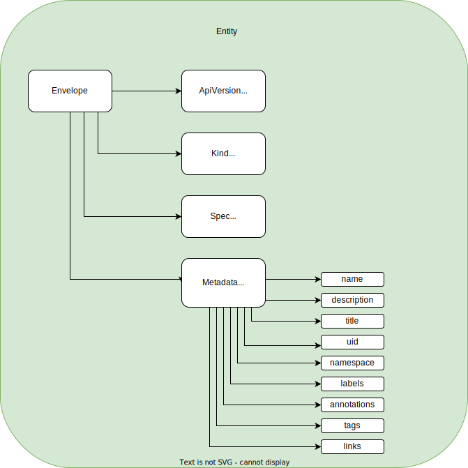

# Creating the Catalog Graph

## Overview

The Software Catalog in Backstage is intended to capture human mental models using entities and their relationships rather than an exhaustive inventory of all possible things. The focus is on attaching functionality and views centered around these entities. Determining the "edge" where the catalog ends and the external world begins is crucial to ensure that the catalog's scope is appropriate.
The Backstage software catalog serves as a centralized hub for organizing and discovering software components and services. While it excels at providing a high-level overview of these concepts, it may not be the ideal solution for tracking dynamic relationships between components and services in real-time. You can achieve real time views by attaching appropriate tooling to the nodes in the graph through [annotations](https://backstage.io/docs/features/software-catalog/well-known-annotations) and developing custom front-end [plugins](http://localhost:3000/docs/plugins/) that display deployment information and other real-time data.
It is worth noting that the Backstage Software Catalog should not be considered the ultimate source of truth, instead, it is advisable to use the Backstage Catalog as a caching mechanism that utilizes a REST API to convey information to the catalog UI and other Backstage plugins. Adopting a GitOps approach is recommended to modify YAML files in Backstage, treating YAML files in repositories as the primary source of truth and using Scaffolder to make changes via the UI and generate a pull request in the repository with the updated changes.

### Descriptor Components used to build the Catalog Graph

[**Entities:**](https://backstage.io/docs/features/software-catalog/system-model) An entity refers to a node in the graph that represents a distinct object, concept, or thing. Nodes are the fundamental building blocks of a graph database and are used to represent entities and their properties.

[**Kinds:**](https://backstage.io/docs/features/software-catalog/descriptor-format#contents) These are broad categories used to group related entities. Kinds are used to provide a high-level categorization of entities, such as "service", "database", or "team". Kinds are often used to provide a way to filter entities in the catalog and to provide a high-level overview of the types of entities that are being managed.

[**Relations:**](https://backstage.io/docs/features/software-catalog/descriptor-format#common-to-all-kinds-relations) These are links between different entities in the catalog. Relations express the relationships between different entities, such as dependencies or ownership. Adopters can use relations to help users navigate the catalog and understand the relationships between different entities.

[**Spec:**](https://backstage.io/docs/features/software-catalog/descriptor-format#spec-varies) A specification or "spec" is a schema that outlines the data structure of an entity in the Backstage catalog. It defines the properties, relationships, data types, and constraints for an entity, ensuring consistency and accuracy of data while allowing for easy sharing and consumption of data across components and plugins. Specs are useful when creating or extending entities and can help make data more reusable and interoperable. The spec section is fully customizable, and users can create their own components and plugins to render the information.

[**Types:**](https://backstage.io/docs/features/software-catalog/system-model#type) These are more specific categories used to classify entities within a given Kind. Types provide a more granular categorization of entities, such as "frontend-service" or "backend-service.". Types are often used to provide additional context and information about an entity and to help users understand the role and function of the entity within the broader system.

[**Annotations:**](https://backstage.io/docs/features/software-catalog/well-known-annotations) These key-value pairs can be attached to an entity in the catalog. They are typically used to add additional information or metadata to an entity. Annotations are often used to provide information that is used by automated tools or scripts and to provide further context to humans working with the entity or refer plugins to the external world.

## Use cases out of the box

The catalog builds a graph using [descriptors](https://backstage.io/docs/features/software-catalog/descriptor-format) as nodes and [relations](https://backstage.io/docs/features/software-catalog/descriptor-format#common-to-all-kinds-relations) as edges. Out of the box you get the following use cases:

- Ownership tracking
- Inventory
- Search
- Lifecycle tracking
- Tracking of real-time information sources
- Dependency mapping
- API exposure

## Tracking Assets

The recommended approach would be to represent information in catalog-info files, which the users themselves can manage. While automated classification based on repository contents can be helpful, it is recommended to use it only to generate the initial file and then allow humans to maintain it manually. The reason is that automation can sometimes fail, and it is essential to ensure the accuracy and reliability of this metadata. In short, humans should govern this piece of metadata to maintain its integrity.

### Well-known trackable assets

**Components**

- Services
- Websites
- Libraries
- Data Pipelines
- Machine Learning Models
- Third-party software components: It is recommended to have a separate repo for all 3d party catalog-info files.
- Jira installation
- Pagerduty

**Resources**

- Physical resources: This is probably more useful for longer-lived ones (For example servers).
- Cloud Infrastructure services

**Ownership - users - groups by**

- Business units
- Team
- Product area

**Naming strategies:**

- Ldap: Internal ldap usernames as entity names. e.g., owner: user:my-user or user: my-team-name.

**Ownership strategies:**

**Ownership based on teams:** The concept of ownership in the system is team-centric; hence, the "owner" field must reference the LDAP name of a squad according to a prescribed set of regulations. While there may be instances where the ownership is attributed to an individual, such deviations might create challenges. In such cases, the user could receive a notification through the web interface, highlighting that this departure is an exception and needs rectification. To ensure adherence to this system, every entity in the model should have a designated owner, preferably a valid team within the LDAP hierarchy.

**Ownership of features:** To track the ownership of specific features within your products and their interrelationships, two options are available: introducing a new component [type](https://backstage.io/docs/features/software-catalog/system-model/#type), such as "feature," or creating a new [Kind](https://backstage.io/docs/features/software-catalog/descriptor-format/#contents) altogether. Nonetheless, it is advisable to choose the former approach and introduce a new type, like "feature," is advisable as it is less complicated and poses a lower risk.

**LDAP doesn’t reflect the organization structure:** If Workday or a similar system serves as the source of truth, and LDAP is utilized for user attributes, it is advisable to develop a layer on top of various systems to establish a unified API that the entire organization can query, rather than only Backstage.

**APIs**

- OpenApi
- AsyncApi
- graphQL
- gRPC

APIs Could list networked services or libraries and it’s particularly useful to identify APIs that form boundaries between systems. There are some considerations to keep in mind:

**API versions:** Major API versions can be treated as distinct APIs, and it is possible to create separate entity instances for each (e.g., metadata.name: my-api-v1 and metadata.name: my-api-v2). However, this approach is not recommended for minor or patch-level variations

**Detail:** It’s not recommended going too granular because the catalog in its current form won't perhaps be a great platform to express it.

**Relationships between APIs:** The idea is that you have a service component that exposes an api and then, it's not the api that consumes the other api, it's the component that consumes the other api.

**Backend for front end API (BFF):** The suggestion is to create separate components for the frontend and backend services, with the frontend component having a type of "website" and the backend component having a type of "service". This is because the BFF API is tailored for a specific UI and is not meant to be used by others, making it unnecessary to include in the catalog.

**API registry:** The exploration of all APIs within an organization is a typical use case for an API registry.

## Reference models

**C4 model:** For inspiration, you could review the [C4 model](https://c4model.com/), which defines a pattern for visualizing software architecture.
