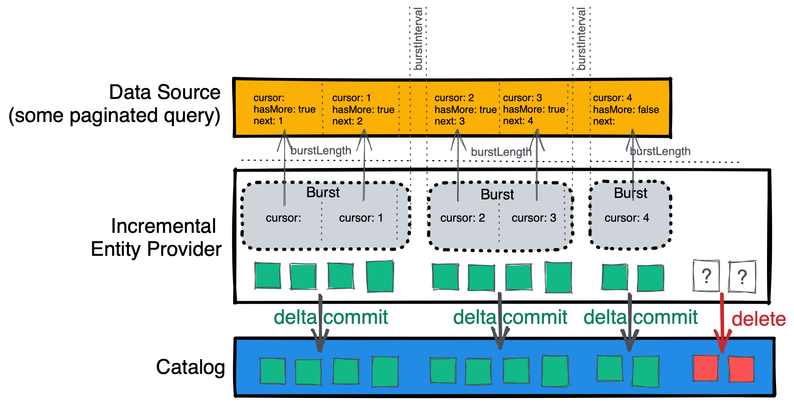

For large data sources that support pagination but may not fit into memory,
the incremental entity provider ingests data in pages across multiple
"bursts". It handles deletions and updates without holding the full data set
at once, which keeps memory usage predictable regardless of the source size.

## Why use an incremental entity provider?

The standard [entity provider](entity-providers.md) offers two kinds of
mutations: `delta` and `full`. Both have limitations when dealing with very
large data sources (100k+ records):

- A `full` mutation requires all entities in memory to compute a diff. At
  scale, this can exhaust process memory.
- A `delta` mutation avoids the memory problem, but cannot guarantee that
  events are never missed. If your Backstage instance is down when a DELETE
  event arrives, the catalog ends up in an inconsistent state.
- Even when using `delta` mutations, you still need a way to build the
  initial list of entities. For example, if you ingest all repositories from
  GitHub using webhooks, you still need the starting set.
- Committing a large number of entities at once with a `full` mutation
  floods the processing queue and delays processing for other providers.

The incremental entity provider addresses all of these issues with a
combination of `delta` mutations and a mark-and-sweep mechanism.

## How it works

Instead of a single `full` mutation, the incremental entity provider
performs a series of short bursts. At the end of each burst, it:

1. Marks each received entity in the database.
1. Commits the entities with a `delta` mutation.

The provider waits a configurable interval before proceeding to the next
burst.

Once the source has no more results, the provider compares all entities it
has previously committed against the entities marked during the current
ingestion cycle. Any unmarked entities are deleted. The provider then rests
for a configured interval before starting a new cycle.



This approach has several benefits:

- Reduced ingestion latency — each burst commits entities that the catalog
  can process before the full data set has been read.
- Stable pressure on the processing pipeline — pauses between bursts give
  the pipeline time to settle without being overwhelmed.
- Built-in retry and back-off — failed bursts are retried automatically
  with configurable back-off intervals.
- Orphan prevention — deleted entities are removed through the mark-and-sweep
  mechanism with a low memory footprint.

## Requirements

The incremental entity provider is designed for data sources that provide
paginated results. Each burst attempts to handle one or more pages. The
plugin fetches as many pages as it can within a configurable burst length,
and at every iteration it expects to receive the next cursor for the
following page.

Each iteration may happen on a different replica, which has several
consequences:

- The cursor must be serializable to JSON (not an issue for most RESTful or
  GraphQL-based APIs).
- The client must be stateless — a client is created from scratch for each
  iteration to allow distributing processing over multiple replicas.
- There must be sufficient storage in Postgres to handle the additional data.

## Installation

1. Install the package from the Backstage root directory:

   ```sh
   yarn --cwd packages/backend add @backstage/plugin-catalog-backend-module-incremental-ingestion
   ```

1. Add the module to your backend:

   ```ts title="packages/backend/src/index.ts"
   const backend = createBackend();

   /* highlight-add-start */
   backend.add(
     import('@backstage/plugin-catalog-backend-module-incremental-ingestion'),
   );
   /* highlight-add-end */

   backend.start();
   ```

## Writing an incremental entity provider

An incremental entity provider needs three methods:

- `getProviderName` — a unique name to avoid conflicts with other providers.
- `around` — wraps the iteration process, handling setup and cleanup (for
  example, creating an API client).
- `next` — fetches a specific page of entities by advancing a cursor.

Here is the full interface:

```ts
interface IncrementalEntityProvider<TCursor, TContext> {
  getProviderName(): string;
  next(
    context: TContext,
    cursor?: TCursor,
  ): Promise<EntityIteratorResult<TCursor>>;
  around(burst: (context: TContext) => Promise<void>): Promise<void>;
}
```

This walkthrough builds an incremental entity provider that talks to an
imaginary paginated API.

### Define the types

Start with types for the API client, its responses, and the cursor that
tracks pagination state:

```ts
interface MyApiClient {
  getServices(page: number): MyPaginatedResults<Service>;
}

interface MyPaginatedResults<T> {
  items: T[];
  totalPages: number;
}

interface Service {
  name: string;
}
```

### Set up the class

Create the provider class with the cursor and context types. The cursor
holds pagination state, and the context carries anything you need during
iteration (such as an API client):

```ts
import { IncrementalEntityProvider } from '@backstage/plugin-catalog-backend-module-incremental-ingestion';

interface Cursor {
  page: number;
}

interface Context {
  apiClient: MyApiClient;
}

export class MyIncrementalEntityProvider
  implements IncrementalEntityProvider<Cursor, Context>
{
  private readonly token: string;
  private readonly mySource: string;

  constructor(token: string, mySource: string) {
    this.token = token;
    this.mySource = mySource;
  }

  getProviderName() {
    return `MyIncrementalEntityProvider`;
  }
}
```

### Implement `around`

The `around` method runs before and after the page iteration cycle. Use it
for setup (creating clients, acquiring connections) and cleanup:

```ts
async around(burst: (context: Context) => Promise<void>): Promise<void> {
  const apiClient = new MyApiClient(this.token);
  await burst({ apiClient });
  // Teardown logic goes here if needed
}
```

### Implement `next`

The `next` method fetches one page of data using the cursor, converts the
results to entities, and returns the next cursor position along with a
`done` flag:

```ts
import {
  ANNOTATION_LOCATION,
  ANNOTATION_ORIGIN_LOCATION,
} from '@backstage/catalog-model';

async next(
  context: Context,
  cursor: Cursor = { page: 1 },
): Promise<EntityIteratorResult<Cursor>> {
  const { apiClient } = context;
  const location = `${this.getProviderName()}:${this.mySource}`;

  const data = await apiClient.getServices(cursor.page);
  const nextPage = cursor.page + 1;
  const done = nextPage > data.totalPages;

  const entities = data.items.map(item => ({
    entity: {
      apiVersion: 'backstage.io/v1beta1',
      kind: 'Component',
      metadata: {
        name: item.name,
        annotations: {
          [ANNOTATION_LOCATION]: location,
          [ANNOTATION_ORIGIN_LOCATION]: location,
        },
      },
      spec: {
        type: 'service',
        lifecycle: 'production',
        owner: 'unknown',
      },
    },
  }));

  return {
    done,
    entities,
    cursor: { page: nextPage },
  };
}
```

## Installing the incremental entity provider

After completing the [installation](#installation) step, create a backend
module for your provider. This example puts it at
`packages/backend/src/extensions/catalogCustomIncrementalIngestion.ts`:

```ts title="packages/backend/src/extensions/catalogCustomIncrementalIngestion.ts"
import {
  coreServices,
  createBackendModule,
} from '@backstage/backend-plugin-api';
import { incrementalIngestionProvidersExtensionPoint } from '@backstage/plugin-catalog-backend-module-incremental-ingestion';

export const catalogModuleCustomIncrementalIngestionProvider =
  createBackendModule({
    pluginId: 'catalog',
    moduleId: 'custom-incremental-ingestion-provider',
    register(env) {
      env.registerInit({
        deps: {
          incrementalBuilder: incrementalIngestionProvidersExtensionPoint,
          config: coreServices.rootConfig,
        },
        async init({ incrementalBuilder, config }) {
          const token = config.getString('myApiClient.token');
          const myEntityProvider = new MyIncrementalEntityProvider(
            token,
            'production',
          );

          incrementalBuilder.addProvider({
            provider: myEntityProvider,
            options: {
              burstLength: { seconds: 3 },
              burstInterval: { seconds: 3 },
              restLength: { days: 1 },
              backoff: [
                { seconds: 5 },
                { seconds: 30 },
                { minutes: 10 },
                { hours: 3 },
              ],
              rejectRemovalsAbovePercentage: 5,
              rejectEmptySourceCollections: true,
            },
          });
        },
      });
    },
  });
```

The `options` object controls how the incremental ingestion engine operates:

- `burstLength` — how long a single burst of page reads can run. Keep this
  short.
- `burstInterval` — pause between bursts.
- `restLength` — how long to wait before re-ingesting from the beginning.
- `backoff` — retry delays after errors, applied in order.
- `rejectRemovalsAbovePercentage` — prevents removing more than a given
  percentage of entities in a single cycle. This protects against flaky
  upstream sources that return partial results.
- `rejectEmptySourceCollections` — rejects a successful response that
  contains zero entities, preventing accidental deletion of all catalog
  entries for this source.

Add the module to `packages/backend/src/index.ts`:

```ts title="packages/backend/src/index.ts"
/* highlight-add-next-line */
import { catalogModuleCustomIncrementalIngestionProvider } from './extensions/catalogCustomIncrementalIngestion';

const backend = createBackend();

backend.add(
  import('@backstage/plugin-catalog-backend-module-incremental-ingestion'),
);
/* highlight-add-next-line */
backend.add(catalogModuleCustomIncrementalIngestionProvider);

backend.start();
```

## Administrative routes

The incremental ingestion plugin exposes REST endpoints for managing
providers at runtime:

| Method | Path                                                   | Description                                                            |
| :----- | :----------------------------------------------------- | :--------------------------------------------------------------------- |
| GET    | `/api/catalog/incremental/health`                      | Check the health of all incremental providers.                         |
| GET    | `/api/catalog/incremental/providers`                   | List all known incremental entity providers.                           |
| GET    | `/api/catalog/incremental/providers/:provider`         | Check the status of a specific provider (resting, interstitial, etc.). |
| POST   | `/api/catalog/incremental/providers/:provider/trigger` | Trigger the provider's next action immediately.                        |
| POST   | `/api/catalog/incremental/providers/:provider/start`   | Stop the current ingestion cycle and start a new one immediately.      |
| POST   | `/api/catalog/incremental/providers/:provider/cancel`  | Stop the current ingestion cycle and start a new one in 24 hours.      |
| DELETE | `/api/catalog/incremental/providers/:provider`         | Remove all records for the provider and restart it in 24 hours.        |
| GET    | `/api/catalog/incremental/providers/:provider/marks`   | Retrieve ingestion marks for the current cycle.                        |
| DELETE | `/api/catalog/incremental/providers/:provider/marks`   | Remove all ingestion marks for the current cycle.                      |
| POST   | `/api/catalog/incremental/cleanup`                     | Remove all records for all providers and restart them in 24 hours.     |

In all cases, `:provider` is the name returned by `getProviderName`.

:::caution
The cleanup endpoint removes records for all providers. Use it with care —
it can cause orphan entities if providers do not re-ingest promptly.
:::

## Error handling

If the `around` or `next` method throws an error, the incremental entity
provider logs the error and retries after the next back-off interval. It
keeps retrying through the configured back-off steps. After exhausting all
retries, it cancels the current ingestion cycle and starts over. You do not
need to implement retry logic yourself.

For more technical details, see the
[incremental ingestion plugin README](https://github.com/backstage/backstage/tree/master/plugins/catalog-backend-module-incremental-ingestion).
