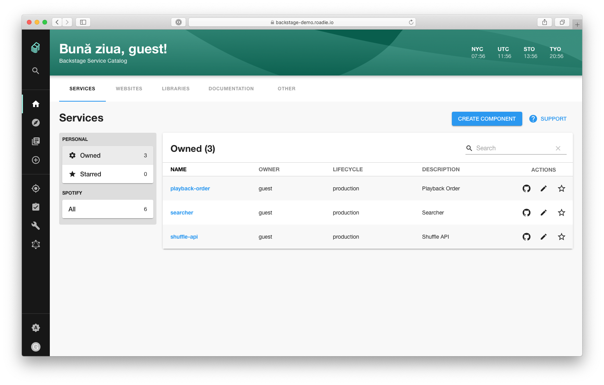

# Backstage Service Catalog (alpha)

## What is a Service Catalog?

The Backstage Service Catalog — actually, a software catalog, since it includes
more than just services — is a centralized system that keeps track of ownership
and metadata for all the software in your ecosystem (services, websites,
libraries, data pipelines, etc). The catalog is built around the concept of
[metadata yaml files](../../architecture-decisions/adr002-default-catalog-file-format.md#format)
stored together with the code, which are then harvested and visualized in
Backstage.

We have also found that the service catalog is a great way to organise the
infrastructure tools you use to manage the software as well. This is how
Backstage creates one developer portal for all your tools. Rather than asking
teams to jump between different infrastructure UI’s (and incurring additional
cognitive overhead each time they make a context switch), most of these tools
can be organised around the entities in the catalog.

## Using the Service Catalog

