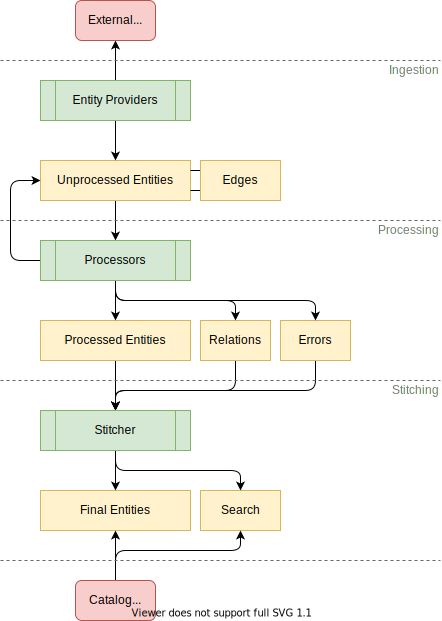
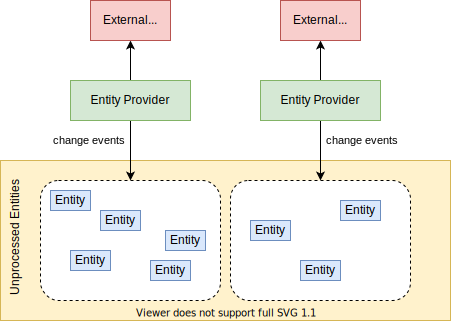
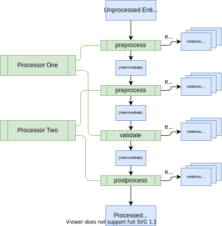
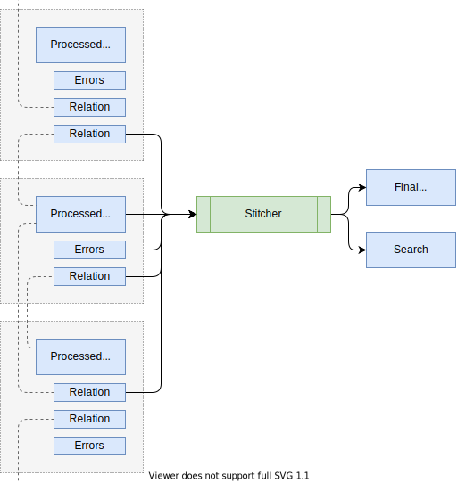

This document gives a high level overview of the catalog backend, and the
technical processes involved in making entities flow through it. It is mainly
aimed at developers who want to understand the internals while installing or
extending the catalog. However, it can be informative for other personas too.

## Key Concepts

The catalog forms a hub of sorts, where entities are ingested from various
authoritative sources and held in a database, subject to automated processing,
and then presented through an API for quick and easy access by Backstage and
others. The most common source is [YAML files](descriptor-format.md) on a
standard format, living in version control systems near the source code of
systems that they describe. Those files are registered with the catalog and
maintained by the respective owners. The catalog makes sure to keep itself up to
date with changes to those files.

The main extension points where developers can customize the catalog are:

- _Entity providers_, that feed initial raw entity data into the catalog,
- _Policies_, that establish baseline rules about the shape of entities,
- _Processors_, that validate, analyze, and mutate the raw entity data into its
  final form.

The high level processes involved are:

- _Ingestion_, where entity providers fetch raw entity data from external
  sources and seed it into the database,
- _Processing_, where the policies and processors continually treat the ingested
  data and may emit both other raw entities (that are also subject to
  processing), errors, relations to other entities, etc.,
- _Stitching_, where all of the data emitted by various processors are assembled
  together into the final output entity.

An entity is not visible to the outside world (through the catalog API), until
it has passed through the last process and landed among the final entities.

The details of these processes are described below.

## Ingestion

Each catalog deployment has a number of entity providers installed. They are
responsible for fetching data from external authoritative sources in any way
that they see fit, to translate those into entity objects, and to notify the
database when those entities are added or removed. These are the _unprocessed
entities_ that will be subject to later processing (see below), and they form
the very basis of existence for entities. If there were no entity providers, no
entities would ever enter the system.

The database always keeps track of the set of entities that belong to each
provider; no two providers can try to output the same entity. And when a
provider signals the removal of an entity, then that leads to an _eager
deletion_: the entity and all auxiliary data that it has led to in the database
is immediately purged.

There are two providers installed by default: the one that deals with user
registered locations (e.g. URLs to YAML files), and the one that deals with
static locations in the app-config. You can add more third party providers by
passing them to the catalog builder in your backend initialization code, and you
can easily write your own.

An entity provider is a class that implements the `EntityProvider` interface. It
has three main parts:

- The identity: Each provider instance has a unique, stable identifier that the
  database can use to keep track of the originator of each unprocessed entity.
- The connection: During backend startup, each provider is attached to the
  catalog runtime.
- The stream of events: During its lifetime, the provider can issue change
  events to the runtime at any point in time, to modify its set of unprocessed
  entities.

It is entirely up to the provider to choose how and when it produces these
change events. For example, the app-config provider only fires off an update at
startup and then lies dormant. The location database provider does an initial
update at startup, and then small delta updates every time a location database
change is detected. The LDAP provider is driven externally by a timer loop that
occasionally triggers a full update. Some future provider may be entirely event
driven, feeding off an event bus or web hook. There is no magic coordination
among providers; if they need to arrange synchronization or locking among
themselves for example to avoid duplicate work across multiple catalog service
machines, they need to handle that out-of-band.

The entities that are emitted get some coarse validation applied to them, to
ensure that they at least adhere to the most basic schema rules about how an
entity should be shaped. For example, they need to have a `kind`, a
`metadata.name`, and optionally a `metadata.namespace`, among others. Apart from
that, the ingestion stage considers its work done, and stores the unprocessed
entities to be picked up at a later time by the processing system. This means
that the more precise validation rules that you put in place on entities are
_not_ yet applied at this stage.

## Processing

Every unprocessed entity comes with a timestamp, which tells at what time that
the processing loop should next try to process it. When the entity first
appears, this timestamp is set to "now" - asking for it to be picked up as soon
as possible.

Each catalog deployment has a number of processors installed. They are
responsible for receiving unprocessed entities that the catalog decided are due
for processing, and then running that data through a number of processing
stages, mutating the entity and emitting auxiliary data about it. When all of
that is done, the catalog takes all of that information and stores it as the
processed entity, and errors and relations to other entities separately. Then,
the catalog checks to see what entities are touched by that output, and triggers
the final assembly of those (see Stitching below).

Entities are always processed one by one, but all of your catalog service hosts
collaborate in doing so to distribute the load. Note how each processor can
contribute to one or more of the fixed steps in the processing pipeline. First
all of the processors' contributions to one step are run in the order that the
processors were registered, then all of their contributions to the next step in
the same order, and so on.

Each step has the opportunity to optionally modify the entity, and to optionally
emit other information. For example, the processor might look at information in
the `spec` field of the entity, and emit relations that correspond to those
declarations. If the processor emits an entity, then that entity gets stored
verbatim with a timestamp saying that it, too, should be processed as soon as
possible. If errors are emitted, then that signals that something is wrong with
the entity and that it should not replace whatever previously error-free version
we had among the final entities. If relations are emitted, then they are put in
a dedicated relations table to be picked up by the stitching process below.

> Optional low level detail note: When entities are emitted, the catalog keeps
> track of the edges between the emitting entity and the ones emitted. This
> happens behind the scenes, hidden from the outside, and is used to form a
> graph. This is _not_ the same thing as relations! The purpose of these edges,
> is to be able to detect when an entity becomes orphaned (see below), and to be
> able to perform eager deletions throughout the graph when a root is explicitly
> unregistered and nothing else is keeping lower nodes alive. We will talk more
> about orphaning and deletions later on in this article.

When the final step has completed, and no errors were encountered, the processed
entity and all of the relations are finally persisted in the database. Then the
catalog considers this entity, and all of the entities it had relations to,
subject for stitching.

It is worth noting here that the processing does not lead to deletion or
unregistration of entities; it can only call new entities into existence or
update entities that it has previously called into existence. More about that
later.

## Stitching

Stitching finalizes the entity, by gathering all of the output from the previous
steps and merging them into the final object which is what is visible from the
catalog API. As the final entity itself gets updated, the stitcher makes sure
that the search table gets refreshed accordingly as well.

> Note: The search table mentioned here is not related to the core Search
> feature of Backstage. It's rather the table that backs the ability to filter
> catalog API query results.

The diagram shows how the stitcher reads from several sources:

- The processed entity, as returned from the processing step
- The errors, if any, that were emitted by the processing step
- All relations that were emitted by the processing step, as well as any
  relations emitted by _other_ entity processing steps that happen to point at
  the current entity

The last part is noteworthy: This is how the stitcher is able to collect all of
the relation edges, both incoming and outgoing, no matter who produced them.

The stitching is currently a fixed process, that cannot be modified or extended.
This means that any modifications you want to make on the final result, has to
happen during ingestion or processing.

## Orphaning

As mentioned earlier, entities internally form a graph. The edges go from
processed parent entities, to child entities emitted while processing the
parent.

The processing loop runs continuously, so these edges are reconsidered over
time. If processing a parent entity no longer emits a given child entity, then
that former edge is severed. If that child has no other edges pointing at it
either, it becomes _orphaned_. The end result is as follows:

- The stitching process injects a `backstage.io/orphan: 'true'` annotation on
  the child entity.
- The child entity is _not_ removed from the catalog, but stays around until
  explicitly deleted via the catalog API, or "reclaimed" by the original parent
  or another parent starting to reference it.
- The child entity stops being subjected to regular processing, frozen in time.
- The catalog page in Backstage for the child entity detects the new annotation
  and informs users about the orphan status.

Orphaning can occur in several different scenarios. One common cause is that the
end user edited a corresponding catalog catalog-info YAML file removing the
entity's entry, or in the case of a `Location` entity, removed the target row
pointing to the file containing the file. Another common cause is large batch
processors such as the ones that crawl through remote systems looking for
entities, no longer finding something that it used to find before. Maybe the
data was moved, or deleted, in the remote system. So for example when a person
leaves the company an LDAP org discovery processor might leave an orphaned
`User` entity behind.

> Note that removing a file, or accidentally corrupting a file so that it cannot
> be read successfully, does _not_ lead to orphaning. Hard errors, including the
> inability to find or read a distinct remote, are marked as such on the entity
> to inform the owner that something is wrong. But processing and other
> behaviors continue as usual.

The reason that the orphaning mechanism exists instead of having an eager
deletion triggered, is safety. Scenarios like these can happen purely by
accident, due to the asynchronous nature of the system and the fallible nature
of humans. In particular when external systems start consuming and relying on
the catalog, the consequences of suddenly dropping entities without your
explicit owner consent could be substantial. The catalog therefore takes the
stance that entities that often were added by direct user action should also be
deleted only by direct user action.

It is possible to build automated "reaper" systems that finally delete entities
that are orphaned by using the catalog API. This is however not something that's
provided out of the box.

## Implicit Deletion

> TODO: Describe the process of entity providers eagerly deleting entities

## Explicit Deletion

> TODO: Describe direct deletion via the catalog API
