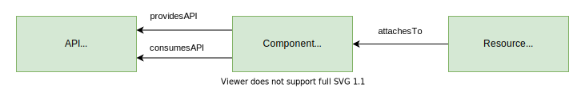
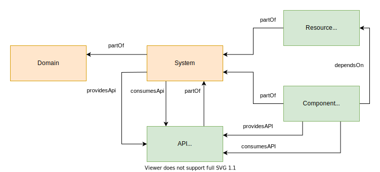

We believe that a strong shared understanding and terminology around software
and resources leads to a better Backstage experience.

_This description originates from
[this RFC](https://github.com/backstage/backstage/issues/390). Note that some of
the concepts are not yet supported in Backstage._

## Core Entities

We model software in the Backstage catalogue using these three core entities
(further explained below):

- **Components** are individual pieces of software

- **APIs** are the boundaries between different components

- **Resources** are physical or virtual infrastructure needed to operate a
  component

### Component

A component is a piece of software, for example a mobile feature, web site,
backend service or data pipeline (list not exhaustive). A component can be
tracked in source control, or use some existing open source or commercial
software.

A component can implement APIs for other components to consume. In turn it might
consume APIs implemented by other components, or directly depend on components or
resources that are attached to it at runtime.

### API

APIs form an important (maybe the most important) abstraction that allows large
software ecosystems to scale. Thus, APIs are a first class citizen in the
Backstage model and the primary way to discover existing functionality in the
ecosystem.

APIs are implemented by components and form boundaries between components. They
might be defined using an RPC IDL (e.g., Protobuf, GraphQL, ...), a data schema
(e.g., Avro, TFRecord, ...), or as code interfaces. In any case, APIs exposed by
components need to be in a known machine-readable format so we can build further
tooling and analysis on top.

APIs have a visibility: they are either public (making them available for any
other component to consume), restricted (only available to a whitelisted set of
consumers), or private (only available within their system). As public APIs are
going to be the primary way interaction between components, Backstage supports
documenting, indexing and searching all APIs so we can browse them as
developers.

### Resource

Resources are the infrastructure a component needs to operate at runtime, like
BigTable databases, Pub/Sub topics, S3 buckets or CDNs. Modelling them together
with components and systems will better allow us to visualize resource
footprint, and create tooling around them.

## Ecosystem Modeling

A large catalogue of components, APIs and resources can be highly granular and
hard to understand as a whole. It might thus be convenient to further categorize
these entities using the following (optional) concepts:

- **Systems** are a collection of entities that cooperate to perform some
  function
- **Domains** relate entities and systems to part of the business

### System

With increasing complexity in software, systems form an important abstraction
level to help us reason about software ecosystems. Systems are a useful concept
in that they allow us to ignore the implementation details of a certain
functionality for consumers, while allowing the owning team to make changes as
they see fit (leading to low coupling).

A system, in this sense, is a collection of resources and components that
exposes one or several public APIs. The main benefit of modelling a system is
that it hides its resources and private APIs between the components for any
consumers. This means that as the owner, you can evolve the implementation, in
terms of components and resources, without your consumers being able to notice.
Typically, a system will consist of at most a handful of components (see Domain
for a grouping of systems).

For example, a playlist management system might encapsulate a backend service to
update playlists, a backend service to query them, and a database to store them.
It could expose an RPC API, a daily snapshots dataset, and an event stream of
playlist updates.

### Domain

While systems are the basic level of encapsulation for related entities, it is
often useful to group a collection of systems that share terminology, domain
models, metrics, KPIs, business purpose, or documentation, i.e. they form a
bounded context.

For example, it would make sense if the different systems in the “Payments”
domain would come with some documentation on how to accept payments for a new
product or use-case, share the same entity types in their APIs, and integrate
well with each other. Other domains could be “Content Ingestion”, “Ads” or
“Search”.
