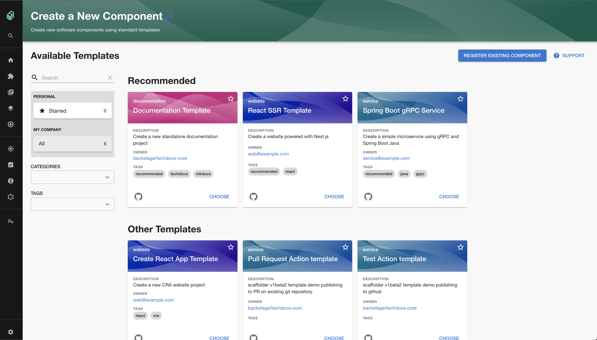

Backstage software templates create source code, so your Backstage application
needs to be set up to allow repository creation.

This is done in your `app-config.yaml` by adding
[Backstage integrations](https://backstage.io/docs/integrations/) for the
appropriate source code repository for your organization.

:::note

Integrations may already be set up as part of your `app-config.yaml`.

:::

The next step is to [add templates](http://backstage.io/docs/features/software-templates/adding-templates)
to your Backstage app.

## Publishing defaults

Software templates can define _publish_ actions, such as `publish:github`, to
create new repositories or submit pull / merge requests to existing
repositories. You can configure the author and commit message through the
`scaffolder` configuration in `app-config.yaml`:

```yaml
scaffolder:
  defaultAuthor:
    name: M.C. Hammer # Defaults to `Scaffolder`
    email: hammer@donthurtem.com # Defaults to `scaffolder@backstage.io`
  defaultCommitMessage: "U can't touch this" # Defaults to 'Initial commit'
```

To configure who can see the new repositories created from software templates,
add the `repoVisibility` key within a software template:

```yaml
- id: publish
  name: Publish
  action: publish:github
  input:
    repoUrl: '{{ parameters.repoUrl }}'
    repoVisibility: public # or 'internal' or 'private'
```

### Default Environment

The scaffolder supports a `defaultEnvironment` configuration that provides default parameters and secrets to all templates. This reduces template complexity and improves security by centralizing common values.

```yaml
scaffolder:
  defaultEnvironment:
    parameters:
      region: eu-west-1
      organizationName: acme-corp
      defaultRegistry: registry.acme-corp.com
    secrets:
      AWS_ACCESS_KEY: ${AWS_ACCESS_KEY}
      GITHUB_TOKEN: ${GITHUB_TOKEN}
      DOCKER_REGISTRY_TOKEN: ${DOCKER_REGISTRY_TOKEN}
```

#### Default parameters

Default parameters are accessible via `${{ environment.parameters.* }}` in templates. Default parameters are isolated in their own context to avoid naming conflicts.

```yaml
 parameters:
    - title: Fill in some steps
      required:
        - organizationName
      properties:
        organizationName:
          title: organizationName
          type: string
          description: Unique name of the organization
          ui:autofocus: true
          ui:options:
            rows: 5

  steps:
    - id: deploy
      name: Deploy Application
      action: aws:deploy
      input:
        region: ${{ environment.parameters.region }}  # Resolves to defaultEnvironment.parameters.region
        organization: ${{ parameters.organizationName }}  # Resolves to frontend input value
        otherOrganization: ${{ environment.parameters.organizationName }}  # Resolves to defaultEnvironment.parameters.organizationName
```

#### Secrets

Default secrets are resolved from environment variables and accessible via `${{ environment.secrets.* }}` in template actions. Secrets are only available during action execution, not in frontend forms.

```yaml
- id: deploy
  name: Deploy with credentials
  action: aws:deploy
  input:
    accessKey: ${{ environment.secrets.AWS_ACCESS_KEY }} # Resolves to defaultEnvironment.secrets.AWS_ACCESS_KEY
```

**Security Note:** Secrets are automatically masked in logs and are only available to backend actions, never exposed to the frontend.

## Task Recovery

The scaffolder supports automatic task recovery when workers restart or crash. When enabled, tasks that were in a `processing` state will be recovered and can be resumed from where they left off.

```yaml
scaffolder:
  taskRecovery:
    enabled: true
    staleTimeout: { seconds: 30 } # Optional, defaults to 30 seconds
```

When task recovery is enabled:

- Tasks in `processing` state with stale heartbeats are automatically recovered to `open` state
- Secrets are preserved until the task reaches a terminal state (completed/failed)
- Completed steps are skipped on retry, resuming from the last incomplete step
- Step outputs are restored so subsequent steps can access previous results

Actions used in recoverable templates should be idempotent. You can use [checkpoints](./writing-custom-actions.md#using-checkpoints-in-custom-actions) in custom actions to achieve this.

### Workspace Serialization

By default, task recovery does not persist the task workspace (filesystem). If your tasks work with files and you want workspaces to survive restarts, you need to install a workspace provider module and configure it separately.

Workspace serialization is **not enabled by default** — you must explicitly opt in by setting `workspaceProvider`.

```yaml
scaffolder:
  taskRecovery:
    enabled: true
    workspaceProvider: database # or 'gcpBucket' for GCS
```

Available workspace providers:

- **`database`** — Stores workspaces in the database via `@backstage/plugin-scaffolder-backend-module-workspace-database`. Has a 5MB limit and is not recommended for production use.
- **`gcpBucket`** — Stores workspaces in a GCS bucket via `@backstage/plugin-scaffolder-backend-module-gcp`. Requires [workload identity](https://cloud.google.com/iam/docs/workload-identity-federation) to be configured. Bucket name is configured via `scaffolder.taskRecovery.gcsBucket.name`.

To use a provider, install the corresponding module in your backend:

```bash
# For database storage (development only)
yarn --cwd packages/backend add @backstage/plugin-scaffolder-backend-module-workspace-database

# For GCS storage (production)
yarn --cwd packages/backend add @backstage/plugin-scaffolder-backend-module-gcp
```

Then add the module to your backend in `packages/backend/src/index.ts`:

```ts
backend.add(
  import('@backstage/plugin-scaffolder-backend-module-workspace-database'),
);
```

### Migrating from Experimental Flags

If you were using the previous experimental configuration, the new config replaces it:

| Old (Experimental)                                            | New                                         |
| ------------------------------------------------------------- | ------------------------------------------- |
| `scaffolder.EXPERIMENTAL_recoverTasks`                        | `scaffolder.taskRecovery.enabled`           |
| `scaffolder.EXPERIMENTAL_recoverTasksTimeout`                 | `scaffolder.taskRecovery.staleTimeout`      |
| `scaffolder.EXPERIMENTAL_workspaceSerialization`              | `scaffolder.taskRecovery.workspaceProvider` |
| `scaffolder.EXPERIMENTAL_workspaceSerializationProvider`      | `scaffolder.taskRecovery.workspaceProvider` |
| `scaffolder.EXPERIMENTAL_workspaceSerializationGcpBucketName` | `scaffolder.taskRecovery.gcsBucket.name`    |

The per-template `spec.EXPERIMENTAL_recovery` field is no longer required. When `taskRecovery.enabled` is set to `true`, all tasks are eligible for recovery.

The old experimental flags are still supported as fallbacks but are deprecated and will be removed in a future release. If you use `EXPERIMENTAL_workspaceSerialization`, install and register the corresponding workspace provider module. The `EXPERIMENTAL_workspaceSerializationProvider` setting continues to select a provider only when `EXPERIMENTAL_workspaceSerialization` is set to `true`.

## Customizing the ScaffolderPage with Grouping and Filtering

The sections below cover the legacy (JSX) frontend system. For the new
frontend system, see [Customizing the templates page in the new frontend system](#customizing-the-templates-page-in-the-new-frontend-system)
below.

Once you have more than a few software templates you may want to customize your
`ScaffolderPage` by grouping and surfacing certain templates together. You can
accomplish this by creating `groups` and passing them to your `ScaffolderPage`
like below

```tsx
<ScaffolderPage
  groups={[
    {
      title: 'Recommended',
      filter: entity =>
        entity?.metadata?.tags?.includes('recommended') ?? false,
    },
  ]}
/>
```

This code will group all templates with the 'recommended' tag together at the
top of the page above any other templates not filtered by this group or others.

You can also further customize groups by passing in a `titleComponent` instead
of a `title` which will be a component to use as the header instead of just the
default `ContentHeader` with the `title` set as it's value.



There is also an option to hide some templates.
You can have several use cases for that:

- it's still in an experimental phase, so you can combine it with feature flagging for example
- you don't want to make them accessible from template list, but only open it on some action with pre-filled data.
- show different set of templates depends on target environment

```typescript jsx
<ScaffolderPage
  templateFilter={entity =>
    entity?.metadata?.tags?.includes('experimental') ?? false
  }
/>
```

## Customizing the templates page in the new frontend system

In the new frontend system the templates page is built from extensions, so
customisations are configured rather than passed as JSX props.

### Defining template groups in `app-config.yaml`

The `sub-page:scaffolder/templates` extension accepts a `groups` config field.
Each group has a `title` and a `filter` predicate (using
[entity predicate queries](https://backstage.io/docs/features/software-catalog/catalog-customization#entity-predicate-queries)).
Templates not matched by any group fall into an automatically appended
"Other Templates" group. With no groups configured the page renders a single
"Templates" group.

```yaml
app:
  extensions:
    - sub-page:scaffolder/templates:
        config:
          groups:
            - title: Recommended Services
              filter:
                spec.type: service
            - title: Documentation
              filter:
                spec.type: documentation
```

Predicate values are matched case-insensitively. The matchers `$exists`,
`$in`, `$contains`, `$hasPrefix` and the logical operators `$all`, `$any`, `$not`
are also supported — see the
[entity predicate queries reference](https://backstage.io/docs/features/software-catalog/catalog-customization#entity-predicate-queries)
for the full grammar.

### Replacing the default `TemplateCard`

The `TemplateCard` exported from `@backstage/plugin-scaffolder-react/alpha`
is a swappable component. Apps can replace it by registering a
`SwappableComponentBlueprint` extension that targets `TemplateCard`:

```tsx
// packages/app/src/modules/appModuleScaffolder.tsx
import { createFrontendModule } from '@backstage/frontend-plugin-api';
import { SwappableComponentBlueprint } from '@backstage/plugin-app-react';
import { TemplateCard } from '@backstage/plugin-scaffolder-react/alpha';

export const appModuleScaffolder = createFrontendModule({
  pluginId: 'app',
  extensions: [
    SwappableComponentBlueprint.make({
      name: 'scaffolder-template-card',
      params: defineParams =>
        defineParams({
          component: TemplateCard,
          loader: () => import('./MyTemplateCard').then(m => m.MyTemplateCard),
        }),
    }),
  ],
});
```

Wire the module into your app by adding `appModuleScaffolder` to the
`features` array of `createApp` in `packages/app/src/App.tsx`.

`MyTemplateCard` receives `TemplateCardComponentProps`
(`{ template, additionalLinks?, onSelected? }`). The list takes care of
binding the template to `onSelected`, so the card just calls
`props.onSelected?.()` to choose itself. The example app under
`packages/app/src/modules/BuiTemplateCard.tsx` shows a Backstage UI (BUI)
implementation you can use as a starting point.
