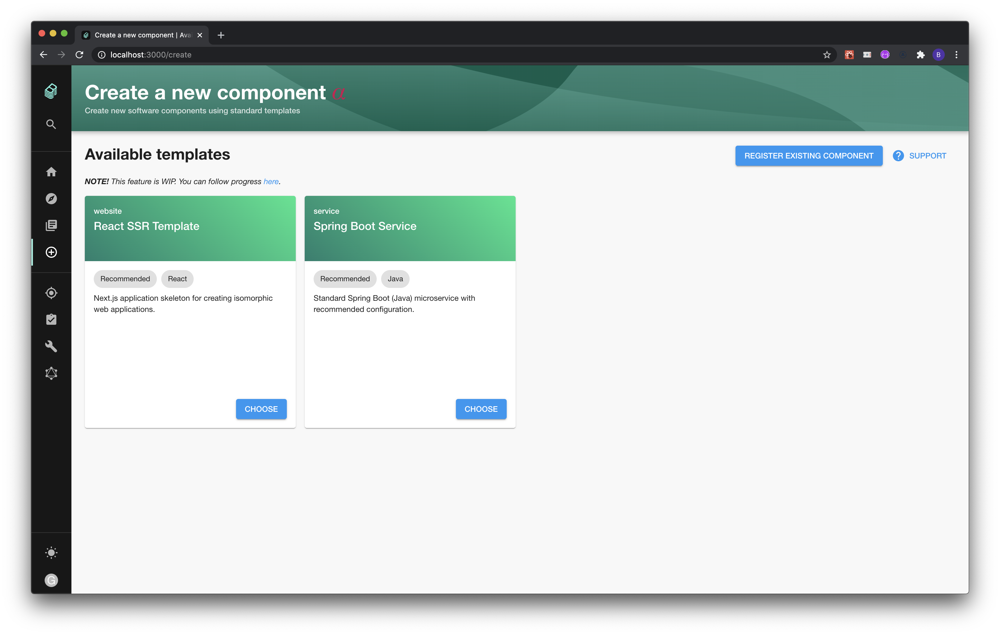

# Software Templates

The Software Templates part of Backstage is a tool that can help you create
Components inside Backstage. It by default has the ability to load skeletons of
code, template in some variables and then publish the template to some location
like GitHub.

### Getting Started

The Software Templates are available under `/create`, and if you've followed
[Getting Started with Backstage](../../getting-started), you should be able to
reach `http://localhost:3000/create`.

You should get something that looks similar to this:

