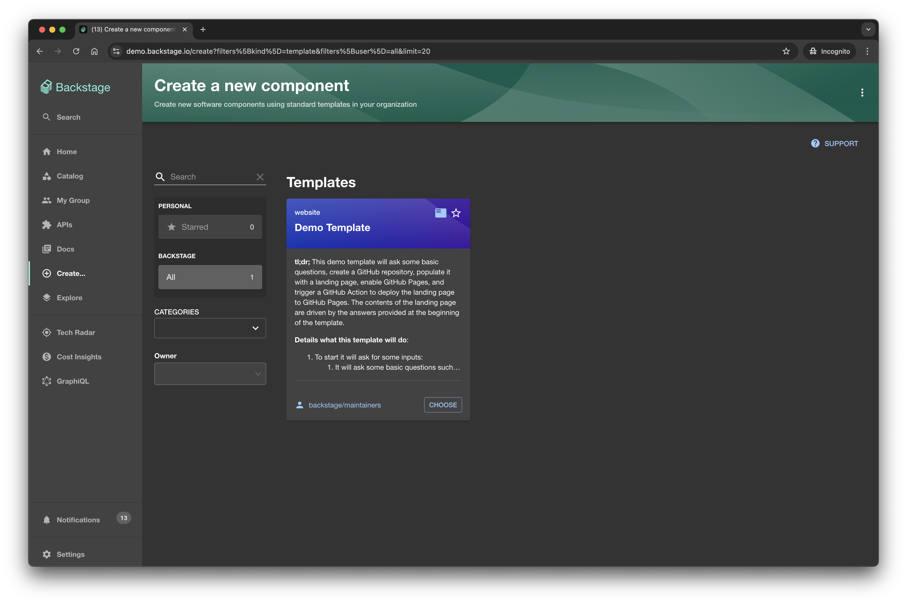
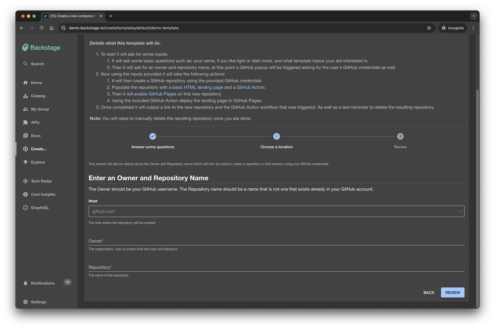
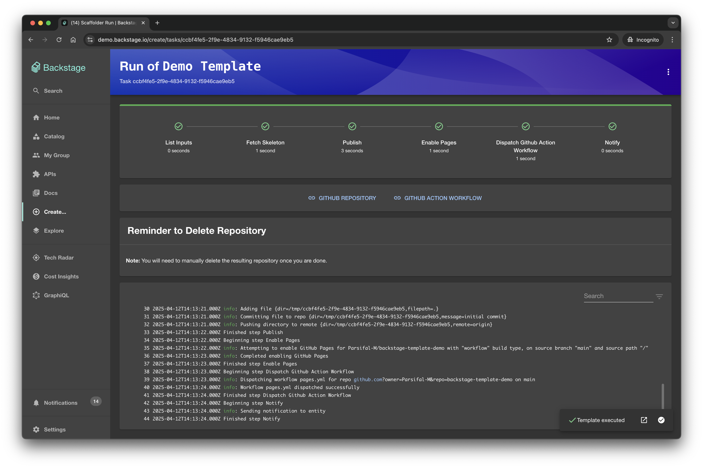

The Software Templates part of Backstage is a tool that can help you create
Components inside Backstage. By default, it has the ability to load skeletons of
code, template in some variables, and then publish the template to some
locations like GitHub or GitLab.

<video width="100%" height="fit-content" controls>
  <source src="/video/software-templates.mp4" type="video/mp4" />
</video>

## Getting Started

> Be sure to have covered
> [Getting Started with Backstage](../../getting-started) before proceeding.

:::note Note

If you're running Backstage with Node 20 or later, you'll need to pass the flag `--no-node-snapshot` to Node in order to
use the templates feature.
One way to do this is to specify the `NODE_OPTIONS` environment variable before starting Backstage:
`export NODE_OPTIONS="${NODE_OPTIONS:-} --no-node-snapshot"`

> It's important to append to the existing `NODE_OPTIONS` value, if it's already set, rather than overwriting it, since some NodeJS Debugging tools may rely on this environment variable to work properly.

:::

The Software Templates are available under `/create`. For local development you
should be able to reach them at `http://localhost:3000/create`.

Once there, you should see something that looks similar to this:



## Choose a template

When you select a template that you want to create, you'll be taken to the next
page which may or may not look different for each template. Each template can
ask for different input variables, and they are then passed to the templater
internally.


After filling in these variables, you'll get some more fields to fill out which
are required for Backstage usage: the owner (which is a `user` in the backstage
system), and the `storePath` which is a destination URL to create for the
provider, for instance `https://github.com/backstage/my-new-repository`, or
`https://gitlab.com/myorg/myrepo`.



## Run!

Once you've entered values and confirmed, you'll then get a popup box with live
progress of what is currently happening with the creation of your template.


It shouldn't take too long, and you'll have a success screen!



If it fails, you'll be able to click on each section to get the log from the
step that failed which can be helpful in debugging.

You can also cancel the running process. Once you clicked on button "Cancel", the abort signal
will be sent to a task and all next steps won't be executed. The current step will be cancelled
only if it supports it.


## View Component in Catalog

When it's been created, you'll see the `View in Catalog` button, which will take
you to the registered component in the catalog:


And then you'll also be able to see it in the Catalog View table:


## Disable Register Existing Component button

There could be situations where you would like to disable the
`Register Existing Component` button for your users. For example:


To do so, you need to explicitly disable the default route binding from the `scaffolderPlugin.registerComponent` to the Catalog Import page.

This can be done in `backstage/packages/app/src/App.tsx`:

```diff
 const app = createApp({
   apis,
   bindRoutes({ bind }) {
     bind(scaffolderPlugin.externalRoutes, {
+      registerComponent: false,
-      registerComponent: catalogImportPlugin.routes.importPage,
       viewTechDoc: techdocsPlugin.routes.docRoot,
     });
})
```

OR in `app-config.yaml`:

```yaml
app:
  routes:
    bindings:
      scaffolder.registerComponent: false
```

After the change, you should no longer see the button.

## Previewing and Executing Previous Template Tasks

Each execution of a template is treated as a unique task, identifiable by its own unique ID. To view a list of previously executed template tasks, navigate to the "Create" page and access the "Task List" from the context menu (represented by the vertical ellipsis, or 'kebab menu', icon in the upper right corner).


If you wish to re-run a previously executed template, navigate to the template tasks page. Locate the desired task and select the "Start Over" option from the context menu.


This action will initiate a new execution of the selected template, pre-populated with the same parameters as the previous run, but these parameters can be edited before re-execution.

In the event of a failed template execution, the "Start Over" option can be used to re-execute the template. The parameters from the original run will be pre-filled, but they can be adjusted as needed before retrying the template.
