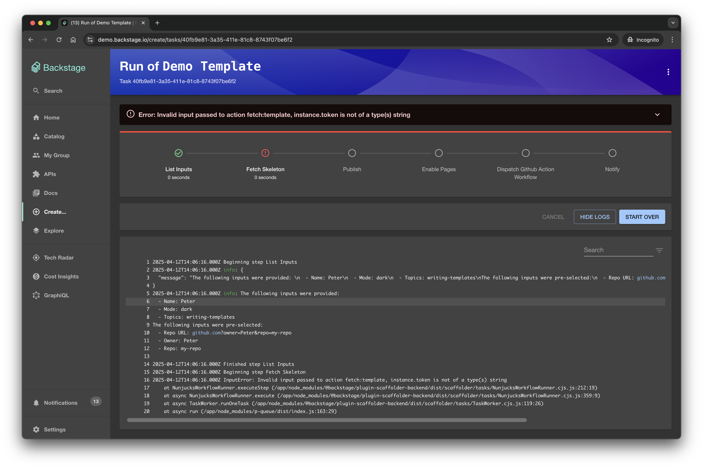

The Software Templates part of Backstage is a tool that can help you create
Components inside Backstage. By default, it has the ability to load skeletons of
code, template in some variables, and then publish the template to some location
like GitHub.

<video width="100%" height="100%" controls>
  <source src="https://backstage.io/blog/assets/2020-08-05/feature.mp4" type="video/mp4">
</video>

### Getting Started

The Software Templates are available under `/create`. If you've followed
[Installing in your Backstage App](./installation.md) in your separate App or
[Getting Started with Backstage](../../getting-started) for this repo, you
should be able to reach `http://localhost:3000/create`.

You should get something that looks similar to this:

### Choose a template

When you select a template that you want to create, you'll be taken to the next
page which may or may not look different for each template. Each template can
ask for different input variables, and they are then passed to the templater
internally.

After filling in these variables, you'll get some more fields to fill out which
are required for backstage usage: the owner, (which is a `user` in the backstage
system), the `storePath` (which right now must be a GitHub Organisation), and a
non-existing github repository name in the format `organisation/reponame`.

### Run!

Once you've entered values and confirmed, you'll then get a modal with live
progress of what is currently happening with the creation of your template.

It shouldn't take too long, and you'll have a success screen!

If it fails, you'll be able to click on each section to get the log from the
step that failed which can be helpful in debugging.

### View Component in Catalog

When it's been created, you'll see the `View in Catalog` button, which will take
you to the registered component in the catalog:

And then you'll also be able to see it in the Catalog View table

