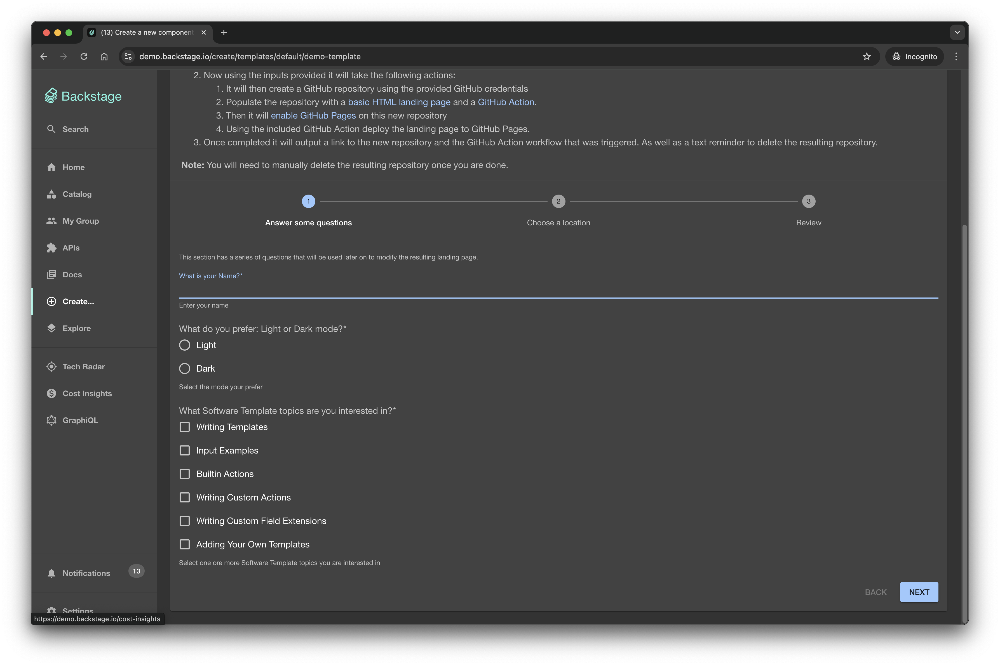
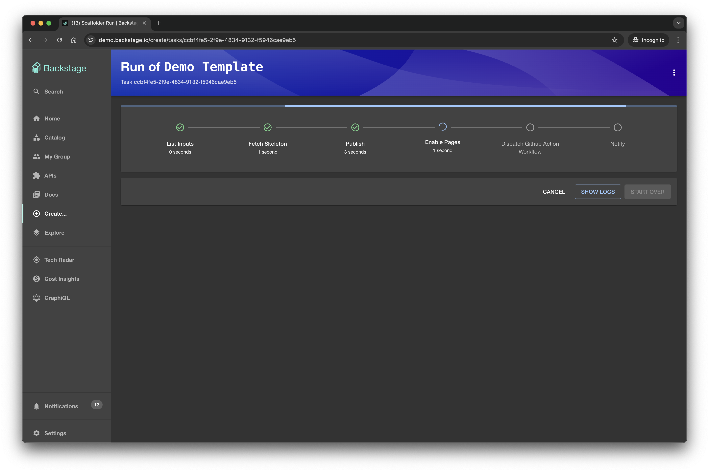
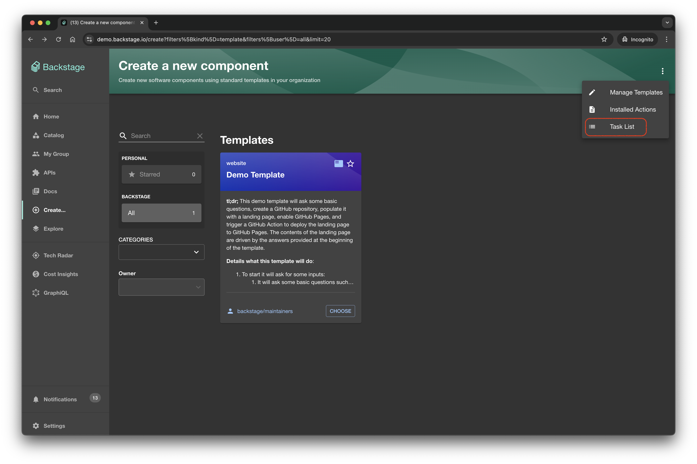
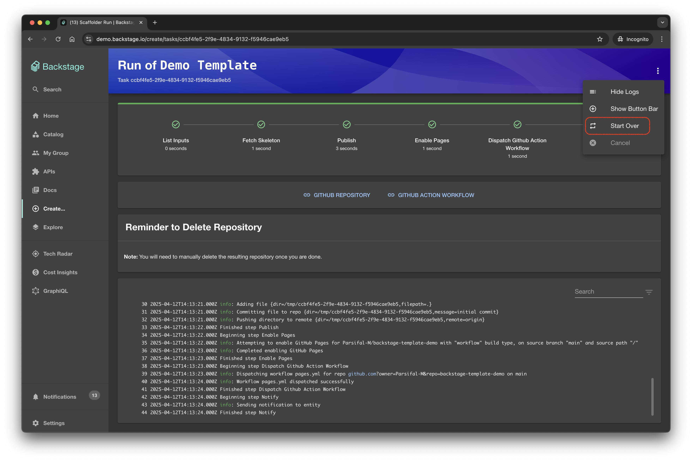

The Software Templates part of Backstage is a tool that can help you create
Components inside Backstage. By default, it has the ability to load skeletons of
code, template in some variables, and then publish the template to some
locations like GitHub or GitLab.

:::warning Important

When creating custom scaffolder actions, **use camelCase for action IDs** instead of kebab-case. Action IDs with dashes (like `fetch-component-id`) will cause template expressions like `${{ steps.fetch-component-id.output.componentId }}` to return `NaN` because the dashes are evaluated as subtraction operators in JavaScript expressions.

:::note

See the [Writing Custom Actions guide](./writing-custom-actions.md#naming-conventions) and [Template Migration guide](./migrating-from-v1beta2-to-v1beta3.md#watch-out-for-dash-case) for more details.

:::

## Prerequisites

:::note Note

If you're running Backstage with Node 20 or later, you'll need to pass the flag `--no-node-snapshot` to Node in order to
use the templates feature.
One way to do this is to specify the `NODE_OPTIONS` environment variable before starting Backstage:
`export NODE_OPTIONS="${NODE_OPTIONS:-} --no-node-snapshot"`

It's important to append to the existing `NODE_OPTIONS` value, if it's already set, rather than overwriting it, since some NodeJS Debugging tools may rely on this environment variable to work properly.

:::

These docs assume you have already gone over the [Backstage Getting Started](../../getting-started) section and you are able to run Backstage locally or it has been deployed somewhere.

## Getting Started

Software Templates you have imported into Backstage can be found under `/create`.

If you're running Backstage locally, this will be `http://localhost:3000/create`.

Once there, you should see something that looks similar to this:


## Choose a template

When you select a template that you want to create, you'll be taken to the next
page which may or may not look different for each template. Each template can
ask for different input variables, and they are then passed to the templater
internally.



Templates generally consist of a set of steps, and each step can have its own set of required or optional inputs, as you can see in the image below we are now prompted to input some Github repository information.


## Review page

Before you run the template, you'll be taken to a summary page where you can verify the inputs you have provided before we run the template.

This is a good time to double check that you have provided the correct information and allows you to go back and change any of the inputs if you need to.


## Run the template

Once you are happy with the inputs you have provided, you can click on the `Create` button to run the template.



## Success

Once the template has finished running, you'll be taken to a success page where you can see the results of the template.


## Failure

If it fails, you'll be able to click on each section to get the log from the
step that failed which can be helpful in debugging.

You can also cancel the running process. Once you clicked on button "Cancel", the abort signal
will be sent to a task and all next steps won't be executed. The current step will be cancelled
only if it supports it.


## View the Results

Once the template has finished running, and from the screenshot above, when its successful, you are presented with two links, clicking on them will take you to the templated repository we created!

## Disable Register Existing Component button

There could be situations where you would like to disable the
`Register Existing Component` button for your users.

To do so, you need to explicitly disable the default route binding from the `scaffolderPlugin.registerComponent` to the Catalog Import page.

This can be done in `backstage/packages/app/src/App.tsx`:

```diff
 const app = createApp({
   apis,
   bindRoutes({ bind }) {
     bind(scaffolderPlugin.externalRoutes, {
+      registerComponent: false,
-      registerComponent: catalogImportPlugin.routes.importPage,
       viewTechDoc: techdocsPlugin.routes.docRoot,
     });
})
```

OR in `app-config.yaml`:

```yaml
app:
  routes:
    bindings:
      scaffolder.registerComponent: false
```

After the change, you should no longer see the button.

## Template Task List

Each execution of a template is treated as a unique task, identifiable by its own unique ID. To view a list of previously executed template tasks, navigate to the "Create" page and access the "Task List" from the context menu (represented by the vertical ellipsis, or 'kebab menu', icon in the upper right corner).



## Starting Over

If you wish to re-run a previously executed template, navigate to the template tasks page. Locate the desired task and select the "Start Over" option from the context menu.



This action will initiate a new execution of the selected template, pre-populated with the same parameters as the previous run, but these parameters can be edited before re-execution.

In the event of a failed template execution, the "Start Over" option can be used to re-execute the template. The parameters from the original run will be pre-filled, but they can be adjusted as needed before retrying the template.

## Want to see it in action?

The [Backstage Demo Site](https://demo.backstage.io/create) has a template you are able to run, which is where the screenshots in this document were taken from!
