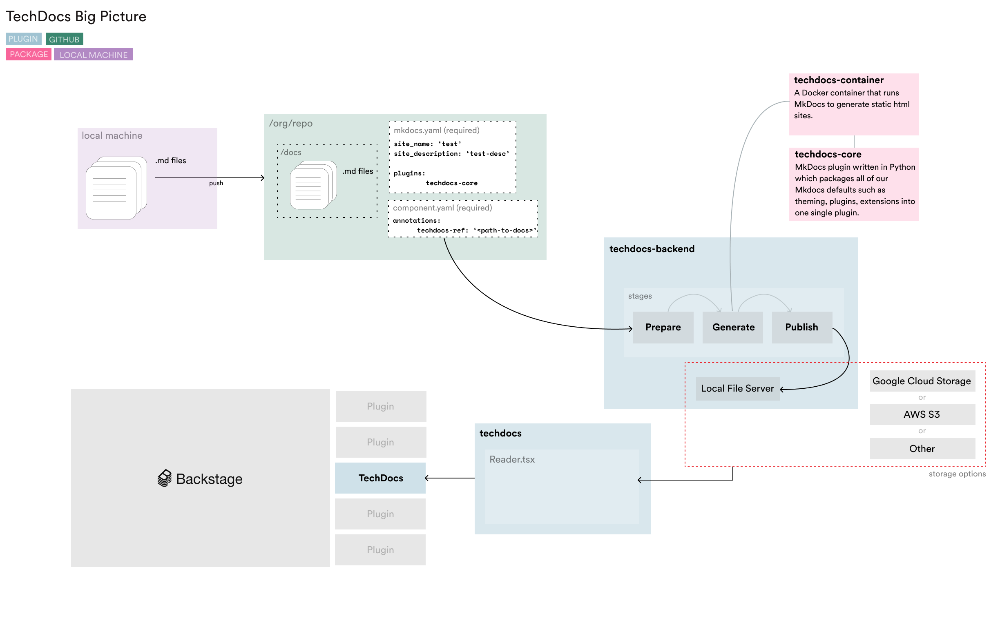

## What is it?

<!-- Intro, backstory, etc.: -->

Wait, what is TechDocs? TechDocs is Spotify’s homegrown docs-like-code solution
built directly into Backstage. Today, it is now one of the core products in
Spotify’s developer experience offering with 2,400+ documentation sites and
1,000+ engineers using it daily.

## Features

- A centralized place to discover documentation.

- A clear end-to-end docs-like-code solution. (_Coming soon in V.1_)

- A tightly coupled feedback loop with the developer workflow. (_Coming soon in
  V.3_)

- A developer ecosystem for creating extensions. (_Coming soon in V.3_)

## Project roadmap

| Version                 | Description                                                                                                                           |
| ----------------------- | ------------------------------------------------------------------------------------------------------------------------------------- |
| [TechDocs V.0 ✅][v0]   | Read docs in Backstage - Enable anyone to get a reader experience working in Backstage. [See V.0 Use Cases.](./#techdocs-v0)          |
| [TechDocs V.1 🚧][v1]   | TechDocs end to end (alpha) - Alpha of TechDocs that you can use end to end - and contribute to. [See V.1 Use Cases.](./#techdocs-v1) |
| [TechDocs V.2 🔮⌛][v2] | Platform stability and compatibility improvements. [See V.2 Use Cases.](./#techdocs-v2)                                               |
| TechDocs V.3 🔮⌛       | Widget Architecture - TechDocs widget architecture available, so the community can create their own customized features.              |

[v0]: https://github.com/spotify/backstage/milestone/15
[v1]: https://github.com/spotify/backstage/milestone/16
[v2]: https://github.com/spotify/backstage/milestone/17

<!-- TODO: Add link to milestone for v3 -->

## Use Cases

#### TechDocs V.0

- As a user I can navigate to a manually curated docs explore page.
- As a user I can navigte to and read mock documentation that is manually
  uploaded by the TechDocs core team.

#### TechDocs V.1

- As a user I can run TechDocs locally and read documentation.
- As a user I can create a docs folder in my entity project and add a reference
  in the entity configuration file (of the owning entity) to my documentation.
  - Backstage will automatically build my documentation and serve it in
    TechDocs.
  - Documentation will be displayed under the docs tab in the service catalog.
- As a user I can create a docs only repository that will be standalone from any
  other service.
- As a user I can choose my own storage solution for the documentation (as
  example GCS/AWS/Azure etc)
- As a user I can define my own API to interface my own documentation solution.

#### TechDocs V.2

Platform stability and compatibility improvements

- As a user I can define the metadata generated for my documentation.
- As a user I will be able to browse metadata from within my documentation in
  Backstage.

#### TechDocs V.3

more to come...

## Structure

- [Getting Started]
- [Concepts]
- [Creating and Publishing Documentation]
- [FAQ]

## Tech Stack

| Stack                                       | Location                                                 |
| ------------------------------------------- | -------------------------------------------------------- |
| Frontend                                    | [`@backstage/plugin-techdocs`][techdocs/frontend]        |
| Backend                                     | [`@backstage/plugin-techdocs-backend`][techdocs/backend] |
| Docker Container (for generating doc sites) | [`packages/techdocs-container`][techdocs/container]      |
| CLI (for local development)                 | [`packages/techdocs-cli`][techdocs/cli]                  |

[getting started]: getting-started.md
[concepts]: concepts.md
[creating and publishing documentation]: creating-and-publishing.md
[faq]: FAQ.md 'Frequently asked questions'
[techdocs/frontend]:
  https://github.com/spotify/backstage/blob/master/plugins/techdocs
[techdocs/backend]:
  https://github.com/spotify/backstage/blob/master/plugins/techdocs-backend
[techdocs/container]:
  https://github.com/spotify/backstage/blob/master/packages/techdocs-container
[techdocs/cli]:
  https://github.com/spotify/backstage/blob/master/packages/techdocs-cli

## TechDocs Big Picture

