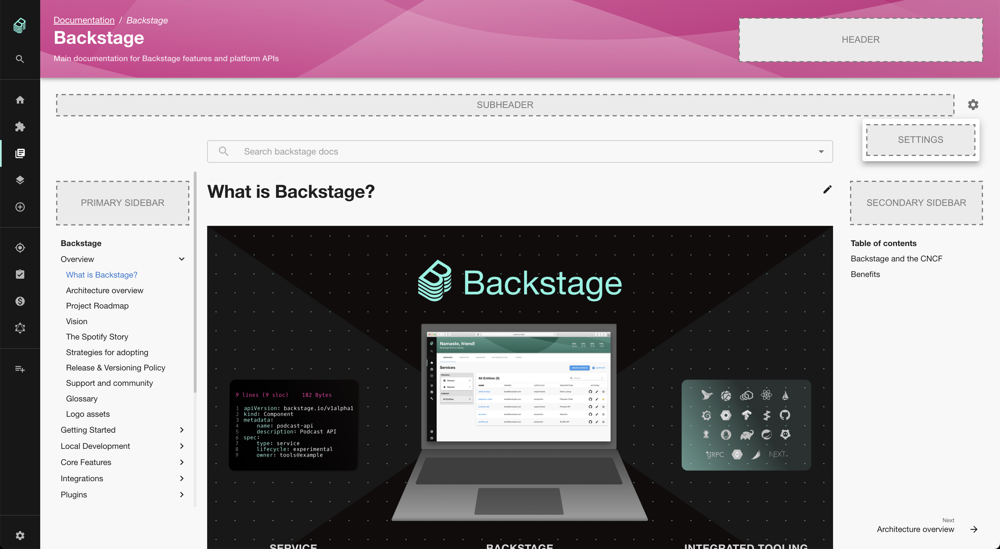

## Concepts

TechDocs is a centralized platform for publishing, viewing, and discovering
technical documentation across an entire organization. It's a solid foundation!
But it doesn't solve higher-order documentation needs on its own: how do you
create and reinforce a culture of documentation? How do you build trust in the
quality of technical documentation?

TechDocs Addons are a mechanism by which you can customize the TechDocs
experience in order to try and address some of these higher-order needs.

### Addons

An Addon is just a react component. Like any react component, it can retrieve
and render data using normal Backstage or native hooks, APIs, and components.
Props can be used to configure its behavior, where appropriate.

### Locations

Addons declare a `location` where they will be rendered. Most locations are
representative of physical spaces in the TechDocs UI:

- `Header`: For Addons which fill up the header from the right, on the same
  line as the title.
- `Subheader`: For Addons that sit below the header but above all content.
  This is a great location for tooling/configuration of TechDocs display.
- `Settings`: These addons are items added to the settings menu list and are designed to make
  the reader experience customizable, for example accessibility options.
- `PrimarySidebar`: Left of the content, above of the navigation.
- `SecondarySidebar`: Right of the content, above the table of contents.
- `Content`: A special location intended for Addons which augment the
  statically generated content of the documentation itself.
- `Component`: A [proposed-but-not-yet-implemented](https://github.com/backstage/backstage/issues/11109)
  virtual location, aimed at simplifying a common type of Addon.

<!-- todo: Needs zoomable plugin -->



### Addon Registry

The installation and configuration of Addons happens within a Backstage app's
frontend. Addons are imported from plugins and added underneath a registry
component called `<TechDocsAddons>`. This registry can be configured for both
the TechDocs Reader page as well as the Entity docs page.

Addons are rendered in the order in which they are registered.

## Installing and using Addons

To start using Addons you need to add the `@backstage/plugin-techdocs-module-addons-contrib` package to your app. You can do that by running this command from the root of your project: `yarn --cwd packages/app add @backstage/plugin-techdocs-module-addons-contrib`

Addons can be installed and configured in much the same way as extensions for
other Backstage plugins: by adding them underneath an extension registry
component (`<TechDocsAddons>`) under the route representing the TechDocs Reader
page in your `App.tsx`:

```tsx
// packages/app/src/App.tsx

import { TechDocsReaderPage } from '@backstage/plugin-techdocs';
import { TechDocsAddons } from '@backstage/plugin-techdocs-react';
import { ReportIssue } from '@backstage/plugin-techdocs-module-addons-contrib';

// ...

<Route path="/docs/:namespace/:kind/:name/*" element={<TechDocsReaderPage />}>
  <TechDocsAddons>
    <ReportIssue />
    {/* Other addons can be added here. */}
  </TechDocsAddons>
</Route>;
```

If you are using a custom [TechDocs reader page](./how-to-guides.md#how-to-customize-the-techdocs-reader-page) your setup will be very similar, here's an example:

```ts
<Route path="/docs/:namespace/:kind/:name/*" element={<TechDocsReaderPage />}>
  <TechDocsAddons>
    <ReportIssue />
    {/* Other addons can be added here. */}
  </TechDocsAddons>
  {techDocsPage} // This is your custom TechDocs reader page
</Route>
```

The process for configuring Addons on the documentation tab on the entity page
is very similar; instead of adding the `<TechDocsAddons>` registry under a
`<Route>`, you'd add it as a child of `<EntityTechdocsContent />`:

```tsx
// packages/app/src/components/catalog/EntityPage.tsx

import { EntityLayout } from '@backstage/plugin-catalog';
import { EntityTechdocsContent } from '@backstage/plugin-techdocs';
import { TechDocsAddons } from '@backstage/plugin-techdocs-react';
import { ReportIssue } from '@backstage/plugin-techdocs-module-addons-contrib';

// ...

<EntityLayout.Route path="/docs" title="Docs">
  <EntityTechdocsContent>
    <TechDocsAddons>
      <ReportIssue />
      {/* Other addons can be added here. */}
    </TechDocsAddons>
  </EntityTechdocsContent>
</EntityLayout.Route>;
```

Note that on the entity page, because the Catalog plugin is responsible for the
page header, TechDocs Addons whose location is `Header` will not be rendered.

## Available Addons

Addons can, in principle, be provided by any plugin! To make it easier to
discover available Addons, we've compiled a list of them here:

| Addon                                                                                                                        | Package/Plugin                                     | Description                                                                                                                                                                                                                                                                                                                                                         |
| ---------------------------------------------------------------------------------------------------------------------------- | -------------------------------------------------- | ------------------------------------------------------------------------------------------------------------------------------------------------------------------------------------------------------------------------------------------------------------------------------------------------------------------------------------------------------------------- |
| [`<ExpandableNavigation />`](https://backstage.io/docs/reference/plugin-techdocs-module-addons-contrib.expandablenavigation) | `@backstage/plugin-techdocs-module-addons-contrib` | Allows TechDocs users to expand or collapse the entire TechDocs main navigation, and keeps the user's preferred state between documentation sites.                                                                                                                                                                                                                  |
| [`<ReportIssue />`](https://backstage.io/docs/reference/plugin-techdocs-module-addons-contrib.reportissue)                   | `@backstage/plugin-techdocs-module-addons-contrib` | Allows TechDocs users to select a portion of text on a TechDocs page and open an issue against the repository that contains the documentation, populating the issue description with the selected text according to a configurable template.                                                                                                                        |
| [`<TextSize />`](https://backstage.io/docs/reference/plugin-techdocs-module-addons-contrib.textsize)                         | `@backstage/plugin-techdocs-module-addons-contrib` | This TechDocs addon allows users to customize text size on documentation pages, they can select how much they want to increase or decrease the font size via slider or buttons. The default value for font size is 100% and this setting is kept in the browser's local storage whenever it is changed.                                                             |
| [`<LightBox />`](https://backstage.io/docs/reference/plugin-techdocs-module-addons-contrib.lightbox)                         | `@backstage/plugin-techdocs-module-addons-contrib` | This TechDocs addon allows users to open images in a light-box on documentation pages, they can navigate between images if there are several on one page. The image size of the light-box image is the same as the image size on the document page. When clicking on the zoom icon it zooms the image to fit in the screen (similar to `background-size: contain`). |

Got an Addon to contribute? Feel free to add a row above!

## Creating an Addon

The simplest Addons are plain old react components that get rendered in
specific locations within a TechDocs site. To package such a react component as
an Addon, follow these steps:

1. Write the component in your plugin like any other component
2. Create, provide, and export the component from your plugin

```ts
// plugins/your-plugin/src/plugin.ts

import {
  createTechDocsAddonExtension,
  TechDocsAddonLocations,
} from '@backstage/plugin-techdocs-react';
import { CatGifComponent, CatGifComponentProps } from './addons';

// ...

// You must "provide" your Addon, just like any extension, via your plugin.
export const CatGif = yourPlugin.provide(
  // This function "creates" the Addon given a component and location. If your
  // component can be configured via props, pass the prop type here too.
  createTechDocsAddonExtension<CatGifComponentProps>({
    name: 'CatGif',
    location: TechDocsAddonLocations.Header,
    component: CatGifComponent,
  }),
);
```

### Addons in the Content location

Beyond the "render a component in a region" use-case, it's also possible for
Addons to access and manipulate a TechDocs site's DOM; this could be used to,
for example, load and instantiate client-side diagramming libraries, replace
elements with dynamically loaded content, etc.

This type of Addon is still expressed as a react component, but instead of
returning a react element to be rendered, it updates the DOM via side-effects
(e.g. with `useEffect`). Access to the DOM is made available via utility hooks
provided by the Addon framework.

```tsx
// plugins/your-plugin/src/addons/MakeAllImagesCatGifs.tsx

import React, { useEffect } from 'react';
import { useShadowRootElements } from '@backstage/plugin-techdocs-react';

// This is a normal react component; in order to make it an Addon, you would
// still create and provide it via your plugin as described above. The only
// difference is that you'd set `location` to `TechDocsAddonLocations.Content`.
export const MakeAllImagesCatGifsAddon = () => {
  // This hook can be used to get references to specific elements. If you need
  // access to the whole shadow DOM, use the the underlying useShadowRoot()
  // hook instead.
  const images = useShadowRootElements<HTMLImageElement>(['img']);

  useEffect(() => {
    images.forEach(img => {
      if (img.src !== 'https://example.com/cat.gif') {
        img.src = 'https://example.com/cat.gif';
      }
    });
  }, [images]);

  // Nothing to render directly, so we can just return null.
  return null;
};
```

### Testing Addons

Install `@backstage/plugin-techdocs-addons-test-utils` as a `devDependency` in
your plugin for access to utilities that make testing such Addons easier.

A test for the above Addon might look something like this:

```tsx
// plugins/your-plugin/src/addons/MakeAllImagesCatGifs.test.tsx
import { TechDocsAddonTester } from '@backstage/plugin-techdocs-addons-test-utils';

// Note: import your actual addon (the one provided by your plugin).
import { MakeAllImagesCatGifs } from '../plugin.ts';

describe('MakeAllImagesCatGifs', () => {
  it('replaces img srcs with cat gif', async () => {
    const { getByTestId } = await TechDocsAddonTester.buildAddonsInTechDocs([
      <MakeAllImagesCatGifs />,
    ])
      .withDom()
      .renderWithEffects();

    expect(getByTestId('fixture')).toHaveAttribute(
      'src',
      'https://example.com/cat.gif',
    );
  });
});
```
