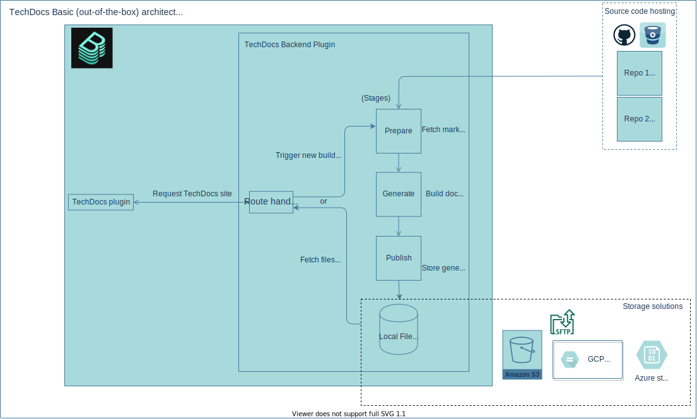
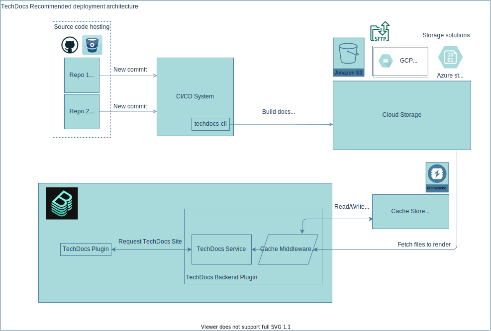

## Basic (out-of-the-box)

When you deploy Backstage (with TechDocs enabled by default), you get a basic
out-of-the box experience.

> Note: See below for our recommended deployment architecture which takes care
> of stability, scalability and speed. Also look at the
> [HOW TO migrate guide](how-to-guides.md#how-to-migrate-from-techdocs-basic-to-recommended-deployment-approach).

When you open a TechDocs site in Backstage, the
[TechDocs Reader](./concepts.md#techdocs-reader) makes a request to
`techdocs-backend` plugin with the entity ID and the path of the current page
you are looking at. In response, it receives the static files (HTML, CSS, JSON,
etc.) to render on the page in TechDocs/Backstage.

The static files consist of HTML, CSS and Images generated by MkDocs. We remove
all the JavaScript before adding them to Backstage for security reasons. And
there is an additional `techdocs_metadata.json` file that TechDocs needs to
render a site. It's important that you use either
[techdocs-cli](https://github.com/backstage/techdocs-cli) or
[techdocs-container](https://github.com/backstage/techdocs-container) to
generate the docs for the expected output.

The TechDocs Reader then applies a list of "Transformers" (see
[Concepts](./concepts.md)) which modify the generated static HTML files for a
number of use cases e.g. Remove certain headers, filter out some HTML tags, etc.

Currently, we use the Backstage server's (or techdocs-backend's) local file
system to store the generated files. However, it's ideal to use an external
storage system (e.g. AWS S3, GCS or Azure Blob Storage). Read more in
[using cloud storage](using-cloud-storage.md).

## Recommended deployment

This is how we recommend deploying TechDocs in production environment.

The key difference in the recommended deployment approach is where the docs are
built.

We assume each entity lives in a repository somewhere (GitHub, GitLab, etc.). We
recommend [using a CI/CD pipeline](configuring-ci-cd.md) with the repository
that has a dedicated step/job to generate docs for TechDocs. The generated
static files are then [stored in a cloud storage](using-cloud-storage.md)
solution of your choice.

Similar to how it is done in the Basic setup, the TechDocs Reader requests
`techdocs-backend` plugin for the docs site. `techdocs-backend` then requests
your configured storage solution for the necessary files and returns them to
TechDocs Reader.

Note about caching: We have noticed internally that some storage providers can
be quite slow, which is why we are recommending a cache that sits between the
TechDocs Reader and the Storage.

_Feel free to suggest better ideas to us in #docs-like-code channel in Discord
or via a GitHub issue._

### Security consideration

Our biggest security concern is managing the access to the docs in the cloud
storage. We also want to have only one security solution for all different types
of storage (GCS, AWS, custom SFTP server, etc.) Restricting access to the
storage and only allowing `techdocs-backend` to fetch files is a good way to
achieve this.

This would also allow us to use the access control management Backstage when
that is ready.
[Track progress here.](https://github.com/backstage/backstage/issues/3218)

In theory, you can directly enable TechDocs Reader to read from your storage.
But, you will have to think about how to do it without the docs being public and
how access to user groups is managed.

For cloud storage access tokens, `techdocs-backend` only needs a token with Read
permissions. But in your CI/CD system, there needs to be a token with Write
permissions to publish the generated docs site files.

## FAQs

**Q: Why do you have separate "basic" and "recommended" deployment approaches?**

A: The basic or out-of-the-box setup is what you get when you create a new app
or do a `git clone` of the Backstage repository. We want the first experience to
_just work magically_ so that you can have your first experience with TechDocs
which is smooth. However, if you decide to deploy Backstage/TechDocs for
production use, the basic setup would work but there are going to be downsides
as you scale with the number of documentation sites and sizes of them. So you
would want to make sure the deployment is as stable as possible. Hence there is
a recommended approach. There can be even more deployment approaches to TechDocs
and we welcome such "Alternative" ideas from the community.

**Q: Why don't you recommend techdocs-backend local filesystem to serve static
files?**

A: It makes scaling a Backstage instance harder. Think about the case where we
have distributed Backstage deployments (e.g. multiple Kubernetes pods of your
Backstage app). Using a separate/central file storage system for TechDocs is
necessary to make sure sites are persistent when the servers/pods are restarted
and avoid duplicating sites per instance. By having an external storage, we are
making it easier to do some operations like delete a docs site or wipe its
contents.

**Q: Why aren't docs built on the fly i.e. when users visits a page, generate
docs site in real-time?**

A: Generating the content from Markdown on the fly is not optimal. Storage
solutions act as a cache for the generated static content. TechDocs is also
currently built on MkDocs which does not allow us to generate docs per-page, so
we would have to build all docs for a entity on every request.

**Q. Can you use the techdocs plugin without the techdocs-backend plugin?**

A: `techdocs` and `techdocs-backend` plugins are designed to be used together,
like any other Backstage plugin with a frontend and its backend (catalog,
scaffolder, etc.). If you set your Backstage instance to generate docs on the
server, `techdocs-backend` will be responsible for managing the whole build
process, making sure it's scalable. It is responsible for securely communicating
with the cloud storage provider, for both fetching static generated sites and
publishing the updates. There are other planned features like an authentication
layer for users to determine whether they have the permission to view a
particular docs site. There are a handful of features which are extremely hard
to develop without a tightly integrated backend in place. Hence, support for
`techdocs` without `techdocs-backend` is limited and challenging to develop.

# Future work

_Ideas here are far fetched and not in the project's milestone for near future
(~6 months)._

We currently depend on MkDocs to parse doc sites written in Markdown. And we
store the generated static assets and re-use it later to render in Backstage. A
better (futuristic) approach will be to directly parse whatever type of source
files you have in your docs repository and directly render in Backstage in
real-time. You can read more in this
[RFC - Simplifying TechDocs Frontend Architecture](https://github.com/backstage/backstage/issues/3998).
