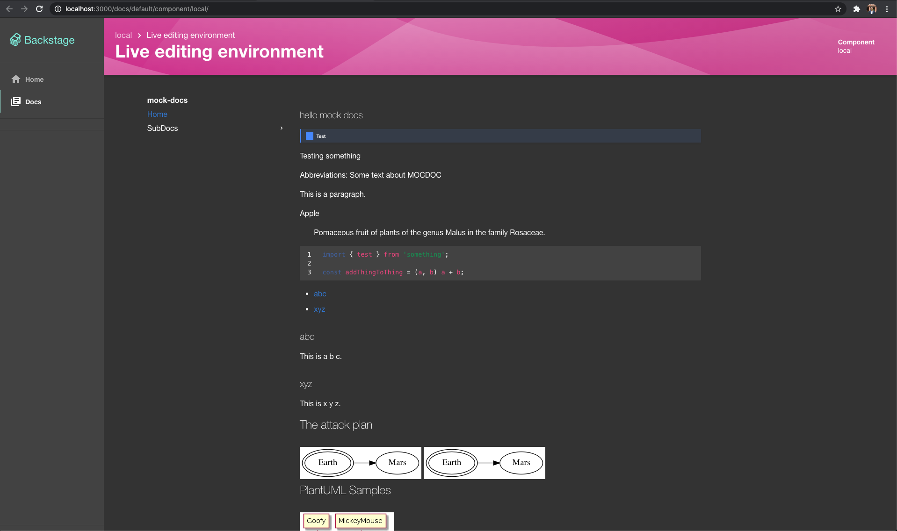

Utility command line interface for managing TechDocs sites in
[Backstage](https://github.com/backstage/backstage).

https://backstage.io/docs/features/techdocs/

## Features

- Supports local development/preview of a TechDocs site in a Backstage app.
- Supports generation and publishing of a documentation site in a CI/CD
  workflow.

```bash
techdocs-cli --help
Usage: techdocs-cli [options] [command]

Options:
  -V, --version             output the version number
  -h, --help                display help for command

Commands:
  generate|build [options]  Generate TechDocs documentation site using mkdocs.
  publish [options]         Publish generated TechDocs site to an external storage AWS S3,
                            Google GCS, etc.
  serve:mkdocs [options]    Serve a documentation project locally using mkdocs serve.
  serve [options]           Serve a documentation project locally in a Backstage app-like
                            environment
  help [command]            display help for command
```

## Installation

You can always use [`npx`](https://github.com/npm/npx) to run the latest version
of `techdocs-cli` -

```bash
npx @techdocs/cli [command]
```

Or you can install it using [npm](https://www.npmjs.com/package/@techdocs/cli) -

```bash
npm install -g @techdocs/cli
techdocs-cli [command]
```

## Usage

### Preview TechDocs site locally in a Backstage like environment

```bash
techdocs-cli serve
```



By default, Docker and
[techdocs-container](https://github.com/backstage/techdocs-container) is used to
make sure all the dependencies are installed. However, Docker can be disabled
with `--no-docker` flag.

The command starts two local servers - an MkDocs preview server on port 8000 and
a Backstage app server on port 3000. The Backstage app has a custom TechDocs API
implementation, which uses the MkDocs preview server as a proxy to fetch the
generated documentation files and assets.

Backstage instances might differ from the provided preview app in appearance and
behavior. To preview documentation with a different app, use
`--preview-app-bundle-path` with a path to the bundle of the app to use instead.
Typically, a `dist` or `build` directory.

NOTE: When using a custom `techdocs` docker image, make sure the entry point is
also `ENTRYPOINT ["mkdocs"]` or override with `--docker-entrypoint`.

Command reference:

```bash
Usage: techdocs-cli serve [options]

Serve a documentation project locally in a Backstage app-like environment

Options:
  -i, --docker-image <DOCKER_IMAGE>           The mkdocs docker container to use (default: "spotify/techdocs")
  --docker-entrypoint <DOCKER_ENTRYPOINT>     Override the image entrypoint
  --docker-option <DOCKER_OPTION...>          Extra options to pass to the docker run command, e.g. "--add-host=internal.host:192.168.11.12"
                                              (can be added multiple times).
  --no-docker                                 Do not use Docker, use MkDocs executable in current user environment.
  --mkdocs-port <PORT>                        Port for MkDocs server to use (default: "8000")
  --preview-app-bundle-path <PATH_TO_BUNDLE>  Preview documentation using a web app other than the included one.
  --preview-app-port <PORT>                   Port where the preview will be served.
                                              Can only be used with "--preview-app-bundle-path". (default: "3000")
  -c, --mkdocs-config-file-name <FILENAME>    Yaml file to use as config by mkdocs.
  -v --verbose                                Enable verbose output. (default: false)
  -h, --help                                  display help for command
```

### Generate TechDocs site from a documentation project

```bash
techdocs-cli generate
```

Alias: `techdocs-cli build`

The generate command uses the
[`@backstage/plugin-techdocs-node`](https://github.com/backstage/backstage/tree/master/plugins/techdocs-node)
package from Backstage for consistency. A Backstage app can also generate and
publish TechDocs sites if `techdocs.builder` is set to `'local'` in
`app-config.yaml`. See
[configuration reference](https://backstage.io/docs/features/techdocs/configuration).

By default, this command uses Docker and
[techdocs-container](https://github.com/backstage/techdocs-container) to make
sure all the dependencies are installed. But it can be disabled using
`--no-docker` flag.

Command reference:

```bash
techdocs-cli generate --help
Usage: techdocs-cli generate|build [options]

Generate TechDocs documentation site using MkDocs.

Options:
  --source-dir <PATH>             Source directory containing mkdocs.yml and docs/ directory. (default: ".")
  --output-dir <PATH>             Output directory containing generated TechDocs site. (default: "./site/")
  --docker-image <DOCKER_IMAGE>   The mkdocs docker container to use (default: "spotify/techdocs:v1.0.3")
  --no-pull                       Do not pull the latest docker image
  --no-docker                     Do not use Docker, use MkDocs executable and plugins in current user environment.
  --techdocs-ref <HOST_TYPE:URL>  The repository hosting documentation source files e.g.
                                  url:https://ghe.mycompany.net.com/org/repo.
                                  This value is same as the backstage.io/techdocs-ref annotation of the corresponding
                                  Backstage entity.
                                  It is completely fine to skip this as it is only being used to set repo_url in mkdocs.yml
                                  if not found.
  --etag <ETAG>                   A unique identifier for the prepared tree e.g. commit SHA. If provided it will be stored
                                  in techdocs_metadata.json.
  --defaultPlugin <PLUGIN_NAME>   Plugins which should be added automatically to the mkdocs.yaml file. (default: [])
  --omitTechdocsCoreMkdocsPlugin  An option to disable automatic addition of techdocs-core plugin to the mkdocs.yaml files.
                                  Defaults to false, which means that the techdocs-core plugin is always added to the mkdocs file.
  --legacyCopyReadmeMdToIndexMd   Attempt to ensure an index.md exists falling back to using <docs-dir>/README.md or README.md
                                  in case a default <docs-dir>/index.md is not provided. (default: false)
  -v --verbose                    Enable verbose output. (default: false)
  -h, --help                      display help for command
```

### Publish generated TechDocs sites

```bash
techdocs-cli publish --publisher-type <awsS3|googleGcs|azureBlobStorage> --storage-name <bucket/container name> --entity <namespace/kind/name>
```

After generating a TechDocs site using `techdocs-cli generate`, use the publish
command to upload the static generated files on a cloud storage (AWS/GCS) bucket
or (Azure) container which your Backstage app can read from.

The value for `--entity` must be the Backstage entity which the generated
TechDocs site belongs to. You can find the values in your Entity's
`catalog-info.yaml` file. If namespace is missing in the `catalog-info.yaml`,
use `default`. The directory structure used in the storage bucket is
`namespace/kind/name/<files>`.

Note that the values are case-sensitive. An example for `--entity` is
`default/Component/<entityName>`.

Command reference:

```bash
Usage: techdocs-cli publish [options]

Publish generated TechDocs site to an external storage AWS S3, Google GCS, etc.

Options:
  --publisher-type <TYPE>                                       (Required always) awsS3 | googleGcs | azureBlobStorage | openStackSwift - same as techdocs.publisher.type in Backstage app-config.yaml
  --storage-name <BUCKET/CONTAINER NAME>                        (Required always) In case of AWS/GCS, use the bucket name. In case of Azure, use container name. Same as
                                                                techdocs.publisher.[TYPE].bucketName
  --entity <NAMESPACE/KIND/NAME>                                (Required always) Entity uid separated by / in namespace/kind/name order (case-sensitive). Example: default/Component/myEntity
  --legacyUseCaseSensitiveTripletPaths                          Publishes objects with cased entity triplet prefix when set (e.g. namespace/Kind/name). Only use if your TechDocs backend is configured
                                                                the same way. (default: false)
  --azureAccountName <AZURE ACCOUNT NAME>                       (Required for Azure) specify when --publisher-type azureBlobStorage
  --azureAccountKey <AZURE ACCOUNT KEY>                         Azure Storage Account key to use for authentication. If not specified, you must set AZURE_TENANT_ID, AZURE_CLIENT_ID &
                                                                AZURE_CLIENT_SECRET as environment variables.
  --awsRoleArn <AWS ROLE ARN>                                   Optional AWS ARN of role to be assumed.
  --awsEndpoint <AWS ENDPOINT>                                  Optional AWS endpoint to send requests to.
  --awsProxy <HTTPS Proxy>                                      Optional Proxy to use for AWS requests.
  --awsS3sse <AWS SSE>                                          Optional AWS S3 Server Side Encryption.
  --awsS3ForcePathStyle                                         Optional AWS S3 option to force path style.
  --awsBucketRootPath <AWS BUCKET ROOT PATH>                    Optional sub-directory to store files in Amazon S3
  --osCredentialId <OPENSTACK SWIFT APPLICATION CREDENTIAL ID>  (Required for OpenStack) specify when --publisher-type openStackSwift
  --osSecret <OPENSTACK SWIFT APPLICATION CREDENTIAL SECRET>    (Required for OpenStack) specify when --publisher-type openStackSwift
  --osAuthUrl <OPENSTACK SWIFT AUTHURL>                         (Required for OpenStack) specify when --publisher-type openStackSwift
  --osSwiftUrl <OPENSTACK SWIFT SWIFTURL>                       (Required for OpenStack) specify when --publisher-type openStackSwift
  --gcsBucketRootPath <GCS BUCKET ROOT PATH>                    Optional sub-directory to store files in Google cloud storage
  --directory <PATH>                                            Path of the directory containing generated files to publish (default: "./site/")
  -h, --help                                                    display help for command
```

#### Publishing from behind a proxy

For users attempting to publish TechDocs content behind a proxy, the TechDocs CLI leverages `global-agent` to navigate the proxy to successfully connect to that location. To enable `global-agent`, the following variables need to be set prior to running the techdocs-cli command:

```bash
export GLOBAL_AGENT_HTTPS_PROXY=${HTTP_PROXY}
export GLOBAL_AGENT_NO_PROXY=${NO_PROXY}
```

### Migrate content for case-insensitive access

Prior to the beta version of TechDocs (`v[0.11.0]`), TechDocs were stored in
object storage using a case-sensitive entity triplet (e.g.
`default/API/name/index.html`). This resulted in a limitation where that exact
case was required in the Backstage URL in order to read/render TechDocs content.
As of `v[0.11.0]` of the TechDocs plugin, any case is allowed in the URL (e.g.
`default/api/name`), matching the behavior of the Catalog plugin.

Backstage instances created with TechDocs `v[0.11.0]` or later do not need this
command. However, when upgrading to this version from an older version of
TechDocs, the `migrate` command can be used prior to deployment to ensure docs
remain accessible without having to rebuild all docs.

Prior to upgrading to `v[0.11.0]` or greater, run this command to copy all
assets to their lower-case triplet equivalents like this:

```bash
techdocs-cli migrate --publisher-type <awsS3|googleGcs|azureBlobStorage> --storage-name <bucket/container name> --verbose
```

Once migrated and the upgraded version of the Backstage plugin has been
deployed, you can clean up the legacy, case-sensitive triplet files by
re-running the command with the `--removeOriginal` flag passed, which _moves_
(rather than copies) the files. Note: this deletes files and is therefore a
destructive operation that should performed with caution.

```bash
techdocs-cli migrate --publisher-type <awsS3|googleGcs|azureBlobStorage> --storage-name <bucket/container name> --removeOriginal --verbose
```

Afterward, update your TechDocs CLI to `v[0.7.0]` to ensure further publishing
happens using a lower-case entity triplet.

Note: arguments for this command largely match those of the `publish` command,
depending on your chosen storage provider. Run `techdocs-cli migrate --help` for
details.

#### Authentication

You need to make sure that your environment is able to authenticate with the
target cloud provider. `techdocs-cli` uses the official Node.js clients provided
by AWS (v3), Google Cloud and Azure. You can authenticate using environment
variables and/or by other means (`~/.aws/credentials`, `~/.config/gcloud` etc.)

Refer to the Authentication section of the following documentation depending
upon your cloud storage provider -

- [Google Cloud Storage](https://backstage.io/docs/features/techdocs/using-cloud-storage#configuring-google-gcs-bucket-with-techdocs)
- [AWS S3](https://backstage.io/docs/features/techdocs/using-cloud-storage#configuring-aws-s3-bucket-with-techdocs)
- [Azure Blob Storage](https://backstage.io/docs/features/techdocs/using-cloud-storage#configuring-azure-blob-storage-container-with-techdocs)

## Development

You are welcome to contribute to TechDocs CLI to improve it and support new
features! See the project
[README](https://github.com/backstage/backstage/blob/main/src/packages/techdocs-cli/README.md)
for more information.
