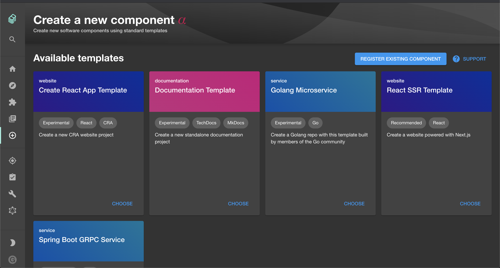

This section will guide you through:

- [Create a basic documentation setup](#create-a-basic-documentation-setup)
  - [Use the documentation template](#use-the-documentation-template)
  - [Manually add documentation setup to already existing repository](#manually-add-documentation-setup-to-already-existing-repository)
- [Writing and previewing your documentation](#writing-and-previewing-your-documentation)

## Prerequisites

- A working Backstage instance with TechDocs installed (see
  [TechDocs getting started](getting-started.md))

## Create a basic documentation setup

If you have an existing repository that you'd like to add documentation to, skip
to the
[Manually add documentation setup](#manually-add-documentation-setup-to-already-existing-repository)
section below. Otherwise, continue reading to start a documentation repo from
scratch.

### Use the documentation template

Your working Backstage instance should by default have a documentation template
added. If not, copy the catalog locations from the
[create-app template](https://github.com/backstage/backstage/blob/master/packages/create-app/templates/default-app/app-config.yaml.hbs)
to add the documentation template. The template creates a component with only
TechDocs configuration and default markdown files as below mentioned in manual
documentation setup, and is otherwise empty.



Create an entity from the documentation template and you will get the needed
setup for free.

### Manually add documentation setup to already existing repository

Prerequisites:

- An existing component
  [registered in backstage](../software-catalog/index.md#adding-components-to-the-catalog)
  (e.g. via a `catalog-info.yaml` file).

Create an `mkdocs.yml` file in the root of your repository with the following
content:

```yaml
site_name: 'example-docs'

nav:
  - Home: index.md

plugins:
  - techdocs-core
```

Update your component's entity description by adding the following lines to its
`catalog-info.yaml` in the root of its repository:

```yaml
metadata:
  annotations:
    backstage.io/techdocs-ref: dir:.
```

The
[`backstage.io/techdocs-ref` annotation](../software-catalog/well-known-annotations.md#backstageiotechdocs-ref)
is used by TechDocs to download the documentation source files for generating an
Entity's TechDocs site.

Create a `/docs` folder in the root of the project with at least an `index.md`
file. _(If you add more markdown files, make sure to update the nav in the
mkdocs.yml file to get a proper navigation for your documentation.)_

> Note - Although `docs` is a popular directory name for storing documentation,
> it can be renamed to something else and can be configured by `mkdocs.yml`. See
> https://www.mkdocs.org/user-guide/configuration/#docs_dir

The `docs/index.md` can for example have the following content:

```md
# example docs

This is a basic example of documentation.
```

Commit your changes, open a pull request and merge. You will now get your
updated documentation next time you run Backstage!

## Writing and previewing your documentation

Using the `techdocs-cli` you can preview your docs inside a local Backstage
instance and get live reload on changes. This is useful when you want to preview
your documentation while writing.

To do this you can run:

```bash
cd /path/to/docs-repository/
npx @techdocs/cli serve
```
