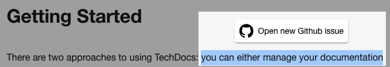
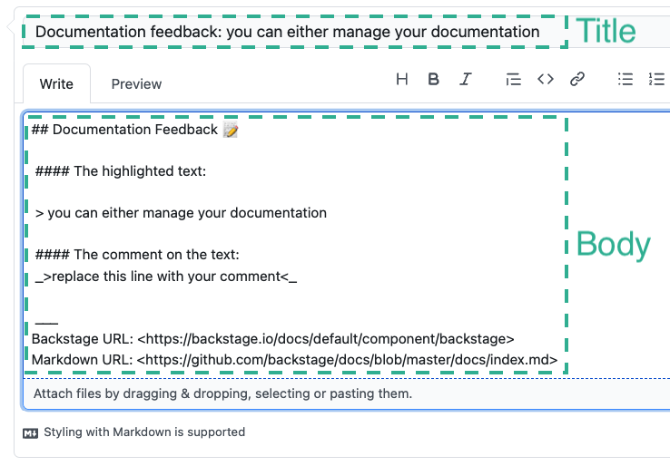

TechDocs functions as a plugin to Backstage, so you will need to use Backstage
to use TechDocs.

If you haven't setup Backstage already, start
[here](../../getting-started/index.md).

> If you used `npx @backstage/create-app`, TechDocs may already be present.
>
> You should skip to [`Setting the Configuration`](#setting-the-configuration)
> below.

## Adding TechDocs frontend plugin

The first step is to add the TechDocs plugin to your Backstage application.
Navigate to your new Backstage application directory. And then to your
`packages/app` directory, and install the `@backstage/plugin-techdocs` package.

```bash title="From your Backstage root directory"
yarn --cwd packages/app add @backstage/plugin-techdocs
```

Once the package has been installed, you need to import the plugin in your app.

In `packages/app/src/App.tsx`, import `TechDocsPage` and add the following to
`FlatRoutes`:

```tsx title="packages/app/src/App.tsx"
import {
  DefaultTechDocsHome,
  TechDocsIndexPage,
  TechDocsReaderPage,
} from '@backstage/plugin-techdocs';

const AppRoutes = () => {
  <FlatRoutes>
    {/* ... other plugin routes */}
    <Route path="/docs" element={<TechDocsIndexPage />}>
      <DefaultTechDocsHome />
    </Route>
    <Route
      path="/docs/:namespace/:kind/:name/*"
      element={<TechDocsReaderPage />}
    />
  </FlatRoutes>;
};
```

It would be nice to decorate your pages with something else... Having a link that redirects you to a new issue page when you highlight text in your documentation would be really cool, right? Let's learn how to do this using the TechDocs Addon Framework!

With the [TechDocs Addon framework](https://backstage.io/docs/features/techdocs/addons#installing-and-using-addons), you can render React components in documentation pages and these Addons can be provided by any Backstage plugin. The framework is exported by the [@backstage/plugin-techdocs-react](https://www.npmjs.com/package/@backstage/plugin-techdocs-react) package and there is a `<ReportIssue />` Addon in the [@backstage/plugin-techdocs-module-addons-contrib](https://www.npmjs.com/package/@backstage/plugin-techdocs-module-addons-contrib) package for you to use once you have these two dependencies installed:

```tsx
import {
  DefaultTechDocsHome,
  TechDocsIndexPage,
  TechDocsReaderPage,
} from '@backstage/plugin-techdocs';
/* highlight-add-start */
import { TechDocsAddons } from '@backstage/plugin-techdocs-react';
import { ReportIssue } from '@backstage/plugin-techdocs-module-addons-contrib';
/* highlight-add-end */

const AppRoutes = () => {
  <FlatRoutes>
    {/* ... other plugin routes */}
    <Route path="/docs" element={<TechDocsIndexPage />}>
      <DefaultTechDocsHome />
    </Route>
    <Route
      path="/docs/:namespace/:kind/:name/*"
      element={<TechDocsReaderPage />}
    >
      {/* highlight-add-start */}
      <TechDocsAddons>
        <ReportIssue />
      </TechDocsAddons>
      {/* highlight-add-end */}
    </Route>
  </FlatRoutes>;
};
```

I know, you're curious to see how it looks, aren't you? See the image below:

<!-- todo: Needs zoomable plugin -->



By clicking the open new issue button, you will be redirected to the new issue page according to the source code provider you are using:

<!-- todo: Needs zoomable plugin -->



That's it! Now, we need the TechDocs Backend plugin for the frontend to work.

## Adding TechDocs Backend plugin

Navigate to `packages/backend` of your Backstage app, and install the
`@backstage/plugin-techdocs-backend` package.

```bash title="From your Backstage root directory"
yarn --cwd packages/backend add @backstage/plugin-techdocs-backend
```

Create a file called `techdocs.ts` inside `packages/backend/src/plugins/` and
add the following

```typescript
import { DockerContainerRunner } from '@backstage/backend-common';
import {
  createRouter,
  Generators,
  Preparers,
  Publisher,
} from '@backstage/plugin-techdocs-backend';
import Docker from 'dockerode';
import { Router } from 'express';
import { PluginEnvironment } from '../types';

export default async function createPlugin(
  env: PluginEnvironment,
): Promise<Router> {
  // Preparers are responsible for fetching source files for documentation.
  const preparers = await Preparers.fromConfig(env.config, {
    logger: env.logger,
    reader: env.reader,
  });

  // Docker client (conditionally) used by the generators, based on techdocs.generators config.
  const dockerClient = new Docker();
  const containerRunner = new DockerContainerRunner({ dockerClient });

  // Generators are used for generating documentation sites.
  const generators = await Generators.fromConfig(env.config, {
    logger: env.logger,
  });

  // Publisher is used for
  // 1. Publishing generated files to storage
  // 2. Fetching files from storage and passing them to TechDocs frontend.
  const publisher = await Publisher.fromConfig(env.config, {
    logger: env.logger,
    discovery: env.discovery,
  });

  // checks if the publisher is working and logs the result
  await publisher.getReadiness();

  return await createRouter({
    preparers,
    generators,
    publisher,
    logger: env.logger,
    config: env.config,
    discovery: env.discovery,
    cache: env.cache,
  });
}
```

You may need to install the `dockerode` package. But you may already have it in
your backend since [Scaffolder plugin](../software-templates/index.md) also uses
it.

See [Concepts](concepts.md) and [TechDocs Architecture](architecture.md) to
learn more about how preparers, generators and publishers work.

The final step is to import the techdocs backend plugin in Backstage app
backend. Add the following to your `packages/backend/src/index.ts`:

```typescript
import techdocs from './plugins/techdocs';

// .... main should already be present.
async function main() {
  // ... other backend plugin envs
  const techdocsEnv = useHotMemoize(module, () => createEnv('techdocs'));

  // ... other backend plugin routes
  apiRouter.use('/techdocs', await techdocs(techdocsEnv));
}
```

That's it! TechDocs frontend and backend have now been added to your Backstage
app. Now let us tweak some configurations to suit your needs.

### New Backend System

To install TechDocs when using the New Backend system you will need to do the following.

Navigate to `packages/backend` of your Backstage app, and install the `@backstage/plugin-techdocs-backend` package.

```bash title="From your Backstage root directory"
yarn --cwd packages/backend add @backstage/plugin-techdocs-backend
```

Then in your backend `index.ts` you will add the following line.

```ts title="packages/backend/src/index.ts"
const backend = createBackend();

// Other plugins...

/* highlight-add-start */
backend.add(import('@backstage/plugin-techdocs-backend'));
/* highlight-add-end */

backend.start();
```

:::note Note

The above is a very simplified example, you may have more content then this in your version.

:::

## Setting the configuration

**See [TechDocs Configuration Options](configuration.md) for complete
configuration reference.**

### Should TechDocs Backend generate docs?

```yaml
techdocs:
  builder: 'local'
```

Note that we recommend generating docs on CI/CD instead. Read more in the
"Basic" and "Recommended" sections of the
[TechDocs Architecture](architecture.md). But if you want to get started quickly
set `techdocs.builder` to `'local'` so that TechDocs Backend is responsible for
generating documentation sites. If set to `'external'`, Backstage will assume
that the sites are being generated on each entity's CI/CD pipeline, and are
being stored in a storage somewhere.

When `techdocs.builder` is set to `'external'`, TechDocs becomes more or less a
read-only experience where it serves static files from a storage containing all
the generated documentation.

### Choosing storage (publisher)

TechDocs needs to know where to store generated documentation sites and where to
fetch the sites from. This is managed by a
[Publisher](./concepts.md#techdocs-publisher). Examples: Google Cloud Storage,
Amazon S3, or local filesystem of Backstage server.

It is okay to use the local filesystem in a "basic" setup when you are trying
out Backstage for the first time. At a later time, review
[Using Cloud Storage](./using-cloud-storage.md).

```yaml
techdocs:
  builder: 'local'
  publisher:
    type: 'local'
```

### Disabling Docker in Docker situation (Optional)

You can skip this if your `techdocs.builder` is set to `'external'`.

The TechDocs Backend plugin runs a docker container with mkdocs installed to
generate the frontend of the docs from source files (Markdown). If you are
deploying Backstage using Docker, this will mean that your Backstage Docker
container will try to run another Docker container for TechDocs Backend.

To avoid this problem, we have a configuration available. You can set a value in
your `app-config.yaml` that tells the techdocs generator if it should run the
`local` mkdocs or run it from `docker`. This defaults to running as `docker` if
no config is provided.

```yaml
techdocs:
  builder: 'local'
  publisher:
    type: 'local'
  generator:
    runIn: local
```

Setting `generator.runIn` to `local` means you will have to make sure your
environment is compatible with techdocs.

You will have to install the `mkdocs` and `mkdocs-techdocs-core` package from
pip, optionally also `graphviz` and `plantuml` from your OS package manager (e.g.
apt).

You can do so by including the following lines right above `USER node` of your
`Dockerfile`:

```Dockerfile
RUN apt-get update && \
    apt-get install -y python3 python3-pip python3-venv && \
    rm -rf /var/lib/apt/lists/*

ENV VIRTUAL_ENV=/opt/venv
RUN python3 -m venv $VIRTUAL_ENV
ENV PATH="$VIRTUAL_ENV/bin:$PATH"

RUN pip3 install mkdocs-techdocs-core
```

Please be aware that the version requirement could change, you need to check our
[`Dockerfile`](https://github.com/backstage/techdocs-container/blob/main/Dockerfile)
and make sure to match with it.

On a Debian-based Docker container, Python packages must be either installed using
the OS package manager or within a virtual environment (see the
[related PEP](https://peps.python.org/pep-0668/)). Alternative is to use e.g.
[pipx](https://pypa.github.io/pipx/) for installing Python packages in an isolated
environment.

The above Dockerfile snippet installs the latest `mkdocs-techdoc-core` package.
Version numbers can be found in the corresponding
[changelog](https://github.com/backstage/mkdocs-techdocs-core#changelog). In
case you want to pin the version, use the example below:

```Dockerfile
RUN pip3 install mkdocs-techdocs-core==1.2.3
```

Note: We recommend Python version 3.11 or higher.

> Caveat: Please install the `mkdocs-techdocs-core` package after all other
> Python packages. The order is important to make sure we get correct version of
> some of the dependencies.

## Additional reading

- [Creating and publishing your docs](creating-and-publishing.md)
- [Back to README](README.md)
