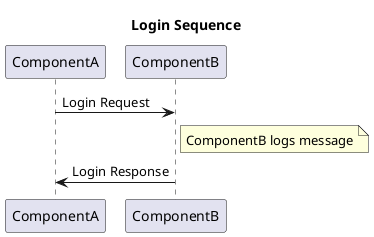

## How to migrate from TechDocs Basic to Recommended deployment approach?

The main difference between TechDocs Basic and Recommended deployment approach
is where the docs are generated and stored. In Basic or the out-of-the-box
setup, docs are generated and stored at the server running your Backstage
instance. But the recommended setup is to generate docs on CI/CD and store the
generated sites to an external storage (e.g. AWS S3 or GCS). TechDocs in your
Backstage instance should turn into read-only mode. Read more details and the
benefits in the [TechDocs Architecture](architecture.md).

Here are the steps needed to switch from the Basic to Recommended setup -

### 1. Prepare a cloud storage

Choose a cloud storage provider like AWS, Google Cloud or Microsoft Azure.
Follow the detailed instructions for
[using cloud storage](using-cloud-storage.md) in TechDocs.

### 2. Publish to storage from CI/CD

Start publishing your TechDocs sites from the CI/CD workflow of each repository
containing the source markdown files. Read the detailed instructions for
[configuring CI/CD](configuring-ci-cd.md).

### 3. Switch TechDocs to read-only mode

In your Backstage instance's `app-config.yaml`, set `techdocs.builder` from
`'local'` to `'external'`. By doing this, TechDocs will not try to generate
docs. Look at [TechDocs configuration](configuration.md) for reference.

## How to understand techdocs-ref annotation values

If TechDocs is configured to generate docs, it will first download source files
based on the value of the `backstage.io/techdocs-ref` annotation defined in the
Entity's `catalog-info.yaml` file. This is also called the
[Prepare](./concepts.md#techdocs-preparer) step.

We strongly recommend that the `backstage.io/techdocs-ref` annotation in each
documented catalog entity's `catalog-info.yaml` be set to `dir:.` in almost all
situations. This is because TechDocs is aligned with the "docs like code"
philosophy, whereby documentation should be authored and managed alongside the
source code of the underlying software itself.

When you see `dir:.`, you can translate it to mean:

- That the documentation source code lives in the same location as the
  `catalog-info.yaml` file.
- That, in particular, the `mkdocs.yml` file is a sibling of `catalog-info.yaml`
  (meaning, it is in the same directory)
- And that all of the source content of the documentation would be available if
  one were to download the directory containing those two files (as well as all
  sub-directories).

The directory tree of the entity would look something like this:

```
├── catalog-info.yaml
├── mkdocs.yml
└── docs
    └── index.md
```

If, for example, you wanted to keep a lean root directory, you could place your
`mkdocs.yml` file in a subdirectory and update the `backstage.io/techdocs-ref`
annotation value accordingly, e.g. to `dir:./sub-folder`:

```
├── catalog-info.yaml
└── sub-folder
    ├── mkdocs.yml
    └── docs
        └── index.md
```

In rare situations where your TechDocs source content is managed and stored in a
location completely separate from your `catalog-info.yaml`, you can instead
specify a URL location reference, the exact value of which will vary based on
the source code hosting provider. Notice that instead of the `dir:` prefix, the
`url:` prefix is used instead. For example:

- **GitHub**: `url:https://githubhost.com/org/repo/tree/<branch_name>`
- **GitLab**: `url:https://gitlabhost.com/org/repo/tree/<branch_name>`
- **Bitbucket**: `url:https://bitbuckethost.com/project/repo/src/<branch_name>`
- **Azure**: `url:https://azurehost.com/organization/project/_git/repository`

Note, just as it's possible to specify a subdirectory with the `dir:` prefix,
you can also provide a path to a non-root directory inside the repository which
contains the `mkdocs.yml` file and `docs/` directory.

e.g.
`url:https://github.com/backstage/backstage/tree/master/plugins/techdocs-backend/examples/documented-component`

### Why is URL Reader faster than a git clone?

URL Reader uses the source code hosting provider to download a zip or tarball of
the repository. The archive does not have any git history attached to it. Also
it is a compressed file. Hence the file size is significantly smaller than how
much data git clone has to transfer.

## How to customize the TechDocs home page?

TechDocs uses a composability pattern similar to the Search and Catalog plugins
in Backstage. While a default table experience, similar to the one provided by
the Catalog plugin, is made available for ease-of-use, it's possible for you to
provide a completely custom experience, tailored to the needs of your
organization. For example, TechDocs comes with an alternative grid based layout
(`<EntityListDocsGrid>`) and panel layout (`TechDocsCustomHome`).

This is done in your `app` package. By default, you might see something like
this in your `App.tsx`:

```tsx
const AppRoutes = () => {
  <FlatRoutes>
    <Route path="/docs" element={<TechDocsIndexPage />}>
      <DefaultTechDocsHome />
    </Route>
  </FlatRoutes>;
};
```

### Using TechDocsCustomHome

You can easily customize the TechDocs home page using TechDocs panel layout
(`<TechDocsCustomHome />`).

Modify your `App.tsx` as follows:

```tsx
import { TechDocsCustomHome } from '@backstage/plugin-techdocs';
//...

const options = { emptyRowsWhenPaging: false };
const linkDestination = (entity: Entity): string | undefined => {
  return entity.metadata.annotations?.['external-docs'];
};
const techDocsTabsConfig = [
  {
    label: 'Recommended Documentation',
    panels: [
      {
        title: 'Golden Path',
        description: 'Documentation about standards to follow',
        panelType: 'DocsCardGrid',
        panelProps: { CustomHeader: () => <ContentHeader title='Golden Path'/> },
        filterPredicate: entity =>
          entity?.metadata?.tags?.includes('golden-path') ?? false,
      },
      {
        title: 'Recommended',
        description: 'Useful documentation',
        panelType: 'InfoCardGrid',
        panelProps: {
          CustomHeader: () => <ContentHeader title='Recommended' />
          linkDestination: linkDestination,
        },
        filterPredicate: entity =>
          entity?.metadata?.tags?.includes('recommended') ?? false,
      },
    ],
  },
  {
    label: 'Browse All',
    panels: [
      {
        description: 'Browse all docs',
        filterPredicate: filterEntity,
        panelType: 'TechDocsIndexPage',
        title: 'All',
        panelProps: { PageWrapper: React.Fragment, CustomHeader: React.Fragment, options: options },
      },
    ],
  },
];
const docsFilter = {
  kind: ['Location', 'Resource', 'Component'],
  'metadata.annotations.featured-docs': CATALOG_FILTER_EXISTS,
}
const customPageWrapper = ({ children }: React.PropsWithChildren<{}>) =>
  (<PageWithHeader title="Docs" themeId="documentation">{children}</PageWithHeader>)
const AppRoutes = () => {
  <FlatRoutes>
    <Route
      path="/docs"
      element={
        <TechDocsCustomHome
          tabsConfig={techDocsTabsConfig}
          filter={docsFilter}
          CustomPageWrapper={customPageWrapper}
        />
      }
    />
  </FlatRoutes>;
};
```

### Building a Custom home page

But you can replace `<DefaultTechDocsHome />` with any React component, which
will be rendered in its place. Most likely, you would want to create and
maintain such a component in a new directory at
`packages/app/src/components/techdocs`, and import and use it in `App.tsx`:

For example, you can define the following Custom home page component:

```tsx
import React from 'react';

import { Content } from '@backstage/core-components';
import {
  CatalogFilterLayout,
  EntityOwnerPicker,
  EntityTagPicker,
  UserListPicker,
  EntityListProvider,
} from '@backstage/plugin-catalog-react';
import {
  TechDocsPageWrapper,
  TechDocsPicker,
} from '@backstage/plugin-techdocs';
import { Entity } from '@backstage/catalog-model';

import { EntityListDocsGrid } from '@backstage/plugin-techdocs';

export type CustomTechDocsHomeProps = {
  groups?: Array<{
    title: React.ReactNode;
    filterPredicate: ((entity: Entity) => boolean) | string;
  }>;
};

export const CustomTechDocsHome = ({ groups }: CustomTechDocsHomeProps) => {
  return (
    <TechDocsPageWrapper>
      <Content>
        <EntityListProvider>
          <CatalogFilterLayout>
            <CatalogFilterLayout.Filters>
              <TechDocsPicker />
              <UserListPicker initialFilter="all" />
              <EntityOwnerPicker />
              <EntityTagPicker />
            </CatalogFilterLayout.Filters>
            <CatalogFilterLayout.Content>
              <EntityListDocsGrid groups={groups} />
            </CatalogFilterLayout.Content>
          </CatalogFilterLayout>
        </EntityListProvider>
      </Content>
    </TechDocsPageWrapper>
  );
};
```

Then you can add the following to your `App.tsx`:

```tsx
import { CustomTechDocsHome } from './components/techdocs/CustomTechDocsHome';
// ...
const AppRoutes = () => {
  <FlatRoutes>
    <Route path="/docs" element={<TechDocsIndexPage />}>
      <CustomTechDocsHome
        groups={[
          {
            title: 'Recommended Documentation',
            filterPredicate: entity =>
              entity?.metadata?.tags?.includes('recommended') ?? false,
          },
          {
            title: 'My Docs',
            filterPredicate: 'ownedByUser',
          },
        ]}
      />
    </Route>
  </FlatRoutes>;
};
```

## How to customize the TechDocs reader page?

Similar to how it is possible to customize the TechDocs Home, it is also
possible to customize the TechDocs Reader Page. It is done in your `app`
package. By default, you might see something like this in your `App.tsx`:

```tsx
const AppRoutes = () => {
  <Route path="/docs/:namespace/:kind/:name/*" element={<TechDocsReaderPage />}>
    {techDocsPage}
  </Route>;
};
```

The `techDocsPage` is a default techdocs reader page which lives in
`packages/app/src/components/techdocs`. It includes the following without you
having to set anything up.

```tsx
<Page themeId="documentation">
  <TechDocsReaderPageHeader />
  <TechDocsReaderPageSubheader />
  <TechDocsReaderPageContent />
</Page>
```

If you would like to compose your own `techDocsPage`, you can do so by replacing
the children of TechDocsPage with something else. Maybe you are _just_
interested in replacing the Header:

```tsx
<Page themeId="documentation">
  <Header type="documentation" title="Custom Header" />
  <TechDocsReaderPageContent />
</Page>
```

Or maybe you want to disable the in-context search

```tsx
<Page themeId="documentation">
  <Header type="documentation" title="Custom Header" />
  <TechDocsReaderPageContent withSearch={false} />
</Page>
```

Or maybe you want to replace the entire TechDocs Page.

```tsx
<Page themeId="documentation">
  <Header type="documentation" title="Custom Header" />
  <Content data-testid="techdocs-content">
    <p>my own content</p>
  </Content>
</Page>
```

## How to migrate from TechDocs Alpha to Beta

> This guide only applies to the "recommended" TechDocs deployment method (where
> an external storage provider and external CI/CD is used). If you use the
> "basic" or "out-of-the-box" setup, you can stop here! No action needed.

For the purposes of this guide, TechDocs Beta version is defined as:

- **TechDocs Plugin**: At least `v0.11.0`
- **TechDocs Backend Plugin**: At least `v0.10.0`
- **TechDocs CLI**: At least `v0.7.0`

The beta version of TechDocs made a breaking change to the way TechDocs content
was accessed and stored, allowing pages to be accessed with case-insensitive
entity triplet paths (e.g. `/docs/namespace/kind/name` whereas in prior
versions, they could only be accessed at `/docs/namespace/Kind/name`). In order
to enable this change, documentation has to be stored in an external storage
provider using an object key whose entity triplet is lower-cased.

New installations of TechDocs since the beta version will work fine with no
action, but for those who were running TechDocs prior to this version, a
migration will need to be performed so that all existing content in your storage
bucket matches this lower-case entity triplet expectation.

1. **Ensure you have the right permissions on your storage provider**: In order
   to migrate files in your storage provider, the `techdocs-cli` needs to be
   able to read/copy/rename/move/delete files. The exact instructions vary by
   storage provider, but check the [using cloud storage][using-cloud-storage]
   page for details.

2. **Run a non-destructive migration of files**: Ensure you have the latest
   version of `techdocs-cli` installed. Then run the following command, using
   the details relevant for your provider / configuration. This will copy all
   files from, e.g. `namespace/Kind/name/index.html` to
   `namespace/kind/name/index.html`, without removing the original files.

```sh
techdocs-cli migrate --publisher-type <awsS3|googleGcs|azureBlobStorage> --storage-name <bucket/container name> --verbose
```

3. **Deploy the updated versions of the TechDocs plugins**: Once the migration
   above has been run, you can deploy the beta versions of the TechDocs backend
   and frontend plugins to your Backstage instance.

4. **Verify that your TechDocs sites are still loading/accessible**: Try
   accessing a TechDocs site using different entity-triplet case variants, e.g.
   `/docs/namespace/KIND/name` or `/docs/namespace/kind/name`. Your TechDocs
   site should load regardless of the URL path casing you use.

5. **Clean up the old objects from storage**: Once you've verified that your
   TechDocs site is accessible, you can clean up your storage bucket by
   re-running the `migrate` command on the TechDocs CLI, but with an additional
   `removeOriginal` flag passed:

```sh
techdocs-cli migrate --publisher-type <awsS3|googleGcs|azureBlobStorage> --storage-name <bucket/container name> --removeOriginal --verbose
```

6. **Update your CI/CD pipelines to use the beta version of the TechDocs CLI**:
   Finally, you can update all of your CI/CD pipelines to use at least v0.x.y of
   the TechDocs CLI, ensuring that all sites are published to the new,
   lower-cased entity triplet paths going forward.

If you encounter problems running this migration, please [report the
issue][beta-migrate-bug]. You can temporarily revert to pre-beta storage
expectations with a configuration change:

```yaml
techdocs:
  legacyUseCaseSensitiveTripletPaths: true
```

[beta-migrate-bug]:
https://github.com/backstage/backstage/issues/new?assignees=&labels=bug&template=bug_template.md&title=[TechDocs]%20Unable%20to%20run%20beta%20migration
[using-cloud-storage]: ./using-cloud-storage.md

## How to implement your own TechDocs APIs

The TechDocs plugin provides implementations of two primary APIs by default: the
[TechDocsStorageApi](https://github.com/backstage/backstage/blob/55114cfeb7045e3e5eeeaf67546b58964f4adcc7/plugins/techdocs/src/api.ts#L33),
which is responsible for talking to TechDocs storage to fetch files to render,
and
[TechDocsApi](https://github.com/backstage/backstage/blob/55114cfeb7045e3e5eeeaf67546b58964f4adcc7/plugins/techdocs/src/api.ts#L49),
which is responsible for talking to techdocs-backend.

There may be occasions where you need to implement these two APIs yourself, to
customize them to your own needs. The purpose of this guide is to walk you
through how to do that in two steps.

1. Implement the `TechDocsStorageApi` and `TechDocsApi` interfaces according to
   your needs.

```typescript
export class TechDocsCustomStorageApi implements TechDocsStorageApi {
  // your implementation
}

export class TechDocsCustomApiClient implements TechDocsApi {
  // your implementation
}
```

2. Override the API refs `techdocsStorageApiRef` and `techdocsApiRef` with your
   new implemented APIs in the `App.tsx` using `ApiFactories`.
   [Read more about App APIs](https://backstage.io/docs/api/utility-apis#app-apis).

```typescript
const app = createApp({
  apis: [
    // TechDocsStorageApi
    createApiFactory({
      api: techdocsStorageApiRef,
      deps: { discoveryApi: discoveryApiRef, configApi: configApiRef },
      factory({ discoveryApi, configApi }) {
        return new TechDocsCustomStorageApi({ discoveryApi, configApi });
      },
    }),
    // TechDocsApi
    createApiFactory({
      api: techdocsApiRef,
      deps: { discoveryApi: discoveryApiRef },
      factory({ discoveryApi }) {
        return new TechDocsCustomApiClient({ discoveryApi });
      },
    }),
  ],
});
```

## How to add the documentation setup to your software templates

[Software Templates](https://backstage.io/docs/features/software-templates/)
in Backstage is a tool that can help your users to create new components out of
already configured templates. It comes with a set of default templates to use,
but you can also
[add your own templates](https://backstage.io/docs/features/software-templates/adding-templates).

If you have your own templates set up, we highly recommend that you include the
required setup for TechDocs in those templates. When creating a new component,
your users will then get a TechDocs site up and running automatically, ready for
them to start writing technical documentation.

The purpose of this how-to guide is to walk you through how to add the required
configuration and some default markdown files to your new template. You can use
the
[react-ssr-template](https://github.com/backstage/software-templates/tree/main/scaffolder-templates/react-ssr-template)
as a reference when walking through the steps.

Prerequisites:

- An existing software template including a `template.yaml` together with a
  skeleton folder including at least a `catalog-info.yaml`.

1. Update your component's entity description by adding the following lines to
   the `catalog-info.yaml` in your skeleton folder.

```yaml
annotations:
  backstage.io/techdocs-ref: dir:.
```

The
[`backstage.io/techdocs-ref` annotation](../software-catalog/well-known-annotations.md#backstageiotechdocs-ref)
is used by TechDocs to download the documentation source files for generating an
entity's TechDocs site.

2. Create an `mkdocs.yml` file in the root of your skeleton folder with the
   following content:

```yaml
site_name: ${{values.component_id}}
site_description: ${{values.description}}

nav:
  - Introduction: index.md

plugins:
  - techdocs-core
```

3. Create a `/docs` folder in the skeleton folder with at least an `index.md`
   file in it.

The `docs/index.md` can for example have the following content:

```markdown
# ${{ values.component_id }}

${{ values.description }}

## Getting started

Start writing your documentation by adding more markdown (.md) files to this
folder (/docs) or replace the content in this file.
```

:::note Note

The values of `site_name`, `component_id` and `site_description` depends
on how you have configured your `template.yaml`.

:::

Done! You now have support for TechDocs in your own software template!

### Prevent download of Google fonts

If your Backstage instance does not have internet access, the generation will fail. TechDocs tries to download the Roboto font from Google. You can disable it by adding the following lines to mkdocs.yaml:

```yaml
theme:
  name: material
  font: false
```

:::note Note

The addition `name: material` is necessary. Otherwise it will not work

:::

## How to enable iframes in TechDocs

TechDocs uses the [DOMPurify](https://github.com/cure53/DOMPurify) library to
sanitize HTML and prevent XSS attacks.

It's possible to allow some iframes based on a list of allowed hosts. To do
this, add the allowed hosts in the `techdocs.sanitizer.allowedIframeHosts`
configuration of your `app-config.yaml`.

For example:

```yaml
techdocs:
  sanitizer:
    allowedIframeHosts:
      - drive.google.com
```

This way, all iframes where the host in the src attribute is in the
`sanitizer.allowedIframeHosts` list will be displayed.

## How to enable custom elements in TechDocs

TechDocs uses the [DOMPurify](https://github.com/cure53/DOMPurify) library to
sanitize HTML and prevent XSS attacks.

It's possible to allow custom elements based on a list of allowed patterns. To do
this, add the allowed elements and attributes in the `techdocs.sanitizer.allowedCustomElementTagNameRegExp`
and `allowedCustomElementAttributeNameRegExp` configuration of your `app-config.yaml`.

For example:

```yaml
techdocs:
  sanitizer:
    allowedCustomElementTagNameRegExp: '^backstage-',
    allowedCustomElementAttributeNameRegExp: 'attribute1|attribute2',
```

This way, custom element like `<backstage-element attribute1="value"></backstage-element>` will be allowed in the result HTML.

## How to render PlantUML diagram in TechDocs

PlantUML allows you to create diagrams from plain text language. Each diagram description begins with the keyword - (@startXYZ and @endXYZ, depending on the kind of diagram). For UML Diagrams, Keywords @startuml & @enduml should be used. Further details for all types of diagrams can be found at [PlantUML Language Reference Guide](https://plantuml.com/guide).

### UML Diagram Details:-

#### Embedded PlantUML Diagram Example

Here, the markdown file itself contains the diagram description.

````md

````

#### Referenced PlantUML Diagram Example

Here, the markdown file refers to another file (`*.puml` or `*.pu`) which contains the diagram description.

````md
```plantuml
!include umldiagram.puml
```
````

Note: To refer external diagram files, we need to include the diagrams directory in the path. Please refer [`Dockerfile`](https://github.com/backstage/techdocs-container/blob/main/Dockerfile) for details.

## How to add Mermaid support in TechDocs

There are a few options for adding Mermaid support in TechDocs: using [Kroki](https://kroki.io) or [markdown-inline-mermaid](https://github.com/johanneswuerbach/markdown-inline-mermaid) to generate the diagrams at build time, or the [`backstage-plugin-techdocs-addon-mermaid`](https://github.com/johanneswuerbach/backstage-plugin-techdocs-addon-mermaid) plugin to generate the diagram in the browser. We currently use `backstage-plugin-techdocs-addon-mermaid` plugin for the [Mermaid example on the Demo site](https://demo.backstage.io/docs/default/component/backstage-demo/examples/mermaid/).

### Using Kroki

To add `Mermaid` support in TechDocs, you can use [`kroki`](https://kroki.io)
that creates diagrams from Textual descriptions. It is a single rendering
gateway for all popular diagrams-as-a-code tools. It supports an enormous number
of diagram types.

1. **Create and Publish Docker image:** Create the Docker image from the
   following `Dockerfile` and publish it to DockerHub.

```docker
FROM python:3.10-alpine

RUN apk update && apk --no-cache add gcc musl-dev openjdk11-jdk curl graphviz ttf-dejavu fontconfig

RUN pip install --upgrade pip && pip install mkdocs-techdocs-core==1.2.0

RUN pip install mkdocs-kroki-plugin

ENTRYPOINT [ "mkdocs" ]
```

Create a repository in your DockerHub and run the below command in the same
folder where your `Dockerfile` is present:

```shell
docker build . -t dockerHub_Username/repositoryName:tagName
```

Once the docker image is ready, push it to DockerHub.

2. **Update app-config.yaml:** So that when your app generates TechDocs, it will
   pull your docker image from DockerHub.

```python
techdocs:
  builder: 'local' # Alternatives - 'external'
  generator:
    runIn: 'docker' # Alternatives - 'local'
    dockerImage: dockerHub_Username/repositoryName:tagName
    pullImage: true
  publisher:
    type: 'local' # Alternatives - 'googleGcs' or 'awsS3'. Read documentation for using alternatives.
```

3. **Add the `kroki` plugin in `mkdocs.yml`:**

```yml
plugins:
  - techdocs-core
  - kroki
```

:::note Note

You will very likely want to set a `kroki` `ServerURL` configuration in your
`mkdocs.yml` as well. The default value is the publicly hosted `kroki.io`. If
you have sensitive information in your organization's diagrams, you should set
up a [server of your own](https://docs.kroki.io/kroki/setup/install/) and use it
instead. Check out [mkdocs-kroki-plugin config](https://github.com/AVATEAM-IT-SYSTEMHAUS/mkdocs-kroki-plugin#config)
for more plugin configuration details.

:::

4. **Add mermaid code into TechDocs:**

````md
```kroki-mermaid
sequenceDiagram
GitLab->>Kroki: Request rendering
Kroki->>Mermaid: Request rendering
Mermaid-->>Kroki: Image
Kroki-->>GitLab: Image
```
````

Done! Now you have a support of the following diagrams along with mermaid:

- `PlantUML`
- `BlockDiag`
- `BPMN`
- `ByteField`
- `SeqDiag`
- `ActDiag`
- `NwDiag`
- `PacketDiag`
- `RackDiag`
- `C4 with PlantUML`
- `Ditaa`
- `Erd`
- `Excalidraw`
- `GraphViz`
- `Nomnoml`
- `Pikchr`
- `Svgbob`
- `UMlet`
- `Vega`
- `Vega-Lite`
- `WaveDrom`

### Using `markdown-inline-mermaid`

To use `markdown-inline-mermaid` to generate your Mermaid diagrams in TechDocs you'll need to do the following:

1. In your Dockerfile you will need to make sure you install `markdown-inline-mermaid` and its dependencies, you will also need to install the `@mermaid-js/mermaid-cli`:

   ```dockerfile title="Dockerfile"
   RUN apt-get install -y chromium
   RUN pip3 install mkdocs-techdocs-core markdown-inline-mermaid
   RUN npm install -g @mermaid-js/mermaid-cli
   ENV PUPPETEER_EXECUTABLE_PATH=/usr/bin/chromium
   ```

2. Now in your `mkdocs.yml` file you will need to add the following section (this is at the root level like `plugins` which you should already have):

   ```yaml title="mkdocs.yml"
   markdown_extensions:
     - markdown_inline_mermaid
   ```

3. With this in place you can now add Mermaid diagrams in your Markdown files like this:

   ````md
   ```mermaid
   sequenceDiagram
   Alice->>John: Hello John, how are you?
   John-->>Alice: Great!
   Alice-)John: See you later!
   ```
   ````

### Using the `backstage-plugin-techdocs-addon-mermaid` plugin

Please follow the [Getting Started](https://github.com/johanneswuerbach/backstage-plugin-techdocs-addon-mermaid?tab=readme-ov-file#getting-started) instructions in the plugin's README.

## How to implement a hybrid build strategy

One limitation of the [Recommended deployment](./architecture.md#recommended-deployment) is that
the experience for users requires modifying their CI/CD process to publish
their TechDocs. For some users, this may be unnecessary, and provides a barrier
to entry for onboarding users to Backstage. However, a purely local TechDocs
build restricts TechDocs creators to using the tooling provided in Backstage,
as well as the plugins and features provided in the Backstage-included `mkdocs`
installation.

To accommodate both of these use-cases, users can implement a custom [Build Strategy](./concepts.md#techdocs-build-strategy)
with logic to encode which TechDocs should be built locally, and which will be
built externally.

To achieve this hybrid build model:

1. In your Backstage instance's `app-config.yaml`, set `techdocs.builder` to
   `'local'`. This ensures that Backstage will build docs for users who want the
   'out-of-the-box' experience.
2. Configure external storage of TechDocs as normal for a production deployment.
   This allows Backstage to publish documentation to your storage, as well as
   allowing other users to publish documentation from their CI/CD pipelines.
3. Create a custom build strategy, that implements the `DocsBuildStrategy` interface,
   and which implements your custom logic for determining whether to build docs for
   a given entity.
   For example, to only build docs when an entity has the `company.com/techdocs-builder`
   annotation set to `'local'`:

   ```typescript
   export class AnnotationBasedBuildStrategy {
     private readonly config: Config;

     constructor(config: Config) {
       this.config = config;
     }

     async shouldBuild(_: Entity): Promise<boolean> {
       return (
         this.entity.metadata?.annotations?.['company.com/techdocs-builder'] ===
         'local'
       );
     }
   }
   ```

4. Pass an instance of this Build Strategy as the `docsBuildStrategy` parameter of the
   TechDocs backend `createRouter` method.

Users should now be able to choose to have their documentation built and published by
the TechDocs backend by adding the `company.com/techdocs-builder` annotation to their
entity. If the value of this annotation is `'local'`, the TechDocs backend will build
and publish the documentation for them. If the value of the `company.com/techdocs-builder`
annotation is anything other than `'local'`, the user is responsible for publishing
documentation to the appropriate location in the TechDocs external storage.

### Hybrid build strategy using the New Backend System

To setup a hybrid build strategy using the New Backend System you'll follow the same steps as above but for Step 4 you will need to do the following:

```ts title="packages/backend/src/index.ts"
const backend = createBackend();

import { createBackendModule } from '@backstage/backend-plugin-api';
import {
  DocsBuildStrategy,
  techdocsBuildsExtensionPoint,
} from '@backstage/plugin-techdocs-node';

const techdocsCustomBuildStrategy = createBackendModule({
  pluginId: 'techdocs',
  moduleId: 'customBuildStrategy',
  register(env) {
    env.registerInit({
      deps: {
        techdocs: techdocsBuildsExtensionPoint,
      },
      async init({ techdocs }) {
        const docsBuildStrategy: DocsBuildStrategy = {
          shouldBuild: async params =>
            params.entity.metadata?.annotations?.[
              'demo.backstage.io/techdocs-builder'
            ] === 'local',
        };

        techdocs.setBuildStrategy(docsBuildStrategy);
      },
    });
  },
});

// Other plugins...

/* highlight-add-start */
backend.add(import('@backstage/plugin-techdocs-backend'));
backend.add(techdocsCustomBuildStrategy);
/* highlight-add-end */

backend.start();
```

:::note Note

You may need to add the `@backstage/plugin-techdocs-node` package to your backend `package.json` if it's not been imported already.

:::

## How to use other mkdocs plugins?

The default plugin [mkdocs-techdocs-core](https://github.com/backstage/mkdocs-techdocs-core) provides a set of plugins that can be viewed as the minimum required plugins to enable TechDocs. Your organization might have needs beyond the core set though, here is the recommended way to enable other plugins.

### Install the plugin

#### With CI generation

If you generate the HTML files in CI using `@techdocs/cli`, you need to install the desired mkdocs plugin in the runtime where the cli is being executed. This might be e.g. a docker image or a Jenkins node. Use the `--no-docker` flag with the cli to pick up the plugin you just installed.

#### With local generation

Create a new Docker image that extends [spotify/techdocs](https://github.com/backstage/techdocs-container), roughly:

```Dockerfile
FROM spotify/techdocs:<version>

pip install <the_plugin_you_want>
...
```

Then publish the image and use it in your config under the `techdocs.generator.dockerImage` [key](https://github.com/backstage/techdocs-container).

### Specify the plugin in the mkdocs config

To use the plugin, it has to be listed in the `mkdocs.yaml` file. You can either add the plugin to your applicable files, or specify defaults.

To make a mkdocs plugin available for all your TechDocs components you can either list it in the `techdocs.generator.mkdocs.defaultPlugins` [config](https://github.com/backstage/backstage/blob/master/plugins/techdocs-backend/config.d.ts#L64C14-L64C14), or use the `--defaultPlugin` [cli option](https://backstage.io/docs/features/techdocs/cli#generate-techdocs-site-from-a-documentation-project) depending on your setup.

## Reference another components TechDocs

In systems where you might have multiple entities for example a System with a Website and an API, when served from a Monorepo you might want to keep the TechDocs in one location in the repository.

In this case you can add the `backstage.io/techdocs-entity` annotation and point to the owners `entityRef` and use its TechDocs. This allows the Subcomponents to read the parents docs, filling the TechDocs link on the `AboutCard` element and the Techdocs tab

```yaml
apiVersion: backstage.io/v1alpha1
kind: System
metadata:
  name: example
  namespace: default
  title: Example
  description: This is the parent entity
  annotations:
    backstage.io/techdocs-ref: dir:.

---
apiVersion: backstage.io/v1alpha1
kind: Component
metadata:
  name: example-platfrom
  title: Example Application Platform
  namespace: default
  description: This is the child entity
  annotations:
    backstage.io/techdocs-entity: system:default/example
```

## How to resolve broken links from moved or renamed pages in your documentation site

TechDocs supports using the [mkdocs-redirects](https://github.com/mkdocs/mkdocs-redirects/tree/master) plugin to create a redirect map for any TechDocs site. This allows broken links from renamed or moved pages in your site to be redirected to their specified replacement.
TechDocs will notify the user that the page they are trying to access is no longer maintained. Then, they will be redirected. External site redirects are not supported. If an external redirect is provided, the user will instead be redirected to the index page of the documentation site.

## Create download links for static assets

You may want to make files available for download by your users such as PDF
documents, images, or code templates. Download links for files included in your
docs directory can be made by adding `{: download }` after a markdown link.

```
[Link text](https://example.com/foo.jpg){: download }
```

The user's browser will download the file as `download.jpg` when the link is
clicked.

Specify a file name to control the name the file will be given when it is
downloaded:

```
[Link text](https://example.com/foo.jpg){: download="foo.jpg" }
```
