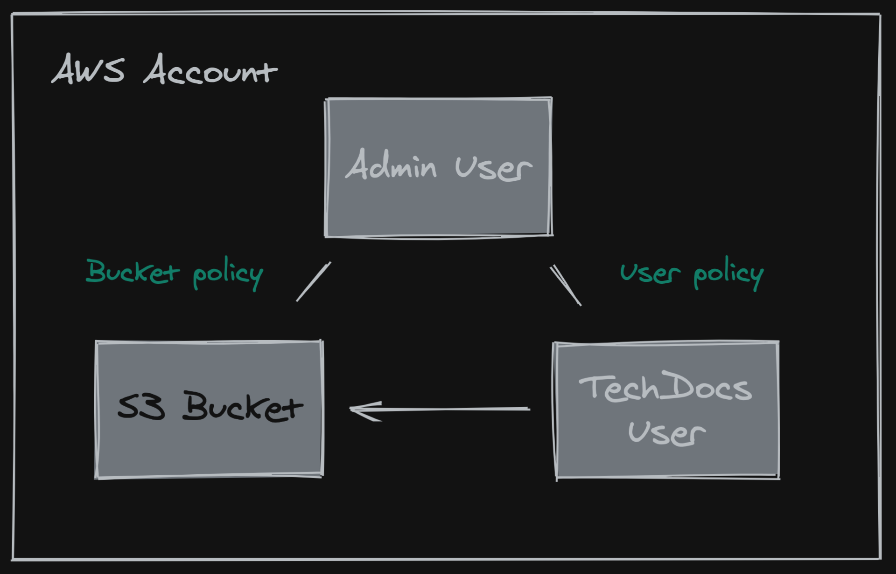

In the [TechDocs architecture](./architecture.md) you have the option to choose
where you want to store the Generated static files which TechDocs uses to render
documentation. In both the "Basic" and "Recommended" setup, you can add cloud
storage providers like Google GCS, Amazon AWS S3, etc. By default, TechDocs uses
the local filesystem of the `techdocs-backend` plugin in the "Basic" setup. And
in the recommended setup, having one of the cloud storage is a prerequisite.
Read more on the TechDocs Architecture documentation page.

On this page you can read how to enable them.

## Configuring Google GCS Bucket with TechDocs

Follow the
[official Google Cloud documentation](https://googleapis.dev/nodejs/storage/latest/index.html#quickstart)
for the latest instructions on the following steps involving GCP.

**1. Set `techdocs.publisher.type` config in your `app-config.yaml`**

Set `techdocs.publisher.type` to `'googleGcs'`.

```yaml
techdocs:
  publisher:
    type: 'googleGcs'
```

**2. GCP (Google Cloud Platform) Project**

Create or choose a dedicated GCP project. Set
`techdocs.publisher.googleGcs.projectId` to the project ID.

```yaml
techdocs:
  publisher:
    type: 'googleGcs'
  googleGcs:
    projectId: 'gcp-project-id'
```

**3. Service account API key**

Create a new Service Account and a key associated with it. In roles of the
service account, use "Storage Admin".

If you want to create a custom role, make sure to include both `get` and
`create` permissions for both "Objects" and "Buckets". See
https://cloud.google.com/storage/docs/access-control/iam-permissions

A service account can have many keys. Open your newly created account's page (in
IAM & Admin console), and create a new key. Use JSON format for the key.

A `<GCP-PROJECT-ID-random-uid>.json` file will be downloaded. This is the secret
key TechDocs will use to make API calls. Make it available in your Backstage
server and/or your local development server and set it in the app config
`techdocs.publisher.googleGcs.credentials`.

```yaml
techdocs:
  publisher:
    type: 'googleGcs'
    googleGcs:
      projectId: 'gcp-project-id'
      credentials:
        $file: '/path/to/google_application_credentials.json'
```

**4. GCS Bucket**

Create a dedicated bucket for TechDocs sites. techdocs-backend will publish
documentation to this bucket. TechDocs will fetch files from here to serve
documentation in Backstage.

Set the name of the bucket to `techdocs.publisher.googleGcs.bucketName`.

```yaml
techdocs:
  publisher:
    type: 'googleGcs'
    googleGcs:
      projectId: 'gcp-project-id'
      credentials:
        $file: '/path/to/google_application_credentials.json'
      bucketName: 'name-of-techdocs-storage-bucket'
```

**5. That's it!**

Your Backstage app is now ready to use Google Cloud Storage for TechDocs, to
store the static generated documentation files.

## Configuring AWS S3 Bucket with TechDocs

Follow the
[official AWS S3 documentation](https://docs.aws.amazon.com/AWSJavaScriptSDK/latest/AWS/S3.html)
for the latest instructions on the following steps involving AWS S3.

**1. Set `techdocs.publisher.type` config in your `app-config.yaml`**

Set `techdocs.publisher.type` to `'awsS3'`.

```yaml
techdocs:
  publisher:
    type: 'awsS3'
```

**2. AWS Policies**

AWS Policies lets you **control access** to Amazon Web Services (AWS) products
and resources.  
Here we will use a user policy **and** a bucket policy to show you the different
possibilities you have but you can use only one.



This is an example of how you can manage your policies:

a. Admin user creates a **bucket policy** granting a set of permissions to our
TechDocs user.

b. Admin user attaches a **user policy** to the TechDocs user granting
additional permissions.

c. TechDocs User then tries permissions granted via both the **bucket** policy
and the **user** policy.

**2.1 Creation**

**2.1.1 Create an Admin user** (if you don't have one yet)

Create an **administrator user** account `ADMIN_USER` and grant it administrator
privileges by attaching a user policy giving the account **full access**.  
Note down the Admin User credentials and IAM User Sign-In URL as you will need
to use this information in the next step.

**2.1.2 Create an AWS S3 Bucket**

Using the credentials of your Admin User `ADMIN_USER`, and the special IAM user
sign-in URL, create a dedicated **bucket** for TechDocs sites. techdocs-backend
will publish documentation to this bucket. TechDocs will fetch files from here
to serve documentation in Backstage.

Set the name of the bucket to `techdocs.publisher.awsS3.bucketName`.

```yaml
techdocs:
  publisher:
    type: 'awsS3'
    awsS3:
      credentials:
        $file: '/path/to/aws_application_credentials.json'
      bucketName: 'name-of-techdocs-storage-bucket'
```

**2.1.3 Create the `TechDocs` user**

This user will be used to interact with your bucket, it will only have
permissions to **get - put** objects.

In the IAM console, do the following:

- Create a new user, `TechDocs`
- Note down the TechDocs User credentials
- Note down the Amazon Resource Name (ARN) for the TechDocs user. In the IAM
  console, select the TechDocs user, and you can find the user ARN in the
  Summary tab.

**2.2 Attach policies**

Remember that you can use Bucket policy **or** User policy.  
Just make sure that you grant all the permissions to the TechDocs user:
`3:PutObject`, `s3:GetObject`, `s3:ListBucket` and `s3:GetBucketLocation`.

**2.2.1 Create the bucket policy**

You now have to attach the following policy to your bucket in the Permission
section:

```json
{
  "Version": "2012-10-17",
  "Statement": [
    {
      "Sid": "statement1",
      "Effect": "Allow",
      "Principal": {
        "AWS": "arn:aws:iam::YOUR_ACCOUNT_ID:user/TechDocs"
      },
      "Action": ["s3:GetBucketLocation", "s3:ListBucket"],
      "Resource": ["arn:aws:s3:::name-of-techdocs-storage-bucket"]
    },
    {
      "Sid": "statement2",
      "Effect": "Allow",
      "Principal": {
        "AWS": "arn:aws:iam::YOUR_ACCOUNT_ID:user/TechDocs"
      },
      "Action": ["s3:GetObject"],
      "Resource": ["arn:aws:s3:::name-of-techdocs-storage-bucket/*"]
    }
  ]
}
```

- The first statement grants **TechDocs User** the bucket operation permissions
  `s3:GetBucketLocation` and `s3:ListBucket` which are permissions required by
  the console.
- The second statement grants the `s3:GetObject` permission.  
  (**NOTE :** if you do not use the user policy defined below you must also add
  the `s3:PutObject` permission to allow the TechDocs user to add objects.)

**2.2.2 Create the user policy**

Create an inline policy for the TechDocs user by using the following policy:

```json
{
  "Version": "2012-10-17",
  "Statement": [
    {
      "Sid": "PermissionForObjectOperations",
      "Effect": "Allow",
      "Action": ["s3:PutObject"],
      "Resource": ["arn:aws:s3:::name-of-techdocs-storage-bucket/*"]
    }
  ]
}
```

See more details in the section
[Working with Inline Policies](https://docs.aws.amazon.com/IAM/latest/UserGuide/access_policies_manage.html).

Now you need to fill in the environment variables with the `TechDocs` User
credentials. You can also specify a region if you want to accesses the resources
in a specific region. Otherwise no region will be selected by default.

```properties
TECHDOCS_AWSS3_ACCESS_KEY_ID_CREDENTIAL="TECHDOCS_ACCESS_KEY_ID"
TECHDOCS_AWSS3_SECRET_ACCESS_KEY_CREDENTIAL="TECHDOCS_SECRET_ACCESS_KEY"
AWSS3_REGION="" // Optional
```

Make it available in your Backstage server and/or your local development server
and set it in the app config techdocs.publisher.awsS3.

```yaml
techdocs:
  publisher:
    type: 'awsS3'
    awsS3:
      credentials:
        accessKeyId:
          $env: TECHDOCS_AWSS3_ACCESS_KEY_ID_CREDENTIAL
        secretAccessKey:
          $env: TECHDOCS_AWSS3_SECRET_ACCESS_KEY_CREDENTIAL
      region:
        $env: AWSS3_REGION
```

**3. That's it!**

Your Backstage app is now ready to use AWS S3 for TechDocs, to store the static
generated documentation files.
